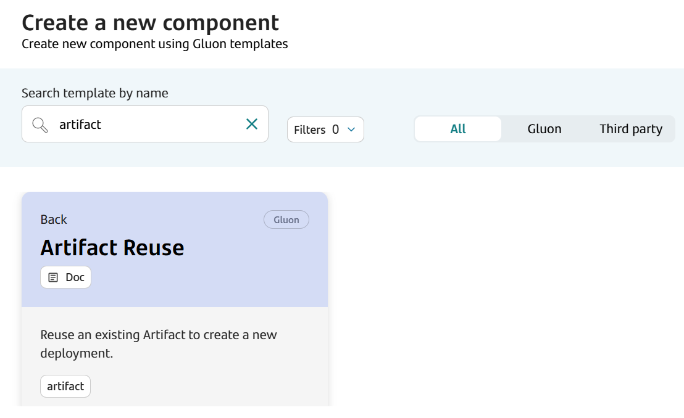
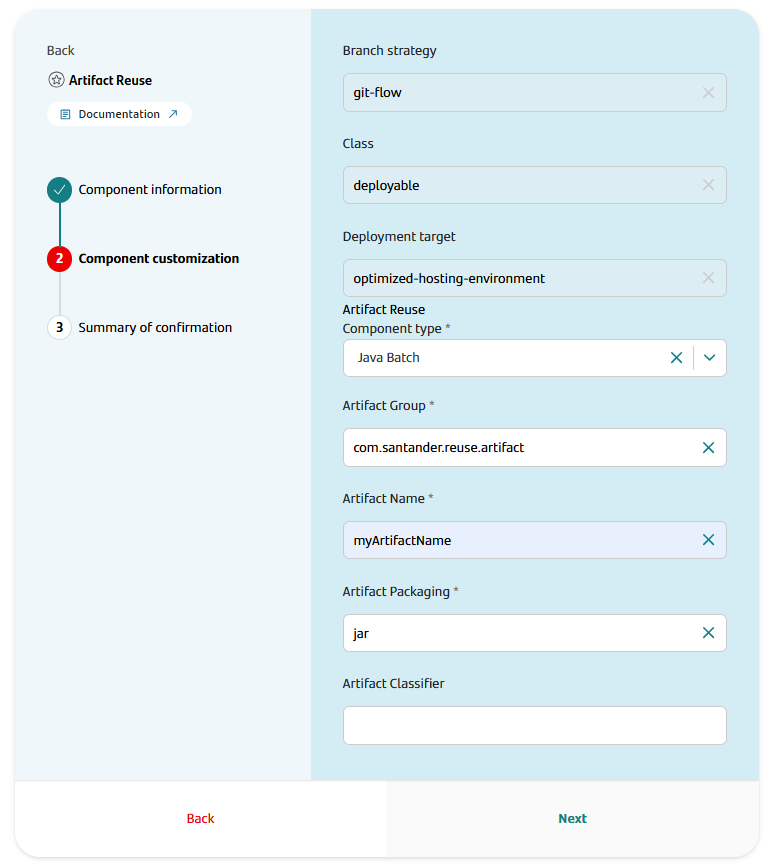
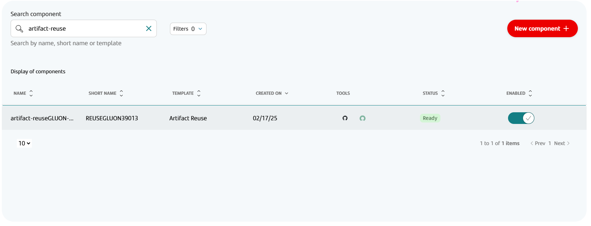
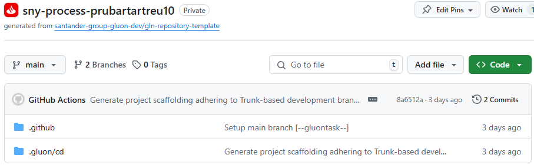

## Introduction

The purpose of this documentation is to provide a **step-by-step guide** on how to orchestrate the deployment of an existing artifact in other destination entity within the GLUON platform.Only Maven and Python technologies are available.

This guide will allow you to understand how read an artifact from one registry and deploy it through a CD process.

All deployments will be done with Ansible using a GLUON predefined playbook and a inventory defined in the OAM component.

## Prerequisites

In the Image Reuse Journey, the following prerequisites are required:

### Available Technologies

When you create a component, a drop-down list appears in the "Artifact Reuse Component Type" field with the available technologies.

To be able to reuse an artifact, the following prerequisites must be met:

The reused artifact must be a Release, meaning that the version must be a Release version `x.x.x` following the [Semantic Versioning](https://semver.org/) standard.

## Create Component

### Gluon Portal

First, you have to [**onboard your application**](../..//index.md). Once you have your application created, you can start creating your component.

To create a component, follow the steps described in [**Componnet Management**](../../application/component-management/create-component.md), searching for the component to be created.

You have to select the type of component you want to create, in this case you are going to create an **Artifact Reuse** component.



In the case of a maven artifact, the user must provide the artifact type, the location of the artifact to be reused (Artifact Group and Artifact Name), the packaging type and the classifier optionally.

In the case of a python artifact, the user must provide the artifact type, the location of the artifact to be reused (Artifact Name), and the packaging type.

Here there a example of component configuration:



Image Reuse Template Parameters:

| **Input**               | **Required** |       **Default value**       | **Description**                                                                                                                                                 |
|-----------------------  |:------------:|:-----------------------------:|-----------------------------------------------------------------------------------------------------------------------------------------------------------------|
| **Component Type**      |     true     |              N/A              | Indicates the type of component to be reused. The options are DB2, DOC1, Java Batch, Modellica, .Net, Net Reveal, Oracle, PAS, PostgreSql, PowerBI, PowerCurve, Share Library, Supra, Tomcat, Unix, WAS, Win |
| **Artifact Group**      |     true in maven artifacts    |              N/A              | Artifact group to search the artifact in Nexus                                                                                                                  |
| **Artifact Name**       |     true     |              N/A              | Artifact name to search the artifact in Nexus                                                                                                                   |
| **Artifact Packaging**  |     true     |              N/A              | Artifact packaging to search the artifact in Nexus                                                                                                              |
| **Artifact Classifier** |     false    |              ""               |  Artifact classifier to search the artifact in Nexus. Only available in maven artifacts                                                                                                            |

Once the component is created, we will be able to see it in the component list, where we will have a direct link to the GitHub repository.

???+ remember

    The repository will be created following the [Repository Naming Convention](../../application/component-management/create-component.md#repository-naming-convention).



We have the following links in:

| Item              | Link                                               | Role Permission                                                                                                                                                                                                                  |
|-------------------|----------------------------------------------------|----------------------------------------------------------------------------------------------------------------------------------------------------------------------------------------------------------------------------------|
| GitHub Repository | Link to the repository created in GitHub           | Developer (RW) /Technical Lead (Maintain) [All roles explained](https://docs.github.com/es/organizations/managing-user-access-to-your-organizations-repositories/managing-repository-roles/repository-roles-for-an-organization) |
| Catalog           | Link to the component catalog in Service Now (APM) | N/A                                                                                                                                                                                                                              |

### Reuse Artifact Template



#### Structure

The generated Artifact Reuse component has a structure similar to the following:

```text
📂.github
┣ 📂artifact
┃ ┗ 📜reuse-artifact-info.yml
┣ 📂workflows
┃ ┣ 📜cd.yml
┃ ┗ 📜update-component-workflow.yml
┗ 📜CODEOWNERS
📂.gluon
┗ 📂cd
  ┣ 📂cert
  ┃ ┗ 📜cd.yml
  ┣ 📂pre
  ┃ ┗ 📜cd.yml
  ┗ 📂pro
    ┗ 📜cd.yml
```

## Local Development

??? abstract "Cloning your repository"

    ### Cloning your repository

    Once we have the device properly configured, the first step is to clone the project locally.

    To do so, visit [**How to clone de project**](../../application/component-management/create-component.md#cloning-a-repository).

??? abstract "Configuring artifact reuse"

    ### Configuring artifact reuse

    When creating the component the origin artifact parameters has been set in .github/artifact/reuse-artifact-info.yaml. This parameters can't be updated by a developer.

## Infrastructure

### How to configure your deployment environment

The Reuse Artifact deployment is orchestrated via Ansible, so the applicable parameters will be those specific to ANSIBLE.

{!
   include-markdown "../../application/ci-cd/technologies/maven/snippets/snippet-oam-artifact.md"
   start="<!--Start Infrastructure 2.0-->"
   end="<!--End Infrastructure 2.0-->"
!}

## Component Configuration

### Branches

When you create the component from the Gluon Portal, the component is created with the default values of the template from the scaffolding workflow.

- Creates a **main** branch which contains an initial structure and content for reusing an existing artifact and deploying it an existing image in other Application/Entity.
- You can create a **feature** branch from the **main** branch to add new features or fix bugs.

This is because we are using the Trunk Based Development (TBD) branching strategy.

## Deploy your application

For getting to know how to deploy your application,
please refer to the
[Common CD Workflow - Gluon Docs](../../application/ci-cd/cd/cd-rm/cd-workflow/index.md)
documentation.
