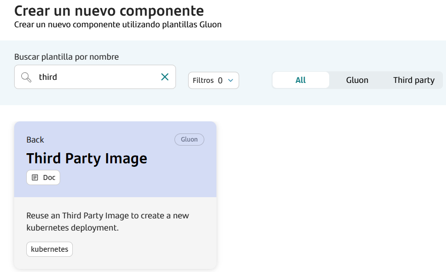
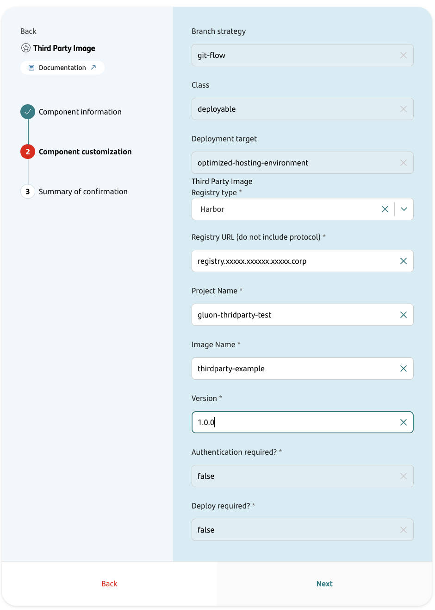
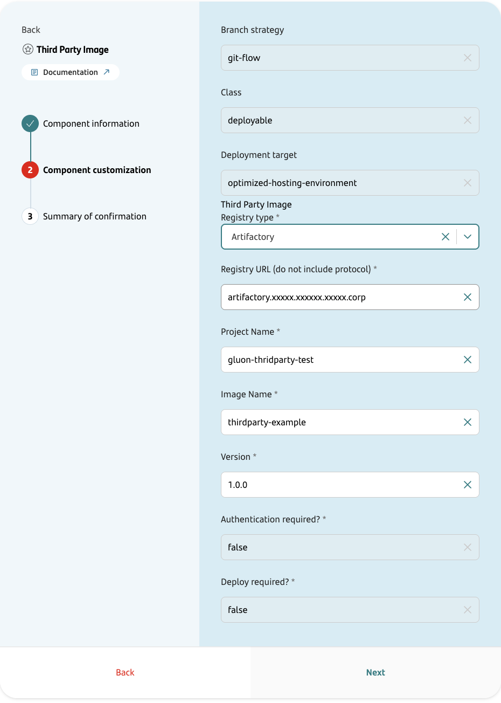
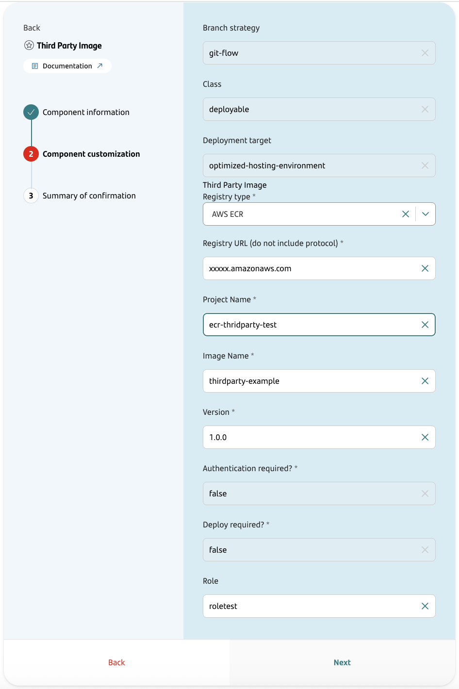
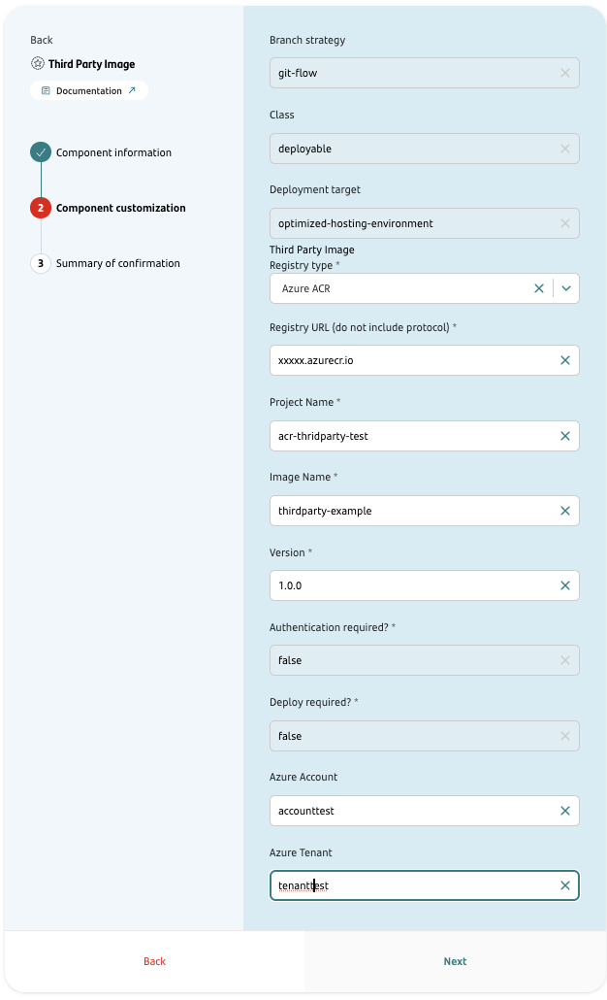
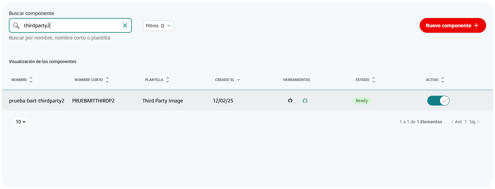
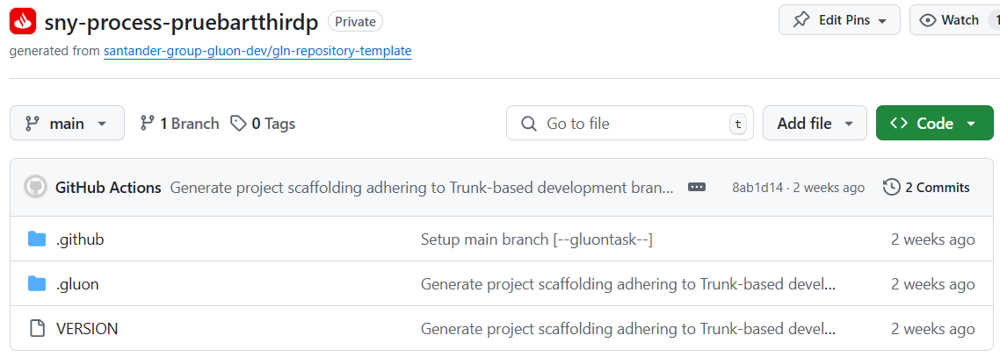

## Introduction

The purpose of this documentation is to provide a **step-by-step guide** on how to orchestrate the upload of an third party image in a destination entity within the GLUON platform.

This guide will allow you to understand how read an image from one registry and copy to another registry (Harbor, Artifactory, ECR and ACR) validating the security (Sysdig).

The current version does not allow the deploy of images but this will be allowed in the future.

## Prerequisites

Third Party Image Reuse Journey, the following prerequisites are required:

  - The Third Party image must be a Release, meaning that the version must be a Release version `x.x.x` following the [Semantic Versioning](https://semver.org/) standard.

## Create Component

### Gluon Portal

First, you have to [**onboard your application**](../..//index.md). Once you have your application created, you can start creating your component.

To create a component, follow the steps described in [**Componnet Management**](../../application/component-management/create-component.md), searching for the component to be created.

You have to select the type of component you want to create, in this case you are going to create an **Third Party Image** component.



The user must provide the location of the Third Party Image to be reused.
Here there are several examples of component configurations, one by each registry type:

#### Harbor example



#### Artifactory example



#### AWS ECR example



#### Azure ACR example



Image Reuse Template Parameters:

| **Input**             | **Required** |       **Default value**       | **Description**                                                                                                                                                 |
|-----------------------|:------------:|:-----------------------------:|-----------------------------------------------------------------------------------------------------------------------------------------------------------------|
| **Branch Strategy**          |     true     |           git-flow            | Git branching model that involves the use of feature branches and multiple primary branches.                                                                    |
| **Class**                    |     true     |          deployable           | Indicates the type of component being created, which is a component that should be deployed in a PaaS.                                                          |
| **Deployment target**        |     true     | optimized-hosting-environment | Indicate target  hosting-environment that should be deployed in a PaaS.                                                                                         |
| **Registry type**            |     true     |              N/A              | Kind of the registry supported: `Harbor`, `Artifactory`, `AWS ECR`, `Azure ACR`                                                                                 |
| **Registry URL**             |     true     |              N/A              | URL of the registry where the origin image is currently stored. Do not include protocol in this parameter.                                                      |
| **Project Name**             |     true     |              N/A              | Name of the registry project where the image is stored.                                                                                                         |
| **Image Name**               |     true     |              N/A              | Name of the image to be reused.                                                                                                                                 |
| **Version**                  |     true     |              N/A              | Version of the image to be reused.                                                                                                                              |
| **Role**                     |     true     |              N/A              | States the role associated with the AWS User.                                                                                                                   |
| **Azure Account**            |     true     |              N/A              | Account identity to access to Azure Cloud services.                                                                                                             |
| **Azure Tenant**             |     true     |              N/A              | Id associated with the Tenant of the organization that it is necessary to use.                                                                                  |
| **Authentication required?** |     true     |              false            | Is necessary authentication to pull the image?                                                                                                                  |
| **Deploy required?**         |     true     |              false            | Only can deploy base image                                                                                                                                      |

Once the component is created, we will be able to see it in the component list, where we will have a direct link to the GitHub repository.

???+ remember

    The repository will be created following the [Repository Naming Convention](../../application/component-management/create-component.md#repository-naming-convention).



We have the following links in:

| Item              | Link                                               | Role Permission                                                                                                                                                                                                                  |
|-------------------|----------------------------------------------------|----------------------------------------------------------------------------------------------------------------------------------------------------------------------------------------------------------------------------------|
| GitHub Repository | Link to the repository created in GitHub           | Developer (RW) /Technical Lead (Maintain) [All roles explained](https://docs.github.com/es/organizations/managing-user-access-to-your-organizations-repositories/managing-repository-roles/repository-roles-for-an-organization) |
| Catalog           | Link to the component catalog in Service Now (APM) | N/A                                                                                                                                                                                                                              |

### Third Party Image Template



#### Structure

The generated Image Reuse component has a structure similar to the following:

```text
📂.github
┣ 📂registry
┃ ┗ 📜reused-image-infos.yml
┣ 📂workflows
┃ ┣ 📜ci-tbd.yml
┃ ┣ 📜release-tbd.yml
┃ ┣ 📜security.yml
┃ ┣ 📜update-component-workflow.yml
┃ ┗ 📜version-validation.yml
┗ 📜CODEOWNERS
📂.gluon
┣ 📂cd
┃ ┣ 📂cert
┃ ┃ ┗📜cd.yml
┃ ┣ 📂pre
┃ ┃ ┗ 📜cd.yml
┃ ┣ 📂pro
┃ ┗ ┗ 📜cd.yml
┗ 📂ci
┗  ┗ 📜properties.env
📜VERSION
```

## Local Development

??? abstract "Cloning your repository"

    ### Cloning your repository

    Once we have the device properly configured, the first step is to clone the project locally.

    To do so, visit [**How to clone de project**](../../application/component-management/create-component.md#cloning-a-repository).

??? abstract "Configuring Third Party image reuse"

    ### Configuring Third Party image reuse

    When creating the component the origin image parameters has been set in .github/registry/reused-image-infos.yaml. Only version parameter can be adjusted later by developer modifying the value stored in *properties.env* file.

## Infrastructure

{!
   include-markdown "../snippets/infrastructure/registry-config.md"
!}

???+ warning "Important"

    In some cases to get the **Origin Image** you have to configure the **Username** and **Password**.
    You can set them using environment secrets. The key names are `ORIGIN_REUSED_CREDENTIAL_USER` and `ORIGIN_REUSED_CREDENTIAL_PASSWORD`.

### How to configure your Registry environment

{!
   include-markdown "../snippets/configuration/oam/snippet-oam.md"
   start="<!--Start Infrastructure Registry 2.0-->"
   end="<!--End Infrastructure Registry 2.0-->"
!}

### Secrets Configuration

{!
   include-markdown "../snippets/configuration/maven-configuration.md"
   start="<!--Start Github Secrets Only Registry 2.0-->"
   end="<!--End Github Secrets Only Registry 2.0-->"
!}

???+ warning "Important"

    Registries Infrastructure does not support Vault secrets

## Component Configuration

### Branches

When you create the component from the Gluon Portal, the component is created with the default values of the template from the scaffolding workflow.

- Creates a **main** branch which contains an initial structure and content for reusing an existing image and deploying it an existing image in other Application/Entity.
- You can create a **feature** branch from the **main** branch to add new features or fix bugs.

This is because we are using the Trunk Based Development (TBD) branching strategy.

## Upload your application

{!
   include-markdown "../snippets/lifecycle/tbd-thirdparty-reuse.md"
!}

## Changelog

### Version 1.0.0

Initial version from which changes are recorded in changelog
