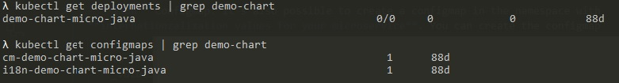

You have to request the following infrastructure resources.

### Registry

- Project: You need a project in the registry (**Harbor** , **JFrog** or **ECR**) to upload your image.
- Credentials: **user/password** with privileges to upload images to the project.

### Kubernetes

- Namespace: You need a **namespace** in the **Kubernetes cluster** to deploy your microservice (and other kubernetes components) in the CERT, PRE and PRO environments.
You can create your namespace in Gluon following [this guide](../../configuration/kubernetes/namespace_harbor.md)
- Credentials: **Service Account** with the credentials to deploy in the namespace.

### Configmaps

- **Configuration** Configmap: You need a configmap in the namespace with your **external environment-dependent microservice configuration**. You can create the configmap component in Gluon following [this guide](../../configuration/kubernetes/configmaps-rm.md).

    To **relate this configmap to your microservice**, it is necessary to define in the _values.yaml_ of the **configmap** the variable **applicationName** with value `cm-[microservice-chart-release-name]-micro-java`.

    In case the variable **fullNameOverride has been defined in the microservice _values.yaml_** the value of the applicationName in the configmap has to be `cm-[microservice-fullNameOverride-value]`.

- **I18n** Configmap: it's also possible to create a configmap in the namespace with **internationzalization values for your microservice**. You can create the configmap component following [this same guide](../../configuration/kubernetes/configmaps-rm.md).

    To **relate this configmap to your microservice**, it is necessary to define in the _values.yaml_ of the **configmap** the variable **applicationName** with value `i18n-[microservice-chart-release-name]-micro-java`.

    In case the variable **fullNameOverride has been defined in the microservice _values.yaml_** the value of the applicationName in the configmap has to be `i18n-[microservice-fullNameOverride-value]`.

E.g.: for a microservice deployed using helm with a Release.Name "demo-chart", these will be the deployment created and the configmaps related:

