Now we are going to describe the steps that a user has to perform in order to make a complete cycle, from the construction process (CI) to the deployment in an artifact repository.

The cycle explained below is based on **GitFlow**.

### Quality Gates

We want our libraries to have the maximum quality in Gluon prior to deployments to production environments, so it will be necessary to have the OK in:

- **Sonar**: Code Quality and test coverage
- **Fortify**: Analysis of the vulnerabilities of our source code
- **Sonatype**: Analysis of the vulnerabilities of our dependencies.

!!! warning "Quality Gates"

    Without these QG resolved we will only be able to deploy release candidate versions, being subject to these validations the release version.

#### Workflows description

##### Python Integration Library

- **Setup environment variables**: Load the properties defined  in the configuration project.
- **Python build & Sonar scan**: Executes the default commands of pipenv install and pipenv build

##### Python Security

- **Setup environment variables**: Load the properties defined in the configuration project.
- **SAST**: Executes the reusable Fortify SAST workflow to perform a SAST scan with Fortify and validate the quality gates.
- **SCA**: Executes the reusable The Sonatype SCA workflow to perform a Sonatype SCA scan and analyze third party components from a repository.
- **Send information to Elasticsearch**: Send data to elasticsearch related with SAST and SCA analysis.

##### Python Quality Gate

- **Setup environment variables**: Load the properties defined  in the configuration project.
- **Python build & Sonar scan**: Executes the default commands of pipenv install and pipenv build

##### Python Release Library

- **Setup environment variables**: Load the properties defined in the configuration project.
- **Python build & Sonar scan**: Executes the default commands of pipenv install and pipenv build
- **Prepare release**: Creates a branch to update library version.
- **SAST**: Executes the reusable Fortify SAST workflow to perform a SAST scan with Fortify and validate the quality gates.
- **SCA**:Executes the reusable The Sonatype SCA workflow to perform a Sonatype SCA scan and analyze third party components from a repository.
- **Send information to Elasticsearch**:Send data to elasticsearch related with SAST and SCA analysis.
- **Python repository upload**: Publishes release version into library repository.

### Events

#### Push to a Feature/Bugfix Branch

To work properly on the project, we first must create a new branch from the **development** branch, usually **feature/gluon-[Your task code here]**.
Once this branch is created, we apply our changes and push them to the github repository.

On a **push**, the ***Python Integration Library*** workflow is executed.

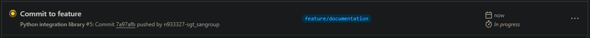
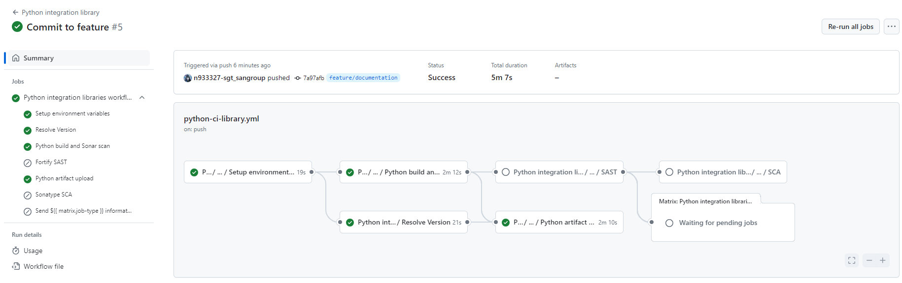

#### Pull Request from Feature to Development

Once the necessary changes have been applied to the **feature** branch, the changes must be merged into the **development** branch through a **Pull Request**.

When we create the **Pull Request** event from our **"Feature" branch to the Development branch** (develop or development), two workflows are executed: ***Python Security*** and ***Python Quality Gate***.

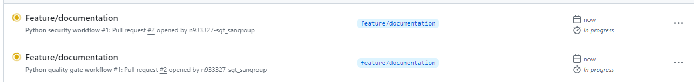
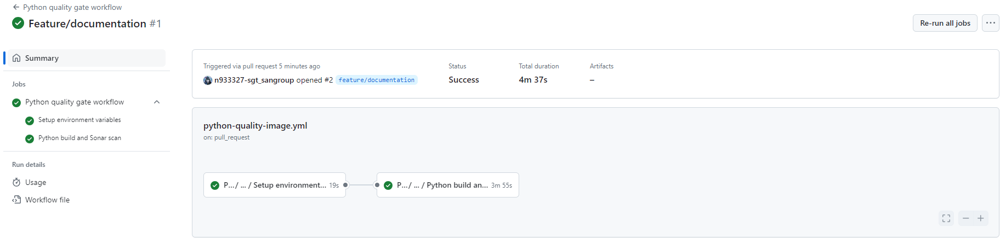
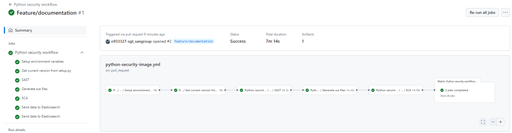

#### Push to Development

When approving the Pull Request of the previous step on the integration branch (development/develop) we will generate a push event on this branch.

The ***Python Integration Library*** workflow is executed and a **Release Candidate version is released**.

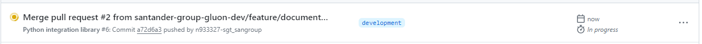
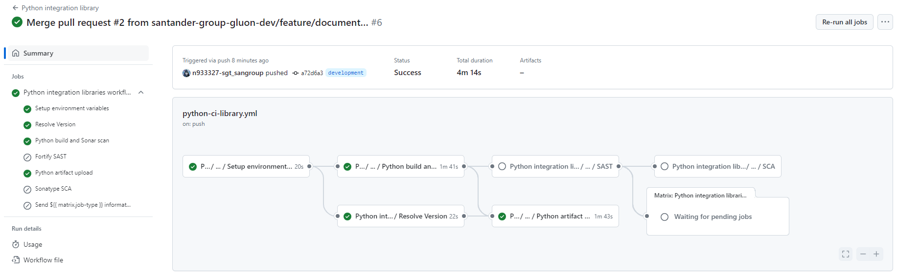

After this step, the library is ready to be used because it has deployed a release candidate version in the Nexus repository.
The format of the version is `X.Y.Z-rc1-timestamp`, where `X.Y.Z` is the version of the library, `rc1` is the release candidate number and `timestamp` is the timestamp of the release.

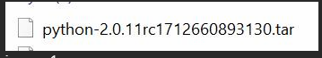

#### Pull Request from Development to Main

When we are ready to promote our library to production, we will create a Pull Request from the integration branch (develop or development) to the main branch.

When we create the **Pull Request** event from our **Development branch to the Main branch**, three workflows are executed: ***Version Validation***, ***Security*** and ***Quality***.

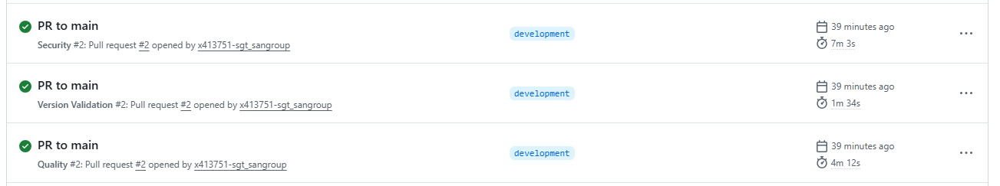
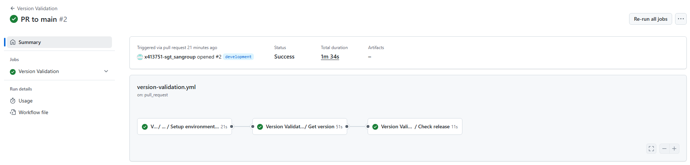
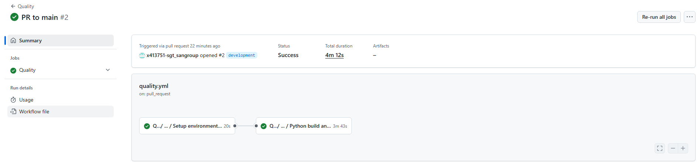
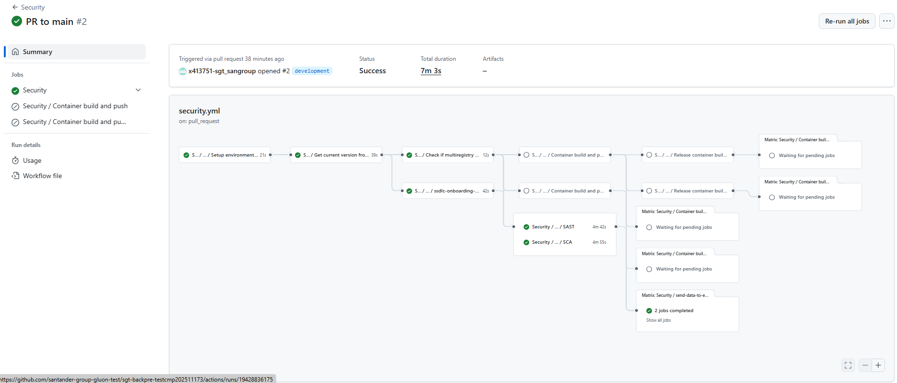

#### Push to main

When we approve the PR of the previous step on the main branch, we will generate a push event on this branch and therefore the ***Release*** workflow will be executed automatically.

This workflow will create a commit with the release version in the main branch.

#### Publish release

While the ***Release*** workflow executes automatically, it will also generate both the tag and release without manual intervention.

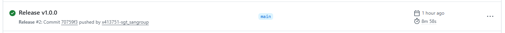
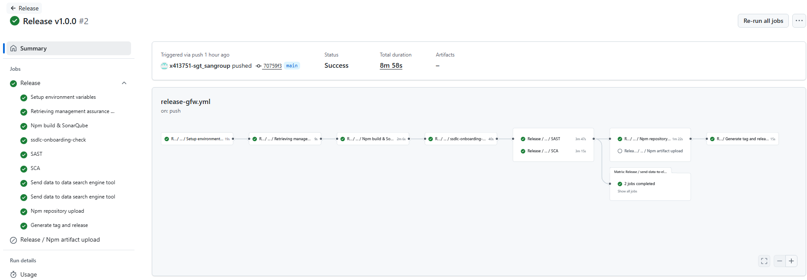

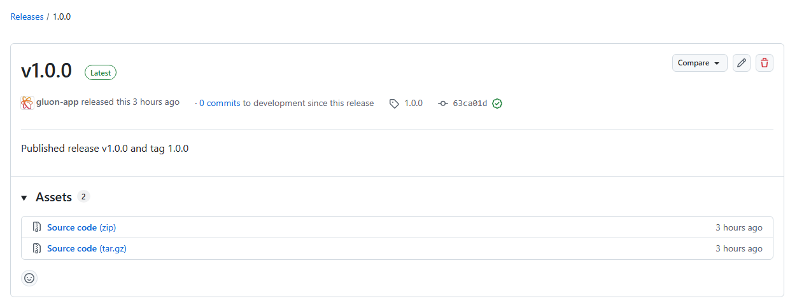

This workflow will publish the release version in artifact
repository.

Your library is now ready to use!
Check the Nexus repository for both snapshot versions (released through pushing to development) and release versions (released through pushing to main).

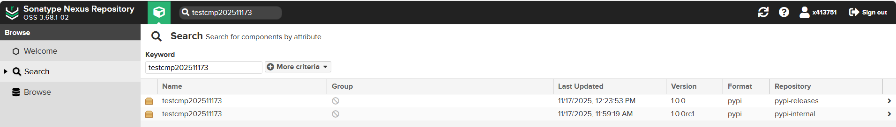

You can view its installation command in the repository:

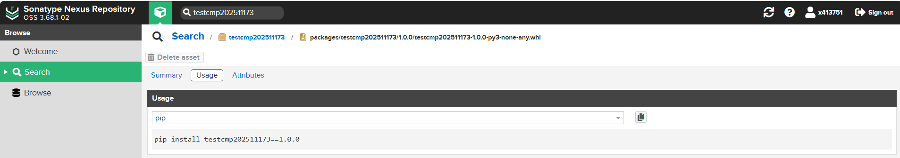

### Generate a new version of the library

When we want to generate a new version of the library, we must create a new branch from the **development** branch, usually **feature/gluon-[Your task code here]**.

Once this branch is created, we have to clone it and change the version in the `setup.py` file.

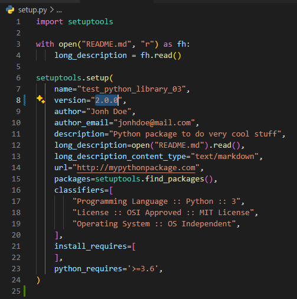

???+ Tip
    The version of the library must be in the format `X.Y.Z`, where:

    - `X` is the major version.
  
    - `Y` is the minor version.
  
    - `Z` is the patch version.
  
    We strongly recommend to follow the [Semantic Versioning](https://semver.org/) standard.

Apply our changes and push them to the github repository, now you are able to start the CI process from the beginning.
