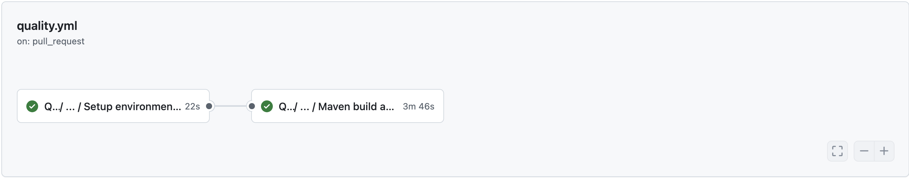
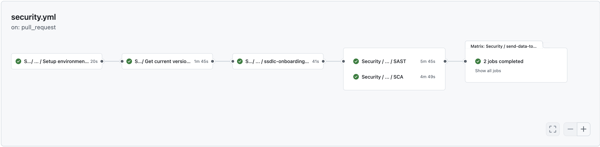
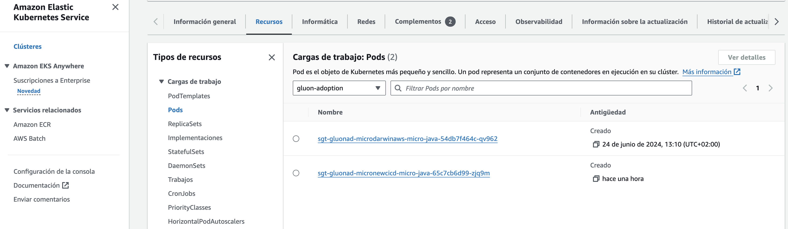
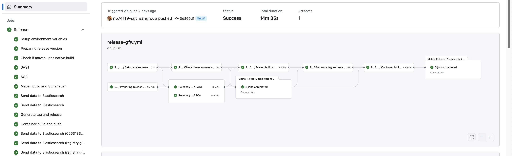

Now we are going to describe the steps that a user has to perform in order to make a complete cycle, from the construction process (CI) to the deployment through the DEV, PRE and PRO environments (CD)

The cycle explained below is based on **GitFlow**

### Quality Gates

We want our microservices to have the maximum quality in Gluon prior to deployments to production environments, so it will be necessary to have the OK in:

- **Sonar**: Code Quality and test coverage
- **Fortify**: Analysis of the vulnerabilities of our source code
- **Sonatype**: Analysis of the vulnerabilities of our dependencies.
- **Gluon Testing**: Functional tests (Execution of Functional Test with Gluon Testing framework after the deployment PRE is successful)

!!! warning "Quality Gates"
    Without these QG resolved we will only be able to deploy to development environments, being subject to these validations the pre/production environments.

### Pull Request from Feature to Develop

We will start working on the "Feature" branches of our GitHub repository, and we will be integrating our changes into the integration branch (develop or development)

When we create the **Pull Request** event from our **"Feature" branch to the integration branch** (develop or development), the quality.yml (Sonar) and security.yml (Fortify & Sonatype) workflows will be executed automatically.

Next, we detail which steps are executed in each of these two workflows:

#### Quality gate workflow

- **Setup environment variables**: Load the properties defined in properties.env file and in the configuration project.
- **Build & Sonar scan**: It builds the application and executes the Sonar scan to validate the quality gates.



??? info "Quality gate workflow code"

    ```yaml linenums="1"
    name: Quality
    on:
      pull_request:
        branches:
          - development
          - develop
          - main
          - master
          - release-v[0-9]+.[0-9]+.[xX]

    jobs:
      call-reusable-workflow:
        name: Quality
        uses: santander-group-shared-assets/gln-workflows/.github/workflows/python-quality-image.yml@v1
        secrets: inherit
    ```

#### Security workflow

- **Setup environment variables**:Load the properties defined in properties.env file and in the configuration project.
- **Get the current version from pom**: Read the pom.xml to get the version of the component.
- **SSDLC Onboarding Check**: Check if the component already exists in Fortify SSC.
- **SAST**: Executes the reusable Fortify SAST workflow to perform a SAST scan with Fortify and validate the quality gates.
- **SCA**:Executes the reusable The Sonatype SCA workflow to perform a Sonatype SCA scan and analyze third party components from a repository.
- **Send information to Elasticsearch**:Send data to elasticsearch related with Fortify analysis.
- **Send information to Elasticsearch**:Send data to elasticsearch related with Sonatype analysis.

??? info "Security workflow code"

    ```yaml linenums="1"
    name: Security
    on:
      pull_request:
        branches:
          - development
          - develop
          - main
          - master
          - release-v[0-9]+.[0-9]+.[xX]

    jobs:
      call-reusable-workflow:
        name: Security
        uses: santander-group-shared-assets/gln-workflows/.github/workflows/python-security-image.yml@v1
        secrets: inherit
    ```


### Push to Develop

When approving the Pull Request of the previous step on the integration branch (development/develop) we will generate a push event on this branch and therefore the ci-gfw.yml workflow will be executed automatically.

Next, we detail which steps are executed in this workflow:

#### Integration workflow

- **Setup environment variables**:Load the properties defined in properties.env file and in the configuration project.
- **Resolve version**: Resolve the version of the component.
- **Check if maven uses native build**: Check if it is necessary to configure a native compilation.
- **Build & Sonar scan**: It builds the application and executes the Sonar scan to validate the quality gates.
- **Fortify SAST** Executes the reusable Fortify SAST workflow to perform a SAST scan with Fortify and validate the quality gates.
- **Sonatype SCA**:Executes the reusable The Sonatype SCA workflow to perform a Sonatype SCA scan and analyze third party components from a repository.
- **Send information to Elasticsearch**: Send data to elasticsearch related with SAST and SCA analysis.
- **Container build and push**:
    - It takes the feature or development branch as image version, and sets the environment variable TAG_VERSION with this value.
    - It builds the docker image based on Dockerfile located in the project and makes a push to one or several image registries associated with the Kubernetes infrastructures configured in the environment `cd.yaml` file.
    - It executes a [sysdig scan](../../../application/ci-cd/sysdig/index.md).
    - Finally, scan the image vulnerabilities and send the data related to the image build to elasticsearch.
- **Deploying a development**: This job deploy our microservice to cert environment

??? info "CI Image workflow code"

    ```yaml linenums="1"
    name: Integration
    on:
      push:
        branches:
          - development
          - develop
          - feature/*

    jobs:
      call-reusable-workflow:
        name: Integration
        uses: santander-group-shared-assets/gln-workflows/.github/workflows/python-ci-gfw.yml@v1
        with:
          technology: 'python'
        secrets: inherit
    ```


If everything works correctly, we will have our image uploaded to the registry, and we will have the information in Sonar and Fortify.


#### Deploy workflow

To learn how the common deployment workflow works, applicable to all technologies, you can refer to the [Common CD Workflow](../../../application/ci-cd/cd/cd-rm/cd-workflow/index.md) section of the documentation.

If everything works correctly, we will have our image deployed in the CERT environment.



### Pull Request from the development branch to the main branch

When we are ready to promote our microservice to the PRE/PRO environments, we will create a Pull Request from the integration branch (develop or development) to the main branch.

This event will launch the **version-validation.yml workflow**, **quality.yml workflow** (Sonar) and **security.yml workflows** (Fortify & Sonatype).

### Push to the main branch

When we approve the PR of the previous step on the main branch, we will generate a push event on this branch,
and therefore the release-gfw.yml workflow will be executed automatically.

#### Release workflow

- **Setup environment variables**: Load the properties defined in properties.env file and in the configuration project. The configuration project is obtained according to the secrets defined here.
- **Preparing release version**: Update version pom in the branch (main or master) with the Release version. Get last commit in the branch.
- **SAST** Executes the reusable Fortify SAST workflow to perform a SAST scan with Fortify and validate the quality gates.
- **SCA**: Executes the reusable The Sonatype SCA workflow to perform a Sonatype SCA scan and analyze third party components from a repository.
- **Build & Sonar scan**: It builds the application and executes the Sonar scan to validate the quality gates.
- **Send information to Elasticsearch**:Send data to elasticsearch related with Fortify analysis.
- **Generate tag and release**: Create the release tag and generate the GitHub Release.
- **Container build and push**:
    - It takes the version from the resolve version job to generate the release identifier as the image version,
      and sets the environment variable TAG_VERSION with this value.
    - After that, it generates the application and the distribution of the configuration, to continue,
    - It builds the docker image based on Dockerfile located in the project and make a push to one or several image registries associated with the Kubernetes infrastructures configured in the environment `cd.yaml` file.
    - The container images are pushed with the calculated release version tag.
    - It executes a [sysdig scan](../../../application/ci-cd/sysdig/index.md).
    - Finally, scan the image vulnerabilities and send the data related to the image build to elasticsearch.
- **Send data to elasticsearch** related to the image.

??? info "Release workflow code"

    ```yaml linenums="1"
    name: Release
    on:
      push:
        branches:
          - main
          - master

    jobs:
      call-reusable-workflow:
        name: Release
        uses: santander-group-shared-assets/gln-workflows/.github/workflows/python-release-gfw.yml@v1
        with:
          technology: 'python'
        secrets: inherit
    ```



At the end of the workflow, we can see a GitHub Release has been created using the GitHub Tag generated with the Release workflow.


And a new container image has been pushed to the container registry using the same name as the tag of the version:


#### PRE and PRO Deployment

The **Deploy Workflow** can be called manually to deploy the microservice in the PRE and PRO environments.

To learn how the common deployment workflow works, applicable to all technologies, you can refer to the [Common CD Workflow](../../../application/ci-cd/cd/cd-rm/cd-workflow/index.md) section of the documentation.

### Retry a deploy

#### Retry a deployment execution

If the **"Container build and push"** job runs successfully and publishes the Release version, you can rerun the deployment workflow.

## Deploy using the Gluon Release Management

Gluon Release Management is a Gluon portal integration process that aims to automate the creation of
releases and tasks in Servicenow ITSM, as well as the orchestration of deployment in Github through
the portal itself.

For getting to know how to deploy using this tool,
please refer to the
[Release Management](../../../application/release-management/zero-touch/index.md)
documentation.
