Now we are going to describe the steps that a user has to perform in order to make a complete cycle, from the construction process (CI) to the deployment through the DEV, PRE and PRO environments (CD)

The cycle explained below is based on **GitFlow**

### Quality Gates

We want our microservices to have the maximum quality in Gluon prior to deployments to production environments, so it will be necessary to have the OK in:

- **Sonar**: Code Quality and test coverage
- **Fortify**: Analysis of the vulnerabilities of our source code
- **Sonatype**: Analysis of the vulnerabilities of our dependencies.
- **Gluon Testing**: Functional tests (Execution of Functional Test with Gluon Testing frameworks after the deployment to PRE is successful)

!!! warning "Quality Gates"
    Without these QG resolved we will only be able to deploy to development environments, being subject to these validations the pre/production environments.

### Pull Request from Feature to Develop

We will start working on the "Feature" branches of our GitHub repository and we will be integrating our changes into the integration branch (develop or development)

When we create the **Pull Request** event from our **"Feature" branch to the integration branch** (develop or development), the maven-quality-image.yml (Sonar) and maven-security-image.yml (Fortify & Sonatype) workflows will be executed automatically.

Next we detail which steps are executed in each of these two workflows:

#### Maven quality gate workflow

- **Setup environment variables**: Load the properties defined in properties.env file and in the configuration project.
- **Maven build & Sonar scan**: Executes the default commands of MAVEN_BUILD_GOAL: clean verify


??? info "Maven quality gate workflow code"

    ```yaml linenums="1"
    name: Maven quality gate workflow
    on:
      pull_request:
        branches:
          - development
          - develop
          - main
          - master
     
    jobs:
      call-reusable-workflow:
        name: Maven quality gate workflow
        uses: santander-group-gluon/gln-workflows/.github/workflows/maven-quality-image.yml@v1
        with:
          runner: 'maven-runner'
        secrets: inherit
    ```

#### Maven security workflow

- **Setup environment variables**:Load the properties defined in properties.env file and in the configuration project.
- **SAST**: Executes the reusable Fortify SAST workflow to perform a SAST scan with Fortify and validate the quality gates.
- **SCA**:Executes the reusable The Sonatype SCA workflow to perform a Sonatype SCA scan and analyze third party components from a repository.
- **Send information to Elasticsearch**:Send data to elasticsearch related with SAST and SCA analysis.

??? info "Maven security workflow code"

    ```yaml linenums="1"
    name: Maven security workflow
    on:
      pull_request:
        branches:
          - development
          - develop
          - main
          - master
     
    jobs:
      call-reusable-workflow:
        name: Maven security workflow
        uses: santander-group-gluon/gln-workflows/.github/workflows/maven-security-image.yml@v1
        with:
          runner: 'maven-runner'
        secrets: inherit
    ```


### Push to Develop

When approving the Pull Request of the previous step on the integration branch (development/develop) we will generate a push event on this branch and therefore the maven-ci-image.yml workflow will be executed automatically.

Next we detail which steps are executed in this workflow:

#### Maven CI Image workflow

- **Setup environment variables**:Load the properties defined in properties.env file and in the configuration project.
- **Maven build**: Executes the default commands of MAVEN_BUILD_GOAL: clean verify
- **SAST** Executes the reusable Fortify SAST workflow to perform a SAST scan with Fortify and validate the quality gates.
- **Send information to Elasticsearch**: Send data to elasticsearch related with SAST analysis.
- **SCA**:Executes the reusable The Sonatype SCA workflow to perform a Sonatype SCA scan and analyze third party components from a repository.
- **Docker build and push**:
    - It takes the feature or development branch as image version and sets the environment variable TAG_VERSION with this value.
    - Then execute the command mvn clean package -Dmaven.test.skip=true to build the application artifact.
    - It builds the docker image based on Dockerfile located in the project and make a push to one or several harbor registries defined in the multiregistry.yaml file.
    - It executes a [sysdig scan](../../../application/ci-cd/sysdig/index.md).
    - Finally, scan the image vulnerabilities in Harbor and send the data related to the image build to elasticsearch.
- **Send information to Elasticsearch**:Send data to elasticsearch related with SAST and SCA analysis.
- **Deploying a development**:  This job call to workflow maven-cd-image.yaml for deploy our microservice to cert environment
- **Send data to elasticsearch** related to the deployment

??? info "Maven CI Image workflow code"

    ```yaml linenums="1"
    name: Maven integration images
    on:
      push:
        branches:
          - development
          - develop
          - feature/*
          - fix/*
     
    jobs:
      call-reusable-workflow:
        name: Maven integration images workflow
        uses: santander-group-gluon/gln-workflows/.github/workflows/maven-ci-image.yml@v1
        with:
          runner: 'maven-runner'
        secrets: inherit
    ```


If everything works correctly, we will have our image uploaded to the registry and we will have the information in Sonar and Fortify.


#### Maven CD Image workflow

- **Show inputs**:It displays in the log and creates an annotation with the values of the input parameters entered by the user.
- **Setup environment variables**:Load the properties defined in properties.env file and in the configuration project.
- **Resolve version**:It takes the deploy-version input parameter or the version from pom.xml as version to deploy.
- **Deployment regions matrix**:This job generates a json matrix with one or more regions of the environment according to CERT_DEPLOYMENT, PRE_DEPLOYMENT and PRO_DEPLOYMENT properties and from deployment file.
Then set this json as output for the next job that used the matrix to do multiple deployments base on the number of regions.
- **Deploy cert in n regions**:Deployment to the environment according to CERT_DEPLOYMENT property with possibility of multi-region deployment.

??? info "Maven CD Image workflow code"

    ```yaml linenums="1"
    name: Maven CD image
    on:
      workflow_dispatch:
        inputs:
          deploy-version:
            required: false
            type: string
            description: 'Image version to deploy. By default the version of the pom.xml is obtained.'
          deployment-yaml-name:
            required: false
            type: string
            default: 'deployment.yaml'
            description: 'Name of yaml file that includes the deployment configuration for one or more environments.'
          config-version:
            required: false
            type: string
            description: 'Version of properties and deployment.yaml file to use in the deployment'
          deploy-type:
            type: choice
            required: false
            default: default
            options:
              - default
              - ose3
              - ansible
              - helm
            description: "Deployment type to execute"
          deployment-environment:
            required: true
            type: choice
            options:
              - cert
              - pre
              - cert/pre
              - pre/pro
              - cert/pre/pro
            description: "Environment to deploy"
          draft-id:
            type: string
            required: false
            description: 'Draft identity to create release from release candidate and deployment-environment "pre/pro", "cert/pre/pro"'
     
    jobs:
      call-reusable-workflow:
        name: Maven CD image
        uses: santander-group-gluon/gln-workflows/.github/workflows/maven-cd-image.yml@v1
        with:
          runner: 'maven-runner'
          deploy-version: ${{ inputs.deploy-version }}
          deployment-yaml-name: ${{ inputs.deployment-yaml-name }}
          config-version: ${{ inputs.config-version }}
          deployment-environment: ${{ inputs.deployment-environment }}
          deploy-type: ${{ inputs.deploy-type }}
          draft-id: ${{ inputs.draft-id }}
        secrets: inherit
    ```

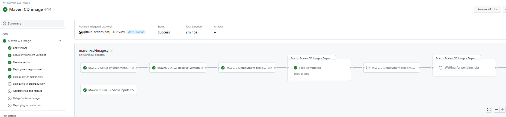

If everything works correctly, we will have our image deployed in the CERT environment.

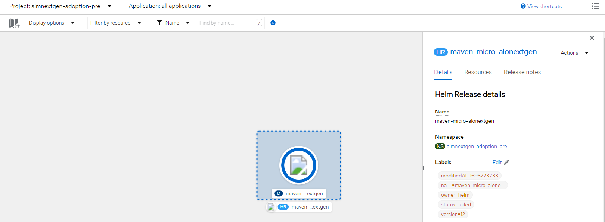

### Pull Request from develop to main

When we are ready to promote our microservice to the PRE/PRO environments, we will create a Pull Request from the integration branch (develop or development) to the main branch.

This event will launch the **maven-quality-image.yml workflow** (Sonar) and **maven-security-image.yml workflows** (Fortify & Sonatype).

### Push to main

When we approve the PR of the previous step on the main branch, we will generate a push event on this branch and therefore the maven-rc-image.yml workflow will be executed automatically.

#### Maven RC Image workflow

- **Setup environment variables**: Load the properties defined in properties.env file and in the configuration project. The configuration project is obtained according to the secrets defined here.
- **Preparing release candidate**: Update version pom in the branch (main or master). Get next RC version. Get last commit in the branch.
- **Maven build & Sonar scan**: Executes the default commands of MAVEN_BUILD_GOAL: clean verify. If you want overwrite the maven command you can configure in properties.env
- **The Sonar analysis** is executed to validate the quality gates
- **Send data to elasticsearch** related with Sonar analysis.
- **Create release candidate tag**: Creates a new tag for RC.
- **SAST** Executes the reusable Fortify SAST workflow to perform a SAST scan with Fortify and validate the quality gates.
- **Send information to Elasticsearch**: Send data to elasticsearch related with SAST analysis.
- **SCA**: Executes the reusable The Sonatype SCA workflow to perform a Sonatype SCA scan and analyze third party components from a repository.
- **Docker build and push**:
    - It takes the version from pom.xml job as image version and sets the environment variable TAG_VERSION with this value.
    - After that, it generates the application and the distribution of the configuration, to continue,
    - It builds the docker image based on Dockerfile located in the project and make a push to one or several harbor registries defined in the multiregistry.yaml file.
    - It executes a [sysdig scan](../../../application/ci-cd/sysdig/index.md).
    - Finally, scan the image vulnerabilities in Harbor and send the data related to the image build to elasticsearch.
- **Send data to elasticsearch** related to the image.
- If IMAGE_DEPLOY_TYPE property is helm then execute the command to package the Helm chart. Afterthat, the Helm package is pushed to one or several harbor registries definided in the multiregistry.yaml file. The chart version is TAG_VERSION.
- **Create draft release**: Creates a new draft release and select the check Set as a pre-release tag for RC.
- **Deploying**: This job call to workflow maven-cd-image.yaml for deploy our microservice to PRE and PRO environment

??? info "Maven RC Image workflow code"

    ```yaml linenums="1"
    name: Maven release candidate images
    on:
      push:
        branches:
          - main
          - master
     
    jobs:
      call-reusable-workflow:
        name: Maven release candidate images workflow
        uses: santander-group-gluon/gln-workflows/.github/workflows/maven-rc-image.yml@v1
        with:
          runner: 'maven-runner'
        secrets: inherit
    ```

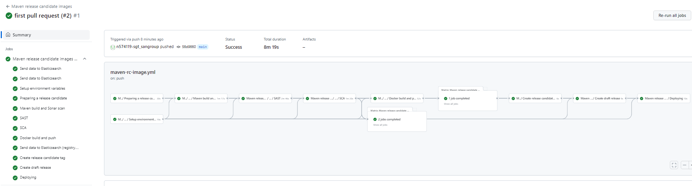

At the end of the workflow we can see the image uploaded to the registry with the 'RC' tag.

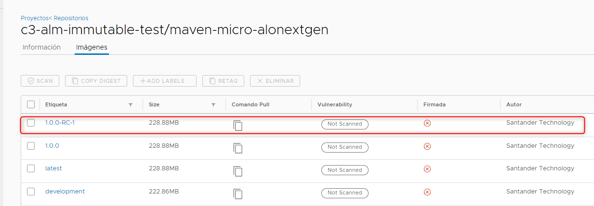

#### PRE Deployment

The Maven RC Image Workflow calls the **Maven CD Image Workflow** to deploy the microservice in the PRE and PRO environments.

We have to define the **environment secrets** and define the approvals the deployment will be waiting for approval.

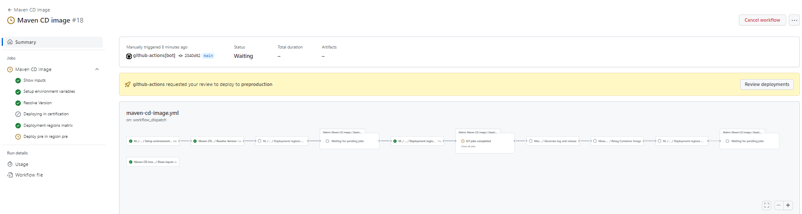

That's because we have defined in production and preproduction environments protection rules for the users that can approve the deployment.

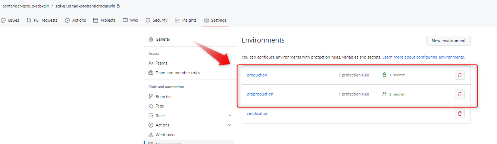

If we click in the environment configuration we can see the users that can approve the deployment.


To deploy in **PRE** we will click in **Review deployments** set a comment and we approve the deployment


At this point the following jobs will be executed

- **Deploy pre in n regions**: Deployment to PRE environment
- **Running test PRE**: Execution of Functional Test with Gluon Testing framework after the deployment PRE is successful. The test environment where the tests are executed is 'PRE'.
- **Send data to elasticsearch** related to the deployment.
- **Generate tag and release**:
    - Creates a new tag for RL and create a new release version from draft release generated in maven-rc-image workflow.
    - It takes draft-it input from maven-rc-image workflow to create the new release from draft release.
- **Retag Container Image**:
    - Retag the version of the image associated with the Release Candidate to the new version of the Release.
    - Associates the latest version to the Release version.

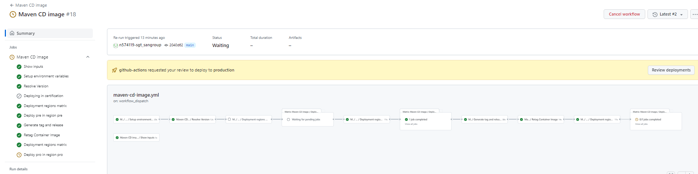

So at this point we have:

- The **microservice deployed** in the PRE environment
- New **Tag and Release** in Github
- New **image tag** in the registry
- **Functional test** executed in **Gluon Testing**.

#### PRO Deployment

The last step, when we have already deployed our microservice in PRE, we will see that it has been left pending approval again, always as we have commented previously, that protection rules have been defined in the production environment.

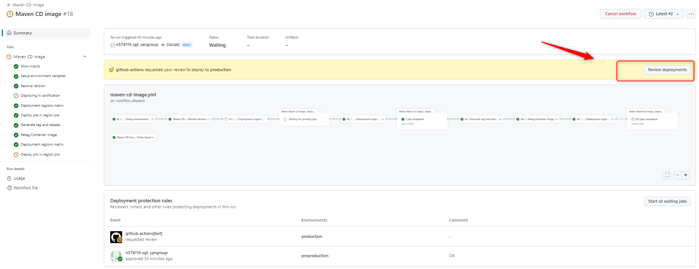

One of the project reviewers must approve the deployment.

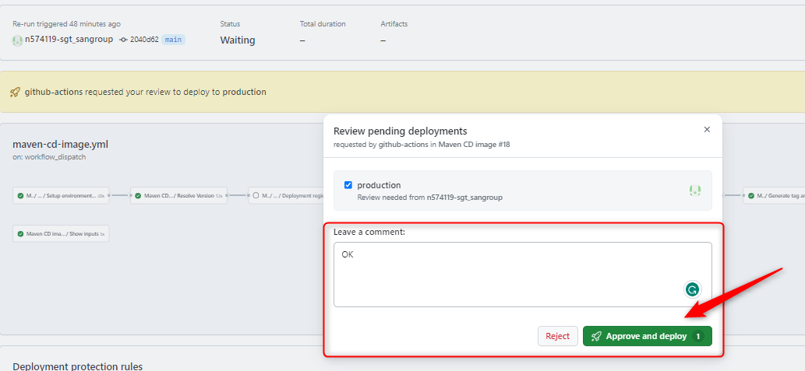

Once the deployment is approved, the last job of the cd workflow will be launched, so CONGRATULATIONS !!!!, with this you already have the deployment of your microservice in production.

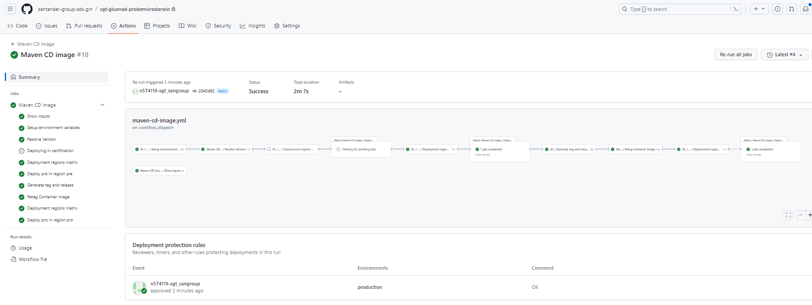

<hr/>

### Manual Deploy

We can execute the maven-cd-image.yaml workflow manually to deploy a specific version of our microservice in any of the environments that we have defined in our deployment.yaml.

Inside "Actions", we click on "Maven CD image" on the left side of the screen and click on the "Run workflow" button on the right side of the screen.


In the configuration we select the environments where we want to deploy

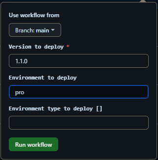

The execution is the same as in the previous case, we will have to wait for the approval of the reviewers to deploy in the PRE and PRO environment.


### Retry a deploy

#### Retry deploy execution with RC version

If the workflow fails and not publish the version Release, you can execute retry only the failed job, you just have to click on the **"Re-run jobs > Re-run failed jobs"** button.

Or you can re-run the entire jobs in workflow by clicking on the **"Re-run jobs > Re-run all jobs"** button, or run workflow again passing input parameters (In this two cases all jobs will be executed).

In all cases, when running again, some validations will be carried out to avoid deployment errors and ensure that the image being published is the image that was building for correspondent TAG version.

- **1** - The workflow will check if the commit hash is the same as the last commit hash of GitHub TAG version.
- **2** - The workflow will check if the hash of the image published in RC is the same as the hash of version published in Release.

If the validations are correct, the workflow will continue with the deployment without problems.

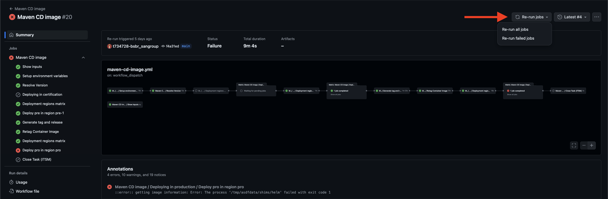

#### Retry deploy execution with Release version

If the **"Retag Container image"** job runs successfully and publishes the Release version, you can rerun the workflow with the release version.

In this case we don't have validated hash of commit or image, this is the fastest way to rerun the deployment,
because the workflow will skip the **"Generate tag and release"** and **"Retag Container image"** jobs and make only the deployment of Release version on environment.

see [**Manual Deploy**](gitflow.md#manual-deploy) to know how to run the workflow manually.
