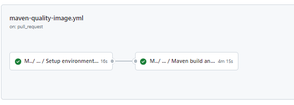
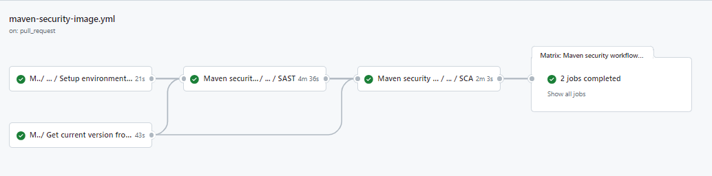
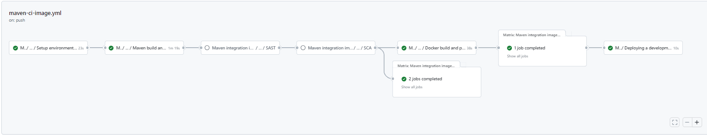
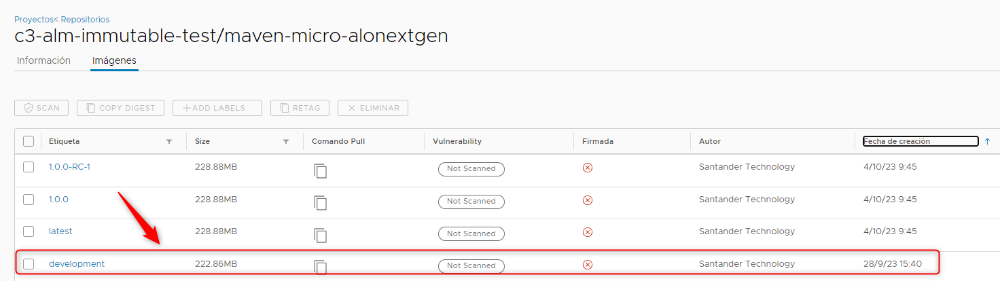

Now we are going to describe the steps that a user has to perform in order to make a complete cycle, from the construction process (CI) to the deployment through the DEV, PRE and PRO environments (CD)

The cycle explained below is based on **GitFlow**

### Quality Gates

We want our Extension to have the maximum quality in Gluon prior to upload to a registry (Harbor/JFROG/ECR) so it will be necessary to have the OK in:

- **Sonar**: Code Quality and test coverage
- **Fortify**: Analysis of the vulnerabilities of our source code
- **Sonatype**: Analysis of the vulnerabilities of our dependencies.

### Pull Request from Feature to Develop

We will start working on the "Feature" branches of our GitHub repository, and we will be integrating our changes into the integration branch development

When we create the **Pull Request** event from our **"Feature" branch to the integration branch** development, the maven-quality-image.yml (Sonar) and maven-security-image.yml (Fortify & Sonatype) workflows will be executed automatically.

Next we detail which steps are executed in each of these two workflows:

#### Maven quality gate workflow

- **Setup environment variables**: Load the properties defined in properties.env file and in the configuration project.
- **Maven build & Sonar scan**: Executes the default commands of MAVEN_BUILD_GOAL: clean verify



??? info "Maven quality gate workflow code"

    ```yaml linenums="1"
    name: Maven quality gate workflow
    on:
      pull_request:
        branches:
          - development
          - develop
          - main
          - master
     
    jobs:
      call-reusable-workflow:
        name: Maven quality gate workflow
        uses: santander-group-gluon/gln-workflows/.github/workflows/maven-quality-image.yml@v1
        with:
          runner: 'maven-runner'
        secrets: inherit
    ```

#### Maven security workflow

- **Setup environment variables**:Load the properties defined in properties.env file and in the configuration project.
- **SAST**: Executes the reusable Fortify SAST workflow to perform a SAST scan with Fortify and validate the quality gates.
- **SCA**:Executes the reusable The Sonatype SCA workflow to perform a Sonatype SCA scan and analyze third party components from a repository.
- **Send information to Elasticsearch**:Send data to elasticsearch related with SAST and SCA analysis.

??? info "Maven security workflow code"

    ```yaml linenums="1"
    name: Maven security workflow
    on:
      pull_request:
        branches:
          - development
          - develop
          - main
          - master
     
    jobs:
      call-reusable-workflow:
        name: Maven security workflow
        uses: santander-group-gluon/gln-workflows/.github/workflows/maven-security-image.yml@v1
        with:
          runner: 'maven-runner'
        secrets: inherit
    ```


### Push to Develop

When approving the Pull Request of the previous step on the integration branch (development) we will generate a push event on this branch and therefore the maven-ci-image.yml workflow will be executed automatically.

Next we detail which steps are executed in this workflow:

#### Maven CI Image workflow

- **Setup environment variables**:Load the properties defined in properties.env file and in the configuration project.
- **Maven build**: Executes the default commands of MAVEN_BUILD_GOAL: clean verify
- **SAST** Executes the reusable Fortify SAST workflow to perform a SAST scan with Fortify and validate the quality gates.
- **Send information to Elasticsearch**: Send data to elasticsearch related with SAST analysis.
- **SCA**:Executes the reusable The Sonatype SCA workflow to perform a Sonatype SCA scan and analyze third party components from a repository.
- **Docker build and push**:
    - It takes the feature or development branch as image version and sets the environment variable TAG_VERSION with this value.
    - Then execute the command mvn clean package -Dmaven.test.skip=true to build the application artifact.
    - It builds the docker image based on Dockerfile located in the project and make a push to one or several harbor registries defined in the multiregistry.yaml file.
    - It executes a [sysdig scan](../../../application/ci-cd/sysdig/index.md).
    - Finally, scan the image vulnerabilities in Harbor and send the data related to the image build to elasticsearch.
- **Send information to Elasticsearch**:Send data to elasticsearch related with SAST and SCA analysis.
- **Deploying a development**:  This job call to workflow maven-cd-image.yaml for deploy our microservice to cert environment
- **Send data to elasticsearch** related to the deployment

??? info "Maven CI Image workflow code"

    ```yaml linenums="1"
    name: Maven integration images
    on:
      push:
        branches:
          - development
          - develop
          - feature/*
          - fix/*
     
    jobs:
      call-reusable-workflow:
        name: Maven integration images workflow
        uses: santander-group-gluon/gln-workflows/.github/workflows/maven-ci-image.yml@v1
        with:
          runner: 'maven-runner'
        secrets: inherit
    ```


If everything works correctly, we will have our image uploaded to the registry and we will have the information in Sonar and Fortify.



### Pull Request from development to main

When we are ready to promote our Extension to the main branch, we will create a Pull Request from the integration branch (development) to the main branch.

This event will launch the **maven-quality-image.yml workflow** (Sonar) and **maven-security-image.yml workflows** (Fortify & Sonatype).

<hr/>
