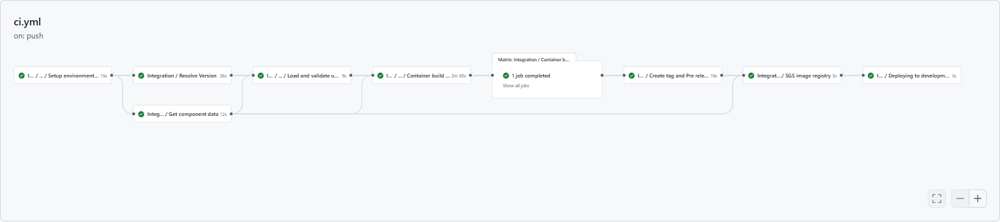
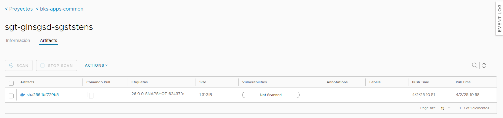
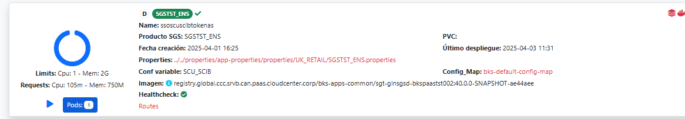
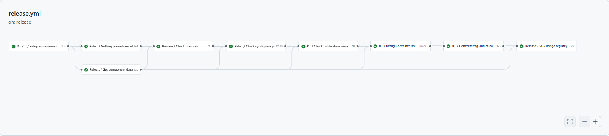
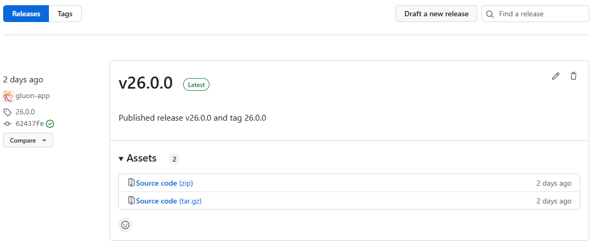
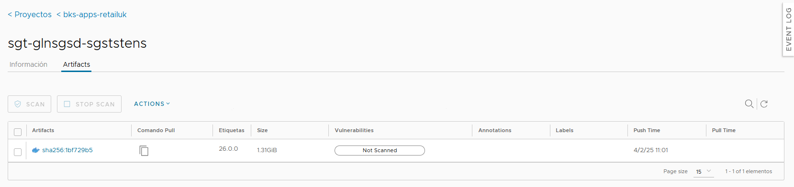

### Trunk Based Development

Now we are going to describe the steps that a user has to perform in order to make a complete cycle, from the construction process (CI) to the deployment through the DEV environments (CD)

The cycle explained below is based on **Trunk Based Development**.

#### Pull Request from Feature to Main

We will start working on the "Feature" branches of our GitHub repository, and we will be integrating our changes into the main branch.

When we create the **Pull Request** event from our **"Feature" branch to the main branch**, the
version-validation.yml (Version Release validation) will be executed automatically.

Next, we detail which steps are executed in each of these two workflows:

#### Push to Main

When approving the Pull Request of the previous step on the main branch we will generate a push event on this branch and therefore the ci-tbd.yml workflow will be executed automatically.

Next, we detail which steps are executed in this workflow:

##### Integration workflow

- **Setup environment variables**: Load the properties defined in properties.env file and in the configuration project.
- **Get component data**: Get the customization parameters of the component.
- **Resolve version**: Resolve the version of the component.
- **Load and validate user variables**: Load the default values of properties not defined in properties.env and validate the values of mandatory properties defined in properties.env.
- **Container build and push**:
    - It takes the feature or development branch as image version, and sets the environment variable TAG_VERSION with this value.
    - It downloads the Dockerfile from Banksphere architecture image repository.
    - It builds the docker image based on downloaded Dockerfile and makes a push to image registries associated with the Kubernetes infrastructure configured in the environment `cd.yaml` file.
    - Finally, [sysdig scan](../../../application/ci-cd/sysdig/index.md) the image for vulnerabilities and send the data related to elasticsearch.
- **Send data to elasticsearch**: related with the image registries where the image has been published.
- **Create tag and Pre release**: Create a tag with the version of the component and generate a pre-release in GitHub.
- **SGS image registry**: Register the docker image in SGS associated with Banksphere assembly product PSI.
- **Deploying a development**: This job call to workflow cd.yaml for deploy our Banksphere assembly product to cert environment

??? info "Integration workflow code"

    ```yaml linenums="1"
    name: Integration

    on:
      push:
        branches:
          - main
          - master

    jobs:
      call-reusable-workflow:
        name: Integration
        uses: santander-group-shared-assets/gln-bks-workflows/.github/workflows/bks-ci-tbd.yml@v1
        secrets: inherit
    ```


If everything works correctly, we will have our image uploaded to the registry.



##### Deploy workflow

To learn how the common deployment workflow works, applicable to all technologies, you can refer to the [Common CD Workflow](../../../application/ci-cd/cd/cd-rm/cd-workflow/index.md) section of the documentation.

If everything works correctly, we will have our image deployed in the CERT environment.



#### Release

When we want to publish a final version, we will do it from the GitHub releases page. First, we select the previously created version (draft version) and then, check the "Set as pre-release" option and click "Publish release".
The release-tbd.yml workflow will run automatically.

##### Release workflow

- **Setup environment variables**: Load the properties defined in properties.env file and in the configuration project. The configuration project is obtained according to the secrets defined here.
- **Get component data**: Get the customization parameters of the component and the data of the CI that you have configure in your OAM configuration.
- **Resolve version**: Get pre-release version, update VERSION file in the branch (main or master) with the Release version. Get last commit in the branch.
- **Check user role**: Validate the user has the proper role in SGS to publish the release.
- **Check sysdig image**: [Sysdig scan](../../../application/ci-cd/sysdig/index.md) the image for vulnerabilities and send the data related to elasticsearch.
- **Check publication release level in SGS**: Validate and change, if necessary, the publication level in SGS. Then send DTS documentation to HADA.
- **Retag container image**:
    - Take the version from the resolve version job to generate the release identifier as the image version,  and sets the environment variable TAG_VERSION with this value.
    - After that, retag the pre-release snapshot image to the client project path of the certification registry with the calculated release version tag.
- **Generate tag and release**: Create the release tag and generate the GitHub Release.
- **SGS image registry**: Register the docker image in SGS associated with Banksphere assembly product PSI.

??? info "Release workflow code"

    ```yaml linenums="1"
    name: Release

    on:
      release:
        types:
          - published

    jobs:
      call-reusable-workflow:
        name: Release
        uses: santander-group-shared-assets/gln-bks-workflows/.github/workflows/bks-release-tbd.yml@v1
        secrets: inherit
    ```



At the end of the workflow, we can see a GitHub Release has been created using the GitHub Tag generated with the Release workflow.



And a new container image has been pushed to the container registry using the same name as the tag of the version:



<hr/>

#### Retry a deploy

##### Retry a deployment execution

If the **"Container build and push"** job runs successfully and publishes the Release version, you can rerun the deployment workflow.

### Deploy using the Gluon Release Management

Gluon Release Management is a Gluon portal integration process that aims to automate the creation of
releases and tasks in Servicenow ITSM, as well as the orchestration of deployment in Github through
the portal itself.

For getting to know how to deploy using this tool,
please refer to the
[Release Management](../../../application/release-management/zero-touch/index.md)
documentation.
