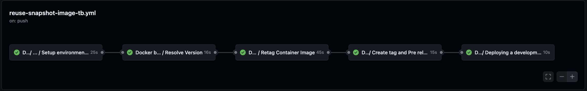
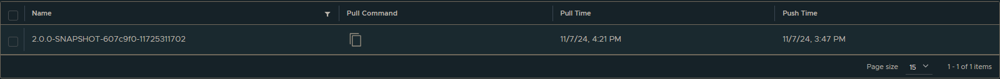
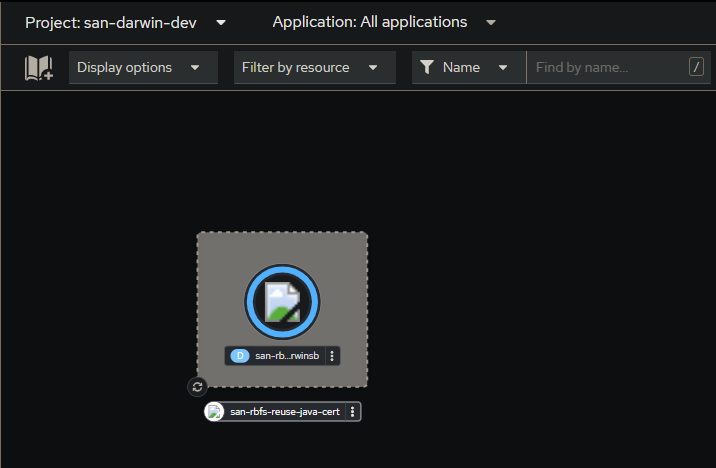
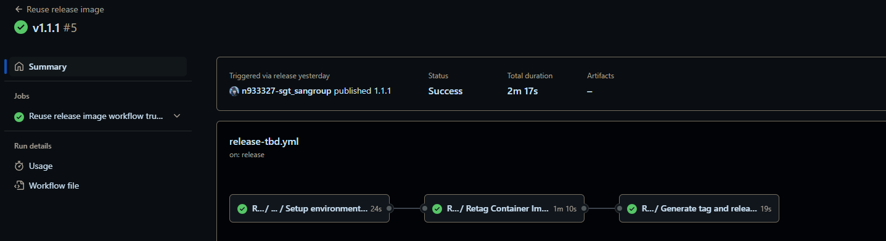
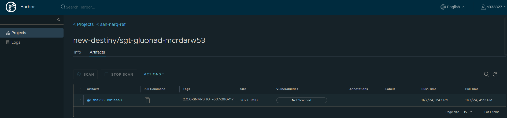
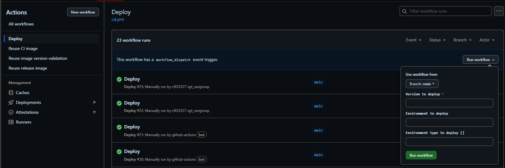
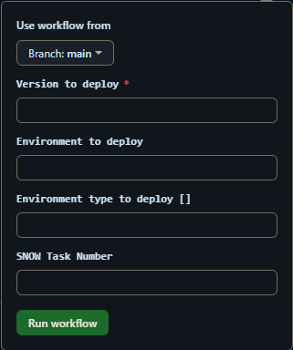
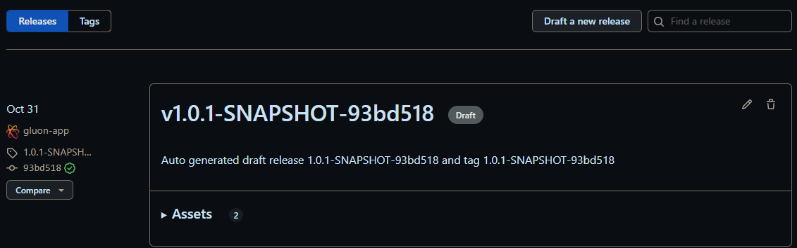
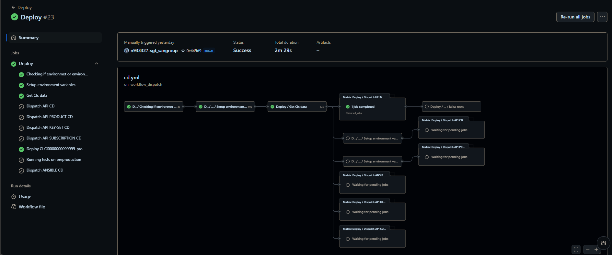

Now we are going to describe the steps that a user has to perform in order to make a complete cycle, from the construction process (CI) to the deployment through the DEV, PRE and PRO environments (CD)

The cycle explained below is based on **Trunk based development**

### Push to Main

When push to the main branch (main/master) we will generate a push event on this branch and therefore the **Reuse CI image** workflow will be executed automatically.

Next we detail which steps are executed in this workflow:

#### Reuse snapshot image TBD workflow

- **Setup environment variables**:Load the properties defined in properties.env file and in the configuration project.
- **Resolve Version**:Validates the version of the reusable image being used. The version must be a RELEASE.
- **Retag container image**:
    - Retag the source image to the destination registry with the following pattern x.x.x-SNAPSHOT-SHOT_COMMIT_HASH-GITHUB_WORKFLOW_EXECUTION_ID (x.x.x is the version)
    - The retag image version sets the environment variable TAG_VERSION with this value.
- **Create tag and Pre release**: Creates a new draft release and select the check Set as a pre-release.
- **Deploying a development**:  This job call to workflow cd.yml for deploy our image to cert environment. There is a boolean parameter "DEPLOYMENT_TO_CERTIFICATION" in the .gluon/ci/properties.env file to enable/disable deployment to certification.

  ```yaml linenums="1"
  ORIGIN_REUSED_IMAGE_VERSION=X.Y.Z
  DEPLOYMENT_TO_CERTIFICATION=false
  ```
  
??? info "Reuse CI image"

    ```yaml linenums="1"
    name: Reuse CI image
    on:
      push:
        branches:
          - main
          - master

    jobs:
      call-reusable-workflow:
        name: Reuse snapshot image workflow Trunk based
        uses: santander-group-shared-assets/gln-workflows/.github/workflows/reuse-image-ci-tbd.yml@v1
        secrets: inherit
    ```


If everything works correctly, we will have our image retaged to the registry with following pattern x.x.x-SNAPSHOT-SHOT_COMMIT_HASH-GITHUB_WORKFLOW_EXECUTION_ID (x.x.x is the version).



#### Deploy workflow

To learn how the common deployment workflow works, applicable to all technologies, you can refer to the [Common CD Workflow](../../../application/ci-cd/cd/cd-rm/cd-workflow/index.md) section of the documentation.

If everything works correctly, we will have our image deployed in the CERT environment. If the deployment is configured for certification.



### Publish release

When we are ready to promote our image to the PRE/PRO environments, we will publish the draft-release generated in reuse-snapshot-image-tb.yml workflow.

This event will launch the **release-tbd.yml workflow**.

#### Reuse release image workflow trunk based workflow

- **Setup environment variables**: Load the properties defined in properties.env file and in the configuration project. The configuration project is obtained according to the secrets defined here.
- **Retag container image**:
  - Retag the source image to the destination registry with the following pattern x.x.x (x.x.x is the version)
  - The retag image version sets the environment variable TAG_VERSION with this value.
- **Generate tag and release**: Creates a new git tag for the release.

??? info "Reuse release image workflow code"

    ```yaml linenums="1"
    name: Reuse release image
    on:
      release:
        types:
          - published

    jobs:
      call-reusable-workflow:
        name: Reuse release image workflow trunk based
        uses: santander-group-shared-assets/gln-workflows/.github/workflows/reuse-image-release-tbd.yml@v1
        secrets: inherit
    ```



At the end of the workflow we can see the image retaged to the registry with following pattern x.x.x (x.x.x is the version).



### Manual Deploy

We can execute the cd.yml workflow manually to deploy a specific version of our microservice in any of the environments that we have defined in our OAM.

Inside "Actions", we click on "Deploy" on the left side of the screen and click on the "Run workflow" button on the right side of the screen.



In the configuration we have to insert the version that we want to deploy and the environment where we want to deploy it.



In the **Version to Deploy** you have to put the name of the version that you want to deploy. In the example above you can see that we are deploying the version `v1.0.1-SNAPSHOT-93bd518`


**SNOW Task Number** is an optional field that we can fill in if we want to link the deployment to a task in ServiceNow.
The execution is the same as in the previous case, we will have to wait for the approval of the reviewers to deploy in the environment that we have selected.



## Deploy using the Gluon Release Management

Gluon Release Management is a Gluon portal integration process that aims to automate the creation of
releases and tasks in Servicenow ITSM, as well as the orchestration of deployment in Github through
the portal itself.

For getting to know how to deploy using this tool,
please refer to the
[Release Management](../../../application/release-management/zero-touch/index.md)
documentation.
