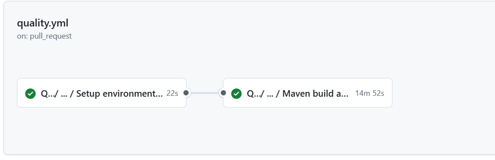
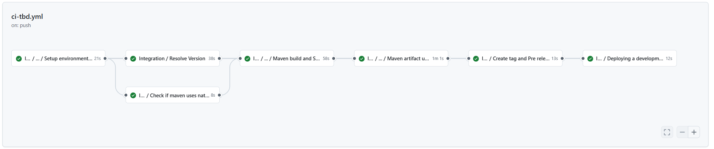
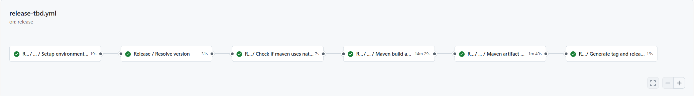

### Trunk Based Development

Now we are going to describe the steps that a user has to perform in order to make a complete cycle, from the construction process (CI) to the deployment through the DEV, PRE and PRO environments (CD)

The cycle explained below is based on **Trunk Based Development**.

#### Quality Gates

We want our microservices to have the maximum quality in Gluon prior to deployments to production environments, so it will be necessary to have the OK in:

- **Sonar**: Code Quality and test coverage
- **Gluon Testing**: Functional tests (Execution of Functional Test with Gluon Testing frameworks after the deployment PRE is successful)

!!! warning "Quality Gates"
    Without these QG resolved we will only be able to deploy to development environments, being subject to these validations the pre/production environments.

#### Pull Request from Feature to Main

We will start working on the "Feature" branches of our GitHub repository, and we will be integrating our changes into the main branch.

When we create the **Pull Request** event from our "Feature" branch to the main branch, the quality.yml (Sonar), and version-validation.yml (Version Release validation) workflows will be executed automatically.

Next, we detail which steps are executed in each of these two workflows:

##### Quality gate workflow

- **Setup environment variables**: Load the properties defined in properties.env file and in the configuration project.
- **Maven build & Sonar scan**: Executes the default commands of MAVEN_BUILD_GOAL: clean verify



??? info "maven quality gate workflow code"

    ```yaml linenums="1"
    name: Quality

    on:
      pull_request:
        branches:
          - development
          - develop
          - main
          - master
          - release-v[0-9]+.[0-9]+.[xX]

    jobs:
      call-reusable-workflow:
        name: Quality
        uses: santander-group-shared-assets/gln-workflows/.github/workflows/maven-quality.yml@v1
        secrets: inherit
    ```

#### Push to Main

When approving the Pull Request of the previous step on the main branch we will generate a push event on this branch and therefore the ci-tbd.yml workflow will be executed automatically.

Next, we detail which steps are executed in this workflow:

##### Integration workflow

- **Setup environment variables**: Load the properties defined in properties.env file and in the configuration project.
- **Resolve version**: Resolve the version of the component.
- **Check if maven uses native build**: Check if it is necessary to configure a native compilation.
- **Maven build and Sonar scan**: Executes the default commands of MAVEN_BUILD_GOAL: clean verify
- **Maven artifact upload**: Upload the artifact to the artifact repository.
- **Create tag and Pre release** Create a tag with the version of the component and generate a pre-release in GitHub.
- **Deploying a development**: This job call to workflow cd.yml for deploy our application to cert environment

??? info "mavevn CI Image workflow code"

    ```yaml linenums="1"
name: Integration

on:
  push:
    branches:
      - main
      - master
      - release-v[0-9]+.[0-9]+.[xX]

jobs:
  call-reusable-workflow:
    name: Integration
    uses: santander-group-shared-assets/gln-workflows/.github/workflows/maven-ci-artifact-tbd.yml@v1
    with:
      technology: 'appian'
    secrets: inheritº

    ```


If everything works correctly, we will have our artifact uploaded to the registry, and we will have the information in Sonar.

##### Deploy workflow

To learn how the common deployment workflow works, applicable to all technologies, you can refer to the [Common CD Workflow](../../../application/ci-cd/cd/cd-rm/cd-workflow/index.md) section of the documentation.

#### Release

When we want to publish a final version, we will do it from the GitHub releases page. First, we select the previously created version (pre-release or draft version) and then, uncheck the "Set as pre-release" option and click "Publish release".
The release-tbd.yml workflow will run automatically.

##### Release workflow

- **Setup environment variables**: Load the properties defined in properties.env file and in the configuration project. The configuration project is obtained according to the secrets defined here.
- **Resolve version**: Resolve the version of the component.
- **Check if maven uses native build**: Check if it is necessary to configure a native compilation.
- **Maven build and Sonar scan**: Executes the default commands of MAVEN_BUILD_GOAL: clean verify
- **Maven artifact upload**: Upload the artifact to the artifact repository.
- **Generate tag and release**: Create the release tag and generate the GitHub Release.

??? info "Release workflow code"

    ```yaml linenums="1"
    name: Release
    on:
      release:
        types:
          - published

    jobs:
      call-reusable-workflow:
        name: Release
        uses: santander-group-shared-assets/gln-workflows/.github/workflows/appian-release-artifact-tbd.yml@v1
        secrets: inherit

    ```



At the end of the workflow, we can see a GitHub Release has been created using the GitHub Tag generated with the Release workflow.


##### PRE and PRO Deployment

The **Deploy Workflow** can be called manually to deploy the application in the PRE and PRO environments.

To learn how the common deployment workflow works, applicable to all technologies, you can refer to the [Common CD Workflow](../../../application/ci-cd/cd/cd-rm/cd-workflow/index.md) section of the documentation.

#### Retry a deploy

##### Retry a deployment execution

If the **"Container build and push"** job runs successfully and publishes the Release version, you can rerun the deployment workflow.

### Deploy using the Gluon Release Management

Gluon Release Management is a Gluon portal integration process that aims to automate the creation of
releases and tasks in Servicenow ITSM, as well as the orchestration of deployment in Github through
the portal itself.

For getting to know how to deploy using this tool,
please refer to the
[Release Management](../../../application/release-management/zero-touch/index.md)
documentation.
