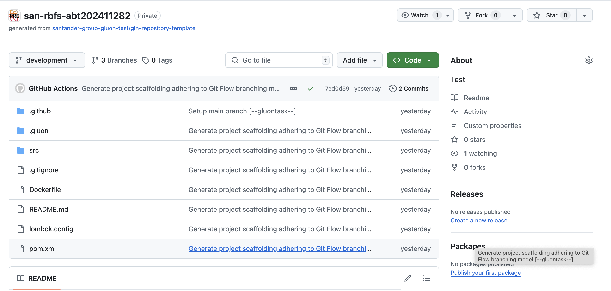

When you create the component from the Gluon Portal, the component is created with the default values of the template from the scaffolding workflow.

- Create a **main** branch with a "Hello World" example and with the structure of files and folders to configure and deploy your microservice.

