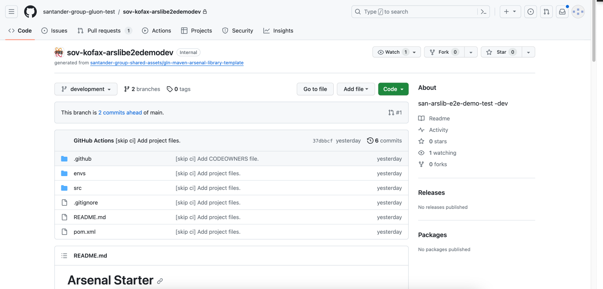
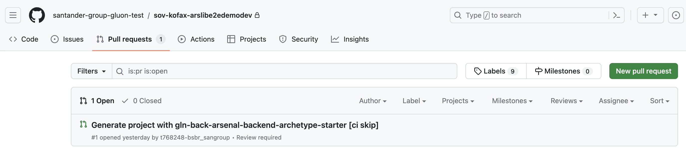

When you create the component from the Gluon Portal, the component is created with the default values of the template from the scaffolding workflow.

- Creates an empty **main** branch
- Creates a **development** branch with a "Hello World" and with the structure of files and folders to configure and run your library.

- Creates a **Pull Request** from **development** to **main** branch with a ci-skip message to avoid the execution of the CI/CD pipeline.

???+ warning "Recommendation"

    Please approve the Pull Request and from the **main** branch create the integration branch **development** or **develop**.
    You can create your feature branches from **develop** or **development** branch.

???+ info "Note"
    If in the DEV deployment we don't have the .github/workflows folder in the **main** branch, when we execute the CI/CD pipeline, the deployment will fail.
