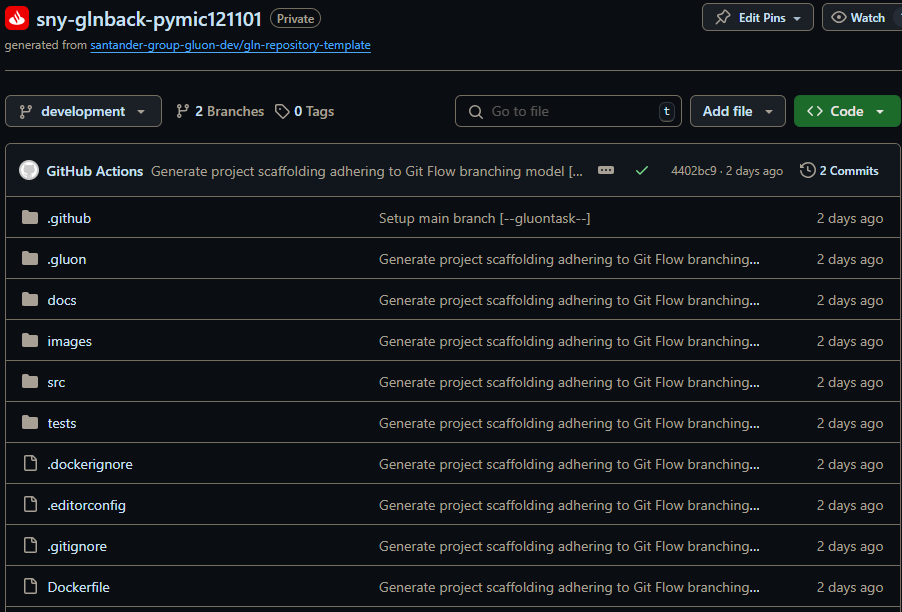

When you creates the component from the Gluon Portal, the component is created with the default values of the template from the scaffolding workflow.

- Creates an empty **main** branch
- Creates a **development** branch with sample business code and with the structure of files and folders to configure and run your microservice.
  
