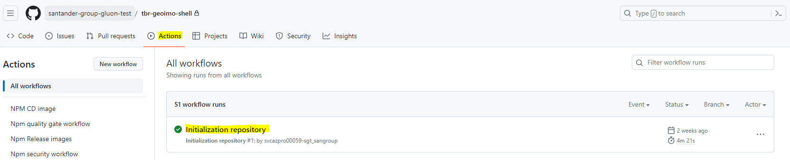
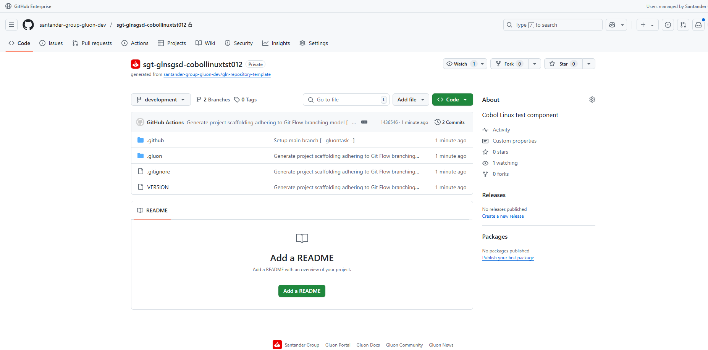

When you create the component from the Gluon Portal, the component is created with the default values of the template from the scaffolding workflow.

It creates a temporal **init-branch** with a set of actions capable of generating the default scaffolding for the selected component type from the Gluon Front CLI.

???+ info "Important!"

    Please, notice that **init-branch** will launch a workflow (you can see it Actions tab) that will take several minutes to generate the full scaffolding for the component type selected.

    

    The repo won't be ready until this workflow has finished.

Once the **init-branch** actions have finished and the repo contains the scaffolding for the component type, the workflow will create the appropriate branches for the Git Flow strategy:

- An empty **main** branch just with the workflows.
- A **development** branch with the initial scaffolding of the project.

