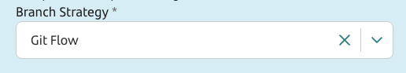

<!--Start Branch Strategy-->
You'll be able to select the branch strategy you want to follow: Git flow (by default) or Trunk-based development. You'll have more information in the next section, inside "branches" subsection.

<!--End Branch Strategy-->
