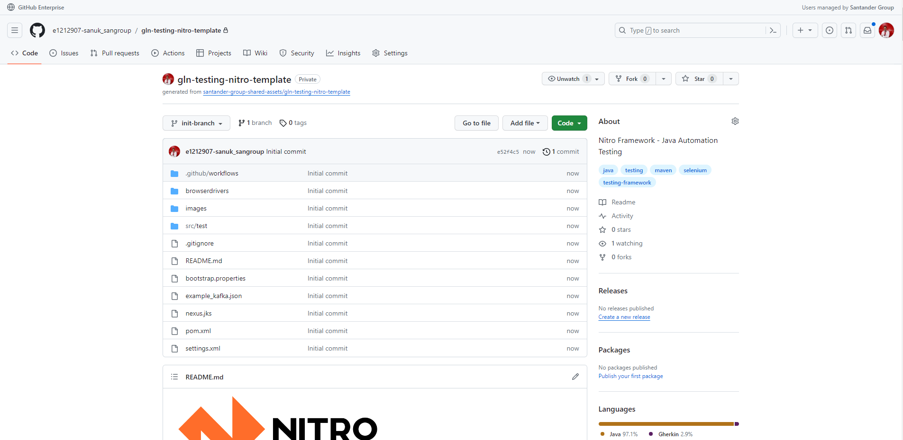

When you create the component from Gluon Portal, the component is created with the default values of the template from the scaffolding workflow.

- Creates an empty **main** branch
- Creates a **develop** branch with a sample project and with the structure of files and folders to run tests with Nitro Framework.

