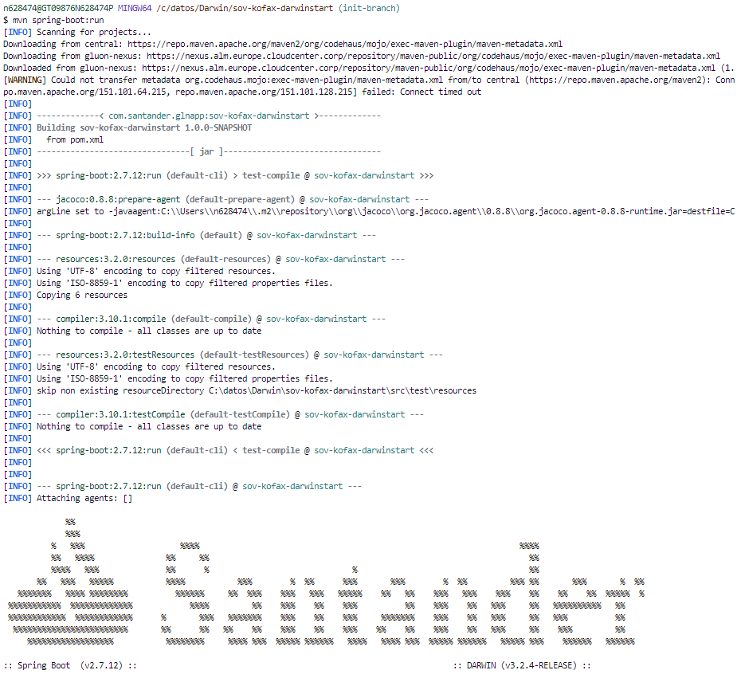
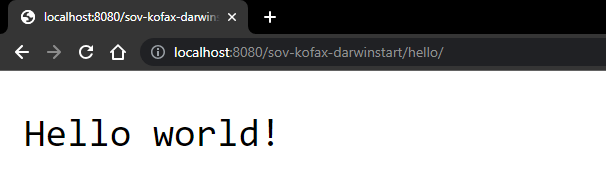

## Create Darwin Component

### Local execution

To run the project locally, the first thing to do is to make sure that we have our device properly configured to work with Java-Maven projects.
To do this you can visit [Java-Maven configurations](../../../getting-started/setup-your-environment/technologies/java-maven.md) to make sure that everything is in order.

#### Cloning the repository

Once we have the device properly configured, the first step is to clone the project locally. To do so, visit [How to clone de project](../../../application/component-management/create-component.md/#cloning-a-repository).

#### Component structure

The generated Darwin microservice has a structure similar to the following:

``` bash

📂.github
 ┣ 📂workflows
 | ┣ 📜maven-cd-image.yml
 | ┣ 📜maven-ci-image.yml
 | ┣ 📜maven-quality-image.yml
 | ┣ 📜maven-rc-image.yml
 | ┗ 📜maven-security-image.yml
 ┗ 📜CODEOWNERS
📂envs
 ┗ 📜properties.env
📂src
 ┣ 📂main
 | ┣ 📂java
 | | ┗ 📂com
 | | | ┗ 📂santander
 | | | | ┗ 📂glnapp
 | | | | | ┗ 📂sovkofaxdarwinstart
 | | | | | | ┣ 📂config
 | | | | | | | ┗ ☕SwaggerConfig.java
 | | | | | | ┣ 📂web
 | | | | | | | ┗ ☕HelloController.java
 | | | | | | ┗ ☕Application.java
 | ┗ 📂resources
 | | ┣ 📂config
 | | | ┣ 📜application-local.properties
 | | | ┗ 📜application.yml
 | | ┣ 📂errors
 | | | ┣ 📜errors_en_US.properties
 | | | ┗ 📜errors_es_ES.properties
 | | ┣ 📜banner.txt
 | | ┗ 📜errors.properties
 ┗ 📂test
 | ┗ 📂java☕
 | | ┗ 📂com
 | | | ┗ 📂santander
 | | | | ┗ 📂glnapp
 | | | | | ┗ 📂sovkofaxdarwinstart
 | | | | | | ┣ 📂config
 | | | | | | | ┗ ☕SwaggerConfigTest.java
 | | | | | | ┣ 📂web
 | | | | | | | ┗ ☕HelloControllerTest.java
 | | | | | | ┗ ☕ApplicationTest.java

```

???+ info

    For more information on the structure and functionality of Darwin microsercives, please refer to the [Darwin Spring Boot Microservice Archetype](https://github.alm.europe.cloudcenter.corp/pages/sanes-darwin-backend/darwin-spring-boot/current/darwin-archetypes/darwin-spring-boot-archetype-microservice/index.html) documentation provided by the framework.

#### Running the microservice
<!-- Start Running Microservice -->
It is necessary to add a couple of lines to test the **basic functionality** of this microservice (without a security token and without many of the libraries available in the Darwin Framework).

In the file "*\src\main\resources\config\application.yml*" we will add the following lines of code:

``` yaml title="application.yml" hl_lines="13 14" linenums="1"

spring.profiles.active: local
---
darwin:
  region: boae
  suffix:
  app-key: glnapp
  logging:
    entity: ESP
    paas-app-version: "@project.version@"
    kafka:
      server: ${env.logging-server}
  security:
    white-list:
      - /**
    connectors:
      pkm-connector:
        pkm-endpoint:
          - ${env.pkm-endpoint}

  ...

```

Once we have made the change to allow calls without a token, to run the generated microservice locally, simply execute the Spring Boot class defined in the project, or run the project using the following command:

``` { .bash .copy }
mvn spring-boot:run
```

The result of the execution should look similar to the following image:



Also, it is possible to execute the microservice using the test scope.
This allows to have a local configuration in such scope while avoiding to have a local configuration in the main scope.
You could execute `ApplicationTestRun` class, or run the project using the following command:

``` { .bash .copy }
mvn spring-boot:test-run
```

By default, if the microservice is MVC it runs on a Tomcat server; and if it is reactive it will run on a Netty server; and in both cases it will be 'listening' on TCP port **8080**.

To test the microservice, we can use Postman or a simple *curl* to make an **HTTP GET** request to port 8080 and to path */project-name/hello/* and get the expected "**Hello World!**" response.

``` { .bash .copy }

curl http://localhost:8080/<project-name>/hello/

```

Or you can use the browser to view the response.



Congratulations, the generated Darwin microservice is working properly!

<br>
<!-- End Running Microservice -->