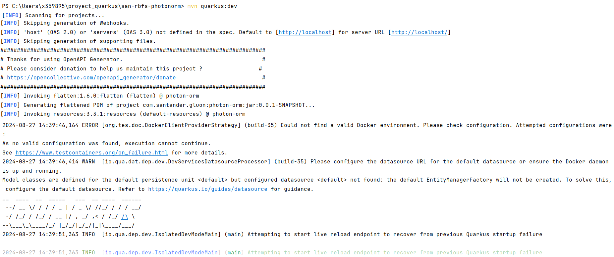

## Create Photon Quarkus Component

### Local execution

To run the project locally, the first thing to do is to make sure that we have our device properly configured to work with Java-Maven projects.
To do this you can visit [Java-Maven configurations](../../../getting-started/setup-your-environment/technologies/java-maven.md) to make sure that everything is in order.

#### Cloning the repository

Once we have the device properly configured, the first step is to clone the project locally. To do so, visit [How to clone de project](../../../application/component-management/create-component.md/#cloning-a-repository).

#### Component structure

The generated Photon Quarkus microservice has a structure similar to the following:

``` bash

📂.github
 ┣ 📂workflows
 | ┣ 📜bluegreen-switch-workflow.yml
 | ┣ 📜maven-ci-image.yml
 | ┣ 📜maven-quality-image.yml
 | ┣ 📜maven-rc-image.yml
 | ┣ 📜maven-security-image.yml
 | ┣ 📜maven-security-image.yml
 | ┣ 📜maven-version-validation.yml
 | ┣ 📜update-component-workflow.yml
 | ┗ 📜workflow.yml
 ┗ 📜CODEOWNERS
 📂.gluon
 ┗ 📜blank-file
📂envs
 ┗ 📜properties.env
📂src
 ┣ 📂main
 | ┣ 📂java
 | | ┗ 📂com
 | | | ┗ 📂santander
 | | | | ┗ 📂gluon
 | | | | | ┣ 📂mapper
 | | | | | | | ┗ ☕PhotonMapper.java
 | | | | | ┣ 📂model
 | | | | | | | ┗ ☕PhotonEntity.java
 | | | | | ┣ 📂repository
 | | | | | | ┗ 📂impl
 | | | | | | | ┗ ☕ PhotonRepositoryImpl.java
 | | | | | | ┗ ☕ PhotonRepository.java
 | | | | | ┣ 📂resource
 | | | | | | | ┗ ☕PhotonResource.java
 | | | | | ┣ 📂service
 | | | | | | ┗ 📂impl
 | | | | | | | ┗ ☕ PhotonServiceImpl.java
 | | | | | | ┗ ☕ ExternalDataService.java
 | | | | | | ┗ ☕ PhotonService.java
 | ┗ 📂resources
 | | ┣ 📜application.properties
 | | ┣ 📜import.sql
 | | ┗ 📜openapi.yaml
 ┗ 📂test
 | ┗ 📂java☕
 | | ┗ 📂com
 | | | ┗ 📂santander
 | | | | ┗ 📂gluon
 | | | | | | ┣ 📂client.resources
 | | | | | | | ┗ ☕HoverflyResource.java
 | | | | | | ┣ 📂middleware
 | | | | | | | ┗ ☕MiddlewareTest.java
 | | | | | | ┗ ☕PhotonOpenIdEndpointTest.java

```

    For more information on the structure and functionality of Photon Quarkus  microservices, please refer to the [Photon Quarkus Microservice Archetype](./../../software/backend/java/photon/framework/current/index.md) documentation provided by the framework.

#### Running the microservice
<!-- Start Running Microservice -->
It is necessary to configure a couple of lines to test the **basic functionality** of this microservice such as  the datasource URL for the default datasource

In the file "*\src\main\resources\config\application.yml*" we will add the following lines of code:

``` yaml title="application.yml" hl_lines="3 4 6 7" linenums="2"

quarkus.profiles.active: Dev
---
  quarkus.datasource.username=your-own-username
  quarkus.datasource.jdbc.url=jdbc:postgresql://localhost/your-own-db
 # Http ports
  quarkus.http.port=8891
  quarkus.http.test-port=8892
  ...

```

<br>

Once we have made the respective changes simple run the project using the following command:

``` { .bash .copy }
mvn quarkus:dev
```

The result of the execution should look similar to the following image:



Also, it is possible to execute the microservice using the test scope.
This allows to have a local configuration in such scope while avoiding having a local configuration in the main scope.
You could run the project using the following command:

``` { .bash .copy }
mvn quarkus:test
```

By default, if the microservice  runs on an Undertow  server;  it will be 'listening' on TCP port **8891**.

To test the microservice, we can use Postman or a simple *curl* to make an **HTTP GET** request to port 8891 and to path */api/v1/photons* and get the expected list of Photon model response.

``` { .bash .copy }

curl http://localhost:8891/api/v1/photons

```

Congratulations, the generated Photon Quarkus  microservice is working properly!

<br>
<!-- End Running Microservice -->
