## Introduction

The purpose of this documentation is to provide a **step-by-step guide** on how to orchestrate the deployment of APIs within the GLUON platform.

This guide will allow you to understand how to build and deploy your APIS through a CI/CD process to your API Connect or APIGee environments.

This component is used in combination with the [**API Product**](../products.md) component, which allows deploying a product with several APIs. Until the product has been deployed, the APIs will not be ready to be consumed.

## Create Component

### Gluon Portal

First you have to [**onboard your application.**](../../../../application/application-management/index.md)
Once you have your application created, you can start creating your component.

### Create a new API deployment component

To customize an API deployment component, there are some additional settings that are needed to be done before creating the component.

For Spain, Darwin APIs deployment, please access following documentation : [Darwin Gateway (Only for Spain Use)](../darwingateway.md)

#### Selecting the API definition

Some API definition data is necessary to create the API deployment component. This data is available in Gluon API catalog.

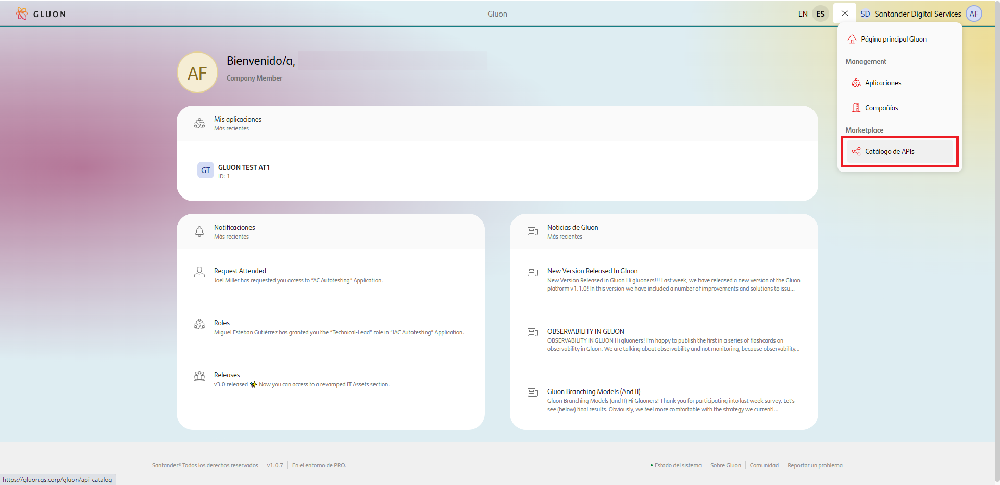

Once in the Catalog, select the API from which the entity wants to develop.

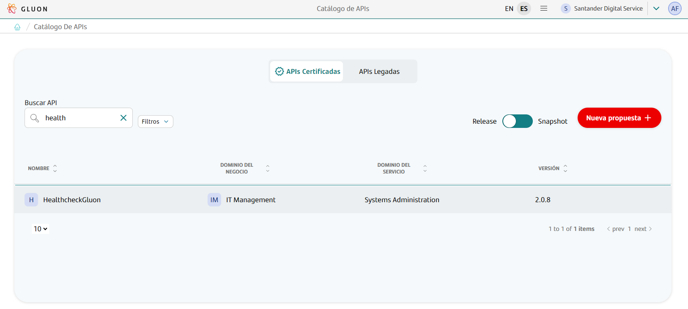

On the API detail page, there is a "Deploy API" button. When you click on it, a tab for creating the API Deployment component is displayed. You need to follow these steps:

- Select the application in which you are going to create the component.

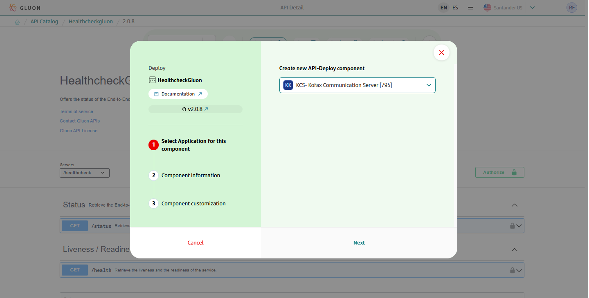

- Enter the common values for Gluon components: component name, short name, description, and repository name.


- Enter the specific values for the API Deployment 2.0 component:

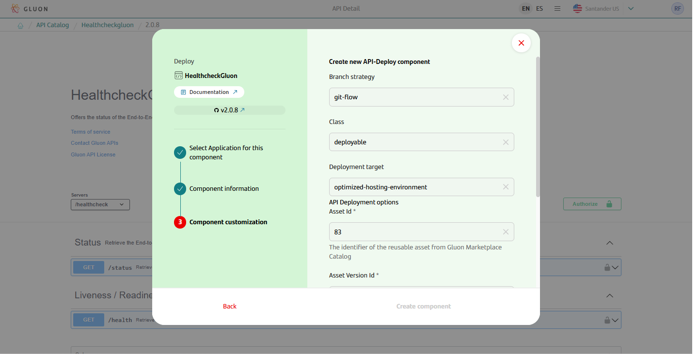
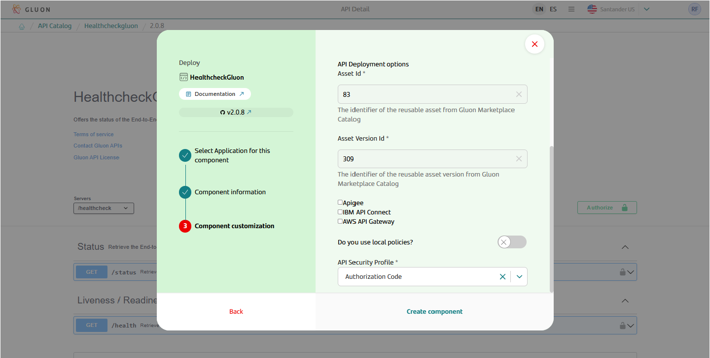

  - **Asset Id**: Identifier of the API definition in the Marketplace, it loads automatically.
  - **Asset Version Id**: Identifier of the version of the API definition in the Marketplace, it loads automatically.
    - **API Gateways**: The component allows deployment in IBM API Connect, in Apigee, in AWS API Gateway and in both, depending on the selection,
    the configuration files for the selected technologies will be created. It is mandatory to select at least one.
  - **Do you use local policies?**: Indicate whether a global security profile or a local one will be used, aligned with the [process of including local security profiles](./apislocalsecurityprofiles.md).
  - **API Security Profile**: The API security profile, which defines the security applied based on the security profiles allowed in Gluon:
      - **Authorization Code**: Security type OAuth 2.0, flow authorization code, generate a JWSID Bearer token.
      - **Authorization Code + COSAC**: Security type OAuth 2.0, flow authorization code, generate a JWSID Bearer token, , applied operational control.
      - **JWT Profile**: Security type OAuth 2.0, flow implicit, generate a JWSID Bearer token.
      - **Client Credentials**: Security type OAuth 2.0, flow client credentials, generate a JWSID Bearer token.
      - **JWSiD**: Security type http, scheme bearer, generate a JWSID Bearer token

Once the component is created you can see under the application that there is a new repository created with the name of the component. This repository may take a few minutes to become available.

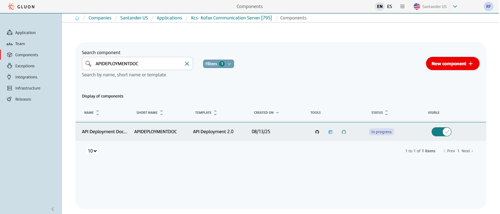

## API Repository Naming Convention

When you create an API deployment in the Gluon platform, a repository is automatically generated in GitHub following the naming convention below:

<**company-acronym**>**-**<**application-acronym**>**-**<**repository-name**>

- **Company acronym**: 3 characters, automatically filled from the company registration.
- **Application acronym**: 7 characters, provided during the application registration.
- **Repository name**: Defined by the user when creating the API deployment, with up to 90 characters.

The full repository name must have a maximum of 100 characters and may contain letters, numbers, hyphens ("-"), underscores ("_"), and dots (".").

**Example:**  
`abc-abcdefg-my_api_repository-01`

This standardization helps with the identification and organization of API repositories created on the platform.

### API Deployment Template

#### Structure

The generated API component has the structure defined in the [archetype](../framework/tech-components/archetypes/api-deployment.md) similar to the following (showing only top levels of directory structure):

``` bash

📦repository
 ┣ 📂.github
 ┃ ┣ 📂workflows
 ┃ ┗ 📜CODEOWNERS
 ┣ 📂.gluon
 ┃ ┣ 📂cd
 ┃ ┣ ┣ 📂cert
 ┃ ┣ ┣ ┗ 📜cd.yml
 ┃ ┣ ┣ 📂pre
 ┃ ┣ ┣ ┗ 📜cd.yml
 ┃ ┣ ┣ 📂pro
 ┃ ┣ ┣ ┗ 📜cd.yml
 ┣ 📂src
 ┃ ┣ 📂properties
 ┃ ┣ ┣ 📂cert
 ┃ ┣ ┣ ┣ 📜values-apigee.yml (*)
 ┃ ┣ ┣ ┣ 📜values-ibm.yml (*)
 ┃ ┣ ┣ ┣ 📜values-aws.yml (*)
 ┃ ┣ ┣ 📂pre
 ┃ ┣ ┣ ┣ 📜values-apigee.yml (*)
 ┃ ┣ ┣ ┣ 📜values-ibm.yml (*)
 ┃ ┣ ┣ ┣ 📜values-aws.yml (*)
 ┃ ┣ ┣ 📂pro
 ┃ ┣ ┣ ┣ 📜values-apigee.yml (*)
 ┃ ┣ ┣ ┣ 📜values-ibm.yml (*)
 ┃ ┣ ┣ ┣ 📜values-aws.yml (*)
 ┃ ┣ ┣ 📜values.yml
 ┃ ┣ ┣ 📜values-apigee.yml (*)
 ┃ ┣ ┣ 📜values-ibm.yml (*)
 ┃ ┣ ┣ 📜values-aws.yml (*)
 ┗ 📜README.md
```

(*) These files will be created based on the selected technology

### Inspect your component in your local environment

??? abstract "Cloning your repository"

    ### Cloning your repository

    Once you have the device properly configured, the first step is to clone the project locally.

    To do so, visit [**How to clone the project**](../../../../application/component-management/create-component.md#cloning-a-repository).

{!
   include-markdown "../snippets/snippet-oam.md"
!}

## Component Configuration

### Branches

It's important that we have our main branch (**main** by default) from where we will make the deployments to each of our environments.

### Configuration Files

It is a requirement to apply the minimum mandatory configuration that the API deployment requires for the correct generation of the deployment artifact and its subsequent correct execution.

Depending on the technology, the configuration can be different. This section indicates the common configuration for both technologies and the specific configuration of each one, as well as the optional and mandatory configuration.

When creating the project, files with the minimum necessary properties for the API configuration will be created, so that the developer has to configure the minimum parameters.
For example, if you use the [HealthcheckGluon API](https://gluon.gs.corp/gluon/api-catalog/83/detail/309), selecting Apigee and IBM API Connect, the following files will be created in the src/properties path:

#### asset_id.yml File (Deprecated)

This file includes the identifier of the API in the Marketplace, in the case of the HealthcheckGluon API it is 83. It does not require any user configuration. The content of the file is:

> !IMPORTANT: The use of this file in the repository is deprecated. If added manually, it will be ignored.

``` yaml title="asset_id.yml"
asset:
  id: 83
```

#### Files api-config-apigee.yml y api-config-ibm.yml (Deprecated)

This file contains the information that the workflow needs to generate the assembly. It does not require any user configuration.

> !IMPORTANT: The use of this file in the repository is deprecated. If added manually, it will be ignored.
>
> Currently, the api-config file generated during deployment can be consulted in action execution: Integration -> Get Definition File -> Create API Config.

#### File values.yml

When creating the scaffolding, this file includes the identifier of the API version in the Marketplace and [framework version](../framework/tech-components/policies/policies.md), which applies to all APIs of all technologies in all environments.

For the HealthcheckGluon API it is 309, the content of the file is:

``` yaml title="values.yml"
asset:
  version: 309
framework:
  version: 1.2.7
```

#### Files values-{{technology}}.yml

These files are created empty, if the developer wants to include some property that applies to all APIs of that technology for all environments, they can modify the file.

#### Files {{environment}}/values-{{technology}}.yml

These files, generally, are the only ones that are modified for deployment in environments. By default, it creates the structure with the operations and verbs of the API and includes the mandatory properties of the selected security profile.

For the client case of the HealthcheckGluon API, the content of the generated file for IBM is:

``` yaml title="cert/values-ibm.yml"
properties: {}
securitySchemes:
  scopes: {}
  x-client-auto-approve-scopes: {}
policies: {}
operations:
  /health:
    get:
      policies:
        gln-jwsid-generate: {}
        invoke:
          target-url: $(target-url)$(request.path)$(request.search)
      securitySchemes:
        scopes: {}
        x-client-auto-approve-scopes: {}
  /status:
    get:
      policies:
        gln-jwsid-generate: {}
        invoke:
          target-url: $(target-url)$(request.path)$(request.search)
      securitySchemes:
        scopes: {}
        x-client-auto-approve-scopes: {}
```

Next, an example is shown, in which the following changes have been included (which are explained in more detail in the rest of the document), which are the minimum necessary for the client API to work:

- The target-url of the microservice that each operation calls is included. For the example, `https://test.corp` is configured.
- The following properties are included at the API level:
    - Audience with the value `audienceexample`.
    - client-id that identifies the API and that will be included in the generated jwsid token, with the value `d97338d1-3a7a-472b-a2a3-d10d5098dd35`.
- The following scopes are included (for a core API, this change is not required):
    - scope at the API level with the value `testScope`.
    - specific scope for the /health operation with the value `testScope2`.
    - specific scope for the /status operation with the value `testScope3`.
    - !IMPORTANTE: For the correct functioning of the scopes, the name of the scope and its description must be included in the format 'scope: description'

The resulting file for IBM is:

``` yaml title="cert/values-ibm.yml"
properties:
  aud: audienceexample
  api-client-id: d97338d1-3a7a-472b-a2a3-d10d5098dd35
securitySchemes:
  scopes:
    - testScope: description testScope
  x-client-auto-approve-scopes: {}
policies: {}
operations:
  /health:
    get:
      policies:
        gln-jwsid-generate: {}
        invoke:
          target-url: https://test.corp
      securitySchemes:
        scopes:
          - testScope2: description testScope2
        x-client-auto-approve-scopes: {}
  /status:
    get:
      policies:
        gln-jwsid-generate: {}
        invoke:
          target-url: https://test.corp
      securitySchemes:
        scopes:
          - testScope3: description testScope3
        x-client-auto-approve-scopes: {}
```

#### Common configuration

##### File values-{{technology}}.yml

###### SecuritySchemes

For a client API, the configuration of the API scopes is done by including the scopes in securitySchemes. The scopes can be applied at two levels: API or operation.

> !IMPORTANT: **Mandatory configuration**: In a client exposure, it is mandatory to configure at least one scope at the API level or alternatively, a scope in each of the operations.

Example of API level scopes:

```yaml

properties: {}
securitySchemes:
  scopes:
    - resources.read: description
  x-client-auto-approve-scopes: {}
policies: {}
operations:
  /health:
  ...
```

Scopes operation level example:

```yaml
policies: {}
operations:
  /health:
    get:
      policies:
        gln-jwsid-generate: {}
        invoke:
          target-url: $(target-url)$(request.path)$(request.search)
      securitySchemes:
     scopes:
          - resources.read: description
        x-client-auto-approve-scopes: {}
```

For a core API, no additional configuration in securitySchemes is required.

Security schemes core profile example:

```yaml
policies: {}
operations:
  /health:
    get:
      policies:
        gln-jwsid-validate: {}
        gln-jwsid-generate: {}
        invoke:
          target-url: $(target-url)$(request.path)$(request.search)
      securitySchemes: {}
```

###### x-auto-approve-scope

Field enabled to indicate the auto-approved scopes.

Example

```yaml

properties: {}
securitySchemes:
  scopes:
    - resources.read: description
  x-client-auto-approve-scopes:
    - resources.write: description
policies: {}
operations:
  /health:
  ...
```

##### Properties

Configure the existing properties at runtime of the API

Minimum required parameters:

For the correct operation of the policies associated with the assembly of the API, it is required to configure at least the following API properties:

- aud: Allows you to enter the audience that will be reported in the JWSId token. It is allowed to enter more than one audience, separating each value with spaces.
- api-client-id: It is the identifier of the consumer of the APIs of other domains

Example:

```yaml

properties:
  aud: APIAudience
  api-client-id: APIClientId

```

##### Overwrite default values

The files api-config-apigee.yml and api-config-ibm.yml contain the default values for the policies, but if necessary, these values can be adapted for a specific API operation.

For example, for the case of the IBM invoke policy, in the api-config-ibm.yml file you can see the default values that apply to this policy:

```yaml

invoke:
  optional: base
  level: operation
  default:
    backend-type: detect
    header-control:
      type: blocklist
      values: []
    parameter-control:
      type: allowlist
      values: []
    http-version: HTTP/1.1
    timeout: 60
    verb: keep
    chunked-uploads: true
    persistent-connection: true
    cache-response: protocol
    cache-ttl: 900
    stop-on-error: []
    graphql-send-type: detect
    websocket-upgrade: false

```

Continuing with the example of the HealthcheckGluon API, if you wanted to overwrite the timeout value from 60 seconds to 120 seconds
for the health operation for the pro environment, the configuration of the file src/properties/pro/values-ibm.yml would be:

```yaml

operations:
  /health:
    get:
      policies:
        gln-jwsid-generate: {}
        invoke:
          target-url: https://test.corp
          timeout: 120
      securitySchemes:
        scopes:
          - testScope2: description testScope2
        x-client-auto-approve-scopes: {}

```

#### Specific configuration by technology - IBM API Connect

##### Profile policies

The mandatory policies required for each profile will be loaded into the values file when executing the scaffolding process. You can consult the mandatory policies for each security profile in the api-config-ibm.yaml file.

Example:

```yaml
  base-policies:
    authorization-code-cosac:
      - gln-jwsid-generate
      - gln-cosac
      - invoke
    authorization-code:
      - gln-jwsid-generate
      - invoke
    jwsid:
      - gln-jwsid-validate
      - gln-jwsid-generate
      - invoke
```

By default, you will find the minimum configurable policies for each deployment profile in the values-ibm.yml file:

|Gluon policy|Versions|Type of policy|Description|Repositories|
|------------|--------|------|-----------|------------|
| gln-jwsid-generate | 2.2.0| Security policy | Generate a JWSId token based in Cybersecurity [requirements](https://santandernet.sharepoint.com/sites/SantanderPlatforms/SitePages/Identity-%26-SAA-JWT-claims(1).aspx).|[JWSid-generate](https://github.com/santander-group-shared-assets/gln-apis-ibm-policies-generate-jwsid/tree/2.2.0)|
| gln-jwsid-validate | 2.0.0|Security policy | Validate a JWSId token |[JWSid-validate](https://github.com/santander-group-shared-assets/gln-apis-ibm-policies-validate-jwsid/tree/2.0.0)|
| gln-cosac | 2.0.1| Security policy | This policy executes a Channel Operation Control using data received in the request based in Cybersecurity [requirements](https://santandernet.sharepoint.com/sites/SantanderPlatforms/SitePages/Channel-operational-security.aspx).|[COSAC](https://github.com/santander-group-shared-assets/gln-apis-ibm-policies-cosac-control/tree/2.0.1)|

Example minimum configuration policies:

JWSID Generate

configuration:

```yaml
        jwsid-generate: {}  
```

COSAC

Example configuration:

```yaml
        cosac:
          configuration:
            cosacUrl: cosac-host/cosac-service
            customer:
              header: X-Customer-ID
            contracts:
              body: contracts.contractIds
```

JWSID Validate

configuration:

```yaml
        jwsid-validate: {}  
```

##### API policies

The policies used at the API level at runtime are indicated in the "policies" node, these policies contain the same configuration for all the operations of the API.

Example of a policies node with a whitelist policy:

```yaml
policies:
  whiteList:
    configuration:
      IpHeaders:
        HeaderIp:
          Host:
            - 10.1.1.1
            - 10.1.1.2
          X-Forwarded-For:
            - 10.1.1.3
            - 10.1.1.4
          Forwarded:
            - 10.1.1.5
            - 10.1.1.6
          X-Client-IP:
            - 10.1.1.7
            - 10.1.1.8
```

###### Mandatory API policies

Currently, no mandatory policies are required at the API level.

###### Optional API policies

Available optional policies:

|Gluon policy|Versions|Type of policy|Description|Repositories|
|------------|--------|------|-----------|------------|
|gln-whitelist| 1.0.1|API management policy|In order to control wanted connections from certain API consumers, an IP control policy that belongs to a whitelist is established.|[gln-whitelist](https://github.com/santander-group-shared-assets/gln-apis-ibm-policies-whitelist/tree/1.0.1)|
|gln-blacklist| 1.0.1|API management policy|In order to control unwanted connections from certain API consumers, an IP control policy that belongs to a blacklist is established.|[gln-blacklist](https://github.com/santander-group-shared-assets/gln-apis-ibm-policies-blacklist/tree/1.0.1)|
|CORS| 1.0.0|API management policy|Cross-Origin Resource Sharing (CORS) is a mechanism that uses additional HTTP headers to allow a user agent (en-US) to get permission to access selected resources from a server, on a different origin (domain) to which it belongs.|It is a policy includes in the deployment archetype|

Whitelist example configuration

```yaml
policies:
  gln-whiteList:
    configuration:
      IpHeaders:
        HeaderIp:
          Host:
            - 10.1.1.1
            - 10.1.1.2
          X-Forwarded-For:
            - 10.1.1.3
            - 10.1.1.4
          Forwarded:
            - 10.1.1.5
            - 10.1.1.6
          X-Client-IP:
            - 10.1.1.7
            - 10.1.1.8
```

Blacklist example configuration

```yaml
policies:
  gln-blacklist:
    configuration:
      IpHeaders:
        HeaderIp:
          Host:
            - 10.1.1.1
            - 10.1.1.2
          X-Forwarded-For:
            - 10.1.1.3
            - 10.1.1.4
          Forwarded:
            - 10.1.1.5
            - 10.1.1.6
          X-Client-IP:
            - 10.1.1.7
            - 10.1.1.8
```

CORS example configuration

```yaml
  API:  
    cors:
      enabled: true
      policy:
        - allow-credentials: true
          allow-origin:
            - test
            - test2
```

##### Operation policies

The policies applied at the operation level are those that can contain specific configuration for that operation.

Example

```yaml
operations:
  /health:
    get:
      policies:
        gln-jwsid-generate: {}
```

###### Mandatory operation policies

|Gluon policy|Versions|Type of policy|Description|Repositories|
|------------|--------|------|-----------|------------|
|parse| 2.0.0 |API management policy|Use the Parse policy to control the parsing of an input document.|It is a policy includes in the deployment archetype [parse](https://www.ibm.com/docs/en/api-connect/10.0.5.x_lts?topic=policies-parse)|
|invoke| 2.3.0|API management policy|Apply the Invoke policy to call another service from within your assembly.|It is a policy includes in the deployment archetype [invoke](https://www.ibm.com/docs/en/api-connect/10.0.5.x_lts?topic=policies-invoke)|

- Parse

The parse policy is mandatory in operations that have a requestBody type schema associated in the api-specification.

The following default configuration is applied:

```yaml
      max_number_length: 128   # Pending security default values
      max_doc_size: 4194304
      max_nesting_depth: 512
      max_name_length: 256
      max_value_length: 8192
```

As these are default values, it is possible to [modify](#overwrite-default-values) them through the values-ibm.yaml file.

- invoke

configuration:

```yaml
        invoke:
          target-url: https://mock-endpoint$(request.path)$(request.search)
```

It is possible to configure the value of `target-url` for all operations by using properties, for example:

```yaml
properties:
  aud: APIAudience
  api-client-id: APIClientId
  target-url: https://service-host1
securitySchemes:
  scopes:
    - scope1: test descrip
  x-client-auto-approve-scopes: {}
policies: {}
operations:
  /{account_id}/standing_orders:
    get:
      policies:
        invoke:
          target-url: $(target-url)$(request.path)$(request.search)
      securitySchemes:
        scopes: {}
        x-client-auto-approve-scopes: {}
    post:
      policies:
        invoke:
          target-url: $(target-url)$(request.path)$(request.search)
      securitySchemes:
        scopes: {}
        x-client-auto-approve-scopes: {}

```

###### Optional operation policies

Available optional policies:

|Gluon policy|Versions|Type of policy|Description|Repositories|
|------------|--------|------|-----------|------------|
| gln-obfuscation | 2.0.0|API management policy|This policy provides the necessary mechanisms to hide sensitive information found within certain fields.|[Obfuscation](https://github.com/santander-group-shared-assets/gln-apis-ibm-policies-obfuscation/tree/1.0.0)|
| gln-sca-operational-signature | 1.1.0|API management policy|In order to control unwanted connections from certain API consumers, an IP control policy that belongs to a blacklist is established.|[SCA](https://github.com/santander-group-shared-assets/gln-apis-ibm-policies-sca-operational-signature/tree/1.1.0)|
|validate| 2.0.0 |API management policy|Validate request body against schema definition.|It is a policy includes in the deployment archetype [validate](https://www.ibm.com/docs/en/api-connect/10.0.5.x_lts?topic=policies-validate-datapower-api-gateway)|

Obfuscation example configuration

```yaml
      policies:
        gln-obfuscation:
          configuration:
            'type=basic, i=length, n=2':
                body: data.accountName
            'type=basic, i=0, n=2':
                body: '$.data.client[1].infoArray[*]'
            'type=newType, i=0, n=2':
                body: data.accountId
```

The configuration of gln-sca is applied through the following properties configured in the infrastructure file:

- sca-token-type
- sca-iss

##### Use of x-santander-client-id as apikey header (optional)

In cases where the user prefers to use the mandatory x-santander-client id header as the necessary apikey in IBM API Connect instead of the usual X-IBM-Client-ID header, an optional Boolean flag has been enabled.
It can be included in the OAM configuration file or in the values-ibm.yaml file of the deployment repository itself.

```yaml
properties:
  aud: APIAudience
  api-client-id: APIClientId
  target-url: https://service-host1
  x-santander-client-id: true
```

If both exist at the same time, preference is given to the value of the flag in the values-ibm.yaml file.

#### Specific configuration by technology - Apigee

##### Profile policies

The mandatory policies required for each profile will be loaded into the values file when executing the scaffolding process. You can consult the mandatory policies for each security profile in the api-config-ibm.yaml file.

Example:

```yaml
  base-policies:
    authorization-code-cosac:
      - gln-authorization-validation
      - gln-jwsid-generate
      - gln-cosac
      - gln-set-target
    authorization-code:
      - gln-authorization-validation
      - gln-jwsid-generate
      - gln-set-target
    jwsid:
      - gln-jwsid-validate
      - gln-jwsid-generate
      - gln-set-target
```

By default, you will find the minimum configurable policies for each deployment profile in the values-ibm.yaml file:

|Gluon policy|Versions|Type of policy|Description|Repositories|
|------------|--------|------|-----------|------------|
| gln-jwsid-generate | 2.2.2 | Security policy | Generate a JWSId token based in Cybersecurity [requirements](https://santandernet.sharepoint.com/sites/SantanderPlatforms/SitePages/Identity-%26-SAA-JWT-claims(1).aspx).|[JWSid-generate](https://github.com/santander-group-shared-assets/gln-apis-apigee-policies-generate-jwsid/tree/2.2.2)|
| gln-jwsid-validate | 1.4.1 |Security policy | Validate a JWSId token |[JWSid-validate](https://github.com/santander-group-shared-assets/gln-apis-apigee-validate-jwsid/tree/1.4.1)|
| gln-cosac| 2.0.1 | Security policy | This policy executes a Channel Operation Control using data received in the request based in Cybersecurity [requirements](https://santandernet.sharepoint.com/sites/SantanderPlatforms/SitePages/Channel-operational-security.aspx).|[COSAC](https://github.com/santander-group-shared-assets/gln-apis-apigee-policies-cosac-control/tree/2.0.1)|

Example minimum configuration policies:

JWSID Generate

configuration:

```yaml
        jwsid-generate: {}  
```

COSAC

Example configuration:

```yaml
        cosac:
          cosac.configuration:
            cosacUrl: cosac-host/cosac-service
            customer:
              header: X-Customer-ID
            contracts:
              body: contracts.contractIds
```

JWSID Validate

configuration:

```yaml
        jwsid-validate: {}  
```

##### API policies

The policies used at the API level at runtime are indicated in the "policies" node, these policies contain the same configuration for all the operations of the API.

Policies node example with whitelist policy:

```yaml
policies:
  whitelist:
    whitelist.configuration:
      IpHeaders:
        HeaderIp:
          Host:
            - 10.1.1.1
            - 10.1.1.2
          X-Forwarded-For:
            - 10.1.1.3
            - 10.1.1.4
          Forwarded:
            - 10.1.1.5
            - 10.1.1.6
          X-Client-IP:
            - 10.1.1.7
            - 10.1.1.8
```

###### Mandatory API policies

|Gluon policy|Versions|Type of policy|Description|Repositories|
|------------|--------|------|-----------|------------|
|gln-verify-client-id| 1.0.2|API management policy|In order to control wanted connections from certain API consumers, an IP control policy that belongs to a whitelist is established.|[gln-verify-client-id](https://github.com/santander-group-shared-assets/gln-apis-apigee-policies-verify-clientId/tree/1.0.2)|
|gln-error-control| 1.0.1|API management policy|In order to control unwanted connections from certain API consumers, an IP control policy that belongs to a blacklist is established.|[gln-error-control](https://github.com/santander-group-shared-assets/gln-apis-apigee-policies-error-control/tree/1.0.1)|

###### Optional API policies

Available optional policies:

|Gluon policy|Versions|Type of policy|Description|Repositories|
|------------|--------|------|-----------|------------|
|gln-whitelist| 1.0.1|API management policy|In order to control wanted connections from certain API consumers, an IP control policy that belongs to a whitelist is established.|[gln-whitelist](https://github.com/santander-group-shared-assets/gln-apis-apigee-policies-whitelist/tree/1.0.1)|
|gln-blacklist| 1.0.1|API management policy|In order to control unwanted connections from certain API consumers, an IP control policy that belongs to a blacklist is established.|[gln-blacklist](https://github.com/santander-group-shared-assets/gln-apis-apigee-policies-blacklist/tree/1.0.1)|
|CORS| 2.0.1 |API management policy| Cross-Origin Resource Sharing (CORS) is a mechanism that uses additional HTTP headers to allow a user agent (en-US) to get permission to access selected resources from a server, on a different origin (domain) to which it belongs.| [cors](https://github.com/santander-group-shared-assets/gln-apis-apigee-policies-cors/tree/2.0.1) |
|gln-set-app-name-header| 1.0.0|API management policy|Propagate channel header|[gln-set-app-name-header](https://github.com/santander-group-shared-assets/gln-apis-apigee-policies-set-appname-header/tree/1.0.0)|
|gln-rate-limit| 1.0.0 |API management policy| APIGEE policy, apply quota stablish in product to the API| It is a policy includes in the deployment archetype |

Whitelist example configuration

```yaml
policies:
  gln-whitelist:
    whitelist.configuration:
      IpHeaders:
        HeaderIp:
          Host:
            - 10.1.1.1
            - 10.1.1.2
          X-Forwarded-For:
            - 10.1.1.3
            - 10.1.1.4
          Forwarded:
            - 10.1.1.5
            - 10.1.1.6
          X-Client-IP:
            - 10.1.1.7
            - 10.1.1.8
```

Blacklist example configuration

```yaml
policies:
  gln-blacklist:
    blacklist.configuration:
      IpHeaders:
        HeaderIp:
          Host:
            - 10.1.1.1
            - 10.1.1.2
          X-Forwarded-For:
            - 10.1.1.3
            - 10.1.1.4
          Forwarded:
            - 10.1.1.5
            - 10.1.1.6
          X-Client-IP:
            - 10.1.1.7
            - 10.1.1.8
```

CORS example configuration

```yaml
  API:  
    cors:
      cors.configuration:
        Access-Control-Allow-Origin: https://origin1
        Access-Control-Allow-Headers: x-client-id
        Access-Control-Max-Age: 60
        Access-Control-Allow-Methods: POST
```

##### Operation policies

The policies applied at the operation level are those that can contain specific configuration for that operation.

Example

```yaml
operations:
  /health:
    get:
      policies:
        gln-jwsid-generate: {}
```

###### Mandatory operation policies

|Gluon policy|Versions|Type of policy|Description|Repositories|
|------------|--------|------|-----------|------------|
|gln-json-message-validation | 2.0.0 |API management policy|Use the Parse policy to control the parsing of an input document.|[gln-json-message-validation](https://github.com/santander-group-shared-assets/gln-apis-apigee-policies-json-validation/tree/2.0.0)|
|gln-set-target|1.0.0|API management policy|This JavaScript will be used with assign message policy in the target endpoints of the API proxies|It is a policy includes in the deployment archetype|

- JSON message validation

The parse policy is mandatory in operations that have a requestBody type schema associated in the api-specification.

The following default configuration is applied:

```yaml
      jsonMessageValidation.configuration:
        max_number_length: 128
        max_doc_size: 4194304
        max_nesting_depth: 512
        max_name_length: 256
        max_value_length: 8192
```

As these are default values, it is possible to modify them through the values-ibm.yaml file.

- set-target

For the correct operation of the APIs, it is mandatory to configure the target-url property of the "set-target" policy for each of the operations configured in the values-ibm file, this property indicates the backend url for each of the operations.

> !IMPORTANT By default, only the backend host should be indicated, the set-target policy will add the path of the API (without basepath) that is being invoked and the query params sent in the request.

Example:

```yaml
target-url: https://my-server-url
```

It is possible to **modify the default behavior** to add the API basepath + path to the content configured in the target-url. To do this, you need to configure the property `enable-message-path` in the `values-apigee.yml` file.

Example:

```yaml
properties:
  aud: APIAudience
  api-client-id: APIClientId
  enable-message-path: true
```

There is another way to modify the default value to not add the API path to the content configured in the target-url. To do this, you need to configure the `disable-pathsuffix` property in the `values-apigee.yml` file.

Example:

```yaml
properties:
  aud: APIAudience
  api-client-id: APIClientId
  disable-pathsuffix: true
```

By modifying the default behavior so that the API path is no longer added to the content configured in the target-url, the capacity to send path parameters to the microservice is lost.

If the call to the microservice requires path parameters sent in the request, you can use properties to indicate the position of the required path parameter in the request path.

With this example configuration, it is indicated that the `customerid` property is in position 2 of the request path.

> !IMPORTANT To obtain the position of the path parameter, the basepath will not be considered. Position 1 will be the first element of the path.

Example:

```yaml
properties:
  aud: APIAudience
  api-client-id: APIClientId
  disable-pathsuffix: true
  customerid: 2
securitySchemes:
  scopes:
    - scope1: test
  x-client-auto-approve-scopes: {}
policies: {}
operations:
  /customer/{customer_id}/card:
    get:
      policies:
        gln-set-target:
          target-url: https://example/{customerid}/card
      securitySchemes:
        scopes: {}
        x-client-auto-approve-scopes: {}
```

With this configuration, if the request URL is <https://example/basepath/customer/1665/card>, the value of the target-url will be <https://example/1665/card>.

It is possible to configure the value of `target-url` for all operations by using properties, for example:

```yaml
properties:
  aud: APIAudience
  api-client-id: APIClientId
  target-url: service-host1
securitySchemes:
  scopes:
    - scope1: test descrip
  x-client-auto-approve-scopes: {}
policies: {}
operations:
  /{account_id}/standing_orders:
    get:
      policies:
        gln-set-target:
          target-url: https://{target-url}
      securitySchemes:
        scopes: {}
        x-client-auto-approve-scopes: {}
    post:
      policies:
        gln-set-target:
          target-url: https://{target-url}
      securitySchemes:
        scopes: {}
        x-client-auto-approve-scopes: {}
```

###### Optional operation policies

Available optional policies:

|Gluon policy|Versions|Type of policy|Description|Repositories|
|------------|--------|------|-----------|------------|
|gln-obfuscation| 2.0.0|API management policy|This policy provides the necessary mechanisms to hide sensitive information found within certain fields.|[Obfuscation](https://github.com/santander-group-shared-assets/gln-apis-ibm-policies-obfuscation/tree/1.0.0)|
|gln-sca-operational-signature | 1.0.1|Security policy|In order to control unwanted connections from certain API consumers, an IP control policy that belongs to a blacklist is established.|[gln-sca-operative-signature](https://github.com/santander-group-shared-assets/gln-apis-apigee-policies-sca-operational-signature/tree/1.0.1)|

Obfuscation example configuration

```yaml
      policies:
        gln-obfuscation:
          obfuscation.configuration:
            'type=basic, i=length, n=2':
                body: data.accountName
            'type=basic, i=0, n=2':
                body: '$.data.client[1].infoArray[*]'
            'type=newType, i=0, n=2':
                body: data.accountId
```

The configuration of SCA is applied through the following properties configured in the infrastructure file:

- sca-token-type
- sca-iss

#### Specific configuration by technology - AWS

The properties configured in the properties section of the values file will be created as stage variables with the following naming convention:

{APIID}_{StageVariableName}

Example:

```yaml
properties:
  aud: APIAudience
  api-client-id: APIClientIdmodified
  newVariable: test
```

If the creation of stage variables is required using the property name as the stage variable name, the variables can be defined within aws-stage-variables.

Example:

```yaml
properties:
  aud: APIAudience
  api-client-id: APIClientIdmodified
aws-stage-variables:
  targeturl: https://test.corp
  newvariable: testvalue2
```

When creating stage variables in AWS API Gateway, it is important to follow certain naming restrictions to ensure proper configuration and functionality. The restrictions are as follows:

- Stage variable names must start with a letter.
- Names can contain letters (a-z, A-Z), numbers (0-9), and underscores (_).
- Spaces and special characters (except underscores) are not allowed.
- Names must be unique within the same stage.

The only variable that does not apply to these restrictions is **api-client-id**.

##### Tags configuration in API stage (Optional)

The aws-stage-tags block allows defining custom tags for the API Gateway stage. Each tag is defined as a key-value pair. Below is an explanation of this configuration:

```yaml
properties:
  aud: APIAudience
  api-client-id: APIClientId
aws-stage-variables:
  target_url: example.com
aws-stage-tags:
  tag1: value1
  tag2: value2
securitySchemes:
  scopes:
    - scope1: testScope1
  x-client-auto-approve-scopes: {}

...
```

##### tlsConfig configuration in API (Optional)

You can now use the new optional parameter **tlsSkipVerification** in your API configuration, it only applies to **vpc-link** integrations (default).
Set it to `true` to disable SSL/TLS certificate verification in AWS (default is `false`, which means verification is enabled).

Example configuration:

```yaml
properties:
  aud: APIAudience
  api-client-id: APIClientId
  tlsSkipVerification: true
securitySchemes:
  scopes:
    - scope1: testScope1
  x-client-auto-approve-scopes: {}
...
```

You can also configure **tlsSkipVerification** at the operation level:

```yaml
properties:
  aud: APIAudience
  api-client-id: ecccd9a0-5fd5-4c72-8f7f-b7ace3d0fcba
aws-stage-variables:
  target_url: example1.com
aws-stage-tags:
  test1: value1
  test2: value2
securitySchemes:
  scopes:
    - example.read: example scope
  x-client-auto-approve-scopes: {}
policies:
  authorizer-api:
    lambda-name: intra-core
    lambda-version: 10
    lambda-x-santander-client-id: true
    lambda-s3bucket: glnpaasecbucket
operations:
  /:
    get:
      policies:
        integration:
          target-url: https://${stageVariables.target_url}
          time-out: 10000
          tlsSkipVerification: true
      securitySchemes:
        scopes: {}
        x-client-auto-approve-scopes: {}
...
```

##### Cloudwatch configuration in API stage (Optional)

The configuration to enable and customize CloudWatch in an API Gateway stage in AWS is done through the aws-cloudwatch-config block. Below is an explanation of each property in the provided configuration:

```yaml
properties:
  aud: APIAudience
  api-client-id: APIClientId
securitySchemes:
  scopes:
    - scope1: testScope1
  x-client-auto-approve-scopes: {}
aws-cloudwatch-config:
  logLevel: INFO
  dataTrace: true
  tracing: true
  detailedMetrics: true
  destinationArn: arn:aws:logs:eu-west-1:533267329486:log-group:test
...
```

Properties:

1. logLevel:
   - Specifies the level of detail for logs sent to CloudWatch.
   - Possible values:
     - OFF: Disables logging.
     - ERROR: Logs only errors.
     - INFO: Logs general information (recommended for standard monitoring).

2. dataTrace:
   - Enables or disables logging of request and response data in CloudWatch logs.
   - Possible values:
     - true: Logs request and response data.
     - false: Does not log request and response data.
   - Here, it is enabled (true), which is useful for debugging but should be used cautiously to avoid exposing sensitive data.

3. tracing:
   - Enables integration with AWS X-Ray for tracing requests through the API.
   - Possible values:
     - true: Enables tracing.
     - false: Disables tracing.
   - In this case, it is enabled (true), allowing you to identify bottlenecks and performance issues.

4. detailedMetrics:
   - Enables detailed metrics for the API in CloudWatch.
   - Possible values:
     - true: Activates detailed metrics.
     - false: Deactivates detailed metrics.
   - Here, it is enabled (true), allowing more granular monitoring of API performance.

5. destinationArn:
   - Specifies the ARN of the CloudWatch log group where logs will be sent.
   - If not specified, the default log group associated with the API Gateway will be used.

Considerations:

- Security: If dataTrace is enabled, ensure that sensitive data such as passwords, tokens, or personal information is not logged.

- Costs: Enabling detailedMetrics and tracing may incur additional AWS costs due to the increased volume of logged data.

- Destination ARN: If you need to send logs to a specific log group, ensure the ARN is correct and that the API has permissions to write to that log group.

If no configuration is applied for CloudWatch (aws-cloudwatch-config is not provided), the default values will be set as follows:

1. logLevel:  
   Default: 'OFF'  
   - Logging is disabled.

2. dataTrace:  
   Default: 'false'  
   - Request and response data will not be logged.

3. destinationArn:  
   Default: arn:aws:logs:${this.region}:${this.accountId}:log-group:${this.restApiId}  
   - Logs will be sent to the default log group associated with the API Gateway in the specified AWS region and account.

4. tracing:  
   Default: 'false'  
   - AWS X-Ray tracing is disabled.

5. detailedMetrics:  
   Default: 'false'  
   - Detailed metrics are disabled.

Summary of Default Behavior:
If no configuration is provided, CloudWatch logging, data tracing, X-Ray tracing, and detailed metrics are all disabled. Logs will only be sent to the default log group if explicitly enabled later.

##### Profile policies

The mandatory configuration required for each profile will be loaded into the values file when executing the scaffolding process.

Example:

```yaml
  base-policies:
    authorization-code-cosac:
      - integration
    authorization-code:
      - integration
    jwt-profile:
      - integration
    jwsid:
      - integration
```

By default, you will find the minimum configurable policies for each deployment profile in the values-aws.yaml file

Example minimum configuration policies:

**Integration**:

configuration:

```yaml
operations:
  /health:
    get:
      policies:
        integration:
          target-url: https://service.com
```

##### API policies

The policies used at the API level at runtime are indicated in the "policies" node, these policies contain the same configuration for all the operations of the API.

CORS example configuration

```yaml
  policies:  
    cors:
      cors.configuration:
        allow-origin: https://origin1
        allow-headers: x-client-id
        allow-methods: POST
```

###### Mandatory API policies

Currently don't exist any mandatory API policy for AWS

###### Optional API policies

Available optional policies:

|Gluon policy|Versions|Type of policy|Description|Repositories|
|------------|--------|---------------|-----------|------------|
|CORS| 1.0.0 |API management policy|In order to control wanted connections from certain API consumers, an IP control policy that belongs to a whitelist is established.|Available in API Deployment archetype|
|authorizer-api| 1.0.0 |API management policy|Configures an authorizer for all API resources. If an authorizer is configured at the operation level, it takes precedence over the API-level authorizer. Allows the same configuration as the operation-level authorizer.|Available in API Deployment archetype|

CORS example configuration

```yaml
policies:  
  cors:
    cors.configuration:
      allow-origin: https://origin1
      allow-headers: x-client-id
      allow-methods: POST
operations:
  /status:
  ...
```

authorizer-api example configuration

Note: The authorizer-api configuration **will not be uploaded to the S3 file if it is configured**.

```yaml
policies:
  authorizer-api:
    lambda-name: intra-core
    lambda-version: 10
    lambda-x-santander-client-id: true
    lambda-s3bucket: glnpaasecbucket
operations:
  /status:
  ...
```

##### Operation policies

In AWS API Gateway, we have two elements that we can configure for each operation: integration and authorizer.

1. **Integration**: Defines how the incoming request will be handled and how it will connect to backend resources. There are several types of integrations available:
     - **lambda**: Allows invoking Lambda functions directly from the API Gateway.
     - **vpc-link**: Uses a VPC link to connect the API Gateway to resources in a VPC.

2. **Authorizer**: Controls access to the API by validating incoming requests. Types of authorizers include:
     - **lambda**: Invokes a Lambda function to implement any custom authentication and authorization logic.

The policies applied at the operation level are those that can contain specific configuration for that operation.

Example

```yaml
operations:
  /health:
    get:
      policies:
        integration:
          target-url: https://service.com
```

###### Mandatory operation policies

There must be at least one integration configuration per operation.

**Integration**:

- **vpc-link**: Default integration type. This type of integration is used to connect the API Gateway to resources in a VPC (Virtual Private Cloud) via a VPC link. It is ideal for accessing internal services that are not publicly exposed.

Example:

```yaml
  /{book_to_book_id}/cancel:
    post:
      policies:
        integration:
          target-url: https://example.com
```

It is possible to configure the value of `target-url` for all operations by using aws-stage-variables. In addition, you can optionally configure the value of `time-out` in milliseconds for each operation to customize the behavior of the Gateway API.
The default value set is 29000 milliseconds. It cannot be configured a time-out value higher than the default value. If it is needed to increase it, please refer to the aws documentation.
Example:

```yaml
properties:
  aud: APIAudience
  api-client-id: APIClientId
aws-stage-variables:
  target_url: example1.com
securitySchemes:
  scopes:
    - scope1: test descrip
  x-client-auto-approve-scopes: {}
policies: {}
operations:
  /{account_id}/standing_orders:
    get:
      policies:
        integration:
          target-url: https://${stageVariables.target_url}
          time-out: 20000
      securitySchemes:
        scopes: {}
        x-client-auto-approve-scopes: {}
    post:
      policies:
        integration:
          target-url: https://${stageVariables.target_url}
      securitySchemes:
        scopes: {}
        x-client-auto-approve-scopes: {}
```

- **lambda**: Integration type that allows invoking Lambda functions directly from the API Gateway. This integration is useful for executing business logic without the need to manage servers, enabling a serverless architecture.

The parameters in the Lambda integration configuration are as follows:

- **type**: Specifies the type of integration. In this case, it is `lambda`, indicating that the integration will be with a Lambda function.

- **lambda-name**: Defines the name of the Lambda function to be used. In this example, the function name is `intra-core`.

- **lambda-version**: Indicates the version of the Lambda function to be used. Here, the specified version is `10`.

Optional configuration:

- **lambda-type**: Specifies the type of integration with Lambda. The value `aws_proxy` indicates that the AWS proxy integration will be used. Default value: `aws`
- **time-out**: Configure the value of `time-out` in milliseconds for each operation to customize the behavior of the Gateway API. The default value set is 29000 milliseconds.
It cannot be configured a time-out value higher than the default value. If it is needed to increase it, please refer to the aws documentation

Example:

```yaml
  /{book_to_book_id}/cancel:
    post:
      policies:
        integration:
          type: lambda
          lambda-name: intra-core
          lambda-version: 10
          lambda-type: aws_proxy
          time-out: 10000
```

###### Optional operation policies

Available optional policies:

**Authorizer**:

- **Lambda**: Type of authorizer that allows using a Lambda function to control access to the APIs. This authorizer invokes a Lambda function that can implement any authentication and authorization logic.

**Mandatory configuration**:

- **lambda-name**: Specifies the name of the Lambda function. This parameter is necessary to identify and reference the Lambda function within the configuration and code.

- **lambda-version**: Defines the version of the Lambda function to be used. This parameter ensures that a specific version of the function is being used, which is useful for controlling updates and changes in the function's behavior.

**Optional configuration**:

[Global Cybersecurity lambda](https://cipdoc.sgtech.dev.corp/workstream/policies/lambda-authorizer/)

- **lambda-s3bucket**: Specifies the name of the S3 bucket where the configuration for using Global Cybersecurity lambda will be stored. If the S3 bucket is encrypted, encryption can be configured with KMS in the OAM configuration.

- **lambda-x-santander-client-id**: Enables the use of the `x-santander-client-id` header as an identity source.
This configuration allows the API Gateway to use the value of this header to identify the client making the request when using Global Cybersecurity lambda.

Example configuration for **authorizer** Global Cybersecurity Lambda policies:

```yaml
properties:
  aud: APIAudience
  api-client-id: APIClientId
securitySchemes:
  scopes:
    - scope1: test1
  x-client-auto-approve-scopes: {}
policies: {}
operations:
  /status:
    post:
      policies:
        integration:
          target-url: https://example.com
        authorizer:
          lambda-name: intra-core
          lambda-version: 10
          lambda-x-santander-client-id: true
          lambda-s3bucket: glnpaasecbucket
          policies:
            gln-cosac:
              configuration:
                cosacUrl: https://example-cosac-service.com
                customer:
                  body: client.customerId
                contracts:
                  body: contract.contractId
            gln-sca-operative-signature: {}
      securitySchemes:
        scopes: {}
        x-client-auto-approve-scopes: {}

```

With this example, this is the configuration file deployed in the configured S3 bucket. The mandatory kid parameter referenced in the oam is included:

```yaml
properties:
  aud: APIAudience
  api-client-id: APIClientId
  kid: TestKid
securitySchemes:
  scopes: scope1
policies: {}
operations:
  /status:
    post:
      securitySchemes:
        scopes: ''
      policies:
        gln-cosac:
          configuration:
            cosacUrl: https://example-cosac-service.com
            customer:
              body: client.customerId
            contracts:
              body: contract.contractId
        gln-sca-operative-signature: {}
```

{!
   include-markdown "../snippets/snippet-secrets.md"
!}

## API Deploy

Next, we will describe the steps needed to deploy your APIs across the DEV, PRE, and PRO environments.

The cycle explained below is based on **Trunk Based Development**.

### Pull Request to Main

When you create the **Pull Request event to your branch main/ branch** it will automatically run the workflow  ***quality.yml***

The following are the steps that are executed in this workflow.

- **Setup environment variables**: Load the properties needed for the workflow.
- **Get Definition File**: Get the yaml definition of the selected API and generate api-config file.
- **Get CIs data**: Get the information of the infrastructures in which it is going to be deployed, based on the configured cd.yml files.
- **Validate assembly**: To validate the configurations in all environments, it generates the assembly of the API to be deployed to detect if there was any format error or configuration of any property.

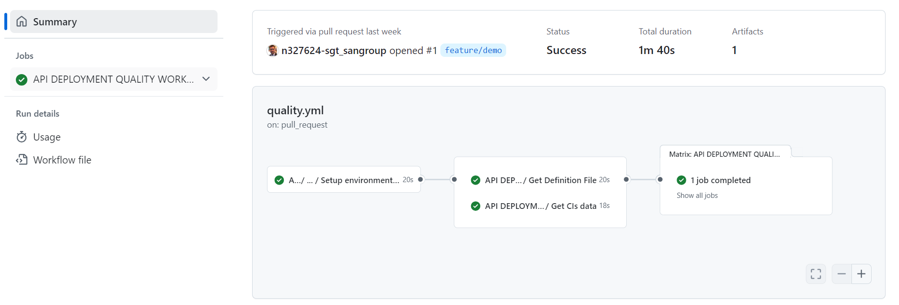

### Push to Main

By approving the Pull Request of the previous step on the main branch you will generate a push event on this branch and therefore the workflow ci-tbd.yml will be executed automatically.

These are the steps that will be executed in this part of the cycle:

- **Setup environment variables**: Load the properties needed for the workflow.
- **Get Definition File**: Get the yaml definition of the selected API.
- **Resolve version**: Get the version of the deployed API. If it is the first deployment it will be the version of the API definition, if a version has already been deployed, the patch value will increase.
- **Upload assets to nexus**: Upload the API configuration to nexus.
- **Deploying development**: Execute the cd workflow.
- **Publish Draft Release**: Generates a Draft Release of the deployment.

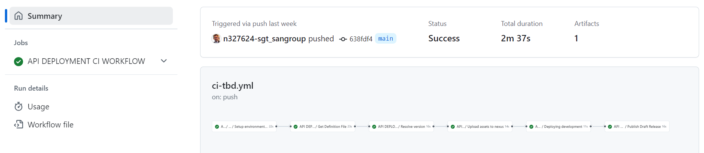

At the end of the ci-tbd.yml workflow, the cd.yml workflow is launched and it is deployed in all the certification type environments that have been configured.

These are the steps that will be executed in this part of the cycle:

- **Checking if environment or environment-type is defined**: Validate that the environment that is being executed is correctly configured in the repository, with its folder created in the .gluon path and the cd.yml file configured.
- **Setup environment variables**: Load the properties needed for the workflow.
- **Get CIs data**: Get the information of the infrastructures in which it is going to be deployed, based on the configured cd.yml files.
- **Setup environment variables**: Load the properties needed for the workflow.
- **Common CD**: Download the artifact generated in the ci-tbd.yml workflow, generate the assembly to be deployed and deploy the API in the API Manager. Depending on the technology, it behaves in the following way:
    - IBM API Connect: The API is uploaded to Nexus and is available to be used in an API Product.
      In previous versions, the API was uploaded to the Draft section of the API Manager.
      These APIs are still available to be used, as the workflow checks if they are available in Nexus, and if not, it downloads them from the Drafts section. For this reason, until a new version of the API is uploaded, the Draft should not be deleted.

        The API is configured with the following unique name, ensuring that no spaces or other characters that could cause errors are generated:

        `api-name + catalog + gateway service + Gluon App Code + Security type (client or core) + Gluon component id`

        An example of a generated name would be:

        `healthcheckgluon_gluon-apic_intercore-gluon_2534_core_33560`

    - Apigee: If it is the first deployment, the API will not be available until a product containing it is deployed. If the API is already in a product, it will be updated with this version.

    - AWS: Using the AWS SDK utilities, commands are executed to configure and publish the API. It is deployed on a custom domain upon completion of the deployment.
    Due to subscription validation, the API cannot be consumed until it is associated with a product and its corresponding subscribers.

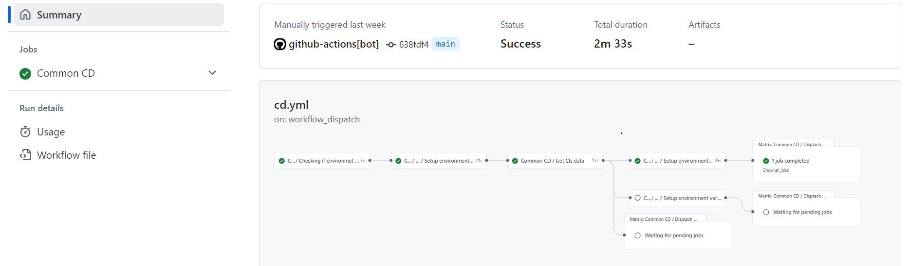

You will also be able to see in your repository that a release has been generated of the
version of your API that you want to deploy.

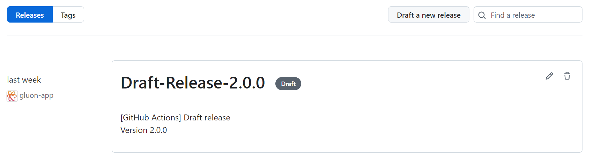

### Publish Release

To publish the Release, you access the Release generated by the ci-tbd.yml workflow, modify the name of the Release by removing Draft and publish the Release.

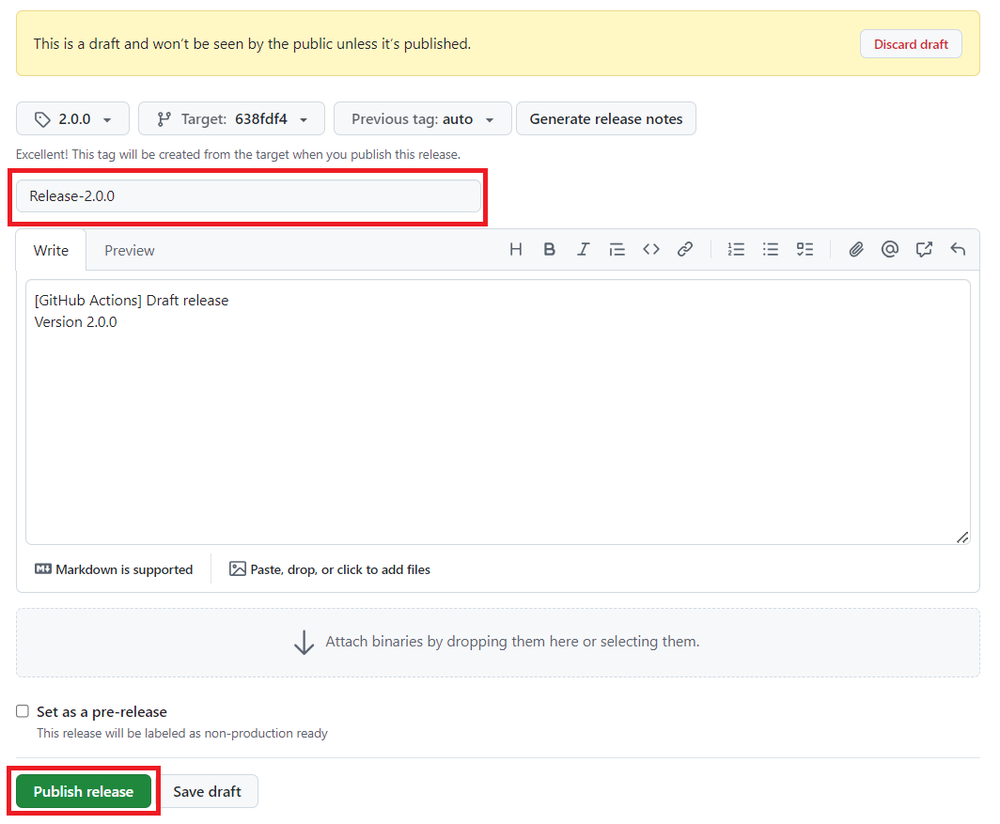

When publishing the Release, the release-tbd.yml workflow is launched.

These are the steps that will be executed in this part of the cycle:

- **Setup environment variables**: Load the properties needed for the workflow.
- **Upload assets to nexus**: Upload the API configuration to nexus.

### Manual deployment to PRE/PRO

> !IMPORTANT: The method for deploying releases in PRE and PRO in Gluon is using Release Management. This method should only be used as an alternative.

For the deployment to pre-production and production, the cd.yml workflow must be executed manually, indicating the following fields:

- **Version to deploy**: Version of the Release to be deployed.
- **Environment to deploy**: Name of the folder of the .gluon path that identifies the environment in which it is going to be deployed.

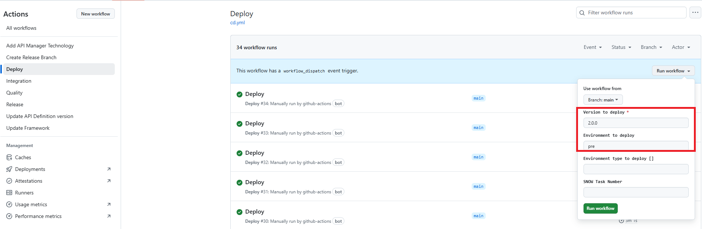

## API Visualization

Once the API deployment is complete, you can consult the deployed API in the Integrations -> Assets -> My API Instances section:


