>IMPORTANT: This component is deprecated, it is recommended that the creation of new API Deployment components is done with the [**API Deployment 2.0 component**](./apis.md).

## Introduction

The purpose of this documentation is to provide a **step-by-step guide** on how to orchestrate the deployment of APIs within the GLUON platform.

This guide will allow you to understand how to build and deploy your APIS through a CI/CD process to your API Connect or APIGee environments.

## Create Component

### Gluon Portal

First you have to [**onboard your application.**](../../../../application/application-management/index.md)
Once you have your application created, you can start creating your component.

<!--Start Create Component-->
### Create a new API deployment component

To customize an API deployment component, there are some additional settings that are needed to be done before creating the component.

For Spain, Darwin APIs deployment, please access following documentation : [Darwin Gateway (Only for Spain Use)](../darwingateway.md)

#### Selecting the API definition

Some API definition data is necessary to create the API deployment component. This data is available in Gluon API catalog.
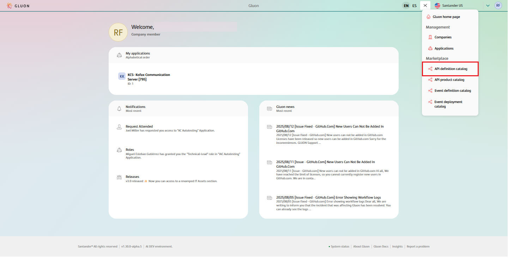

Once in the Catalog, select the API from which the entity wants to develop.
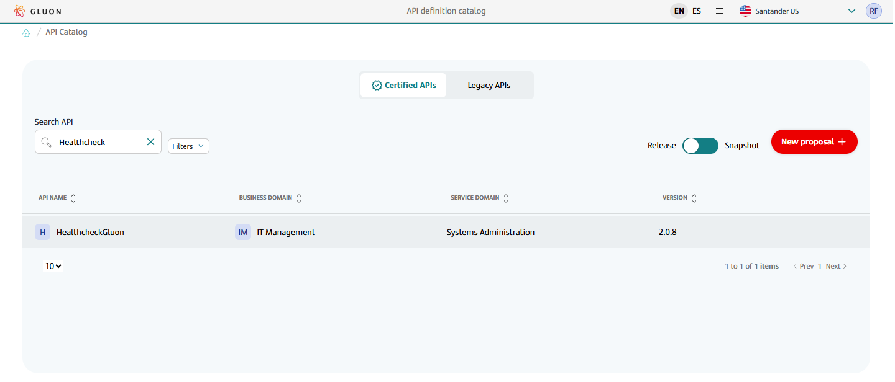

Then click on the three dots symbol and the last option of the dropdown on "Show asset details".
???+ important

    The image shown in the documentation may not match the rendering on the front end for screens related to the API definition view. However, the functionalities offered by this view remain unchanged.
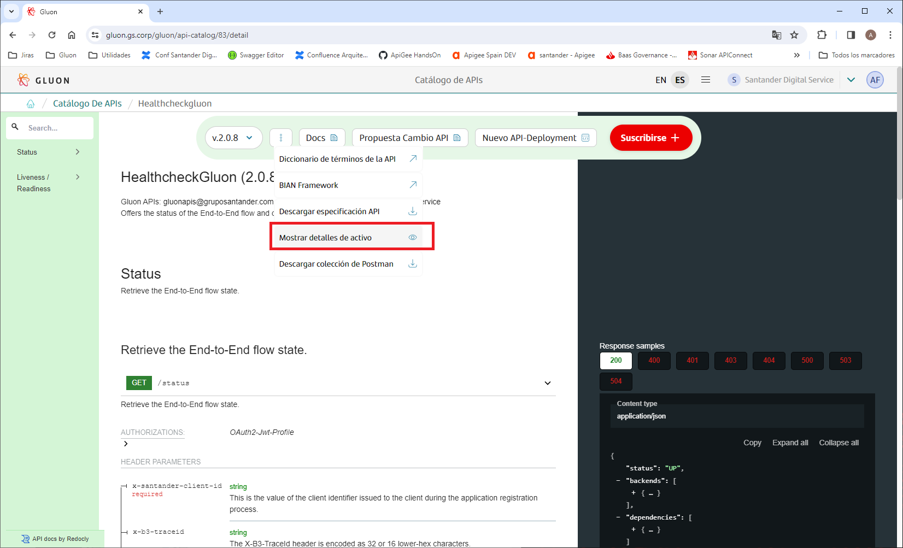

Copy the information through the button.

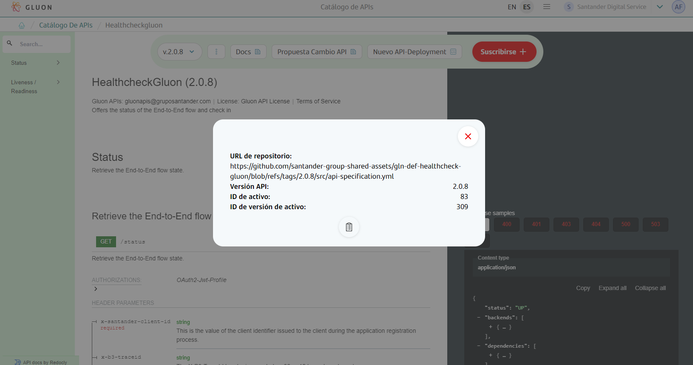

#### Creating the API deployment component

At this point (and from the same browser tab), follow the [component creation guide](../../../../application/component-management/create-component.md#adding-new-components-to-your-application) to create an API deployment component.

The component and short name components are mandatory in order to have the API deployment repository.
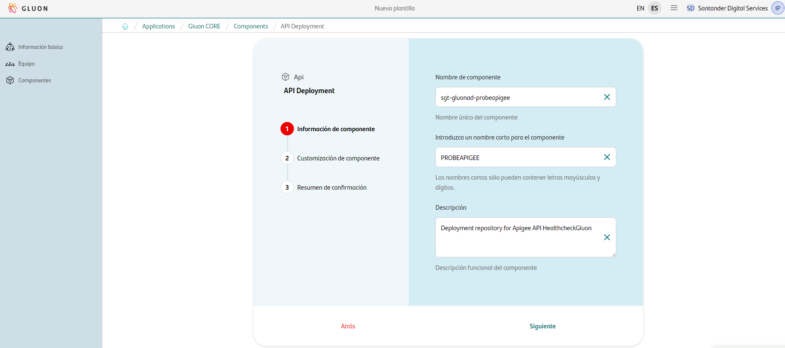

One of the steps in the creation of the component is "Customization of the component". These fields are automatically filled in with the values that have been previously copied from the API Catalog as it can be seen in the following picture.
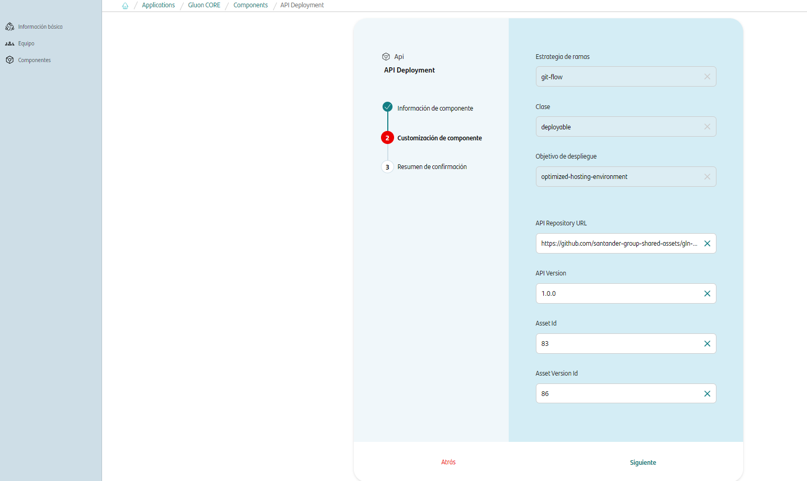

Once all the fields have been filled, the next step is to check in "Summary of confirmation" ​​before creating the component, and finally press to last button "Create a component".
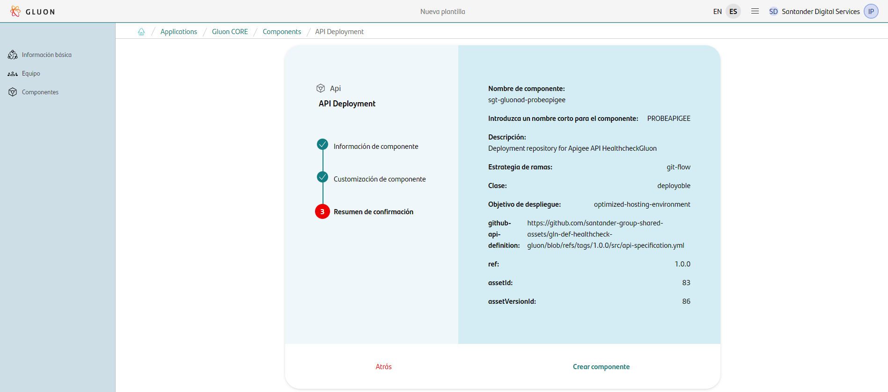

At this point, the API deployment repository has been created and it is available for the development team.

> See an example of a deployment repository created: [sgt-app360-gln30apigee](https://github.com/santander-group-gluon-test/sgt-app360-gln30apigee).
<!--End Create Component-->

Once the component is created we can see under the application that there is a new repository created with the name of the component. This repository may take a few minutes to become available.

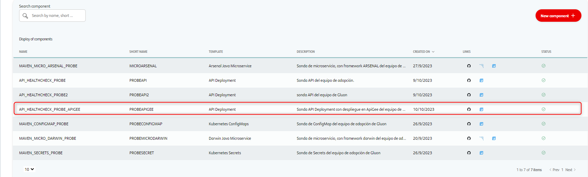

We have the following links in:

| Item | Link | Permissions |
| --- | --- | --- |
| GitHub Repository | Link to the repository created in GitHub | Developers: Write. Technical Leads: Maintain. You can get more detail on repository permissions into [Github doc site](https://docs.github.com/es/organizations/managing-user-access-to-your-organizations-repositories/managing-repository-roles/repository-roles-for-an-organization)  |
| Sonar Project | N/A | N/A |
| Fortify Project | N/A | N/A |

???+ warning

    The **Fortify icon**, although active, will not be used in the deployment of the apis.

<br>

### API Template

#### Branches

When you create the component from the Gluon Portal, the component is created with the default values of the template from the scaffolding workflow. The following steps are automatically executed by the workflow:

- Creates an empty **main** branch
- Creates an **init-branch** with a "Hello World" and with the structure of files and folders to configure and run your api.
- Deletes the **init-branch** and **main** branch is the only one available with the Hello World structure.

???+ info "Note"
    If in the DEV deployment we don't have the .github/workflows folder in the **main** branch, when we execute the CI/CD pipeline, the deployment will fail.

#### Structure

The generated API component has a structure similar to the following (showing only top levels of directory structure). Both, APIGee and API Connect setup elements are included:

``` bash

📦sgt-app360-gln30apigee
 ┣ 📂.github
 ┣ 📂apigee-properties
 ┃ ┣ 📂cert/environment
 ┃ ┣ 📂pre/environment
 ┃ ┗ 📂pro/environment
 ┃ ┗ 📜README.md
 ┣ 📂assembly
 ┣ 📂envs
 ┃ ┗ 📜properties.env
 ┣ 📂resources/documents
 ┃ ┃ ┣ 📂marketplace
 ┃ ┃ ┃ ┗ 📜files.yml
 ┃ ┃ ┗ 📂technical
 ┃ ┃ ┃ ┗ 📜files.yml
 ┣ 📂src
 ┃ ┗ 📂apigee-opdk-brazil
 ┃ ┃ ┣ 📂config/templ
 ┃ ┃ ┣ 📜pom.xml
 ┃ ┃ ┗ 📜README.md
 ┃ ┗ 📂apigee-opdk-europe
 ┃ ┃ ┣ 📂config/templ
 ┃ ┃ ┣ 📜pom.xml
 ┃ ┃ ┗ 📜README.md
 ┃ ┗ 📂ibm-v10
 ┃ ┃ ┣ 📂config/apis-config-service
 ┃ ┃ ┣ 📜README.md
 ┣ 📜api-spec.json
 ┣ 📜deployment-apiconnect.yaml
 ┣ 📜deployment-apigee.yaml
 ┣ 📜README.md
 ┗ 📜version.txt
```

### Inspect your component in your local environment

??? abstract "Cloning your repository"

    ### Cloning your repository

    Once we have the device properly configured, the first step is to clone the project locally.

    To do so, visit [**How to clone the project**](../../../../application/component-management/create-component.md#cloning-a-repository).

## Infrastructure

You have to know the following infrastructure resources from the entity you belong to and you want to deploy an API.

=== "**APIGee**"

    Servers and Endpoints:

    - URL Manager:  Example https://{host}/management
    - URL Token: is the URL of the Oauth Server for the token retrieval Example: https://{host}/oauth/token

    Credentials list needed to access the API Manager administration:

    - API_BAAS_USER
    - API_BAAS_PWD

=== "**API Connect**"

    Credentials list needed to access the API Manager administration:

    - api_connect_user
    - api_connect_password
    - datapower_user
    - datapower_password

## Component Configuration

### Branches

It's important that we have our main branch (**main** or **master** by default) from where we will make the deployments to each of our environments.

### Configuration Files

- **api-spec.json**: Generated with the creation of component and should not be modified

These are the files to be configured:

API Connect:

  - **env.yaml**
  - **properties.yaml**

APIGee:

  - **KVM.json**
  - **targetServers.json** (Brasil only)

<br>

#### api-spec.json

This json file is common to all platforms:

Example:

``` json
{
    "api-spec": "https://github.com/santander-group-shared-assets/gln-def-healthcheck-gluon/blob/main/src/api-specification.yml",
    "api-spec-raw": "https://raw.githubusercontent.com/santander-group-shared-assets/gln-def-healthcheck-gluon/main/src/api-specification.yml",
    "org": "santander-group-shared-assets",
    "repo": "gln-def-healthcheck-gluon",
    "path": "src/api-specification.yml",
    "ref": "2.0.1",
    "X-Santander-Country": "scib",
    "asset": {
        "id": "83",
        "version": "98"
    }
}
```

|Parameter|Description|Example|
|---|---|---|
|api-spec|URL complete of the github repository where the API definition is stored| <https://github.com/santander-group-gluon-test/api-definition-demo-signatures/blob/1.0.0/src/api-specification.yml> |
|api-spec-raw|Raw URL complete of the github repository where the API definition is stored| <https://raw.githubusercontent.com/santander-group-gluon-test/api-definition-demo-signatures/1.0.0/src/api-specification.yml> |
|org|GitHub organization of the API definition repository|santander-group-gluon-test|
|repo|Name of API definition repository|api-definition-demo-signatures|
|path|Path of the yaml file in the API definition repository|src/api-specification.yml|
|ref|Branch of the API definition repository|1.0.0|
|asset-id|Id of the asset of the API in marketplace|13|
|asset-version|Version of the asset of the API in marketplace|9|
|X-Santander-Country|Deprecated field. It will be removed in a future Gluon release. |-|

Some of this data is available from the Marketplace itself, within the definition itself:

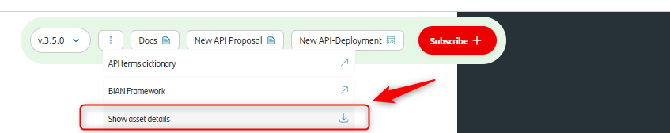
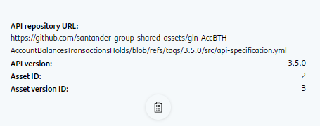

#### API-Connect Configuration

##### apis-config-service

In the path src/ibm-v10/config/apis-config-service route are stored the configuration files by environment

``` bash

📦root
 ┗ 📂src
   ┗ 📂ibm-v10
     ┗ 📂config
       ┗ 📂apis-config-service
         ┣ 📜dev.yaml
         ┣ 📜pre.yaml
         ┣ 📜pro.yaml
         ┗ 📜properties.yaml

```

It will be necessary for each environment to indicate the properties that the policies will use at runtime. This file will be loaded at the gateway.

``` yaml title="dev.yaml"
apiConfig:
  target-url: https://open-api-cib-cto-arquitectura-apis-dev.apps.cib01.cib.dev.bo1.paas.cloudcenter.corp
  audience: APImEntityIntraCoreCHSd
```

In src/ibm-v10/config/apis-config-service/properties.yaml will be necessary to add:

- All scopes of the API. *(Add in defaults part of the file)*
- If you want to use security at operation level, yo need to configure the name of the operation and the scope for this operation. *(Add in operationIds part of the file)*

See an example of the `properties.yaml` file with security at operation level:

``` yaml
scopes:
  defaults:
    resources.read: It is a role that compiles reading scope on the assigned method.
    resources.create: It is a role that compiles scope of creation on the method assigned.
    resources.delete: It is a role that collects deletion scope on the assigned method.
    resources.update: It is a role that collects scope for modification of the assigned method.
    resources.custom: It is a role custom that collects scope for modification of the assigned method.
  operationIds:
    retrieveResources:
      resources.read: Description
    createResource:
      resources.create: Description
    retrieveResource:
      resources.read: Description
    modifyResource:
      resources.update: Description
    updateResource:
      resources.update: Description
    deleteResource:
      resources.delete: Description
    retrieveHealth:
      resources.read: Description
    retrieveHealth:
      resources.custom: Custom
```

See an example of the `properties.yaml` file with security at API level:

``` yaml
scopes:
  defaults:
    resources.read: It is a role that compiles reading scope on the assigned method.
    resources.create: It is a role that compiles scope of creation on the method assigned.
    resources.delete: It is a role that collects deletion scope on the assigned method.
    resources.update: It is a role that collects scope for modification of the assigned method.
    resources.custom: It is a role custom that collects scope for modification of the assigned method.
```

#### APIGee Configuration

For each environment (CERT, PRE, PRO) some files may be necessary to add API properties in each gateway (apigee environments: internet, intranet, sandbox, ) The name of the "environment" directory refers to the name of the gateway to configure.
As many directories have to be included as gateways you want to configure inside CERT/PRE/PRO directories, with the corresponding files.

Therefore, among the values ​​that can be included inside those kvms.json, are those that can vary by environment (CERT, PRE, PRO)

Also for static gateway variables that do not mutate by environment (CERT/PRE/PRO), a kvms.json file will be included in the following directory with the corresponding values.

``` bash
📦 src
 ┣ 📂apigee-opdk-europe
 ┃ ┗ 📂config
 ┃ ┃ ┗ 📂 templ
 ┃ ┃ ┃ ┗ 📂 config
 ┃ ┃ ┃ ┃ ┗ 📂 env
 ┃ ┃ ┃ ┃ ┃ ┗ 📂 environment
 ┃ ┃ ┃ ┃ ┃ ┃ ┗ 📜kvms.json
```

Consider including as many directories as gateways (Apigee environments) you want to configure with the corresponding files inside templ/config/env directory, with the corresponding kvms.json file.

``` bash
📦apigee-properties
 ┣ 📂cert
 ┃ ┗ 📂environment
 ┃ ┃ ┣ 📜kvms.json
 ┃ ┃ ┗ 📜targetServers.json
 ┣ 📂pre
 ┃ ┗ 📂environment
 ┃ ┃ ┣ 📜kvms.json
 ┃ ┃ ┗ 📜targetServers.json
 ┗ 📂pro
   ┗ 📂environment
     ┣ 📜kvms.json
     ┗ 📜targetServers.json
```

##### KVM Files

KVM File in APIGee is a file in JSON format that contains values that the API will use in some policies.

Inside apigee-properties, for each environment there are several folders (cert, pre and pro) and in each one of them you must create as many folders as gateways in which the API must be deployed.

   - The values defined inside those kvms json files, are those that can vary by environment (CERT/PRE/PRO). For example the target of the API.
   - For each defined environment folder (Cert/pre/pro), we will have as many gateways folders as necessary, and within these folders the kvm json files with the variables.

``` json title="KVM inside apigee-properties"
[
    {
        "name": "targetUrl",
        "value": "targetUrl-value-here"
    },
    {
        "name": "cosac-config",
        "value": "{\"data\":{\"GET\/accounts\":{\"cosacUrl\":\"cosac-host\/cosac-service\",\"customer\":{\"header\":\"X-Customer-ID\"},\"contracts\":{\"body\":\"$.contracts[*].contractId\"}},\"GET\/accounts\/{account-id}\":{\"cosacUrl\":\"cosac-host\/cosac-service\",\"customer\":{\"header\":\"X-Customer-ID\"},\"contracts\":{\"body\":\"contracts.contractIds\"}},\"GET\/accounts\/{accounts-id}\/balances\":{\"cosacUrl\":\"cosac-host\/cosac-service\",\"customer\":{\"path\":\"customer-id\"},\"contracts\":{\"query\":\"contract-ids\"}}}}"
    },
    {
        "name": "api-client-id",
        "value": "apiclientidvaluehere"
    }
]
```

Inside OPDK-Europe/config/templ/config/env, you must create as many folders as gateways in which the API must be deployed.

   - The values defined inside those kvms files, are those that are no mutable by environment (CERT/PRE/PRO). For instance the audience of the API.
   - For each defined gateway folder, we have the kvm json file with the corresponding variables.
   - A property called "devmkt\_metadata" with the URL in RAW format of the yaml file of the repository is **mandatory**.

``` json title="KVM inside apigee-opdk-europe subfolder env"

[
    {
        "entry": [
            {
                "name": "audience",
                "value": "audience-value"
            },
            {
                "name": "devmkt_metadata",
                <\#if doc.info.x\-santander\-name??>
    "value":"{\"title\":\"${(doc.info.x\-santander\-name)}\",\"description\":\"description\",\"yaml_uri\":\"https://raw.githubusercontent.com/${ORG}/${repo}/${ref}/${path}\"}"
                <\#else>
    "value":"{\"title\":\"${(doc.info.title)!"PROXY_NAME"}\",\"description\":\"description\",\"yaml_uri\":\"https://raw.githubusercontent.com/${ORG}/${repo}/${ref}/${path}\"}"
                </\#if>
            }
        ],
        "name": ${'"'}CP_PROXY_NAME${'"'}
    }
]
```

Once both files are configured, at compililation time these values are concatenated to the list defined in the "entry" element of the template that will be compiled and stored in Nexus before the deployment process in Apigee.

>IMPORTANT: Entries are not merged in the process. If an entry in is defined both files, an error will occur.

[More information about kvm configure process](https://github.com/santander-group-shared-assets/sgt-glncom-glndocsweb/blob/main/docs/components/software/api/framework/lifecycle/apideployment.md#fill-kvm-files)

##### Target servers files

??? note "Brasil Solution"
    This solution is only used by the Brasil entity. In the case that the API is not from this entity, and so that the deployment workflow does not fail, it will be necessary to delete these files from the repository

TargetSevers decouples URLs from TargetEndpoint configurations, instead of defining a specific URL in the configuration, one or more TargetServers with name can be configured.

Then each TargetServer is referenced by name in an HTTP TargetEndpoint connection.

For each environment there are several folders (cert, pre and pro) and in each one of them you must create as many folders as gateways in which the API must be deployed.

``` json title="targetServer.json example"

[
  {
    "host": "<write_your_targetUrl>",
    "isEnabled": true,
    "name": ${'"'}ts-$PROXY_NAME${'"'},
    "port": 443,
    "sSLInfo": {
        "ciphers": [],
        "clientAuthEnabled": "false",
        "enabled": "true",
        "ignoreValidationErrors": false,
        "protocols": []
     }
  }
]

```

??? warning "Important"
    The "**host**" value must be the URL of the real destination for each environment and gateway when the API is deployed.

### Configuration CD Files

- **Properties file**: File where we will store some properties related to the CI/CD process inside the "ENVS" folder.

- **deployment-apiconnect.yaml**: File with the necessary properties to deploy to the different **apiconnect** environments.

- **deployment-apigee.yaml**: File with the necessary properties to deploy to the different **apigee** environments.

#### Properties file

In case of that you want to deploy in **IBM** the value of **ARCHETYPE_DIRECTORY** should be "N/A".

In case of that you want to deploy in **apigee** the value of **ARCHETYPE_DIRECTORY** should be the route of apigee archetype directory folder.

See an example:

APIConnect Example:

``` yaml
API_PLATFORM='apiconnect'
ARCHETYPE_DIRECTORY="N/A"
```

APIGee Example:

``` yaml
API_PLATFORM='apigee'
ARCHETYPE_DIRECTORY="src/apigee-opdk-europe"
```

| **Property** | **Required**  | **Type** | **Description** |
|--- |--- |--- |--- |
| ARCHETYPE_DIRECTORY   | true  | apigee | Archetype used for build apigee artifact |
| API_PLATFORM | true | apiconnect/apigee | Api manager where deploy is mad |

<br>

#### Deployment.yaml file

=== "**API Connect**"

``` yaml
environments:
  - name: cert
    playbook: pb-gluon-api-connect-devops.yml
    inventoryGit: santander-group-gluon/gln-apiconnect-inventory
    inventoryGitBranch: develop
    inventory: ${ENTITY}/inventory
    git: santander-group-shared-assets/gln-apiconnect-deploy-ansible-scripts
    gitBranch: development
    gitCredentialUserId: ACTIONS_PA
    ansibleDebug: true
    extraParams:
      maven_artifact_id: ${API_NAME}
      component_name: ${API_NAME}
      nexus_url: ${ARTIFACT_NEXUS_URL}
      version: ${PRODUCT_VERSION}
      env: ${ENVIRONMENT}
      config_service_path: ${APICONNECT_CONFIG_SERVICE_PATH}
      api_file: ${API_SPEC_YAML_FILE}
    extraSecretParams:
      api_connect_user: APICONNECT_USER_DEV
      api_connect_password: APICONNECT_USER_DEV_PASS
      datapower_user: DATAPOWER_USER_DEV
      datapower_password: DATAPOWER_USER_DEV_PASS
    apiConfigDeploy:
      deploy:
        apiVersion: v3
        deployments:
          - name: region1
            infrastructureId: apicDeploy
            organization: scib
            catalog: gluon-apic
            space:  gluon-apic
            service: intranet-client
            product_version: 1.0.0
      security:
        profile: authorization-code-cosac
        timeout: 60
        cache_ttl: 900
        exp_claim: 60
        exp: 60
      plans:
       live-plan:
        title: "LivePlan"
         description: "PlanForLiveCalls"
         rate-limits:
           default:
             value: "1000/1minute"
             hard-limit: false
       sandbox-plan:
         title: "SandboxPlan"
         description: "PlanForSandboxCalls"
         rate-limits:
           default:
             value: "1000/1minute"
             hard-limit: false
         burst-limits:
           default:
             value: "9/1second"
       custom-plan:
         title: "CustomPlan"
         description: "PlanForCustomCalls"
         rate-limits:
           default:
             value: "1000/1minute"
             hard-limit: false
       visibility:
         view:
           type: public
           orgs: []
           tags: []
           enabled: true
         subscribe:
           type: authenticated
           orgs: []
           tags: []
           enabled: true
```

=== "**APIgee**"

    ```yaml
    environments:
    - name: cert
      HOST_MNG: https://management.apis.sandigital.innaacc.dev.corp
      TOKEN_URL: https://sso.weu.apis.sandigital.dev.corp/oauth/token
      APIGEE_PROPERTIES_PATH: apigee-properties/cert
      SET_PROPERTIES_FILE: ./sssrc/setProperties.xml
      APIGEE_ORG: spain
      APIGEE_TEAM: ARQ_apis
      API_BAAS_USER: API_BAAS_USER
      API_BAAS_PWD: API_BAAS_PWD
      APIGEE_ENVIRONMENTS:
        - intranet-core
    - name: pre
      HOST_MNG: https://management.apis.sandigital.innaacc.dev.corp
      TOKEN_URL: https://sso.weu.apis.sandigital.dev.corp/oauth/token
      APIGEE_PROPERTIES_PATH: apigee-properties/pre
      APIGEE_ORG: spain
      APIGEE_TEAM: ARQ_apis
      API_BAAS_USER: API_BAAS_USER
      API_BAAS_PWD: API_BAAS_PWD
      APIGEE_ENVIRONMENTS:
        - intranet-core
    - name: pro
      HOST_MNG: https://management.apis.sandigital.innaacc.dev.corp
      TOKEN_URL: https://sso.weu.apis.sandigital.dev.corp/oauth/token
      APIGEE_PROPERTIES_PATH: apigee-properties/pro
      APIGEE_ORG: spain
      APIGEE_TEAM: ARQ_apis
      API_BAAS_USER: API_BAAS_USER
      API_BAAS_PWD: API_BAAS_PWD
      APIGEE_ENVIRONMENTS:
        - intranet-core
    ```

<br>

For apigee it is also necessary to modify the pom.xml only for apigee-opdk-europe to include client/core security, JWSID Token and Cosac Control Policy. For further details please go to the Apigee Deployment documentation in the capabilities section.

### Configure your repository secrets

There are three types of secrets in Github.com:

- **Organization secrets**: Secrets that can be used by all repositories in the organization.
- **Repository secrets**: Secrets that can be used only by the repository.
- **Environment secrets**: Secrets that can be used only by the repository and the environment.

???+ warning "Setup Github Secrets"

    Currently only the devops team of the entity has permissions to create the secrets in the organization. If you need to create a secret, please contact with the devops team. If you have doubts what users belongs to devops team, please contact with your entity Gluon Champion.

<br>

#### Deploy Secrets

We will first need to create a SECRET at repository level called **ACTIONS_PA**, which will need to contain a PAT of the user ([Personal Access
Token](https://docs.github.com/en/enterprise-server@3.6/authentication/keeping-your-account-and-data-secure/managing-your-personal-access-tokens)).

When creating a personal access token, they have to be configured with **No expiration** and all the checks from repo have to be activated, leaving every other check deactivated.

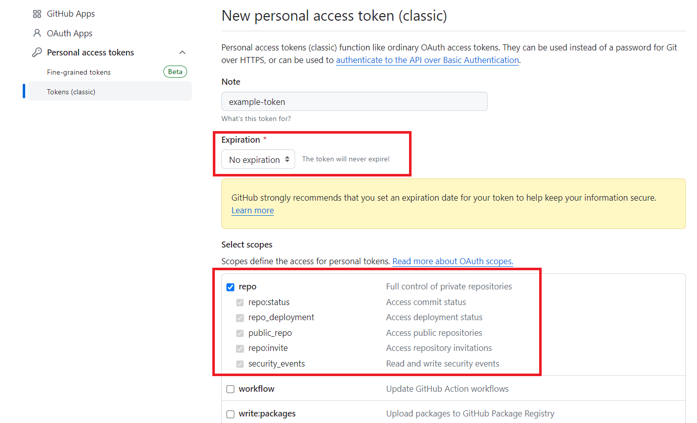

After generating the token, SSO has to be configured for the entity.

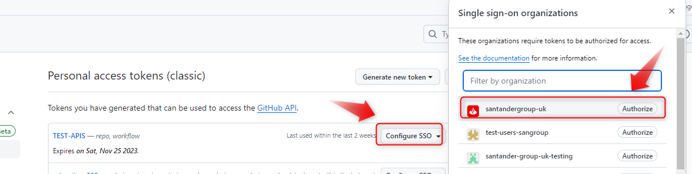

=== "**API Connect**"

    | **Secret id** | **Type** | **Description** |
    | --- | --- | --- |
    | SOS_CRED_ID | Apiconnect | SOS credential ID (only for SCIB)|
    | DATAPOWER_USER_PRO_PASS | Apiconnect | PRO apiconnect datapower password |
    | DATAPOWER_USER_PRO | Apiconnect | PRO apiconnect datapower user |
    | DATAPOWER_USER_PRE_PASS | Apiconnect | PRE apiconnect datapower password |
    | DATAPOWER_USER_PRE | Apiconnect | PRE apiconnect datapower user |
    | DATAPOWER_USER_DEV_PASS | Apiconnect | DEV apiconnect datapower password |
    | DATAPOWER_USER_DEV | Apiconnect | DEV apiconnect datapower user |
    | APICONNECT_USER_PRO_PASS | Apiconnect | PRO apiconnect deploy password |
    | APICONNECT_USER_PRO | Apiconnect | PRO apiconnect deploy user |
    | APICONNECT_USER_PRE_PASS | Apiconnect | PRE apiconnect deploy password |
    | APICONNECT_USER_PRE | Apiconnect | PRE apiconnect deploy user |
    | APICONNECT_USER_DEV_PASS | Apiconnect | DEV apiconnect deploy password |
    | APICONNECT_USER_DEV | Apiconnect | DEV apiconnect deploy user |

=== "**APIGee**"

    | **Secret id** | **Type** | **Description** |
    | --- | --- | --- |
    | APIGEE_USER_DEV | Apigee | App user for Apigee manager in dev |
    | APIGEE_PWD_DEV | Apigee | App password for Apigee manager in dev |
    | APIGEE_USER_PRE | Apigee | App user for Apigee manager in pre |
    | APIGEE_PWD_PRE | Apigee | App password for Apigee manager in pre |
    | APIGEE_USER_PRO | Apigee | App user for Apigee manager in pro |
    | APIGEE_PWD_PRO | Apigee | App password for Apigee manager in pro |
<br>

???+ info "How to add Secrets"
    [**How to add Secrets**](https://docs.github.com/en/actions/security-guides/using-secrets-in-github-actions)

## API Deploy

We will now describe the steps you need to take in order to deploy your API across the CERT, PRE and PRO environments.

The cycle explained below is based on **Trunk Based Development**.

### Pull Request to Main

When we create the **Pull Request event to our branch main/hotfix branch** it will automatically run the workflow  ***api-quality-deployment.yml***

The following are the steps that are executed in this workflow.

``` yaml title="api-quality-deployment.yml"

name: Quality Gluon Flow

on:

  pull_request:
  branches:
      - main
      - hotfix/*
  workflow_dispatch:

concurrency: quality-${{ github.ref }}

jobs:
  call-reusable-workflow:
    name: Api quality workflow
    uses: santander-group-gluon/gln-workflows/.github/workflows/api-quality-deployment.yml@v1
    with:
      runner: 'maven-runner'
    secrets: inherit
```

These are the jobs that will be executed in this part of the cycle:

- **Configure environment variables**: Load the properties defined in the properties.env file and in the configuration project.
- **Get definition file**: Load the definition file for a specific organisation, repository and branch.
- **API Validation**: Checks if the asset-id and asset-version obtained in Get Definition File are valid by calling API Marketplace.
- **Linter Validation**: This action uses Stoplight's Spectral to clean up your OpenAPI documents or any other JSON/YAML file.
- **Send data to Elastic**: This action sends the publish-version response and the repository and environment data to elasticsearch.

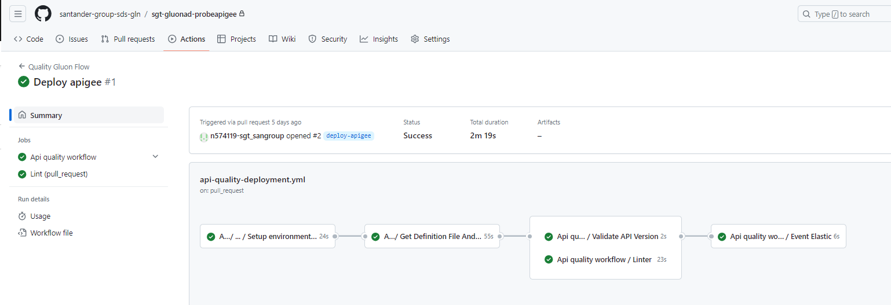

### Push to Main

By approving the Pull Request of the previous step on the main branch we will generate a push event on this branch and therefore the workflow api-snapshot-deployment.yml will be executed automatically.

The following are the steps that are executed in this workflow:

``` yaml title="api-snapshot-deployment.yml"
name: Api snapshot deployment
on:
  workflow_dispatch:
  push:
    branches:
      - main
      - hotfix/*

concurrency: snapshot-${{ github.ref }}

jobs:
  call-reusable-workflow:
    name: Api Snapshot workflow
    uses: santander-group-gluon/gln-workflows/.github/workflows/api-snapshot-deployment.yml@v1
    with:
      runner: 'maven-runner'
    secrets: inherit
```

These are the jobs that will be executed in this part of the cycle:

- **Configure environment variables**: Load the properties defined in the properties.env file.
- **Apigee artifact upload/Apiconnect artifact upload**: These jobs are executed depending on the management platform where we want to deploy the API, orchestrated by the API_PLATFORM - environment variable.
    - The main functionalities are:
        - Get the specification file from the definition repository,
        - Generate the artefact and upload it to the nexus repository.
- **Call the cd workflow**: This job calls the CD workflow to deploy to the CERT environment.
- **Prepare tag and draft version**: This job creates a tag with the version contained in version.txt, and then associates a draft version to the created tag.

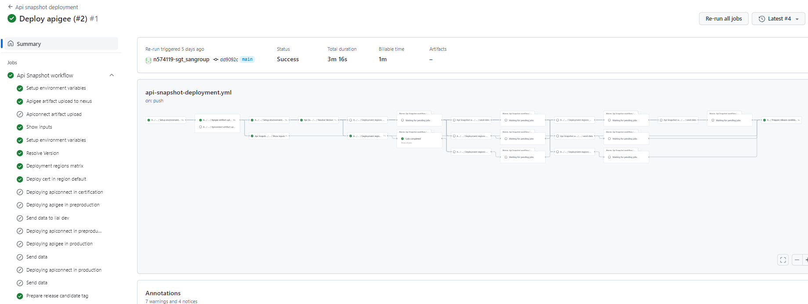

You will also be able to see in your repository that a release has been generated of the
version of your API that you want to deploy.

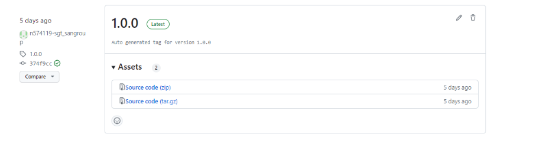

<br>

### Deploy PRE/PRO

When we want to promote our API to the **PRE/PRO** environments we will publish the release that has been generated in our repository.

To do so, we will enter the release and click on the button **Publish release**.

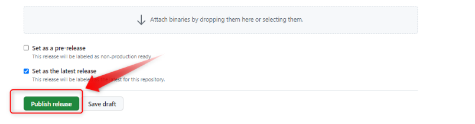

This event will trigger the last workflow involved in the cycle **(api-release-deployment.yml)**.

```yml title="api-release-deployment.yml"
name: Api release deployment

on:
  workflow_dispatch:
  release:
    types:
      - published

concurrency: release-${{ github.ref }}

jobs:
  call-reusable-workflow:
    name: Api release workflow
    uses: santander-group-gluon/gln-workflows/.github/workflows/api-release-deployment.yml@v1
    with:
      runner: 'maven-runner'
    secrets: inherit
```

These are the jobs to be executed in this part of the cycle:

- Setup environment variables: Load the properties defined in env file and in the configuration project.
- Calling quality workflow: This job calls the quality workflow. It executes a complete workflow with 'Setup environment variables', 'Get Definition File', 'API validation', 'Linter validation' and 'Send data to Elastic' jobs.
- Apigee artifact upload/Apiconnect artifact upload: These jobs are executed depending on the manager platform where we want to deploy the API, orchestrated by the environment variable API_PLATFORM.
  - The main functionalities are:
      - Get the specification file from the definition repository
      - Generate the artifact and upload it to the nexus repository (release repository)
- Calling cd workflow: This job calls the CD workflow in order to perform the deployment in PRE & PRO environments

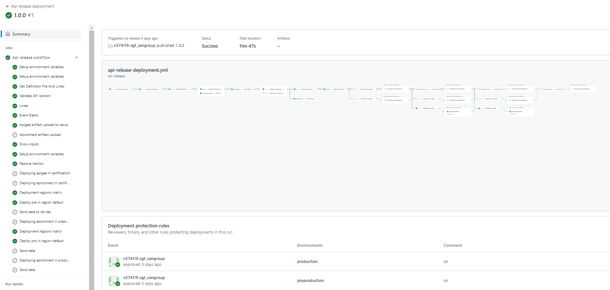

But before generating the release, we must make sure that we have defined the **secrets at environment level** and **which users can approve the release**.
That we have defined **which users will be able to approve the deployment**.

To do this, we have to make sure that both the environment of ***production***, as well as the ***preproduction*** environment, have defined **protection rules**, with the users that can approve this deployment.


Therefore, when we publish the release, the workflow will be at a standstill at the expense of a review.

To deploy to PRE/PRO, we will click on **Review deployments**, where we put a comment and approve the deployment.

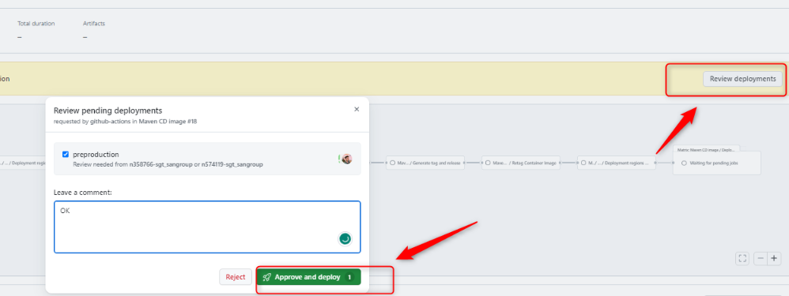

## Manual deployment

In the current Gluon release we cannot separate the deployment of the repository where we have the source code of our application.
But we can execute the workflow **api-release-deployment.yml** in a manual way, to deploy a specific version of our API in any of the environments that we have defined in our deployment.yaml.
To do this, in Github inside **Actions**, we will click on **API release deployment** to the left of the screen and click on the **Run workflow** button on the right of the screen.

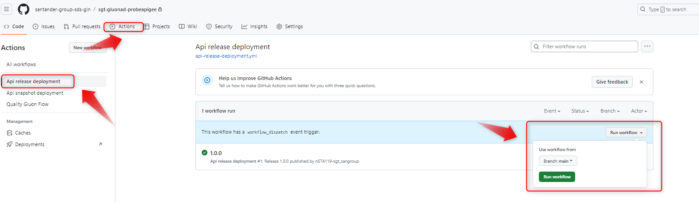

This workflow will deploy the version of the API that we have defined in the ***api-spec.json*** file.

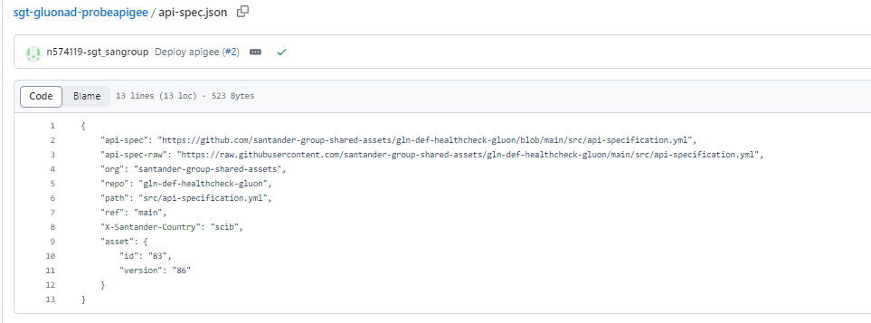

The workflow will be executed like in the previous case. Once the workflow is executed we can deploy to PRE and PRO with the approval of the reviewer.

## Repository Example

If you need an example of a repository with an api created with Gluon, you can visit:

- [Api Connect example](https://github.com/santander-group-gluon-test/cib-apiteam-test)
- [APIGee example](https://github.com/santander-group-gluon-test/sgt-app360-gln30apigee)

## Migration from Gluon 2.0 to Gluon 3.0 api deployment repositories

### New API deployment component (Recommended)

Recommended option for test repositories and probes.

### Changes needed for API deployment repositories in Gluon 3.0 (Only for production repositories)

In .github/workflows/:

**ADD**:

- [api-cd-apigee-deployment.yml](https://github.com/santander-group-shared-assets/gln-user-reusable-workflows/blob/v1.5.0/apis/api-cd-apigee-deployment.yml)
- [api-cd-apiconnect-deployment.yml](https://github.com/santander-group-shared-assets/gln-user-reusable-workflows/blob/v1.5.0/apis/api-cd-apiconnect-deployment.yml)
- [api-deployment-version-validation.yml](https://github.com/santander-group-shared-assets/gln-user-reusable-workflows/blob/v1.5.0/apis/api-deployment-version-validation.yml)

**DELETE**:

- api-cd-deployment.yml

Set the new [deployment-apiconnect.yaml](https://github.com/santander-group-shared-assets/gln-scaffolding-action/blob/v2.1.0/resources/apis-deployment/deployment-apiconnect.yaml ) file

**Optional**:

Delete deprecated vars from envs/properties.env:

- APICONNECT_CATALOG_SPACE
- JAVA_VERSION

Delete deprecated secrets:

- APICONNECT_ADMIN_USER_DEV
- APICONNECT_ADMIN_USER_DEV_PASS
- SOS_CRED_ID

## Migration from Gluon 3.0 and 3.1 to Gluon 3.2 API deployment repositories

### Changes in properties.env

Security profiles must be configured in properties.env instead of pom.

???+ warning "Recommendation"

    If additional support is needed, please contact the Gluon product team.
