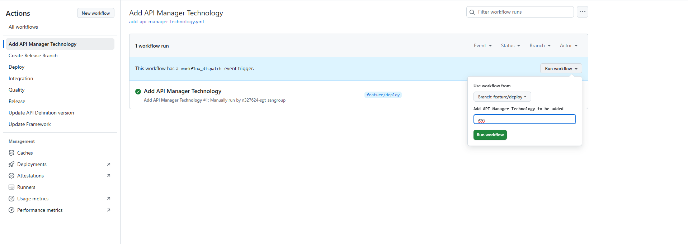
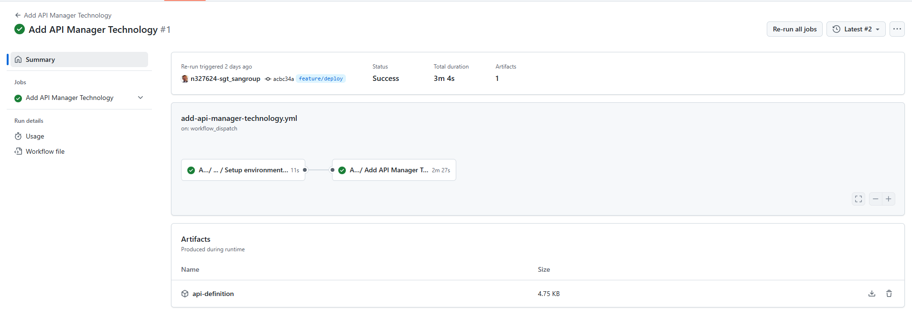
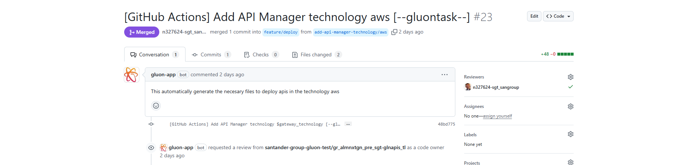

## Introduction

The API Deployment 2.0 component, when created, is configured to be deployed in one or more API Management technologies. However, it may later be required to deploy in other technologies that have been added subsequently or to which it needs to migrate.

To facilitate adding new technologies, there is a workflow called **Add API Manager Technology**.

> !IMPORTANT: This workflow is available from version 1.2.24 of the API Deployment 2.0 component. If the component was created in an earlier version, you must [*update the component*](./../../../../application/component-management/update-component.md#updating-your-component)

## Add API Management technology to the component

### Identify the technology to add

Currently, Gluon supports 3 technologies: IBM API Connect, Apigee, and AWS API Gateway. The keys that need to be configured for these technologies are **ibm**, **apigee**, and **aws**.

### Run the workflow

In the component repository, in the Actions section, you must select the "Add API Manager Technology" workflow and then click on "Run workflow".

At that moment, a menu will open where you must configure the following parameters:

- **Use workflow from**: Branch from which you want to run it. It is recommended to use a branch different from the main one to facilitate its subsequent configuration.
- **Add API Manager Technology to be added**: Technology you want to add selected in the step [Identify the technology to add](#identify-the-technology-to-add)

Once configured, click on the "Run workflow" button.

Once the workflow execution is finished, a Pull Request is created with the title "[GitHub Actions] Add API Manager technology {{technology}} [--gluontask--]", adding the "values-{{technology}}.yml" files to include the new technology.

Once the Pull Request is merged, you can work on the repository branch to deploy the API with the new technology.
