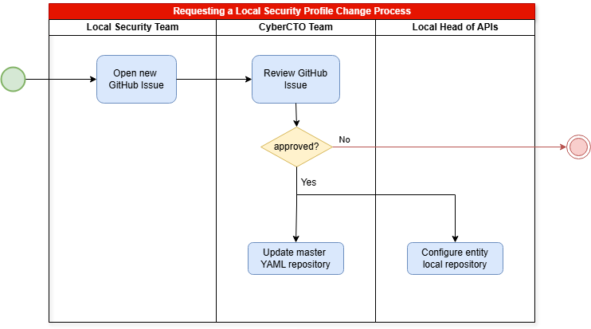

## Security Profiles

**Security Profiles** are structured sets of policies designed to enforce specific security requirements for APIs. Each security profile defines rules for authentication and identity verification, authorization, encryption, and other security controls.

These profiles ensure a standardized and repeatable way to enforce security across APIs and are typically managed through API Gateways.

## Local Security Profiles

**Local Security Profiles** are specialized security profiles designed to meet specific requirements of entities when the standard security profile does not satisfy certain use cases.

These profiles consist of **additional or modified security rules tailored to individual entities** and implemented at the **API Gateway level**.

??? info "Example Scenario"
    An entity may require a specific integration with an external partner using a custom authentication mechanism (e.g., mutual TLS). Standard security policies do not cover this scenario.
    Then, the entity needs to request the creation of a new local security profile to include this mandatory TLS policy.

Local Security Profiles are entity-specific and managed in a [master Github repository](https://github.com/santander-group-shared-assets/api-deployment-global-security-local-policies).

The **CyberCTO team** owns and manages this repository, maintaining YAML files with the security rules for each entity. When a specific entity requires a local security profile, a **Local Security Team** member is responsible for submitting a new request.

### Process for Requesting a Local Security Profile Change

The following outlines the end-to-end process for creating or modifying Local Security Profiles:

#### Step 1: Request Creation and Form Submission - Local Security Team

The **Local Security Team** identifies the need for a new local profile or modifications to an existing one.

- Open a new **GitHub Issue** using the dedicated form available here: [Local Security Profile Request](https://github.com/santander-group-shared-assets/api-deployment-global-security-local-policies/issues/new?template=new-local-security-profile-proposal.yml).
- The GitHub Issue form guides the Local Security Team in providing relevant information, including:
    - Motivation and justification for the request.
    - Security profile affected.
    - YAML file version affected.
    - Types of API Gateway involved.
    - Policies to add, modify, or remove.

#### Step 2: Review and Approval Decision - CyberCTO Team

Local Security Team notifies the **CyberCTO team** about the new request.

- The CyberCTO removes ***"pending-review"*** label, reviews and evaluates the proposal.

??? note "Additional Information"
    CyberCTO may request additional information or clarification from the Local Security Team via comments on the GitHub Issue.

- The CyberCTO indicates the decision by adding a comment on the GitHub Issue:
    - If **approved**, the  CyberCTO comments approval (e.g. ✅ Approved) and adds the ***"approved"*** label.
    - If **rejected**: CyberCTO comments rejection with reasons and marks the issue as ***Close as not planned***.

#### Step 3: Implementation of Approved Changes - CyberCTO & Local Head of APIs

Once approved by CyberCTO:

- **CyberCTO**: Applies the approved changes in the [master repository](https://github.com/santander-group-shared-assets/api-deployment-global-security-local-policies), specifically in the YAML file associated with the entity.

Once the changes are implemented, CyberCTO marks the issue as ***Close as completed***.

??? note "Implementation Process via PR"
    The CyberCTO team creates a new branch associated with the Issue ID (e.g., `issue-<id>`) and implements the changes.
    A Pull Request (PR) is created to merge the changes into the main branch.
    The PR is reviewed, approved and merge by other member of CyberCTO team.

- **Local Head of APIs**: Notified by Local Security Team, applies corresponding changes in the local repository configuration.
