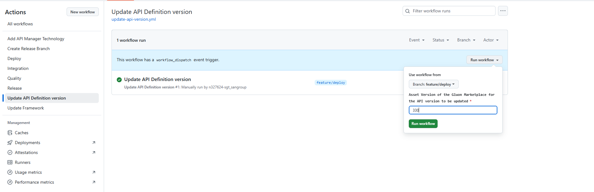
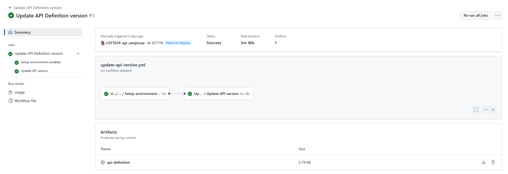
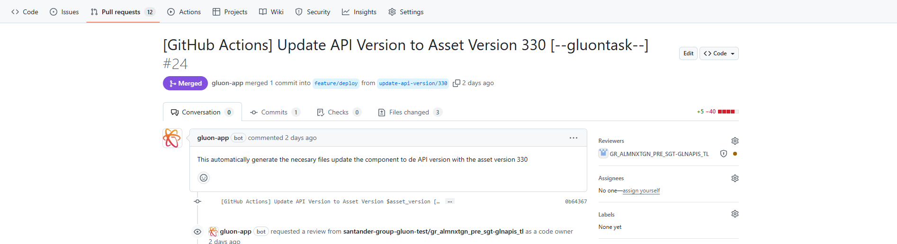

## Introduction

The API Deployment 2.0 component, when created, is configured to deploy an API definition with a specific version. But API definitions have a lifecycle and can evolve in version.

To facilitate updating an API Deployment 2.0 component to use a different version of the API definition, there is a workflow called **Update API Definition version**

> !IMPORTANT: This workflow is available from Gluon version 6.4. If the component was created in an earlier version, you must [*update the component*](./../../../../application/component-management/update-component.md#updating-your-component)

## Update the component's API definition version

### Identify the component version (Asset Version Id)

To identify the version of the API definition to which you want to update (Asset Version Id), you must go to the Marketplace and search for the API with which the component was created.

> !IMPORTANT: This workflow is used to update the API version (Asset Version Id), the API (Asset Id) cannot be modified

When accessing the API details, you can obtain the Asset Version Id from the URL or through the "Show asset details" option.

### Run the workflow

In the component repository, in the Actions section, you must select the "Update API Definition version" workflow and then click on "Run workflow".

At that moment, a menu will open where you must configure the following parameters:

- **Use workflow from**: Branch from which you want to run it. It is recommended to use a branch different from the main one to facilitate its subsequent configuration.
- **Asset Version of the Gluon Marketplace for the API version to be updated**: You must configure the value obtained in the point [Identify the component version (asset version)](#identify-the-component-version-asset-version-id)

Once configured, click on the "Run workflow" button.

Once the workflow execution is finished, a Pull Request is created with the title "[GitHub Actions] Update API Version to Asset Version ### [--gluontask--]",
with the necessary modifications in the "values-{{technology}}.yml" files to adapt them to the new API definition.

Additionally, the asset-version property value in the general values.yml file will be updated with the value selected during the workflow execution.

Once the Pull Request is approved, you can work on the repository branch to deploy a new version of the API with this definition.
