## Introduction

The purpose of this documentation is to provide a **step-by-step guide** on how to subscribe to API Products deployed in Gluon.

This guide will guide you in understanding how to execute the CI/CD processes to perform the subscription in AWS, Apigee and API Connect, integrating with the SOS as Authorization Server:

## Create Component

### Gluon Portal

To create a subscription, you must have followed the [subscription request and approval process](./framework/marketplace/request-subscription.md) by the Application Owner of the application.
Once approved, from the received section of Integrations -> Assets -> Requests -> Requested, a logo with 3 points is enabled in the row of the request in the actions column,
which shows the option to **Subscribe** (in case of being a **client** subscription it also requires the creation of a [**Key Set**](./keyset.md) component).

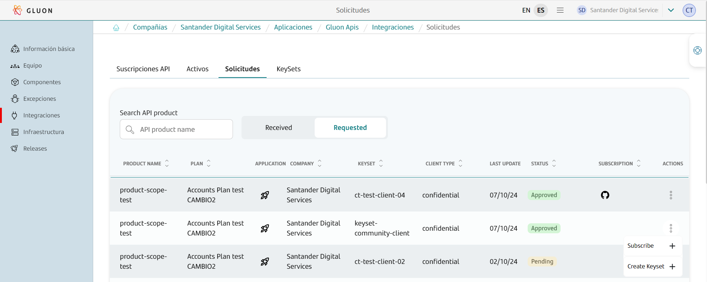

When clicking on **Subscribe**, a screen is displayed that allows you to create the component. On the first screen, you must enter the 4 common values of all Gluon components:

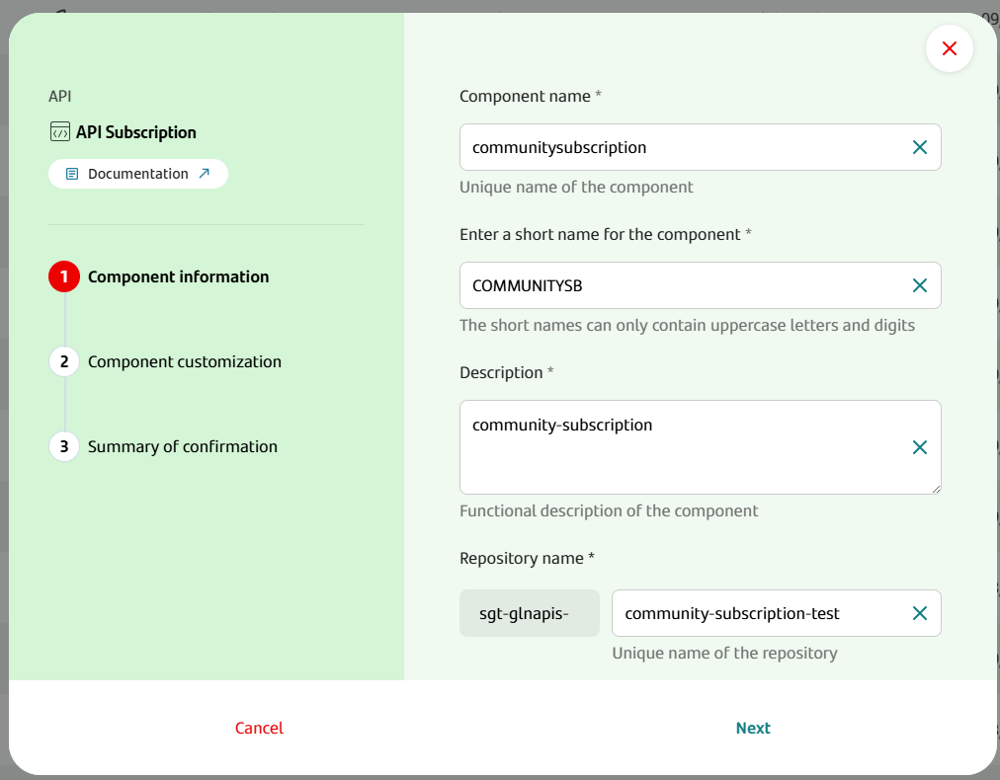

At the next point, the fields that allow configuring the component are displayed. These fields are not editable, as they are obtained from the request made:

- **API Product Plan**: Plan of the API Product to which the subscription has been requested.
- **API Key Set Id**: Key Set (client id) selected for the subscription.
- **API Product Component Repository**: Repository that identifies the product to which the subscription has been requested.
- **API Product Version**: Major version of the product to which the subscription has been requested.

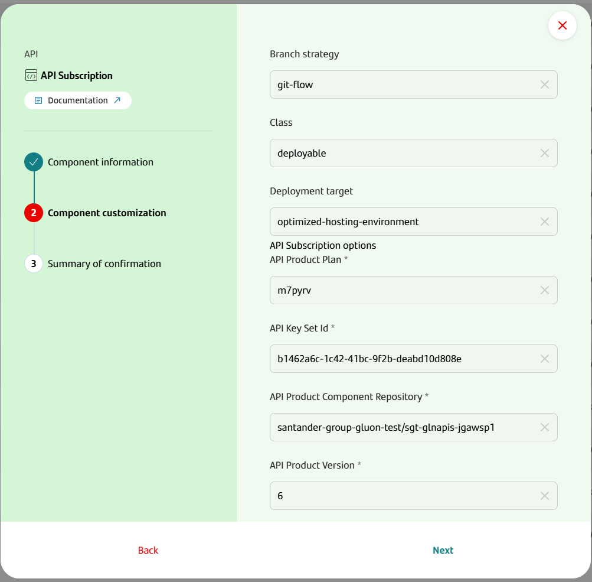

The next screen shows a summary of all the fields that will be used to create the component.

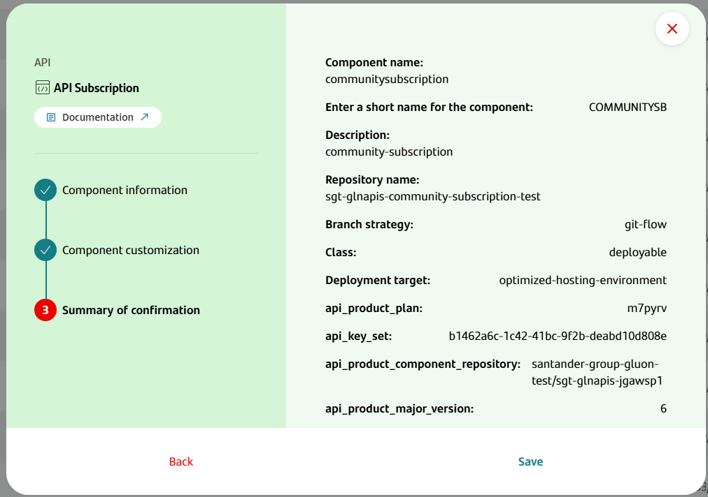

Finally, when you click Save, the component is created and is accessible from the components screen of the technical application.

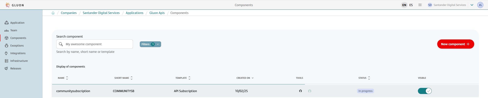

### API Subscription Template

#### Structure

The generated API Subscription component has the following structure (showing only top levels of directory structure):

``` bash
📦repository
 ┣ 📂.github
 ┃ ┣ 📂workflows
 ┃ ┗ 📜CODEOWNERS
 ┣ 📂.gluon
 ┃ ┣ 📂cd
 ┃ ┣ ┣ 📂cert
 ┃ ┣ ┣ ┗ 📜cd.yml
 ┃ ┣ ┣ 📂pre
 ┃ ┣ ┣ ┗ 📜cd.yml
 ┃ ┣ ┣ 📂pro
 ┃ ┣ ┣ ┗ 📜cd.yml
 ┣ 📂src/properties
 ┃ ┣ 📜api-subscription-config.yml
 ┃ ┣ 📜values.yml
 ┃ ┣ 📂cert
 ┃ ┃ ┗ 📜values.yml
 ┃ ┣ 📂pre
 ┃ ┃ ┗ 📜values.yml
 ┃ ┗ 📂pro
 ┃   ┗ 📜values.yml
 ┗ 📜README.md
```

### Inspect your component in your local environment

??? abstract "Cloning your repository"

    ### Cloning your repository

    Once you have the device properly configured, the first step is to clone the project locally.

    To do so, visit [**How to clone the project**](../../../application/component-management/create-component.md#cloning-a-repository).

{!
   include-markdown "./snippets/snippet-oam.md"
!}

## Component Configuration

### Branches

It's important that we have our main branch (**main** by default) from where we will make the deployments to each of our environments.

### Configuration Files

The generated configuration files (src/properties folder) already include all the necessary information for the subscription generation,
so it is not necessary to make any configuration in these files except when importing existing applications from API managers that have different client IDs in each environment.

**Important Note about Client ID Configuration:**

The environment-specific `values.yml` files (cert, pre, pro) are only used when you need to configure an existing application imported from API managers that has different client IDs in each environment.
For new key sets, the same client ID is used across all environments, and no configuration is required in these environment-specific files.

Next, the content of each file is described

#### api-subscription-config.yml

This file contains the information entered by the user in the subscription. Below is an example of a generated file:

> !IMPORTANT: This file should not be modified

``` yaml title="api-subscription-config.yml"
api-subscription:
    api-product-plan: accounts-v1-plan
    api-key-set: 234b5c84-536d-4420-9d6b-0cbdf8421c94
    api-product-component-repository: santander-group-gluon/sgt-glnapis-scopeproduct
```

#### values.yml

This file contains the parameters that the user can modify for the subscription. The included parameters are:

- **version**: Subscription version to generate the release.
- **api-product-major-version**: Major version of the product to which you are going to subscribe. The workflow will subscribe to the highest version available in the environment of the major version indicated by this property.

Below is an example of a generated file:

``` yaml title="values.yml"
  version: 1.0.0
  api-product-major-version: 1
```

#### Environment-specific values.yml files

These files are located in environment-specific folders within `src/properties/`. The exact folder names depend on your configured environments (e.g., cert, pre, pro, or any custom environment names).

For example, if your environments are cert, pre, and pro, the files would be located at:

- `src/properties/cert/values.yml`
- `src/properties/pre/values.yml`
- `src/properties/pro/values.yml`

**Important**: These files are only used when configuring existing applications imported from API managers that have different client IDs in each environment. For new key sets, these files remain empty and unused.

When needed, the content format is:

``` yaml title="cert/values.yml (example)"
api-subscription:
  api-key-set: client-id-for-cert-environment
```

``` yaml title="pre/values.yml (example)"
api-subscription:
  api-key-set: client-id-for-pre-environment
```

``` yaml title="pro/values.yml (example)"
api-subscription:
  api-key-set: client-id-for-pro-environment
```

{!
   include-markdown "./snippets/snippet-secrets.md"
!}

## API Subscription Deployment

Next, we will describe the steps needed to deploy your API Subscription across the DEV, PRE, and PRO environments.

The cycle explained below is based on **Trunk Based Development**.

### First automatic execution

When the component is created, the infrastructure identifiers are searched in the OAM where the API Product to which it is subscribed is configured, automatically creating the folders with this configuration in the path ./gluon/cd.

Once the component is created, the CI workflow will be automatically launched with the configuration obtained from the product, so that if the secrets are configured in Vault,
the CD workflow will be executed correctly and the subscription to the certification environments will be completed automatically.

**Important**: Since the subscription component deploys automatically, the client ID that will be automatically deployed in the cert environment will be the one configured in the frontend (Gluon Portal) when creating the key set.
This only applies when importing existing applications from API managers that have different client IDs per environment.

If the secrets are not in Vault, this workflow will fail and the secrets will need to be configured and the following steps will need to be taken to complete the subscription.

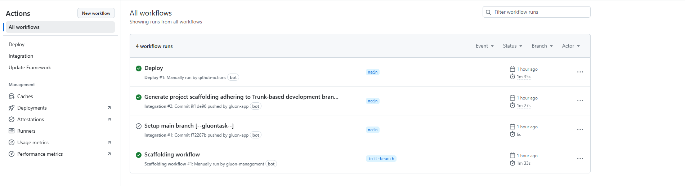

### Pull Request to Main

Firstly, once the target infrastructure is configured, a Pull Request must be made to the main branch.

### Push to Main

By approving the Pull Request of the previous step on the main branch you will generate a push event on this branch and therefore the workflow ci-tbd.yml will be executed automatically.

These are the steps that will be executed in this part of the cycle:

- **Setup environment variables**: Load the properties needed for the workflow.
- **Integration/validate version**: It obtains the version from the values.yml file and validates that it is higher than the last release of the component.
- **Deploying development**: Execute the cd workflow.
- **Publish Draft Release**: Generates a Draft Release of the deployment.

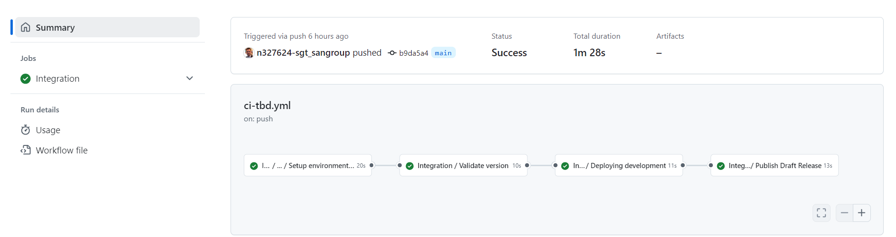

At the end of the ci-tbd.yml workflow, the cd.yml workflow is launched and it is deployed in all the certification type environments that have been configured.

These are the steps that will be executed in this part of the cycle:

- **Checking if environment or environment-type is defined**: Validate that the environment that is being executed is correctly configured in the repository, with its folder created in the .gluon path and the cd.yml file configured.
- **Setup environment variables**: Load the properties needed for the workflow.
- **Get CIs data**: Get the information of the infrastructures in which it is going to be deployed, based on the configured cd.yml files.
- **Common CD**: Create the subscription in the API Manager and, in the case of being a client, update the scopes in the Authorization Server.
  
> **IMPORTANT:** If the consumer organization (IBM) has been previously created using the short name of the technical application as the name, that consumer organization will be used.
> If there is no consumer organization it will be created during the deployment of the subscription.

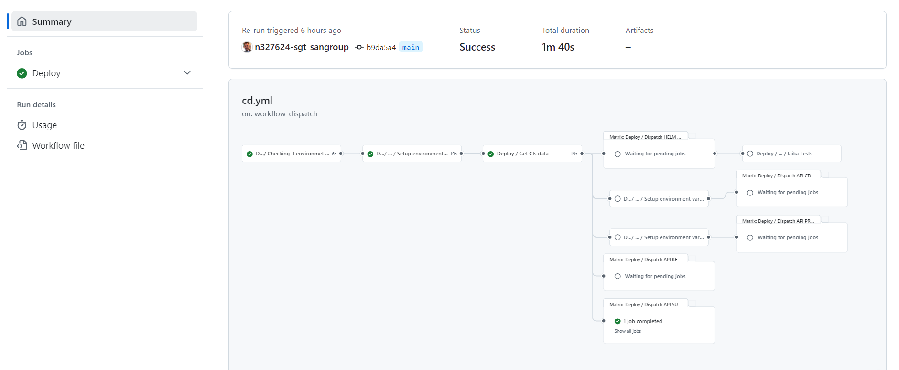

You will also be able to see in your repository that a release has been generated of the
version of your API Subscription that you want to deploy.

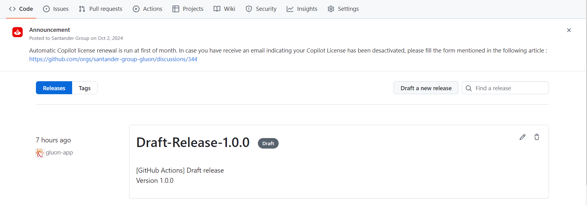

#### Subscriptions in IBM API Connect

In the case of IBM API Connect, there may be more than one major version of the API Product available. The behavior of the API Subscriptions component is to subscribe to the latest version of the
API Product of the major version configured in the values.yml file deployed in the environment.

If the owner of the API Product has deployed a new version, the following steps may occur to subscribe to the latest version:

- Subscription migration configured in the API Product and executed by the Product Owner (recommended): With this [configuration](./products.md#migration-of-subscriptions-in-ibm-api-connect),
the API Product owner will handle migrating the subscriptions to the latest version, so the consumer does not need to take any action.
- Generate a new version of the component: If the API Product Owner has not configured subscription migration, the consumer can increase the subscription version in the values.yml file and generate a new release.
In this case, if not already subscribed to the latest version, the component will generate a subscription to the latest version of the product and remove the subscription to the previous version to avoid issues.

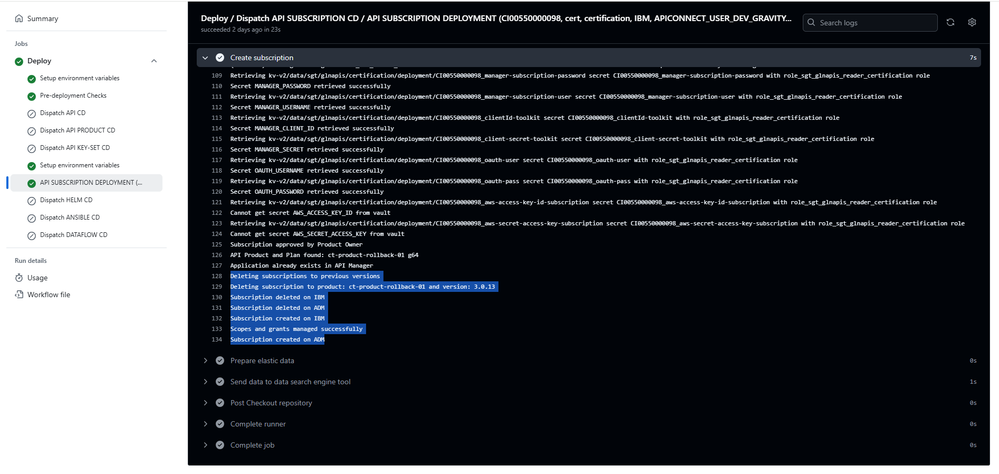

If already subscribed to the latest version, a warning message will be displayed indicating: *A subscription to the latest version of the API Product already exists: ct-product-rollback-01 3.0.16*

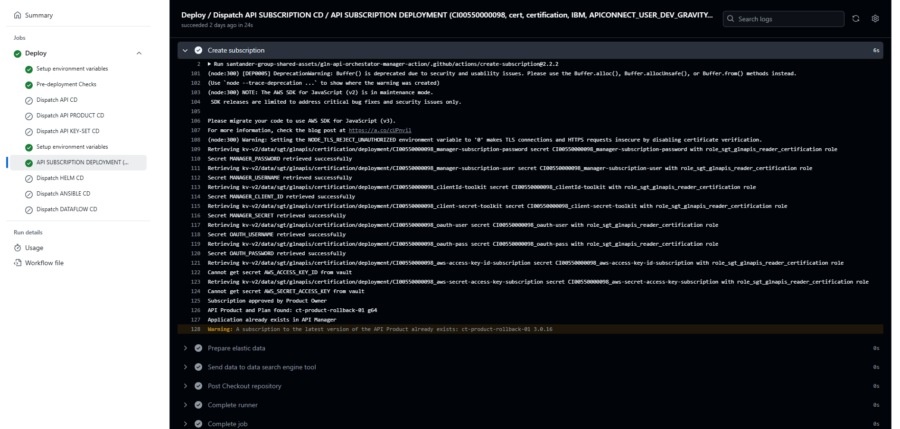

### Publish Release

To publish the Release, you access the Release generated by the ci-tbd.yml workflow, modify the name of the Release by removing Draft and publish the Release.

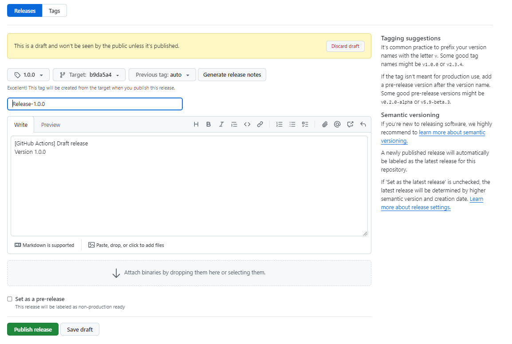

### Manual deployment to PRE/PRO

> !IMPORTANT: The method for deploying releases in PRE and PRO in Gluon is using Release Management. This method should only be used as an alternative.

The **Deploy Workflow** can be called manually to deploy to the PRE and PRO environments.

To learn how the common deployment workflow works, applicable to all technologies, you can refer to the [Common CD Workflow](../../../application/ci-cd/cd/cd-rm/cd-workflow/index.md) section of the documentation.

When publishing the Release, the release-tbd.yml workflow is launched.

These are the steps that will be executed in this part of the cycle:

- **Setup environment variables**: Load the properties needed for the workflow.
- **Upload assets to nexus**: Upload the API configuration to nexus.

> !IMPORTANT: The release workflow is available from version 7.0 of Gluon. If the component was created in an earlier version, you must [*update the component*](./../../../application/component-management/update-component.md#updating-your-component)

## API Subscription Visualization

Once the API Subscription is complete, you can consult the subscription in the Integrations -> Assets -> Key section and selest the Key Set used for the subscription:

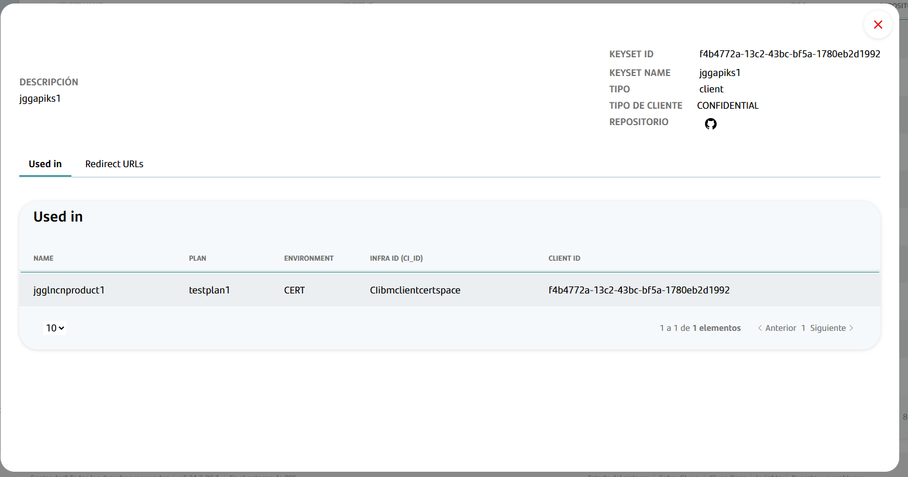
