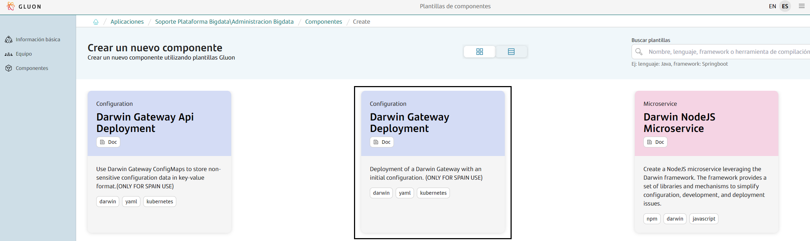
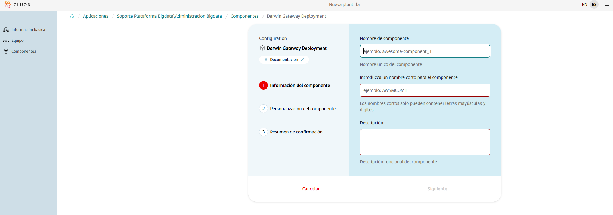
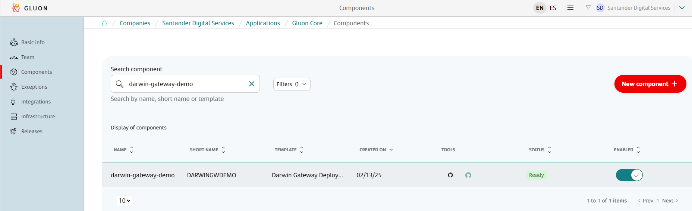
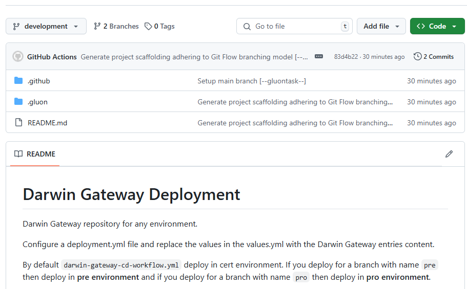

## 1. Darwin Gateway - Introduction

The purpose of this documentation is to provide a step-by-step guide on how to orchestrate the deployment of a Darwin Gateway.

???+ warning

    Darwin gateway needs a Configmap where both, the configuration and the definition of the apis can be found. Therefore, before deploying a Darwin Gateway it will be necessary to have deployed a "Api Deployment in Darwin Gateway" so, that "at start-up" it can load configurations and apis.

<br>

## Create Component

### Gluon Portal

First you have to [**onboard your application**](../../../application/application-management/index.md). Once you have your application created, you can start creating your component.

To create a component, follow the steps described in [**Component Management**](../../../application/component-management/create-component.md), searching for the component to be created.

You have to select the type of component you want to create, in this case you are going to create a **Darwin Gateway Deployment**.



The user can customize the type of component that they want to create. But for Darwin Gateway Deployment components we can't change the default characteristics:



- **Branch Strategy**: git-flow
- **Class**: deployable
- **Deployment target**: optimized-hosting-environment

Once the component is created, we will be able to see it in the component list, where we will have a direct link to the GitHub repository.

???+ remember

    The repository will be created following the [Repository Naming Convention](../../../application/component-management/create-component.md#repository-naming-convention).



We have the following links in:

| Item | Link | Role Permission |
| --- | --- | --- |
| GitHub Repository | Link to the repository created in GitHub | Developer (RW) /Technical Lead (Maintain) [All roles explained](https://docs.github.com/es/organizations/managing-user-access-to-your-organizations-repositories/managing-repository-roles/repository-roles-for-an-organization) |
| Sonar Project | Disabled | N/A |
| Fortify Project | Disabled | N/A |

<br>

### Darwin Template (Deployment of a Darwin Gateway)

#### Branches

When you create the component from the Gluon Portal, the component is created with the default values of the template from the scaffolding workflow.

- Creates a **main** branch which contains just the workflow file for the created component.
- Creates a **development** branch with an initial structure and content for an Darwin Gateway Deployment deployed using Helm Chart.



???+ info "Recommendation"

    You can create your feature branches from **development** branch.

<br>

#### Structure

The generated repository has a structure similar to the following:

``` bash
📂.github
 ┣ 📂workflows
 ┃ ┣ 📜cd.yml
 ┃ ┗ 📜update-component-workflow.yml
 ┗ 📜CODEOWNERS
📂.gluon
 ┣ 📂cd
 ┃ ┣ 📂cert
 ┃ ┃ ┣ 📜cd.yml
 ┃ ┃ ┗ 📜values-cert.yaml
 ┃ ┣ 📂pre
 ┃ ┃ ┣ 📜cd.yml
 ┃ ┃ ┗ 📜values-pre.yaml
 ┃ ┣ 📂pro
 ┃ ┃ ┣ 📜cd.yml
 ┃ ┃ ┗ 📜values-pro.yaml
 ┃ ┗ 📜values.yaml
 ┗ 📂 ci
   ┗ 📜properties.env  
📜README.md
```

### Inspect your component in your local environment

??? abstract "Cloning your repository"

    Once you have the device properly configured, the first step is to clone the project locally.

    To do so, visit [**Cloning a repository**](../../../application/component-management/create-component.md#cloning-a-repository).

## Infrastructure

{!
   include-markdown "../../snippets/infrastructure/kubernetes-configmap-secrets.md"
!}

## Configure your Component

### Branches

{!
   include-markdown "../../snippets/configuration/maven-configuration.md"
   start="<!--Start Gitflow Branches-->"
   end="<!--End Gitflow Branches-->"
!}

<br>

### Configure your repository secrets

{!
   include-markdown "../../snippets/configuration/kubernetes-secrets.md"
   start="<!--Start Github Secrets-->"
   end="<!--End Github Secrets-->"
!}

<br>

### Configuration Files

#### Continuous Deployment files

{!
   include-markdown "../../snippets/configuration/maven-configuration.md"
   start="<!--Start Deployment 2.0-->"
   end="<!--End Deployment 2.0-->"
!}

#### Helm Configuration

You must have the next files in the `.gluon/cd` folder of your project with the following structure:

``` bash
📂.gluon
┣ 📂cd
┃ ┣ 📂cert
┃ ┃ ┗ 📜values-cert.yml
┃ ┣ 📂pre
┃ ┃ ┗ 📜values-pre.yml
┃ ┣ 📂pro
┃ ┃ ┗ 📜values-pro.yml
┗ ┗ 📜values.yaml
```

Description of the files:

- **values.yaml**: Helm values file with the default values to deploy the microservice.
- **values-cert.yaml**: Helm values file with the values to deploy the microservice in the CERT environment.
- **values-pre.yaml**: Helm values file with the values to deploy the microservice in the PRE environment.
- **values-pro.yaml**: Helm values file with the values to deploy the microservice in the PRO environment.

Examples of values file:

```yaml
# Default values for Darwin Gateway Chart.
# This is a YAML-formatted file.

# Gateway name
applicationName: NameOfTheDarwinGatewayComponent

##
# Gateway Type. Mandatory
##
# gatewayweb / gatewaysys / thirdparty
gatewayType:

## @param region. Cluster identifier. Mandatory.
## Possible values: `bo1`, `bo2`, `weu1-az`, `weu2-az`, `bo1-dmz` or `bo2-dmz`, `EMPTY` (this value will render an empty string)
## The value below is not valid, it is just an example. You must set a valid value from the list above.
region:

## Active
active: online

## @section Common parameters

## @param commonLabels [object] Labels to add to all deployed objects
##
commonLabels: {}
## @param commonAnnotations [object] Annotations to add to all deployed objects
##
commonAnnotations: {}
## @param podLabels [object] Extra labels for the gateway service pods
## Ref: https://kubernetes.io/docs/concepts/overview/working-with-objects/labels/
##
podLabels: {}
## @param podAnnotations [object] Annotations for the gateway service pods
## ref: https://kubernetes.io/docs/concepts/overview/working-with-objects/annotations/
##
podAnnotations:
  rolloutTrigger: '1'

## Darwin Gateway images
## @param image registry image
##
image:
  ## Registry image version
  ## @param image.registry darwin gateway image registry
  ## For OHE:   registry.global.ccc.srvb.bo.paas.cloudcenter.corp
  ## For Azure: registry.harbor.san.pro.bo1.paas.cloudcenter.corp
  ##            registry.harbor.san.pre.bo1.paas.cloudcenter.corp
  ##            registry.harbor.san.dev.bo1.paas.cloudcenter.corp
  ##            registry.harbor.san.pre.weu.paas.cloudcenter.corp
  ##            registry.harbor.san.pro.weu.paas.cloudcenter.corp
  ## @param image.repository darwin gateway image name
  ## @param image.tag darwin gateway image tag
  ## @param image.digest darwin gateway image digest in the way sha256:aa.... Please note this parameter, if set, will override the tag
  ##
  registry:
  repository: sanes-darwin-catalog-san/gateway
  tag: 3.4.0
  digest: ""
  ## @param image.pullPolicy darwin gateway image pull policy
  ## Specify a imagePullPolicy
  ## Defaults to 'Always' if image tag is 'latest', else set to 'IfNotPresent'
  ## ref: https://kubernetes.io/docs/user-guide/images/#pre-pulling-images
  ##
  pullPolicy: IfNotPresent

## @param replicaCount Number of replicas of the gateway pod
##
replicaCount: 1

## @param lifecycle [object] Override default gateway container hooks
## If you do not set this property, the default hook is:  `{lifecycle: {preStop: {exec: {command: [sleep 120]}}}}`
##
lifecycle: {}

## @param terminationGracePeriodSeconds In seconds, time the given to the pod needs to terminate gracefully
## ref: https://kubernetes.io/docs/concepts/workloads/pods/pod/#termination-of-pods
##
terminationGracePeriodSeconds: 300

## darwin gateway pods' Security Context
## ref: https://kubernetes.io/docs/tasks/configure-pod-container/security-context/#set-the-security-context-for-a-pod
## @param podSecurityContext.enabled Enable security context for the pods
## @param podSecurityContext.fsGroup Set gateway pod's Security Context fsGroup
## e.g:
##   podSecurityContext:
##     enabled: true
##     fsGroup: 1001
##
podSecurityContext:
  enabled: false

## darwin gateway containers' Security Context
## ref: https://kubernetes.io/docs/tasks/configure-pod-container/security-context/#set-the-security-context-for-a-container
## @param containerSecurityContext.enabled Enable darwin gateway containers' Security Context
## @param containerSecurityContext.runAsUser Set darwin gateway containers' Security Context runAsUser
## @param containerSecurityContext.runAsNonRoot Set darwin gateway containers' Security Context runAsNonRoot
## @param containerSecurityContext.allowPrivilegeEscalation Force the child process to be run as nonprivilege
## e.g:
##   containerSecurityContext:
##     enabled: true
##     runAsUser: 1001
##     runAsNonRoot: true
##     allowPrivilegeEscalation: false
##
containerSecurityContext:
  enabled: false

## Configures the ports gateway listens on
## @param containerPorts.http Sets http port inside container
## @param containerPorts.https Sets https port inside container
##
containerPorts:
  http: 8080
  https: 8443

## darwin gateway containers resource requests and limits
## ref: https://kubernetes.io/docs/user-guide/compute-resources/
## @param resources.limits [object] The resources limits for the gateway container
## @param resources.requests [object] The requested resources for the gateway container
##
resources:
  ## Example:
  ## limits:
  ##    cpu: 500m
  ##    memory: 1Gi
  ##
  limits:
    memory: 1G
    cpu: 1000m
  requests:
    memory: 500M
    cpu: 200m

## @param updateStrategy.rollingUpdate deployment rolling update configuration parameters
## ref: https://kubernetes.io/docs/concepts/workloads/controllers/deployment/#strategy
## Note: Set to Recreate if you use persistent volume that cannot be mounted by more than one pods to make sure the pods is destroyed first.
## E.g:
## updateStrategy:
##  type: RollingUpdate
##  rollingUpdate:
##    maxSurge: 25%
##    maxUnavailable: 25%
##
updateStrategy:
  type: RollingUpdate
  rollingUpdate: {}

## Configure extra options for liveness probe
## ref: https://kubernetes.io/docs/tasks/configure-pod-container/configure-liveness-readiness-startup-probes/#configure-probes
## @param livenessProbe.enabled Enable livenessProbe by default /actuator/health/liveness
## @param livenessProbe.initialDelaySeconds Initial delay seconds for livenessProbe
## @param livenessProbe.periodSeconds Period seconds for livenessProbe
## @param livenessProbe.timeoutSeconds Timeout seconds for livenessProbe
## @param livenessProbe.failureThreshold Failure threshold for livenessProbe
## @param livenessProbe.successThreshold Success threshold for livenessProbe
##
livenessProbe:
  initialDelaySeconds: 60
  timeoutSeconds: 1
  periodSeconds: 10
  successThreshold: 1
  failureThreshold: 3

## Configure extra options for readiness probe
## ref: https://kubernetes.io/docs/tasks/configure-pod-container/configure-liveness-readiness-startup-probes/#configure-probes
## @param readinessProbe.enabled Enable readinessProbe, by default /actuator/health/readiness
## @param readinessProbe.initialDelaySeconds Initial delay seconds for readinessProbe
## @param readinessProbe.periodSeconds Period seconds for readinessProbe
## @param readinessProbe.timeoutSeconds Timeout seconds for readinessProbe
## @param readinessProbe.failureThreshold Failure threshold for readinessProbe
## @param readinessProbe.successThreshold Success threshold for readinessProbe
readinessProbe:
  initialDelaySeconds: 25
  timeoutSeconds: 1
  periodSeconds: 10
  successThreshold: 1
  failureThreshold: 3

## @section service configuration
##
service:
  type: ClusterIP
  ## @param service.ports.http Service HTTP port
  ## @param service.ports.https Service HTTPS port
  ##
  ports:
    http: 8080
    https: 8443
  targetPort:
    http: 8080
    https: 8443
  ## @param service.annotations [object] Additional annotations for the service of the gateway
  ##
  annotations: {}

## @section expose configuration
##
## @param expose.type Allows to create a openshift route
## @param expose.termination Route termination, default is Edge when ssl is disabled and Passthrough when ssl is enabled
expose:
  ## E.g.
  ## expose:
  ##  type: "Route"
  ##  termination: edge
  type: "Route"


## @section server TLS configuration

## TLS configuration
##
ssl:
  ## @param ssl.enabled Enable init container that generate the truststore and keystore
  ##
  enabled: false
  ## @param ssl.image.registry Init container cert-store-generation registry name
  ## @param ssl.image.repository Init container cert-store-generation image name
  ## @param ssl.image.tag Init container cert-store-generation image tag

  image:
    registry:
    repository: produban/init-certs-container
    tag: 1.0.0.RELEASE
    ## @param ssl.image.pullPolicy Init container cert-store-generation image pull policy
    ## Defaults to 'Always' if image tag is 'latest', else set to 'IfNotPresent'
    ## ref: https://kubernetes.io/docs/user-guide/images/#pre-pulling-images
    pullPolicy: IfNotPresent
  ## Init container resource requests and limits
  ## ref: https://kubernetes.io/docs/user-guide/compute-resources/
  ## If you do want to specify resources, uncomment the following
  ## lines, adjust them as necessary, and remove the curly braces after 'resources:'.
  ## @param ssl.resources.limits [object] Init container ssl- resource  limits
  ## @param ssl.resources.requests [object] Init container cert-store-generation resource requests
  ##
  resources:
    ## Example:
    ## limits:
    ##    cpu: 500m
    ##    memory: 1Gi
    ##
    limits: {}
    ## Examples:
    ## requests:
    ##    cpu: 100m
    ##    memory: 128Mi
    ##
    requests: {}
  ## @param ssl.keystorePassword Password for the keystore to create. If no value is specified, a random password is generated.
  ##
  keystorePassword: ""
  ## @param ssl.truststorePassword Password for the truststore to create. If no value is specified, a random password is generated.
  ##
  truststorePassword: ""

## @section Darwin configuration

## Darwin Framework parameters
##
darwin:
  ## @param darwin.version. Darwin Framework Version used in this gateway release.
  version: "5.5.0"
  ## @param darwin.gitRepo. Git repository with the source code of gateway release.
  gitRepo: "https://github.alm.europe.cloudcenter.corp/sanes-darwin-backend/gateway.git"
  ## @param darwin.technologyVersion. JRE version of the image used in this gateway release.
  technologyVersion: "17"
  ## @param darwin.sufix. Suffix to blue green deployments.
  ## Possible values: `""`, `-b` or `-g`
  suffix: ""
  ## @param darwin.configType Allows to set the configuration from ConfigMap or Configuration Service
  ## It indicates the location from which the configuration is retrieved.
  ## Four possible values are allowed:
  ##  - "cm" the user has to create a Kubernetes ConfigMap with the name cm-{release_name}-{chart_name}. It will be mounted.
  ##  - "secret" the user has to create a Kubernetes Secret with the name secret-{release_name}-{chart_name}. It will be mounted.
  ##  - "cm-secret" the user has to create a Kubernetes ConfigMap with name cm-{release_name}-{chart_name} and a Kubernetes Secret with name secret-{release_name}-{chart_name}. They will be mounted.
  ##  - "configserver" to use Spring Cloud Configuration Server.
  configType: cm
  ## Darwin Framework Logging parameters
  ##
  logging:
    ## @param darwin.logging.confluent When true, the logs are sent to Confluent.
    ## It configures the configmap, secret and JVM variables for kerberos.
    ## When false logs will be sent to Cloudera (legacy mode).
    ## Possible values: `true` or `false`
    confluent: true
    level:
      root: WARN
  tz: Europe/Madrid
  spring:
    profiles: dev
    cloud_config:
      failfast: true
      uri_http: http://configuration-service${darwin.suffix}:8080
      uri_https: https://configuration-service${darwin.suffix}.${PROJECT_NAME}.svc.cluster.local:8443
      username:
      password:
      retry:
        initialInterval : 3000
        maxInterval : 6000
        maxAttempts : 10
  java:
    opts_ext: "-Djava.security.egd=file:/dev/./urandom -Dfile.encoding=UTF-8 -XX:MaxJavaStackTraceDepth=128 -XX:MaxRAMPercentage=50.0 -XX:+UseParallelGC -XX:ActiveProcessorCount=2"
    parameters:
  ## @param darwin.events When true, enables events mode, allowing to send events to Confluent.
  ## It configures the configmap, secret and JVM variables for kerberos and the secret for Schema registry user and pass.
  ## When false, events filter won't be available
  ## Possible values: `true` or `false`
  events: false
  ## @param darwin.vault When true, enables Vault mode, using Vault stored keys for converting tokens.
  ## It configures the necessary environment variables for Vault.
  ## When false, vault mode won't be enabled, using STS instead.
  ## Possible values: `true` or `false`
  vault: false

## @param extraEnvVars Array with extra environment variables to add to gateway deployment
## e.g:
## extraEnvVars:
## - name: "FOO"
##   value: "bar"
```

##### File values-\[env\].yaml

In this file we define the values to be used in Darwin Gateway. The only values mandatory to define by now are:

| **Tag**         | **Description**                                                                                            |
|-----------------|------------------------------------------------------------------------------------------------------------|
| applicationName | Name of the application                                                                                    |
| gatewayType     | Type of gateway (gatewayweb / gatewaysys / thirdparty)                                                     |
| region          | Region where the gateway is deployed (`bo1`, `bo2`, `weu1-az`, `weu2-az`, `bo1-dmz` or `bo2-dmz`, `EMPTY`) |

Example:

```yaml

applicationName: sgt-darwingw-appname

##
# Gateway Type. Mandatory
##
# gatewayweb / gatewaysys / thirdparty
gatewayType: gatewayweb

## @param region. Cluster identifier. Mandatory.
## Possible values: `bo1`, `bo2`, `weu1-az`, `weu2-az`, `bo1-dmz` or `bo2-dmz`, `EMPTY` (this value will render an empty string)
## The value below is not valid, it is just an example. You must set a valid value from the list above.
region: bo1
```

???+ warning "Important"

    values.yaml applies to all environments. If you need to define different values for each environment, you must use the values file for each environment (values-cert.yaml, values-pre.yaml, values-pro.yaml).

???+ warning "Important"

    Remember, when the gateway is deployed, a number of default values are taken. You must modify the values-[env].yaml files to display the gateway with the correct values for each environment. See the [complete list of properties](https://registry.global.ccc.srvb.bo.paas.cloudcenter.corp/harbor/projects/2196/helm-charts/gateway/versions) that you can configure associated with gateway deployment.

<br>

## Build and Deploy your Darwin Gateway

We will now describe the steps you need to take to be able to deploy your Darwin Gateway through the CERT, PRE and PRO environments.

### Manual Deployment

The **Deploy Workflow** can be called manually to deploy the microservice in the target environments.

To learn how the common deployment workflow works, applicable to all technologies, you can refer to the [Common CD Workflow](../../../application/ci-cd/cd/cd-rm/cd-workflow/index.md) section of the documentation.

#### Retry a deployment execution

If the **"Container build and push"** job runs successfully and publishes the Release version, you can rerun the deployment workflow.

### Deploy using the Gluon Release Management

Gluon Release Management is a Gluon portal integration process that aims to automate the creation of
releases and tasks in Servicenow ITSM, as well as the orchestration of deployment in Github through
the portal itself.

For getting to know how to deploy using this tool,
please refer to the
[Release Management](../../../application/release-management/zero-touch/index.md)
documentation.

</br>

## 2. Api Deployment in Darwin Gateway - Introduction

To configure the Darwin Gateway, we need to create a ConfigMap component. This component will be used to deploy
the Darwin Gateway in the Kubernetes cluster. To create a Kubernetes ConfigMap, follow the steps described in
the [**ConfigMap 2.0 Kubernetes Journey**](../../configuration/kubernetes/configmaps-rm.md).

Consult the [Gateway Documentation](https://github.alm.europe.cloudcenter.corp/pages/sanes-darwin-backend/gateway/current/index.html) for all the configuration possibilities and apply the appropriate policies for the application.

???+ danger "Important: Darwin Gateway Api Deployment"

    The Darwin Gateway Api Deployment has been deprecated and is not used anymore. The new way to configure the Darwin Gateway Deployment  is through the Kubernetes ConfigMap component.
