# API Definition Flow

This document describes the process for defining new API functionality:

1. [Determine whether a new or modified API is needed](apidefinition.md#whether-a-new-or-modified-api-is-needed).
2. Create a proposal [for a new API](apidefinition.md#proposal-for-a-new-api) or [for modifying an existing API](apidefinition.md#proposal-for-modifying-an-existing-api).
3. [Send the proposal to the API Governance team for review](apidefinition.md#api-governance-proposal-review).
4. [Complete the API definition repository content](apidefinition.md#api-definition-repository).
5. [Create a pull request](apidefinition.md#pull-request).
6. [Send the pull request to the API Governance team for review](apidefinition.md#api-governance-pull-request-review).
7. [Publish the API](apidefinition.md#api-publication).

The following figure illustrates the overall API definition process.
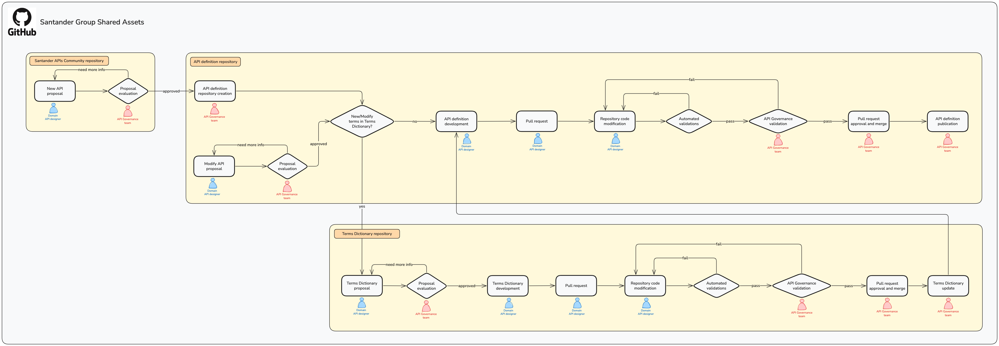

## Whether a new or modified API is needed

To implement new API functionality, the API designer must first evaluate the requirements and decide whether to create a new API or modify an existing API.

To check whether an API that meets your requirements already exists:

1. Access the API catalog [directly](https://gluon.gs.corp/gluon/api-catalog). Alternatively, you can:
    1. Go to the [Gluon Portal](https://gluon.gs.corp/gluon/) main page and open the hamburger menu on the upper-right side.
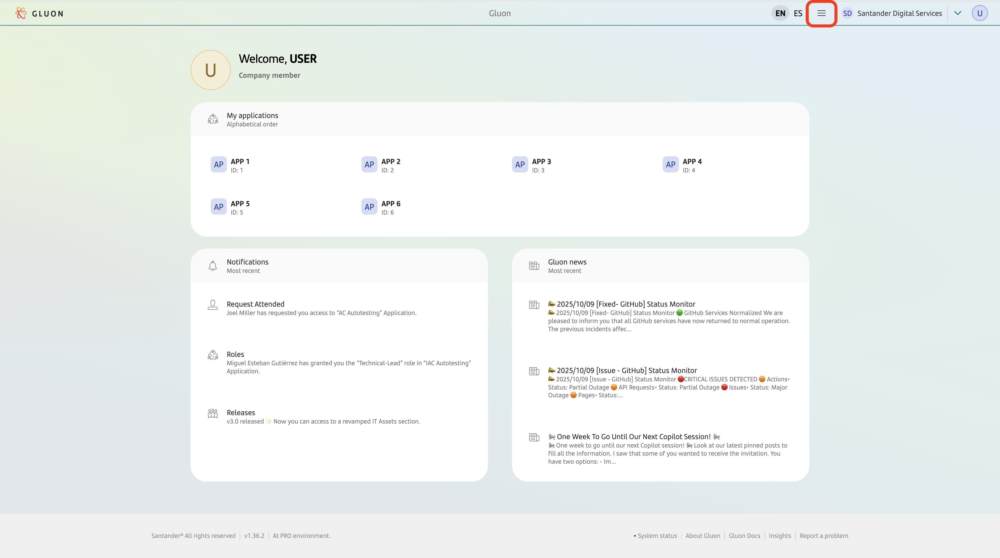
    2. Select **API definition catalog**.
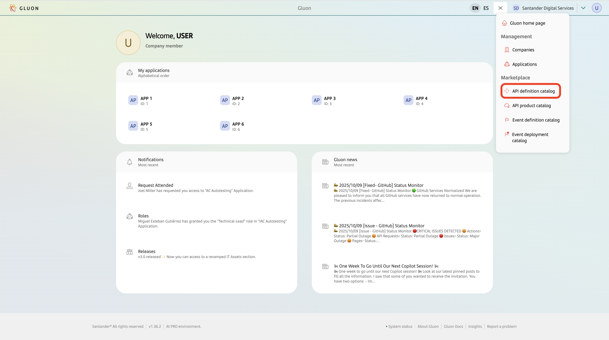
2. Review the available APIs and their functionality within the API catalog. The filters can help you to find an API. You can also download the YAML file for each API version, as needed.
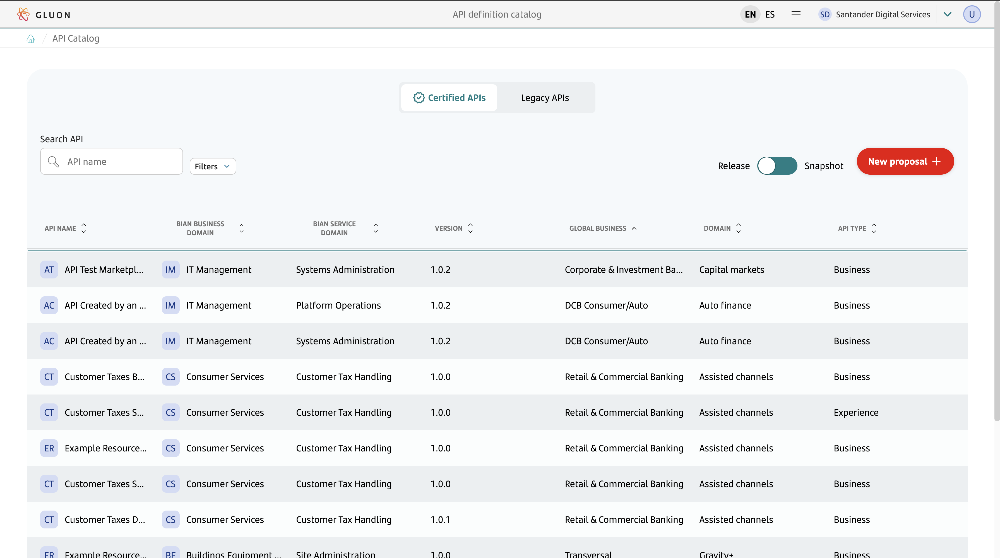
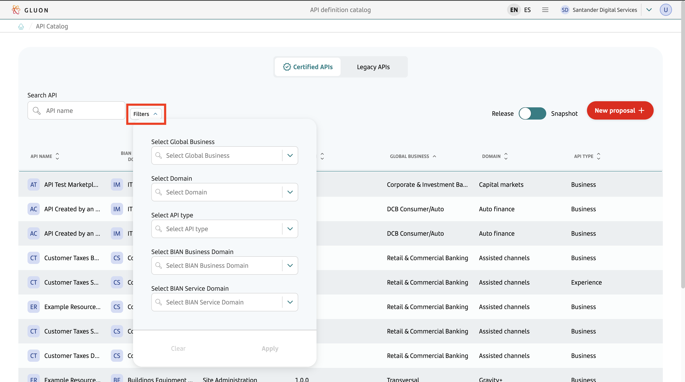
    - If there is no API that meets your requirements, [create a new API](apidefinition.md#proposal-for-a-new-api).<br>
    - If your requirements can be fulfilled through an existing API, [modify an existing API](apidefinition.md#proposal-for-modifying-an-existing-api).

## Proposal for a new API

To define a request for a new API definition and create an API proposal:

- The API designer must be onboarded in Gluon and belong to the Gluon technical application.
- The API designer must have a predefined solution design for the API.

To create an API proposal as an issue in GitHub:

1. Go to the [API catalog](https://gluon.gs.corp/gluon/api-catalog) and click **New proposal +**.
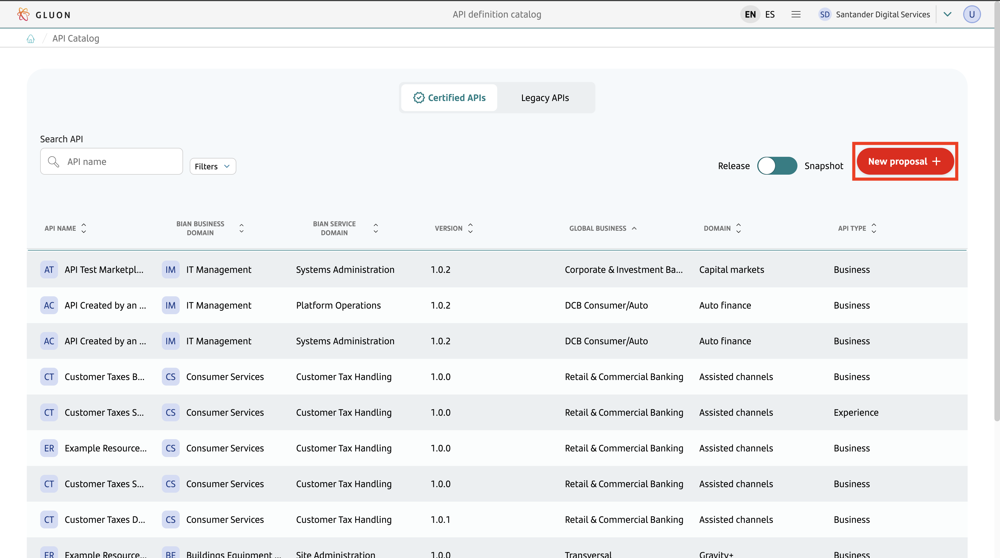
2. In the **Add a title** field, enter a title for the proposal.
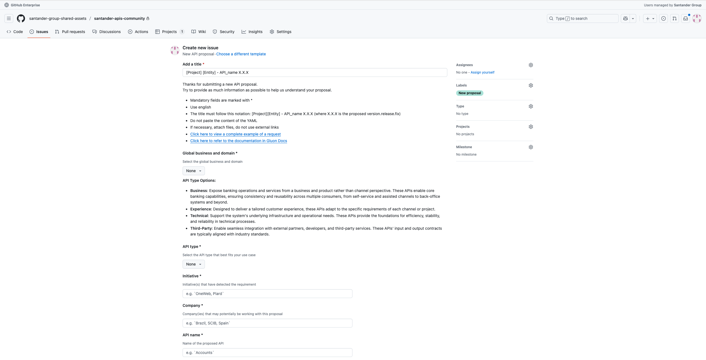
3. In the **Global business and domain** drop-down menu, select the most suitable option for the API.
The available options are defined in the [domain map](https://santandernet.sharepoint.com/sites/Santander-Now/SitePages/agile-domains.aspx), and the selected option determines to which API Governance team the new API is assigned.
4. In the **API type** drop-down menu, select the API type:
   - **Business** APIs expose banking operations and services from a business and product rather than channel perspective.
   These APIs enable core banking capabilities, ensuring consistency and reusability across multiple consumers, from self-service and assisted channels to back-office systems and beyond.
   - **Experience** APIs are designed to deliver a tailored API consumer experience. These APIs adapt to the specific requirements of each channel or project.
   - **Technical** APIs support the system's underlying infrastructure and operational needs. These APIs provide the foundations for efficiency, stability, and reliability in technical processes.
   - **Third-party** APIs enable seamless integration with external partners, developers, and third-party services. These APIs' input and output contracts are typically aligned with industry standards.
5. Enter the proposed name in the **API name** field.
6. In the **API functional description** and **API use cases** fields, define the functional description and use cases for the API.
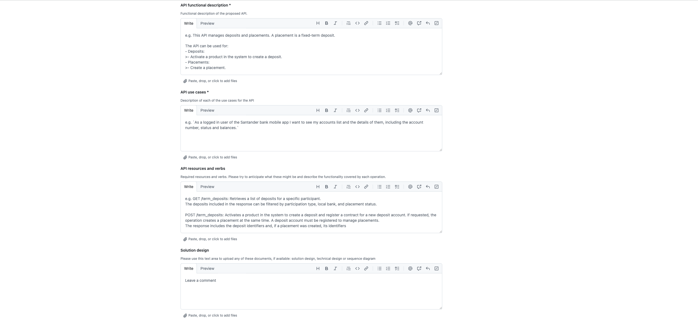

7. In the **BIAN domain** drop-down menu, select the most suitable option based on the [BIAN 11 service landscape](https://bian.org/servicelandscape-11-0-0/views/view_52926.html).

8. Fill in any other fields as needed, based on your API's requirements.<br>**Note:** You must use natural language in all fields and include sufficient detail for the API Governance team to understand the API requirements.
9. When the proposal is complete, click **Create** to submit it to the [API Governance proposal review](apidefinition.md#api-governance-proposal-review).

For an example of a completed API proposal, see [GitHub issue #1](https://github.com/santander-group-shared-assets/gln-global-head-of-apis/issues/1).

## Proposal for modifying an existing API

To create an API modification proposal in GitHub:

1. Go to the [API catalog](https://gluon.gs.corp/gluon/api-catalog) and find the API for which you want to propose a modification.

2. On the API page, click the kebab menu on the upper-right side and select **API Change Proposal**.
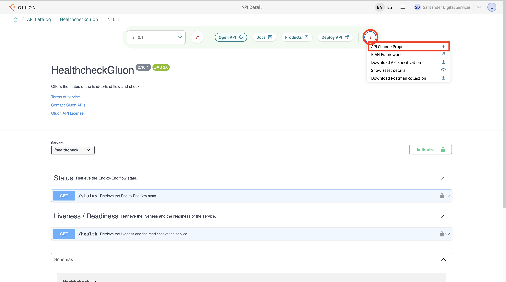
3. Fill in all fields needed for the API owner to accept the proposal. As a minimum, the functional description and details defining the scope of the change are needed.
<br>**Note:** You must use natural language in all fields and include sufficient detail for the API Governance team to understand the API requirements.
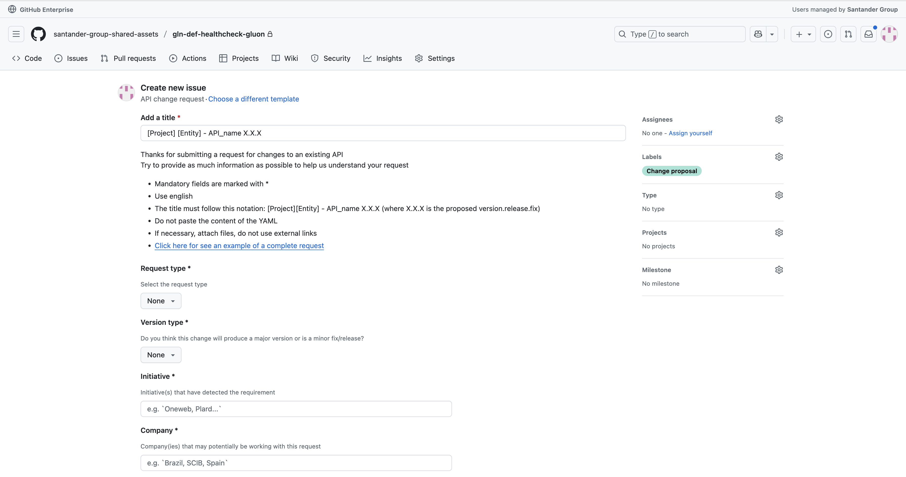
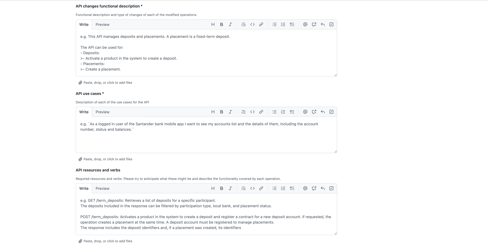
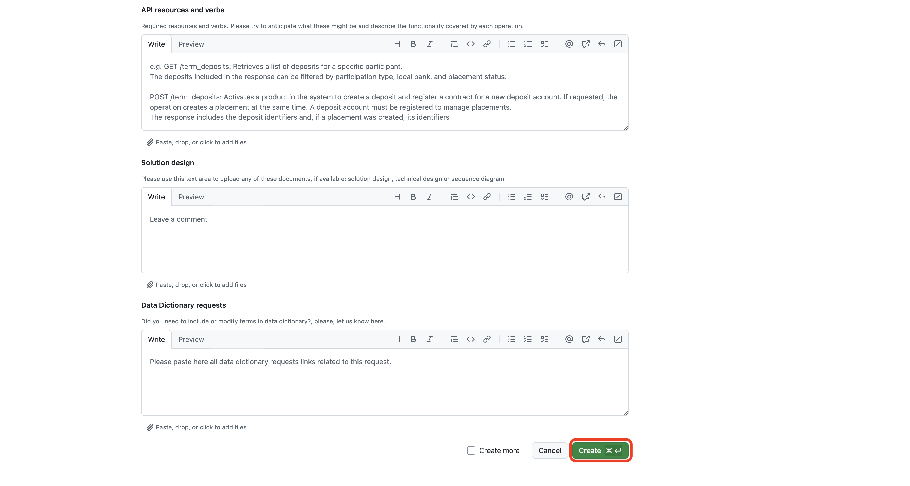
4. When the proposal is complete, click **Create** to submit it to the [API Governance proposal review](apidefinition.md#api-governance-proposal-review).

For an example of a completed API modification proposal, see [GitHub issue #2](https://github.com/santander-group-shared-assets/gln-global-head-of-apis/issues/2).

## API Governance proposal review

The API Governance team reviews the incoming API proposal based on a combination of assessment criteria, including:

- Suitability of the functionality described in the proposal
- Whether there is overlap with or an attempt to replace an existing API in the API catalog
- Input from relevant stakeholders identified by the API Governance team
- Input from the members of the API community mentioned in the proposal

API names, including endpoint paths and other related names, are reviewed by the Technical Writing team.

The API Governance team makes the final decision on whether the API proposal is approved or rejected, or if more information must be requested.

- If the proposal is approved:
  - For a new API, a new API definition repository is created for the API designer to create the API.
  - For an existing API to be modified, the API designer is granted access to the API definition repository to apply the agreed changes.
- If the proposal is rejected, the API designer must follow the API Governance team's instructions.

## API definition repository

An API definition repository has the following structure, within which the API designer defines the API:

``` bash
    my-api
    ├── README.md
    ├── catalog.yml
    ├── .github
    │   ├── ISSUE_TEMPLATE
    │       ├── request-api-changes.yml
    └── src
        ├── api-specification.yml
```

The API designer must update the repository content in a feature branch with the following steps.

### 1. Check the `catalog.yml` file

The `catalog.yml` file contains the information needed to locate the API definition within the API catalog. It has the following fields, populated automatically using the values from the new API proposal:

| Parameter | Description | Example |
|-----------|-------------|---------|
| api-type | API type | Business |
| global-business | Global business | Retail & Commercial Banking |
| domain | Domain | Assisted channels |
| bian-landscape-version | BIAN landscape version | 11 (mandatory) |
| bian-business-area | BIAN business area | Operations and Execution |
| bian-business-domain | BIAN business domain | Loans and Deposits |
| bian-service-domain | BIAN service domain | Current Account |

Check the values. If any discrepancies are found, the file must be reviewed in the [pull request](apidefinition.md#pull-request) stage.

### 2. Complete the `src/api-specification.yml` file

The API designer must complete the OAS3 definition in the `src/api-specification.yml` file.

Once the OAS3 definition has been completed, make a [pull request](apidefinition.md#pull-request).

???+ warning "API definition validations"

    Depending on the selected API type (Business, Experience, Technical, or Third-party), the validations that are performed automatically in the pull request can block the pull request merge.

To avoid problems with the pull request merge, manually check the following validations:

- [Standards & Patterns](../standards/std-general.md). To execute the Spectral rules locally on any computer, follow [this guide](../tech-components/tools/spectral.md).
- [Dictionary of Terms](../tech-components/tools/terms-dictionary.md). To validate file in the Data Dictionary, follow [these steps](../tech-components/tools/terms-dictionary.md):
  - If the validation returns an error, review if the impacted fields are necessary in the API and check if there are similar fields already defined in the dictionary.
  - To add terms to the dictionary, open [an issue](../tech-components/tools/terms-dictionary.md#how-to-update-the-dictionary).

### 3. Update the `README.md` file

The `README.md` file contains the information that is shown in the **Docs** section in the API catalog.

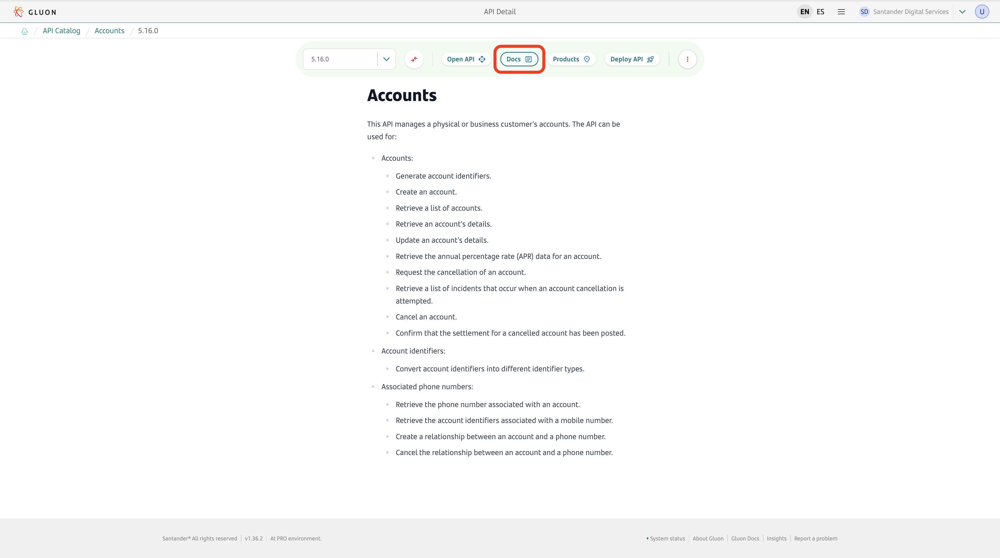

Update the file to include the API description from the `api-specification.yml` file, obeying the markdown format rules.

Example:

``` md
# API Example

This API is an example.

The API can be used for:
- Tag 1:
  - Operation 1
  - Operation 2
- Tag 2:
  - Operation 3
```

## Pull request

After the API definition repository content has been checked, the API designer creates a pull request:

1. Create a new branch, using **main** as the base branch.
2. Make the necessary modifications and open the pull request.<br>A link to the approved issue from which the change originated must be included.
3. When a pull request is opened for the first time, some automated tasks are triggered.<br>Verify that the results of the following validations (triggered by each commit) are OK before submitting the pull request to the [API governance pull request review](apidefinition.md#api-governance-pull-request-review):

    - Catalog validation
    - Standards & Patterns validation
    - Dictionary of Terms validation

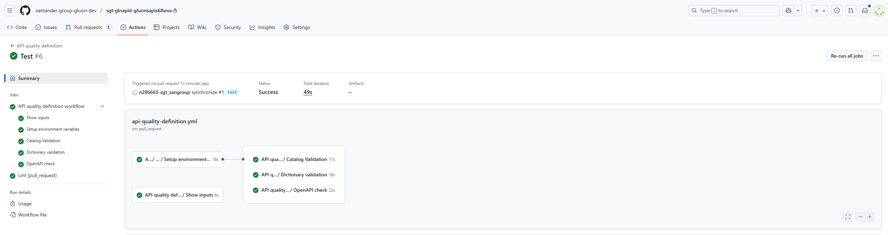

### Catalog validation

This validation checks that the following values in the `catalog.yml` file are correct:

- BIAN cataloguing
- API type
- Global business and domain

Click **Catalog Validation** to see the catalog validation results.

| Validation OK | Validation KO |
|---|---|
| 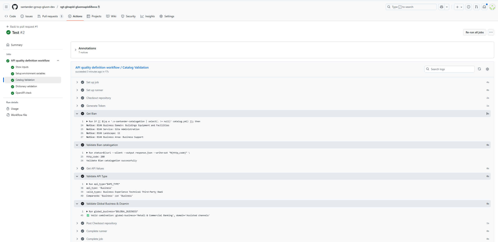 | 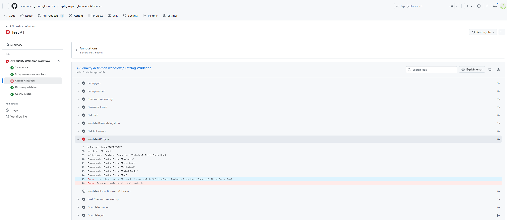 |

### Standards & Patterns validation

Click **OpenAPI check** to see the Standards & Patterns (Spectral) validation results.

| Validation OK | Validation KO |
|---|---|
| 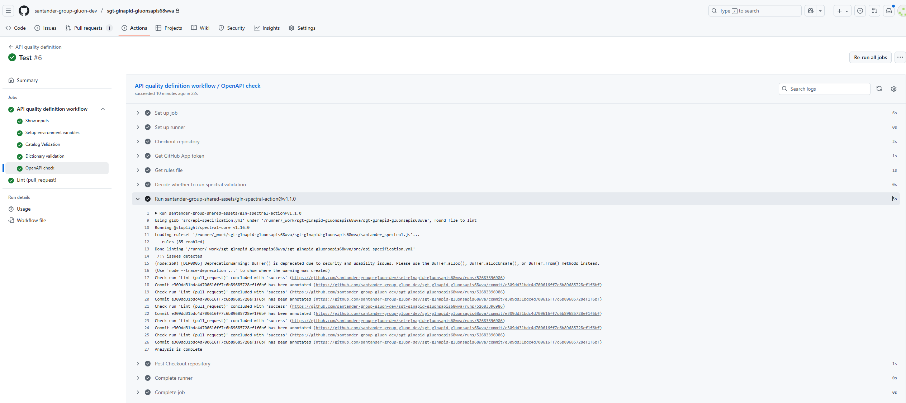 | 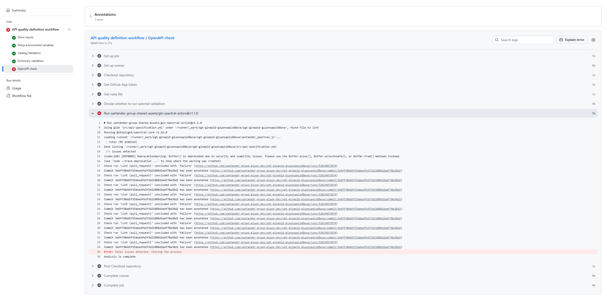 |

Click **Lint (pull_request)** to review the complete Spectral report.
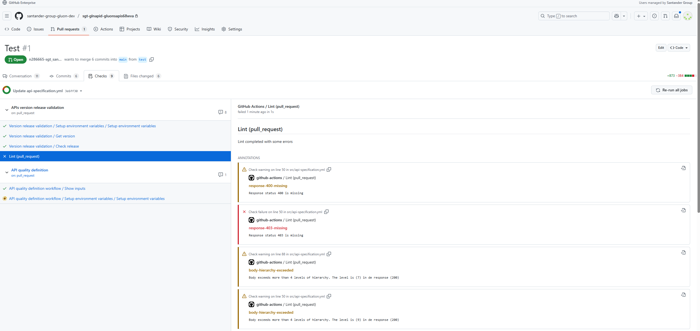

???+ warning "Spectral validation"

    The final validation result is a pass or a fail, where a fail result occurs only if the validation returns an error. The validation result can be a pass and still contain warnings. It is strongly recommended to always review the complete Spectral report and check any possible warnings.

### Dictionary of Terms validation

Click **Dictionary validation** to see the Data Dictionary validation results.

| Validation OK | Validation KO |
|---|---|
| 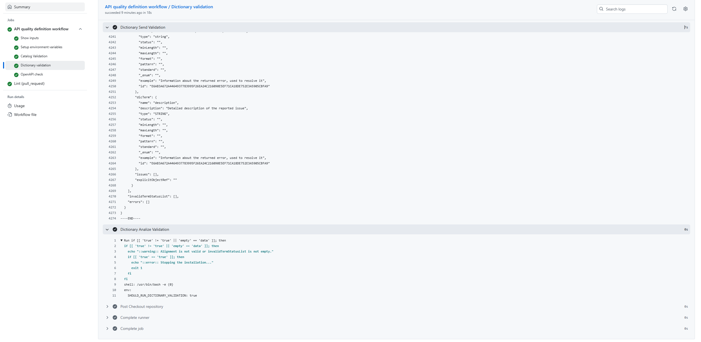 | 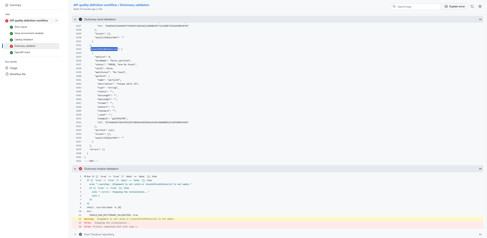 |

The validation result is returned in the JSON format, which can be difficult to read. Use the [Terms Dictionary API Validator](https://gluon.gs.corp/gluon/data-platform/terms-dictionary/validator) for a more user-friendly representation of the result.

### Skip dictionary of terms and/or spectral

Depending on the API type, spectral and dictionary of terms validations are carried away.

| API type | Dictionary of terms | Spectral |
|----------|---------------------|----------|
| Business | true | true |
| Experience | true | true |
| Technical | false | true |
| Third-Party | false | false |

However, there are two models to modify these values, using common organization variables to an entire domain or repository by repository.

???+ warning "Skip validations"

    These two models can only be applied by the technical leads of each domain. API Designers cannot execute them under any circumstances.

#### Organization variables (to apply to all definitions in a global business)

At the organization level there are two variables by global business, which allow to execute or not validations of the dictionary of terms and of the rules of spectral. These variables have the following name:

- `APIS_SKIP_DICTIONARY_VALIDATION_<GLOBAL_BUSINESS>`
- `APIS_SKIP_SPECTRAL_VALIDATION_<GLOBAL_BUSINESS>`

If activated, they allow the control for which the flag has been activated to not be executed.

#### Repository variable (only for one definition)

If the technical lead of your domain wants to change the validations of a specific definition, a workflow can be used in the following repository:

- [gln-apis-repository-variables](https://github.com/santander-group-shared-assets/gln-apis-repository-variables), from which repository variables can be configured to skip one or both validations.

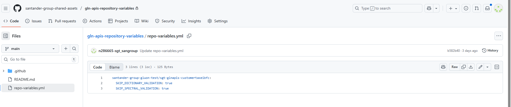

In the repo-variables.yml the repository name has to be configured along with the two variables  SKIP_DICTIONARY_VALIDATION and SKIP_SPECTRAL_VALIDATION with the correct values. After that, there are two workflows to be executed.

First of all, "Validate repo-variables.yml structure" to check that the repository and variables name are correctly filled, and afterwards "Update variables in repositories" to execute the changes in the variables value.

## API Governance pull request review

The API Governance team reviews the final pull request:

1. The API Governance team reviews the pull request, including checks to ensure the validation results are OK and that the proposed API definition aligns with what was agreed in the related issue.
<br>If any problems are identified, changes are requested from the API designer.
2. When the API Governance team is satisfied with the API definition, the YAML file is sent to the Technical Writing team for review and validation.<br>If any problems are identified, changes are requested from the API designer.
3. When the Technical Writing team is satisfied with the API definition, the final YAML file is sent to the API designer.
4. The API definition file in the pull request is updated using the YAML file received from the Technical Writing team.

## API publication

The API Governance team publishes the API:

1. The API Governance team approves and merges the pull request into the **main** branch.
2. After a period of time, the API definition is published in the [API catalog](https://gluon.gs.corp/gluon/api-catalog).
3. The API Governance team sends a notification when the API definition is published.
