# API Legacy Deployment flow

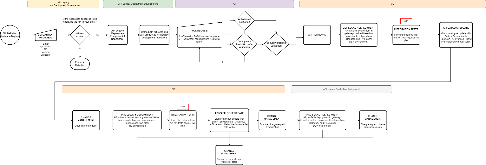

???+ warning

    Api Legacy Deployment supports API Connect V10 , with the relation 1 Product - 1 Service/gateway - 1 API. 
    For Apigee OPDK, the restriction is 1 API Product - 1 Environment - 1 API Proxy

<!--Start Create Component-->
### Create a new API Legacy deployment component

To customize an API Legacy deployment component, there are some additional settings that are needed to be done before creating the component.

#### Selecting the API Legacy definition

Some API definition data is necessary to create the API Legacy deployment component. This data is available in Gluon API catalog.


Once in the Catalog, select the API Legacy from which the entity wants to develop.
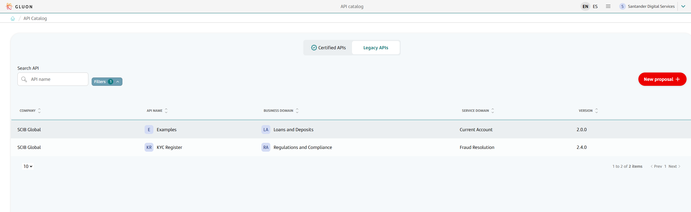

Then click the deployment button "Deploy Api".
???+ important

    The image shown in the documentation may not match the rendering on the front end for screens related to the API definition view. However, the functionalities offered by this view remain unchanged.
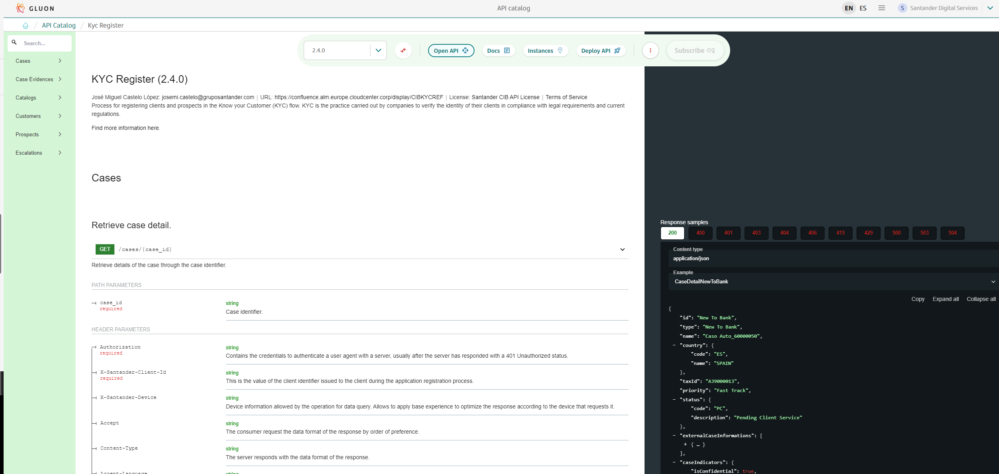

Then select the technical application
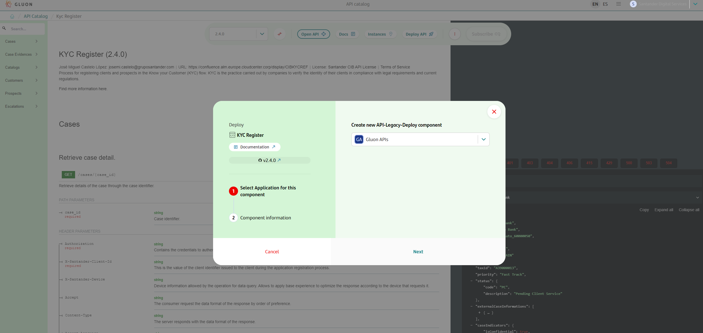

Afterwards you have to create the API Legacy deployment component

The component and short name components are mandatory in order to have the API deployment repository.
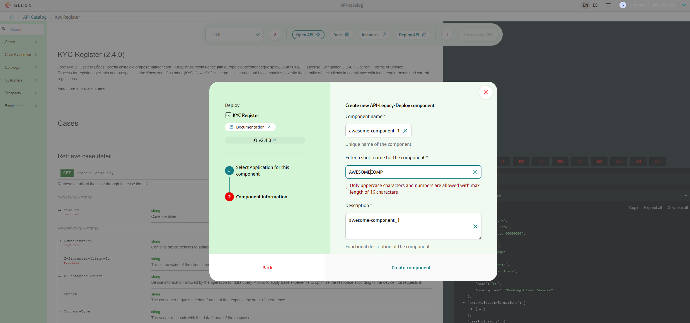

Once all the fields have been filled, press the button "Create a component".
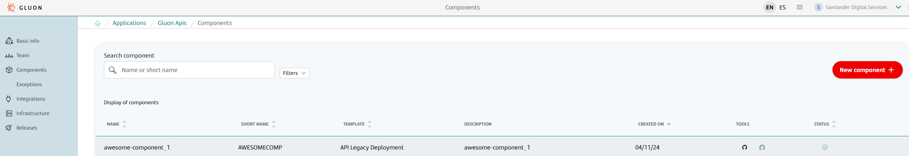

At this point, the API deployment repository has been created and it is available for the development team. When a repository is generated it will be in the default ‘development’ branch as we follow the TBD branching strategy.

<!--End Create Component-->
## API Legacy Deployment Development

### Naming convention

The repository created will have this [naming convention](../../../../../application/component-management/create-component.md#repository-naming-convention)

### Repository configuration

The deployment repository available will have this [structure](../tech-components/archetypes/api-legacy.md).

> NOTE: The deployment repository does not contain the API Legacy definition (yaml file). The API Legacy definition is referenced in api-spec.json file.

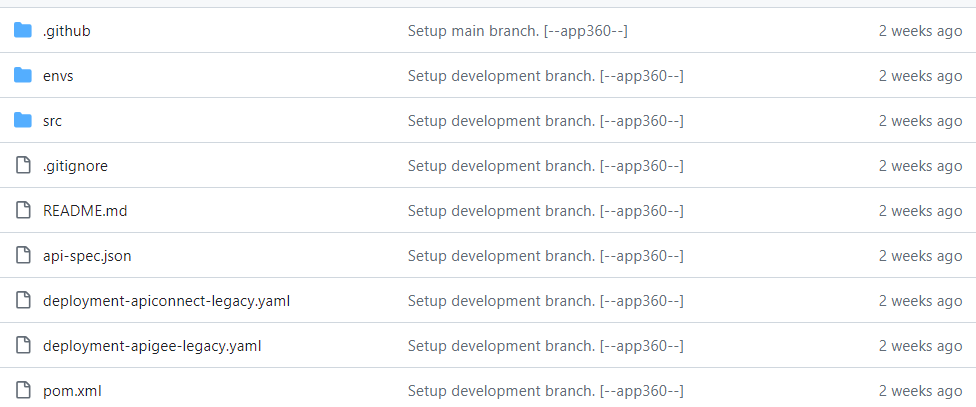

### Configuration files in the deployment repository

To configure the deployment repository to deploy the API, follow the steps below to populate some files. **Please do not modify other files not indicated in the following steps.**

#### Steps 1 and 2, Common files for deployment

##### **Step 1. - api-spec.json file**

<!--api-spec-start-->

 `api-spec.json` file contains the the values of "Show asset details" in the API Catalog. This file is common to all platforms and the values are as follows:

>IMPORTANT
>**api-spec.json is generated with the creation of component and should not be modified**

``` json
{
    "api-spec": "https://github.com/${ORG}/${repo}/blob/${ref}/${path}",
    "api-spec-raw": "https://raw.githubusercontent.com/${ORG}/${repo}/${ref}/${path}",
    "org": "${ORG}",
    "repo": "${repo}",
    "path": "${path}",
    "ref": "${ref}",
    "X-Santander-Country": "${country}",
    "asset": {
        "id": "${asset-id}",
        "version": "${asset-version}"
    }
}
```

| Parameter | Description | Example |
|-----------|-------------|---------|
| api-spec | URL complete of the github repository where the API definition is stored | <https://github.com/santander-group-gluon-test/api-definition-demo-signatures/blob/1.0.0/src/api-specification.yml> |
| api-spec-raw | Raw URL complete of the github repository where the API definition is stored | <https://raw.githubusercontent.com/santander-group-gluon-test/api-definition-demo-signatures/1.0.0/src/api-specification.yml> |
| org | GitHub organization of the API definition repository | santander-group-gluon-test |
| repo | Name of API definition repository | api-definition-demo-signatures |
| path | Path of the yaml file in the API definition repository | src/api-specification.yml |
| ref | Branch of the API definition repository | 1.0.0 |
| asset-id | Id of the asset of the API in marketplace | 13 |
| asset-version | Version of the asset of the API in the marketplace | 9 |
| X-Santander-Country | Deprecated field. It will be removed in a future Gluon release.| - |
<br>

Example of `api-spec.json` file with the values based on "Show asset details" in the API Catalog.

``` json
{
    "api-spec": "https://github.com/santander-group-shared-assets/gln-def-healthcheck-gluon/blob/refs/tags/2.0.0/src/api-specification.yml",
    "api-spec-raw": "https://raw.githubusercontent.com/santander-group-shared-assets/gln-def-gluon-pilot-test13/refs/tags/2.0.0/src/api-specification.yml",
    "org": "santander-group-shared-assets",
    "repo": "gln-def-healthcheck-gluon",
    "path": "src/api-specification.yml",
    "ref": "main",
    "X-Santander-Country": "scib",
    "asset": {
        "id": "83",
        "version": "86"
    }
}
```

<br>

<!--api-spec-end-->
##### **Step 2. - properties.env file**

API platform where the API will be deployed (IBM or Apigee).

<!--properties.env-start-->

`envs/properties.env` contains the API Manager where API will be deployed. The values can be "apiconnect" or "apigee" and must be added in a variable called **API_PLATFORM**.

In case of that you want to deploy in **IBM** the value of **ARCHETYPE_DIRECTORY** should be be the route of api connect archetype directory folder.

In case of that you want to deploy in **apigee** the value of **ARCHETYPE_DIRECTORY** should be the route of apigee archetype directory folder.

See an example:

APIConnect Example:

``` bash
API_PLATFORM='apiconnect'
ARCHETYPE_DIRECTORY="src/ibm-v10"
```

APIGee Example:

``` bash
API_PLATFORM='apigee'
ARCHETYPE_DIRECTORY="src/apigee"
```

<br>

#### Step  3. - Deployment IBM or Apigee files

Fill in the files according to whether the API is to be deployed in IBM or Apigee.

Depending on where the API is deployed, some files have to be modified in the Apigee or IBM folders of the repository.

- [3.1. Files needed to deploy on IBM API Connect v10](#31-fill-ibm-api-connect-v10-files-in-github-repository)

- [3.2. Files needed to deploy on Apigee OPDK](#32-files-needed-to-deploy-on-apigee-opdk)

<!--properties.env-end-->
##### **3.1. Fill IBM API Connect v10 files in GitHub repository**

All files for IBM API Connect v10 are within of `src/ibm-v10` folder.

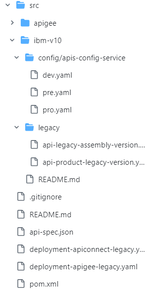

###### Inventory

Please, check the inventory before filling the deployment yaml files.

The inventory is a repository which keeps all the possible combinations that can be used in a deployment per entity. [Inventory by Entity Repository](https://github.com/santander-group-gluon/gln-apiconnect-inventory/)
There you can find the **default values** for the deployment, some of this values can be modified in deployment-apiconnect.yaml replacing the values established in the inventory.

Inside the inventory repository in the [entity]/group_vars/[entity]_api.yml file:

| Parameter | Description |
|-----------|-------------|
| profiles | Specifies the profiles of the deployment allowed in the entity, it also specifies the sequence of policies |
| policies | Specifies the policies of the deployment allowed in the entity, it also specifies the version of the policy |
| default_plans | Specifies the default_plans configured in the entity, they are configured in the deployment if it is not specified other in the deployment-apiconnect.yaml |
| default_visibility | Specifies the default_visibility configured in the entity, they are configured in the deployment if it is not specified other in the deployment-apiconnect.yaml |
| gateways | Specifies the gateways configured in the entity by environment, the parameter needed in the deployment-apiconnect.yaml is the name of the gateway |

For the Api Legacy deployment it is only needed to onboard the managers & gateways in the inventory. The inventory values do not interfere with the configuration of the API assembly deployment.
On this occasion, the definition of the profiles in the inventory does not interfere in order to deploy one assembly or another (which will be local to each entity).

###### deployment-apiconnect-legacy.yaml file

<!--deployment-apiconnect-start-->

The `deployment-apiconnect-legacy.yaml` file has the configuration to deploy APIs in IBM API Connect v10.
**For each of the environments that appear in the file (cert, pre and pro) the secrets in the section must be configured at the repository level: extraSecretParams**

<!--secrets-apiconnect-start-->

The secrets showed below must be created in the GitHub at the repository level. To register a secret in a repository and that it can be consumed from workflows, it is necessary to follow the following steps.

  In order to carry out the operation admin permissions in the repository are required.

  Then click on the Settings tab, to the Secrets -> Actions menu and click over New repository secret.

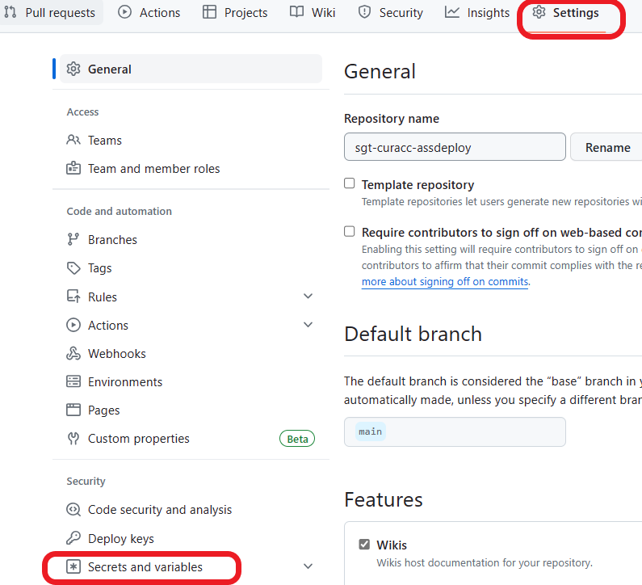
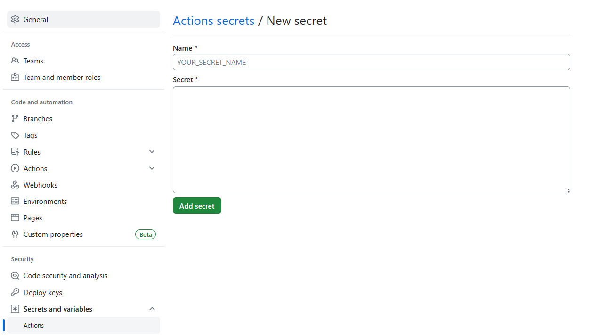
<br>
The secret name must match the value to the right of the colon (:) for example: APICONNECT_USER_DEV, APICONNECT_USER_DEV_PASS. The value must correspond to the description in the table below.

``` yaml
    extraSecretParams:
      api_connect_user: APICONNECT_USER_DEV
      api_connect_password: APICONNECT_USER_DEV_PASS
      datapower_user: DATAPOWER_USER_DEV
      datapower_password: DATAPOWER_USER_DEV_PASS
```

|Secret | Description |
|-----------|-------------|
| APICONNECT_USER_DEV | This secret represents the username for an API Connect user in a development environment. It is likely used for authentication and access control purposes within an API Connect platform |
| APICONNECT_USER_DEV_PASS | This secret corresponds to the password for the API Connect user mentioned above. It is used for authentication when accessing the API Connect platform in a development environment |
| DATAPOWER_USER_DEV | This secret represents the username for a DataPower user in a development environment. DataPower is an appliance used for secure integration and optimization of various types of traffic. The username is likely used for authentication and access control purposes within the DataPower appliance |
| DATAPOWER_USER_DEV_PASS | This secret corresponds to the password for the DataPower user mentioned above. It is used for authentication when accessing and managing the DataPower appliance in a development environment |
> NOTE: In the previous example, the necessary secrets for the development environment are showed, if it is pre-production or production environment it must be "DEV" replaced by "PRE" and "PRO" respectively in all of them
<!--secrets-apiconnect-end-->
On the other hand, it is necessary to configure all the deployment data that comes under the apiConfigDeploy tag (this would be an example for the certification environment):

``` yaml
    apiConfigDeploy:
      deploy:
        apiVersion: v3
        deployments:
          - name: region1
            infrastructureId: apicDeploy
            organization: scib
            catalog: gluon-apic
            space:  gluon-apic
            service: intranet-client
```

| Parameter | Description | Example |
|-----------|-------------|---------|
| name | Specifies the name of the deployment | region1 |
| infrastructureId | Specifies the ID of the infrastructure being used for the deployment | apicDeploy |
| organization |  Specifies the organization associated with the deployment | GLUON |
| catalog | Specifies the catalog associated with the deployment | gluon-apic |
| space | **optional** Specifies the space in which it is being deployed, **if the space is not used leave the value empty** | gluon-apic |
| service | Specifies the service being deployed | intranet-client |

<br>

A complete example of what the `deployment-apiconnect-legacy.yaml` file looks like for the certification environment is showed below. For the rest of the environments it would be copy and paste modifying the data explained in the previous section.

``` yaml
environments:
  - name: cert
    playbook: pb-gluon-api-connect-devops.yml
    inventoryGit: santander-group-gluon/gln-apiconnect-inventory
    inventoryGitBranch: develop
    inventory: ${ENTITY}/inventory
    git: santander-group-shared-assets/gln-apiconnect-deploy-ansible-scripts
    gitBranch: development
    ansibleDebug: true
    extraParams:
      component_name: ${API_NAME}
      env: ${ENVIRONMENT}
      config_service_path: ${APICONNECT_CONFIG_SERVICE_PATH}
      api_name: ${API_ASSEMBLY_FILE_NAME}
      product_name: ${API_PRODUCT_FILE_NAME}
    extraSecretParams:
      api_connect_user: APICONNECT_USER_DEV
      api_connect_password: APICONNECT_USER_DEV_PASS
      datapower_user: DATAPOWER_USER_DEV
      datapower_password: DATAPOWER_USER_DEV_PASS
    apiConfigDeploy:
      deploy:
        apiVersion: v3
        deployments:
          - name: region1
            infrastructureId: apicDeploy
            organization: scib
            catalog: gluon-apic
            space:  gluon-apic
            service: intranet-client
```

<!--deployment-apiconnect-end-->

###### apis-config-service folder

<!--config-service-start-->

In `src/ibm-v10/config/apis-config-service` route are stored the environment files configuration.

It will be needed for each environment to indicate the properties to be used by the policies at runtime. This file shall be loaded into the gateway. Fill dev.yaml, pre.yaml and pro.yaml files with the values for each environment.

All environments have to be identified, and their values defined in:

- envs/properties.env
- deployment-apiconnect-legacy.yaml

If you do not define all the environments with their values, it will be an error. Because when the merge is done to main it is deployed to dev and generates a draft release that when published goes to pre and pro.

An example of a `dev.yaml` file:

``` yaml
apiConfig:
  target-url: https://target-url
  audience: audience
```

<!--config-service-end-->

###### legacy folder

You need to put api assembly and api product yaml generated from the entity local CI in the legacy folder. Please review the following image as an example:

- Api-legacy-assembly-version.yaml: upload both the definition and the assembly for the IBM API Connect case.
- Api-product-legaci-version.yaml: the product yaml is uploaded, with reference to the API assembly.

<br>
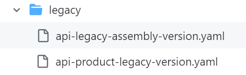

##### 3.2. Files needed to deploy on Apigee OPDK

  - **Step 3.2** - **Apigee OPDK** files to fill:
    - apigee-properties folder with KVMs for mutable values by environment and/or target servers files.
    - deployment-apigee.yaml
    - properties.env to adapt security profile.

<!--deployment-apige-start-->

> NOTE: This folder structure only will be complete if the API is going to be deployed in APIGEE OPDK.

It is necessary to prepare the folders structure to deploy the KVMs and TargetServers properly.

In the `apigee-properties` folder structure follow the next steps. This folder contains for each environment a the short name of the environment. Values allowed: cert, pre and pro.

1. Create folders within of each environment with the names of the gateways or apigee environments ("*environment*" folders have to be renamed to the actual Apigee environments.). Examples: internet, intranet,...
2. Add for each gateway or apigee environment folders kvms.json and/or target-server.json. (Review the kvm/target sections to know what values ​​are filled in each file, and its restrictions.)
3. Make sure that APIGEE_PROPERTIES_PATH property on *apigee-deployment* file is enabled and it has the correct path to the environment (CERT/PRE/PRO) to be used. For example, for cert  environment a valid value is "apigee-properties/cert".
In the APIGEE_ENVIRONMENTS property, it is defined which gateway the API is going to be deployed (e.g. internet) and the kvm file. For more details about apigee-deployment file, see the "deployment-apigee-legacy.yaml file" section.

An example of `apigee-properties` folder structure:

``` bash
apigee-properties
├── cert
|    ├──environment
│         └── kvms.json
│         └── target-server.json
├── pre
|    ├──environment
│         └── kvms.json
│         └── target-server.json
├── pro
|    ├──environment
│         └── kvms.json
│         └── target-server.json
```

<!--If you want to use a different deployment environment, for example 'sandbox', define a folder with the name "sandbox"-->

###### legacy folder

You need to put api bundle zip and api product yaml generated from the entity local CI in the legacy folder. Please review the following image as an example:
<br>
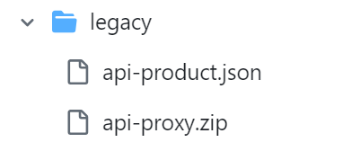

###### Fill KVM files

A KVM in Apigee contains values that the API will use in some policies.

The kvm.json file should be a list of key value (name-value) pairs in Json format.

The directory "apigee-properties" will be used to establish those values ​​that change through environments (CERT/PRE/PRO), also for a certain apigee environment (Intranet, internet, sandbox). Further considerations for this kvm file:

- It is json format, key-valued map.
- If it is necessary to include a json as a valuespecial characters such as "{" must be escaped. (Check the example)

Example of apigee-properties/cert/environment/kvms.json :

``` json
{
  "entry": [
        {
            "name": "targetUrl",
            "value": "targetUrl-value-here"
        },
        {
            "name": "cosac-config",
            "value": "{\"data\":{\"GET\/accounts\":{\"cosacUrl\":\"cosac-host\/cosac-service\",\"customer\":{\"header\":\"X-Customer-ID\"},\"contracts\":{\"body\":\"$.contracts[*].contractId\"}},\"GET\/accounts\/{account-id}\":{\"cosacUrl\":\"cosac-host\/cosac-service\",\"customer\":{\"header\":\"X-Customer-ID\"},\"contracts\":{\"body\":\"contracts.contractIds\"}},\"GET\/accounts\/{accounts-id}\/balances\":{\"cosacUrl\":\"cosac-host\/cosac-service\",\"customer\":{\"path\":\"customer-id\"},\"contracts\":{\"query\":\"contract-ids\"}}}}"
        },
        {
            "name": "api-client-id",
            "value": "apiclientidvaluehere"
        }
  ],
  "name": "ConfigProxy_<apiName>"
}
```

*name field: normally including the name of the api as the one referenced from the policy that accesses the KVM (by default the KVM-Configuration.xml policy), which usually has the following prefix ConfigProxy_ or CP_.

Once both files are configured, at compilation time these values are concatenated to the list defined in the "entry" element of the template that will be generated and stored in Nexus before the deployment process in Apigee.

Please note therefore that the final values ​​have the following behavior when performing the operation on the kvm through the management api:

- If the KVM doesn't exist it will be created. If exists, the entries will be updated.
- If the KVM exists, but the entry doesn't, it will be created.
- If the KVM exists, and the entry exists too, the value will be updated.

###### Fill target servers files

> Note: this solution is only used by Brazil entity. Other entities should not include and create this file anywhere because it may cause errors in the deployment. Remove these files in the repository if you does not need.

[TargetServers](https://cloud.google.com/apigee/docs/api-platform/deploy/load-balancing-across-backend-servers) decouple concrete endpoint URLs from TargetEndpoint configurations.
Instead of defining a concrete URL in the configuration, one or more named TargetServers can be configured. Then, each TargetServer is referenced by name in a TargetEndpoint HTTPConnection.

For each environment there are several folders (cert, pre and pro). In each one, there have to be created as much folders as gateways in which the API has to be deployed.

Example of target-server.json file. "host" value has to be changed to the actual targetUrl for each environment and gateway when the API is deployed.

``` json
[
  {
"host": "<write_your_targetUrl>",
"isEnabled": true,
"name": ${'"'}ts-$PROXY_NAME${'"'},
"port": 443,
"sSLInfo": {
  "ciphers": [],
  "clientAuthEnabled": "false",
  "enabled": "true",
  "ignoreValidationErrors": false,
  "protocols": []
      }
  }
]
```

An example of `apigee-properties` folder structure if target servers are included *(if these files are not necessary please include them like an empty file)*:

``` bash
apigee-properties
├── cert
|    ├──environment
│         └── kvms.json
│         └── target-server.json
├── pre
|    ├──environment
│         └── kvms.json
│         └── target-server.json
├── pro
|    ├──environment
│         └── kvms.json
│         └── target-server.json
```

###### deployment-apigee-legacy.yaml file

The `deployment-apigee-legacy.yaml` file has the configuration to deploy APIs in Apigee OPDK.

In the *deployment-apigee-legacy.yaml* file the environment where deploy the API will be indicated. First, go to the name of the environment (cert, pre or pro) and modify the "APIGEE_ENVIRONMENTS" value.

See an example of an API that it will be deployed in cert environment and intranet apigee environment:

``` yaml
  - name: cert
    HOST_MNG: https://xxxxxxxxxx.dev.corp
    APIGEE_ORG: xxxxxxxxxx
    API_BAAS_USER: APIGEE_USER_CERT
    API_BAAS_PWD: APIGEE_PWD_CERT
    APIGEE_ENVIRONMENTS:
      - intranet
```

HOST_MNG: API manager for deployment services in Apigee.

APIGEE_ORG: Organization in Apigee to deploy API

APIGEE_ENVIRONMENTS: Environment where to deploy API

API_BAAS_USER and API_BAAS_PWD: The name of the secrets that contains credentials for the API manager. Each environment will have its own secrets associated.

|Secret | Description |
|-----------|-------------|
| APIGEE_USER_CERT | This secret represents the username for an Apigee in a development environment.|
| APIGEE_PWD_CERT | This secret corresponds to the password for the Apigee user mentioned above.|

> NOTE: Currently, the deployment is done in a single apigee environment, it is not a simultaneous process of deploying APIs to multiple apigee environments.
> If it is necessary to deploy the API to another apigee environment, the value in this file must be changed. Only one apigee environment is allowed.

## Pull request

A complete example of what the `deployment-apigee-legacy.yaml` file looks like for the cert is showed below, pre and pro environment.

``` yaml

environments:
  - name: cert
    HOST_MNG: https://api-management.sgtech.dev.corp
    APIGEE_ORG: spain
    API_BAAS_USER: APIGEE_USER_CERT
    API_BAAS_PWD: APIGEE_PWD_DEV
    APIGEE_ENVIRONMENTS:
      - intranet
  - name: pre
    HOST_MNG: https://api-management.sgtech.pre.corp
    APIGEE_ORG: spain
    API_BAAS_USER: APIGEE_USER_PRE
    API_BAAS_PWD: APIGEE_PWD_PRE
    APIGEE_ENVIRONMENTS:
      - intranet
  - name: pro
    HOST_MNG: https://api-management.sgtech.pro.corp
    APIGEE_ORG: spain
    API_BAAS_USER: APIGEE_USER_PRO
    API_BAAS_PWD: APIGEE_PWD_PRO
    APIGEE_ENVIRONMENTS:
      - intranet

```

<!--deployment-apige-end-->

<br>

<!--pull-request-start-->
#### Pull Request

The last step is to create a pull request to merge the data from "feature/name-branch" to "main" branch and then the process will start.

Steps:
Go to the pull request section and click on new pull request

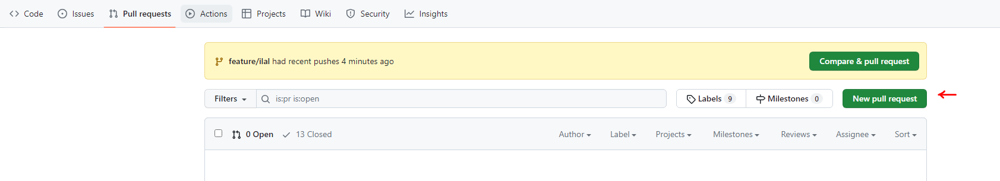

Select the branch created with the changes (in the image is *feature/ilal*) to the *main* branch and create the pull request.

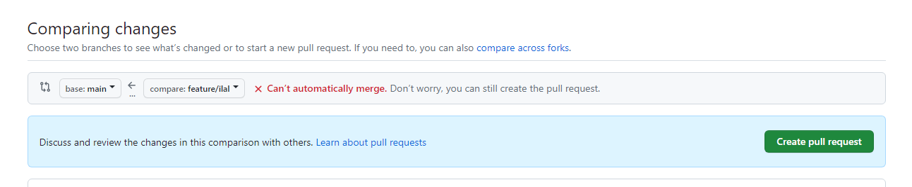

When the pull request is created the deployment process is started.

Follow the [steps to do the pull request](../../../../../application/ci-cd/technologies/apis/deployment/apis-cd-index.md).

A workflow will automatically execute the rest of the steps of the deployment flow. If error occurred, they will be notified in order to correct them.
<!--pull-request-end-->
