# Upload APIs legacy to Gluon Catalog flow

Procedure to migrate and upload the APIs legacy to Gluon catalog.

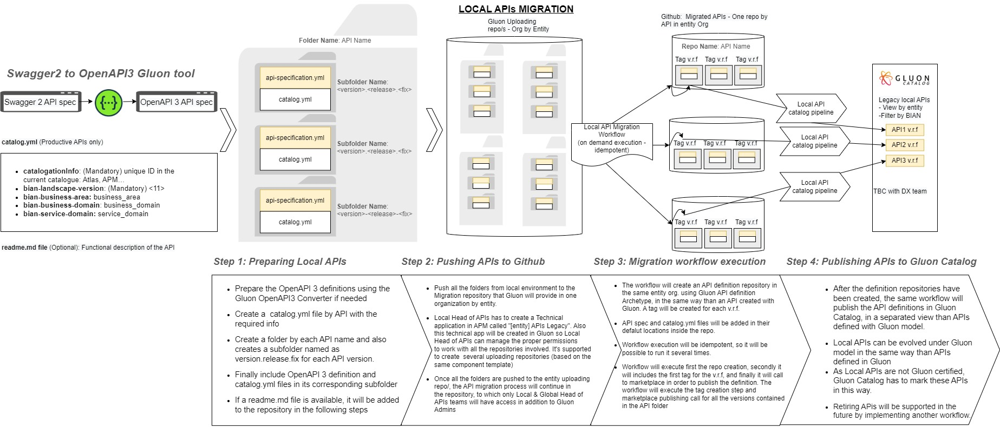

## Step 1: preparing local APIs

Prepare in a local environment the APIs legacy following the next steps.

#### 1. Create folders structure

Create a folder by each API name and also creates a subfolder named as "version.release.fix" for each API version. Each folder will have two files: catalog.yml and api-specification.yaml.

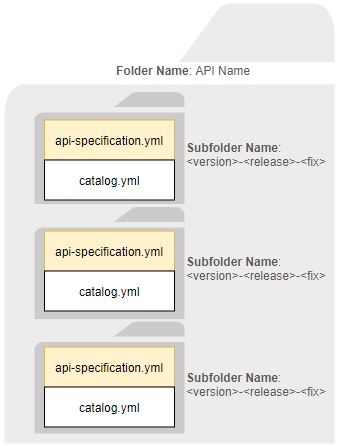

    Folder: API name 1
      ├── Subfolder: 1.0.0
        ├── catalog.yml
        ├── api-specification.yml
      ├── Subfolder: 1.0.1
        ├── catalog.yml
        ├── api-specification.yml
      ├── Subfolder: 2.0.0
        ├── catalog.yml
        ├── api-specification.yml

    Folder: API name 2
      ├── Subfolder: 1.0.0
        ├── catalog.yml
        ├── api-specification.yml
      ├── Subfolder: 1.0.1
        ├── catalog.yml
        ├── api-specification.yml

#### Naming convention

- **API folders names**: the current API name of the APIs (Example: API name 1)
- **Subfolders names**: "version.release.fix" (Example: 1.0.0)

See an example of a folder structure in this [repository of example](https://github.com/santander-group-gluon-test/gln-apis-legacy-repo-test)

#### 2. Fill catalog.yaml file

Fill the `catalog.yml` file by API and "version.release.fix" with the required info (only productive APIs). **All fields are mandatories**.

| Parameter | Description | Example |
|-----------|-------------|---------|
| catalogationInfo | Unique ID of the API in the current catalogue in the entity: Atlas, APM…| *12345*|
| bian-landscape-version | BIAN landscape version| *11* (mandatory value)|
| bian-business-area | BIAN business area | *Operations and Execution* |
| bian-business-domain | BIAN business domain| *Loans and Deposits* |
| bian-service-domain | BIAN service domain| *Current Account* |

> Find more information about how to complete the correct BIAN values [here](https://bian.org/servicelandscape-11-0-0/views/view_52926.html) **It is mandatory to fill correctly all BIAN values**

Example of `catalog.yml` file (replace all values except *"bian-landscape-version"* because it must to be "11"):

```yaml
catalogationInfo: 12345
bian-landscape-version: 11
bian-business-area: Operations and Execution
bian-business-domain: Loans and Deposits
bian-service-domain: Current Account
```

#### 3. Add OpenAPI3 files

Include OpenAPI3 definition file by API and "version.release.fix" in the folders structure.

#### 4. Include README.md file (optional)

If a `readme.md` file is available, it will be added to the repository with the functional description of the API.

#### 5. Requirements for runners

You must have a group of runners reserved for migration before using it with the label "**api-legacy-migrator**".

## Step 2: publishing APIs to github

### Pre-requirements

The **local head of APIs (LHA)** must do some previous work before starting the
migration process. This previous work, we call it *prerequisite*, will consist
of creating a **repository** in the entity GitHub organization from
[this template](https://github.com/santander-group-shared-assets/gln-apis-migration-legacy-template)
and setting up the **technical application** to bind the APIs to.

#### 1. Create a technical application

Functional architect or other responsible of the entity has to create in APM a
technical application where all APIs legacy will be allocated in Gluon.

Once technical application is created, LHA will assign this technical
application to the company in Gluon. The technical application will be unique
by company or entity.

Also this technical app will be created in Gluon so LHA can manage the proper
permissions to work with all the repositories involved. It's supported to
create several uploading repositories (based on the same component template).

#### 2. Create a GitHub repository from a template

To create a new repository based on a template, access the template URL, select
the *Use this template* button and then choose the option
*Create a new repository* as shown in the screenshot:

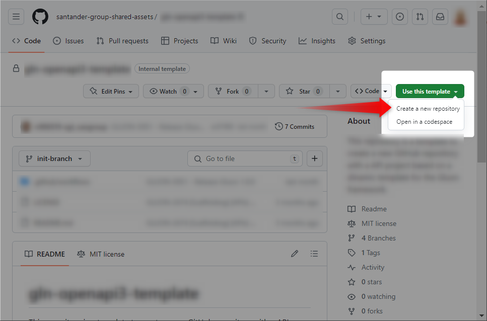

In the next screen, you must fulfill the new repository parameters.

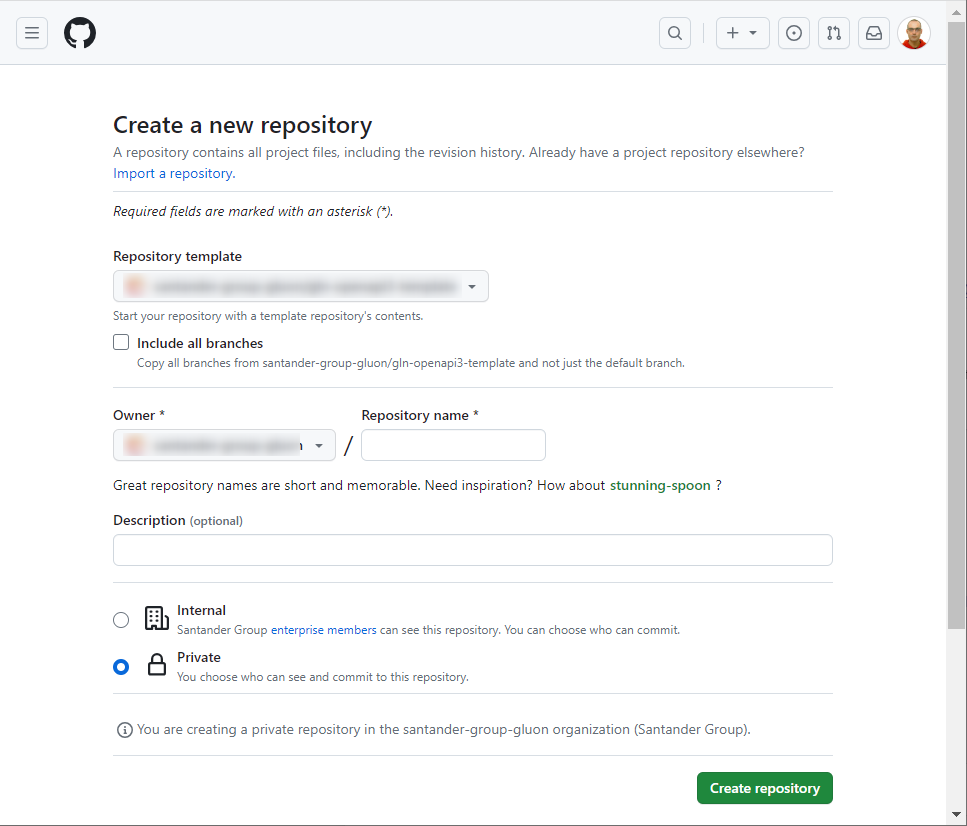

The first one is the source *Repository template*, which, if you've previously
clicked in *Use this template*, should have the right template selected. It is
unnecessary to check the *Include all branches* option.

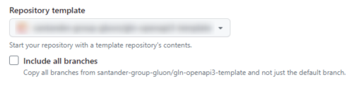

In the *Owner* selection combo, you must select the GitHub organization you
belong to or want to create the repository. You have to be able to create the
repository in the target organization, so you need permissions for that. (If
you don't have permission, you can contact your organization admin and invite
him to do the steps described here). It's mandatory to write down the
*Repository name* according to your organization's naming convention. The *Description field* is free to use, and you can write anything you want.

**Repository naming convention**
Depending of the APIs catalogation in entity there are two use cases:

- All APIs Legacy (<=256) are cataloged under the same technical application code: the repository name must be **entity-api-legacy**
- All APIs Legacy (>256) are cataloged under the same technical application code:
  1. The first repository name must be **entity1_256-api-legacy**
  2. The second repository name must be **entity256_512-api-legacy**
  3. And the rest of repository name following this sequential nomenclature until your last API upload. **The process only allows to upload 256 APIs for each repository.**
- Each API Legacy is cataloged under different technical application code: the repository name must be **entity_apmCode-api-legacy**. Example: `tot_0089462-api-legacy`

If the user exceeds the limit of 256 APIs for each repository, the workflow will fail and this error is returned in the workflow log.

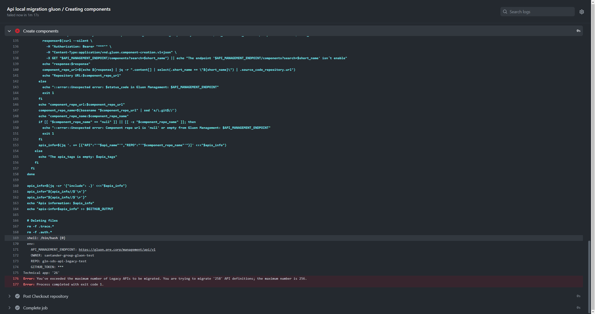

To obtain the 'entity' value:

- Deep into your Gluon Company and see the details in Gluon Portal.

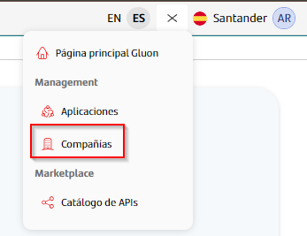

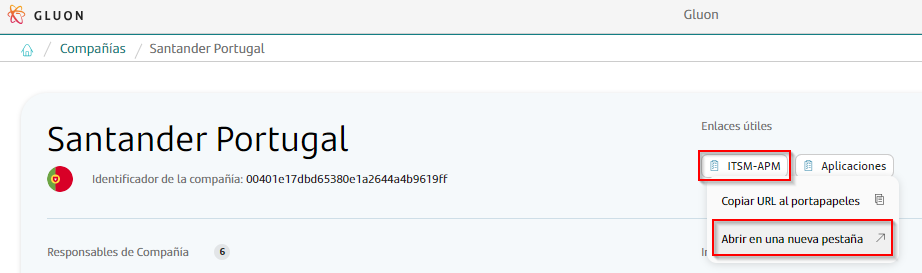

- Open the company information in Service Now in a new tab and your entity value is the Client Code.

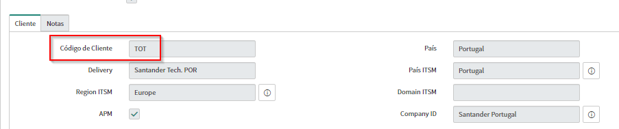

The next step is to select the repository's visibility. You can select between
[private and internal](https://docs.github.com/en/enterprise-cloud@latest/repositories/creating-and-managing-repositories/about-repositories#about-repository-visibility).

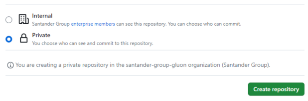

By clicking the *Create repository* button, the creation process will start,
and you will be redirected to your new repository homepage. The repository
created includes by default, a sample API folder to assist in creating and
organising the repository.

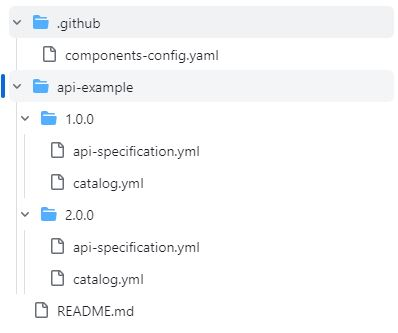

##### 2.1. Branching strategy

Once the repository is created, you must know how to work with it. The most
important aspect is the branch strategy it is supposed to use. We recommend
keeping a main branch protected and only writable using
[pull request](https://docs.github.com/en/enterprise-cloud@latest/pull-requests/collaborating-with-pull-requests/proposing-changes-to-your-work-with-pull-requests/about-pull-requests)
processes from other working branches:

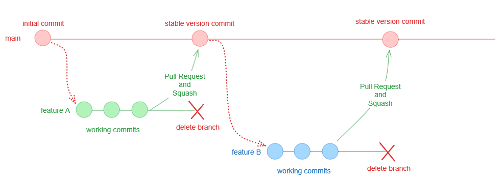

The diagram shows the initial status after the repository creation with the
*main* branch with an initial commit. You must create a new working branch,
usually called *feature name*, and start working there. Once all the work is
ready to be released, you have to create a *Pull Request* from the *feature*
branch into the *main* branch. When reviewed and approved, click on the "Squash
and merge" option in the pull request form to create a new commit with all the
working commits so you can keep a clean *main_ branch history.*

##### 2.2. Github repository Teams configuration

Check the Gluon application alias in Gluon Portal

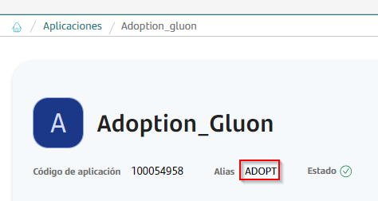

- Deep into the Github repository 'Settings' - Teams - Add teams (button) and search by the application alias.
- Select and add the group ending with 'alias'_DEV with 'Maintain' permission
- Select and add the group ending with 'alias'_TL with 'Write' permission

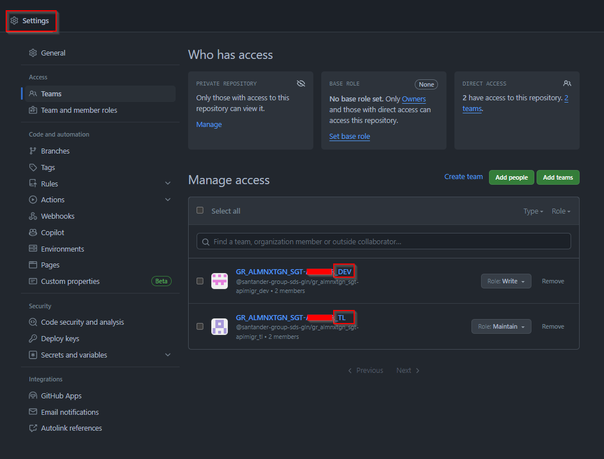

It configuration allows all the application members in Gluon modify the repository.

#### 3. Delete the APIs example folder

The API Legacy Upload procedure creates one API Legacy component when the workflow is executed. To avoid upload the example API to the Gluon portal. **The user must delete this directory with the example API**, which is only informative.

#### 4. Workflow and configuration insertion

Your first working commit would consist of **inserting the workflow** in charge
of the migration process and creating the configuration file needed by the
workflow to create the API components in Gluon to migrate. As described in the
previous section, you must create a working branch and copy the workflow,
available [here](https://github.com/santander-group-shared-assets/gln-user-reusable-workflows/blob/main/apis/api-local-migration.yml), under the path
*.github/workflows/*. This is an example of a root folder:

    ├── .github
    │   ├── workflows
    │   │   └── api-local-migration.yml
    │   └── components-config.yaml
    ├── api-example/1.0.0
    │   ├── api-specification.yml
    │   └── catalog.yml
    ├── envs
    │   └── properties.env
    └── README.md

In the root folder, it's possible also to have `envs/properties.env` file
with the **MAX_PARALLEL_JOBS** property - responsible to set the maximum
number of parallel jobs.
├── envs
│   └── properties.env

Inside the .env file:
**MAX_PARALLEL_JOBS=3**

In case this value is empty, the workflow is going to use the value
configured in the workflow file .github/workflows/api-local-migration.yml.

After that, create the configuration file
`.github/components-config.yaml` and fill it with the **technical application**
and the **Gluon application id** values.

- **Technical application**: was obtained in the creation of the application.
- **Gluon application id**: this value is needed for the workflow to relate the
  repository with the GitHub organization and then can send the entity value to
  the catalog. It can be retrieved following these steps:

  1. Go to [Gluon](https://gluon.gs.corp/gluon/applications) in Applications section.
  2. Search and select your application. *(Example: Account Settlement and Statements)*
      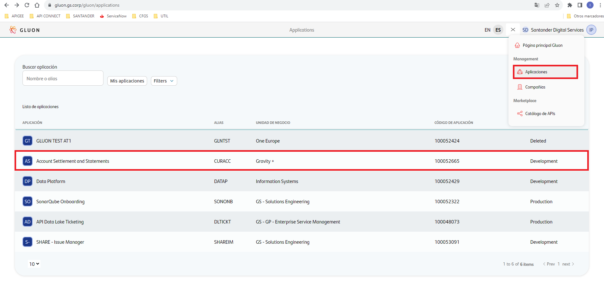
  3. Copy the internal ID number of gluon application from the URL of the browser. *(Example: 23)*
      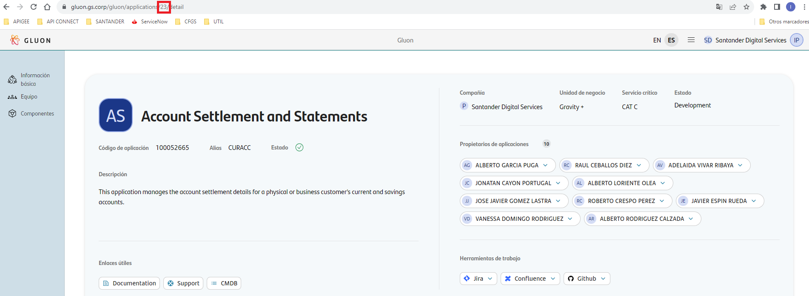

Example of `.github/components-config.yml` file (these values are examples, replace them with your correct values):

```yaml
technical-app: 100048000
id-gluon-app: 23
```

Once the file is complete and the workflow copied in your working branch,
[commit your changes](https://www.atlassian.com/git/tutorials/saving-changes/git-commit) and [push them to the remote](https://www.atlassian.com/git/tutorials/syncing/git-push) git repository called GitHub.

### Upload APIs to GitHub repository

Once the *prerequisites* were done, all folders, subfolders and files will be pushed to the repository. The API migration process will continue in the repository,
to which only Local & Global Head of APIs teams will have access in addition to
Gluon Admins.

From here, a workflow will be executed in order to create the repositories in
the same entity org like as the same way that an API created with Gluon. Once
repositories are created the same workflow will upload the API in the catalog
with a specific category or label "legacy".

> **The APIs uploading process has a maximum limit of 256 APIs for each repository.** If new folders or subfolders are added, the workflow will only update these
folders and subfolders. In case a current folder or subfolder is updated in the
repository, the workflow will check if exists and will not run because these
versions are already in the catalog.

## Step 3: migration workflow execution

> A workflow will automatically execute this step.

The workflow will create an API definition repository in the same entity organization using Gluon API definition Archetype, in the same way than an API created with Gluon. A tag will be created for each v.r.f.

### Naming convention

The naming convention of the new repositories for each API

- **Repository name**: it will be composed of the word "legacy" and the API name in *lower-kebab-case*. (Example: legacy-api-name-1)

API specification and catalog.yml files will be added in their default locations inside the repository.

### Workflow execution

Workflow execution will be idempotent, so it will be possible to run it several times (it will execute every time when there is a push in main branch).

Workflow tasks are the following:

1. Create a repository for each API.
2. Create a tag for each v.r.f subfolder in the API folder.
3. Check spectral and dictionary of terms (it will not block API publishing).
4. Call to marketplace in order to publish the API definition. The workflow will execute the tag creation step and marketplace publishing call for all the subfolders contained in the API folder.

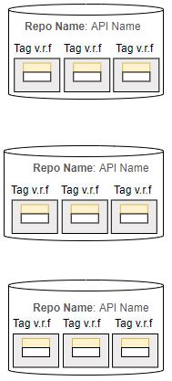

Example of API legacy repositories created:

    Repository: legacy-api-name-1
      ├── Tag: 1.0.0
        ├── catalog.yml
        ├── api-specification.yml
      ├── Tag: 1.0.1
        ├── catalog.yml
        ├── api-specification.yml
      ├── Tag: 2.0.0
        ├── catalog.yml
        ├── api-specification.yml

    Repository: legacy-api-name-2
      ├── Tag: 1.0.0
        ├── catalog.yml
        ├── api-specification.yml
      ├── Tag: 1.0.1
        ├── catalog.yml
        ├── api-specification.yml

## Step 4: publishing APIs to Gluon catalog

> A workflow will automatically execute this step.

After the definition repositories have been created, the same workflow will publish the API definitions in Gluon Catalog, in a separated view than APIs defined with Gluon model.

Local APIs can be evolved under Gluon model in the same way than APIs defined in Gluon.
