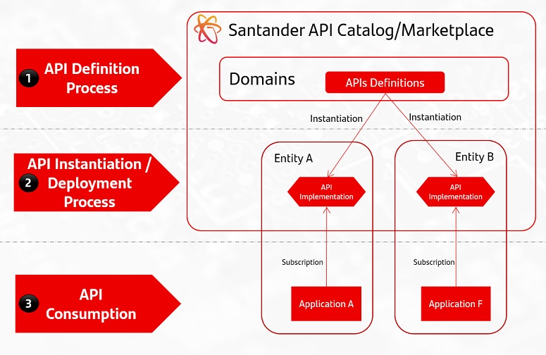

## Overview

### Key facts

1. API Definition process

    - Single API Catalog
    - Group Wide unique API definitions.
    - Local API Governance promote API proposals.
    - Global API Governance decides on API proposals and definitions.
    - APIs include complete consumer oriented documentation.
    - APIs include Virtualization.

2. API Instantiation / Deployment process

    - Local instantiation of global API for an entity.
    - API Definition remains unaltered.
    - Local Governance decides on deployment proposals.

3. API Consumption

    - API Implementations available for subscription in Gluon Marketplace.
    - No Governance involved.
    - No subscription restrictions as default model.
