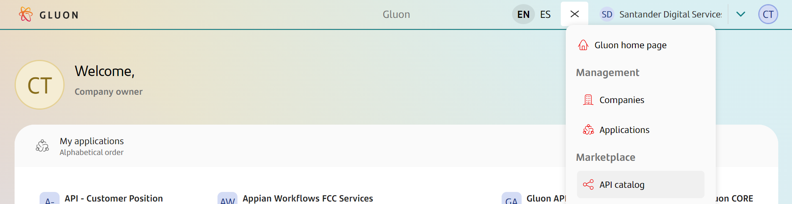
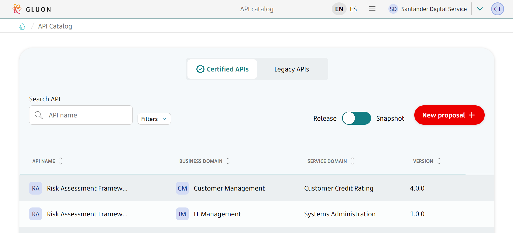
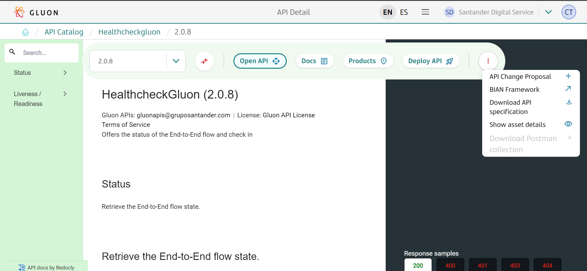

# API Catalog

The API Catalog allows you to view the following components deployed with Gluon:

- [**API Definition**](../lifecycle/apidefinition.md)
- [**API Deployment**](../../../../../architecture/tech-stack/snippets/apis/apis.md)
- [**API Legacy Deployment**](../lifecycle/apilegacydeployment.md)

You can access it from the main menu of Gluon, in the **API catalog** section.

Upon entering, it shows the global list of **Certified APIs** in Gluon, the list of **Legacy APIs** of the entities and the option to make a [new proposal](../lifecycle/apidefinition.md/#proposal-for-a-new-api).

When selecting an API, the detail of the API specification will be displayed, with the following options:

- **Open API**: API detail
- **Docs**: Additional available API documentation
- **Products**: Link to the list of API Products that contain the API
- **Deploy API**: Launches the creation flow of an [API Deployment 2.0](../../../../../architecture/tech-stack/snippets/apis/apis.md) component  
- **API Change Proposal**: Launches the API change proposal flow
- **BIAN Framework**: External link to the BIAN portal
- **Download API specification**: Downloads a file with the specification of the file in yaml format
- **Show assets details**: Shows the API details to be able to create an API Deployment 2.0 component
- **Download Postman collection**: Downloads a sample Postman collection of the API

???+ important

    The image shown in the documentation may not match the rendering on the front end for screens related to the API definition view. However, the functionalities offered by this view remain unchanged.

