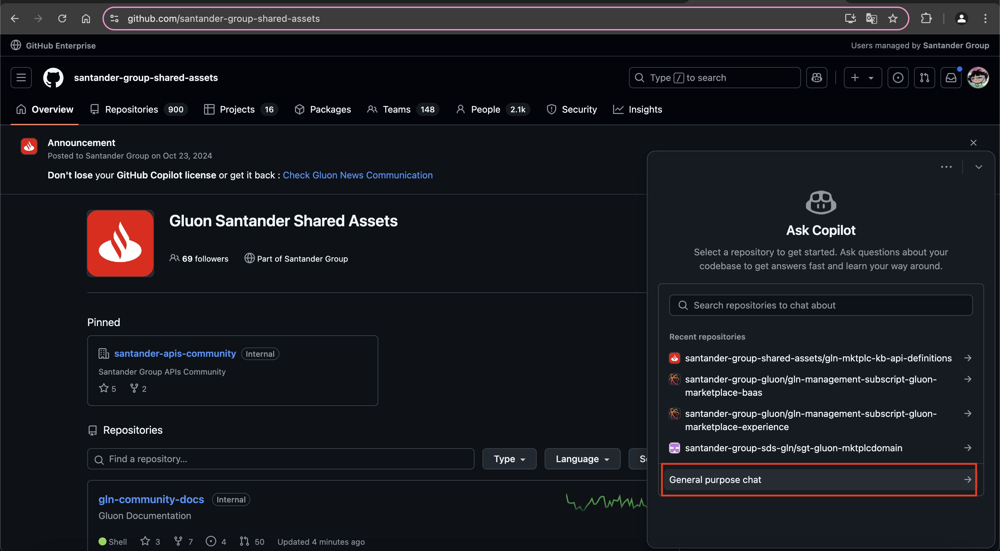
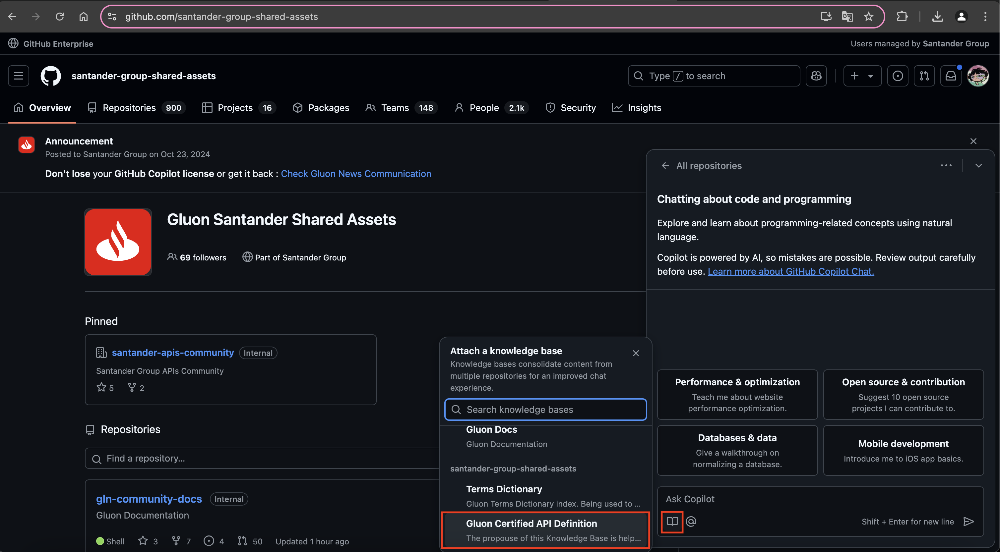
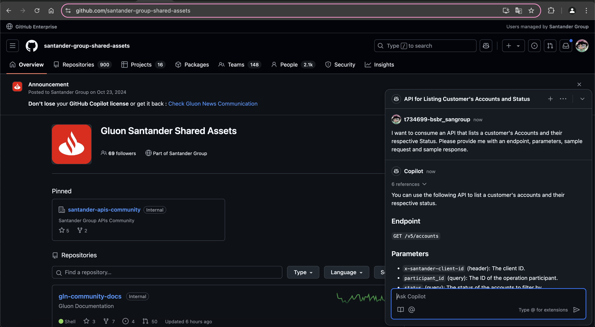

## Goal

- For Gluon Users, the Marketplace Service API Definition Knowledge Base is a resource that gives them the ability to search for any information about the latest API definitions, whether in the contract, description, or BIAN catalog.

### Prerequisites and Considerations

- You must have access to `Github`, also have the `Copilot License` enabled for your user and have access to the organization 'santander-group-shared-assets'.

## Step By Step

1. After entering your Github account, you should open a Chat with Copilot, and select `General purpose chat`.

   

2. After that, select the Knowledge Base `Gluon Certified API Definition`

   

3. Once all these things are done, you can now talk to Copilot about `API Definition Gluon Certified`

   

### Best Practices for Prompts

>- Be Clear and Specific: Clearly describe what you need, avoiding ambiguities.
>- Provide Context: Include relevant details, such as the purpose of the code or the desired function.
>- Use Examples: Demonstrate with examples of expected inputs and outputs.
>- Break Down Complex Tasks: If the task is complex, break it down into smaller, more manageable steps.
>- Request Reviews: Ask for suggestions and reviews to continuously improve your prompts.

## Examples of Questions

>- I want to consume an API that lists a customer's accounts and their respective statuses. Inform me of its endpoints, parameters, request example, and response example.
>- Could you provide the reference link for the Gluon API shown above?
>- What is the BIAN version of the API?
>- What is its Business Domain?
>- What is the Service Domain?
