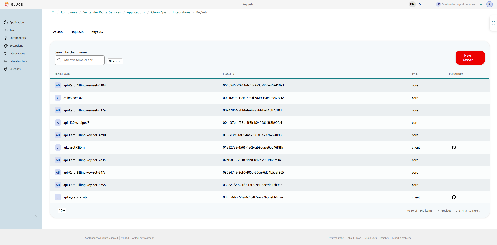
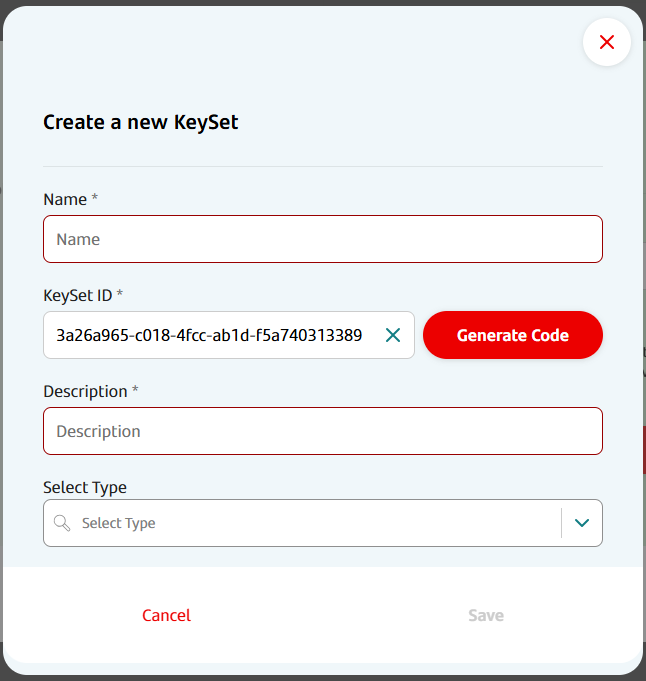
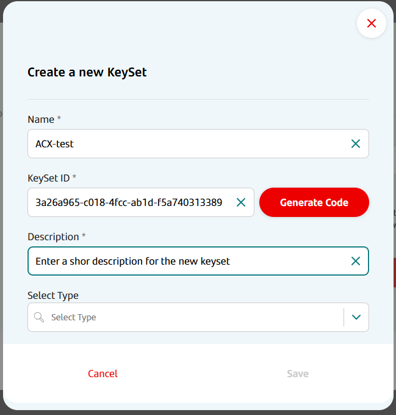
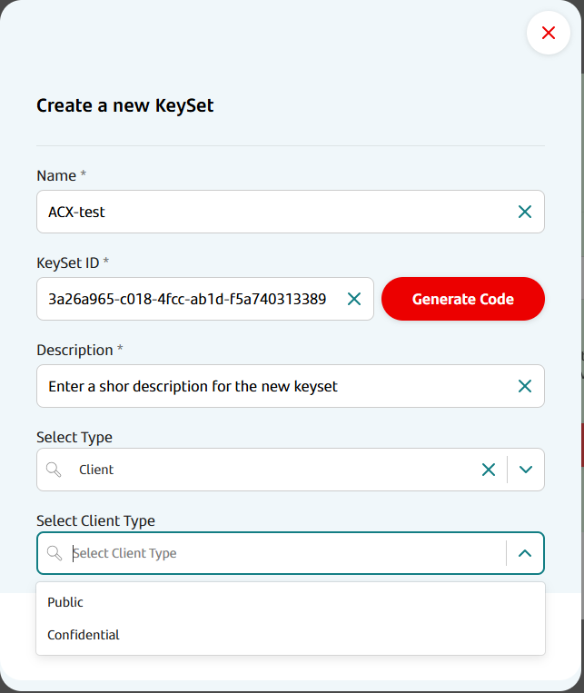
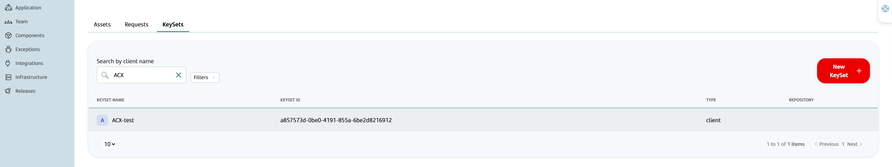
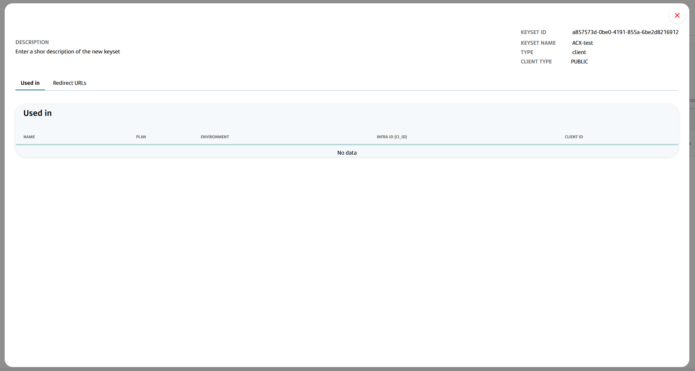

## Prerequisites & Considerations

- To create a KeySet, you must be onboard the Marketplace and be an application owner

## KeySet Creation Step By Step

1. To access KeySet, from the Gluon homepage, click on the three-line button located in the upper right corner. In the drop-down menu select "Companies",
search for "Company Name" > Applications > "Application Name" > Integration > KeySet > "New Keyset" (Red Button) as seen in the image.

    

2. To create a new KeySet, enter a name, choose to use an autogenerated ClientId or import an existing ClientId, create a description, and select an option in "Select Type".

   **Client ID Options:**
   - **Autogenerated**: Creates a new universally unique identifier (UUID)
   - **Import Existing**: Allows you to specify an existing client ID from API Manager to import into Gluon by entering the client ID in the KeySet ID field

   2.1. Select Type
   > "Channel TP" is the KeySet exhibition venue.

   **If you select "core" in "Select Type":** Click Save

   > Core type is used for API Products deployed with `security_type: CORE`

   

   

   **If you select "Client" in "Select Type":** The option "Select Client Type" will appear. Select "Confidential" or "Public" and click Save

   > Client type is used for API Products deployed with `security_type: CLIENT`
   >
   > - **Confidential**: Generates a client secret that will be stored in Vault
   > - **Public**: For public applications that don't require a client secret

   

### Created Keyset Information

   

## Consult KeySet Step By Step

1. To access KeySet, from the Gluon homepage, click on the three-line button located in the upper right corner. In the drop-down menu select "Companies", search for "Company Name" > Applications > "Application Name" > Integration > KeySet.

   > On this query screen, we can see the name, generated ClientId and the type.

   

2. Click on the client name for more information

   

   In this detailed information screen, you can see:
   - **KEYSET ID**: The unique identifier for the KeySet
   - **KEYSET NAME**: The descriptive name given to the KeySet
   - **TYPE**: The type of KeySet (core or client)
   - **CLIENT TYPE**: The client type (Confidential or Public)
   - **Subscribed Products**: For each API Product that is subscribed, the corresponding client ID is displayed

## Important Notes

- **Environment Configuration**: KeySets can optionally be configured with different client IDs per environment
- **Import vs Generate**: When importing an existing client ID, it will be imported from API Manager if it exists, or created if it doesn't exist
- **Security Types**: The KeySet type (core/client) must match the API Product's security configuration
