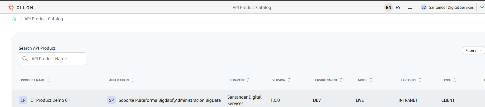
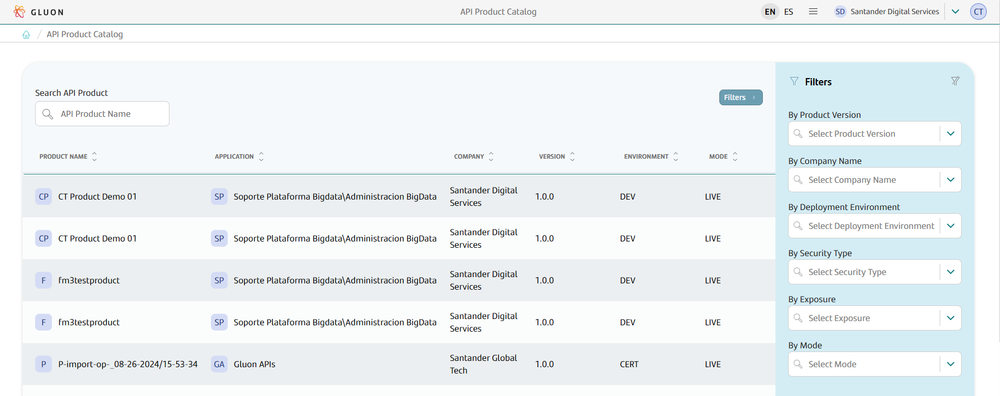
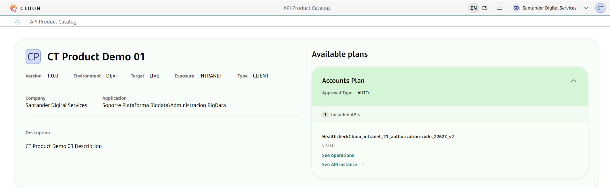
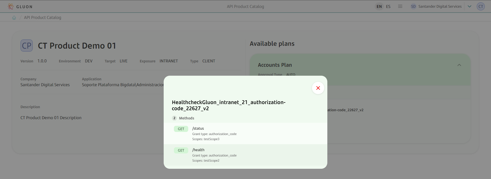
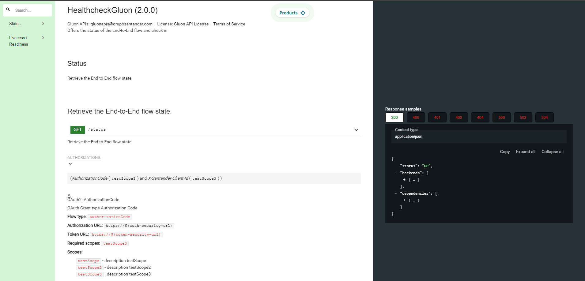

# Product Catalog

The API Catalog allows you to view the following components deployed with Gluon:

- [**API Products**](../../products.md)
- [**API Deployment**](../../../../../architecture/tech-stack/snippets/apis/apis.md)

Upon entering, it shows the list of all the API Products deployed by the entities:

Filters are available to facilitate the search for products. The filters will be updated based on the selection of the other filters.
For example, if a value is selected in Product Version, the rest of the filters will be updated showing only the available options for that Product Version value.

If a Product is selected, the detail page is displayed, with the available plans and the APIs that the plan contains.

You can consult the available operations of that API for that plan.

In addition, you can also go to the detail of that deployed API, which contains the following differences compared to the definition API:

- The version shown is that of the API Deployment, which may have varied compared to the API Definition if several deployments have been made.
- The necessary information for the consumption of the API is shown, such as the configured security, the scopes and the necessary urls for its consumption, such as the Authorization URL and the Token URL.
- If the Products option is selected, the list of API Products that contain that API Deployment will be shown, not the API Definition.

???+ important

    The image shown in the documentation may not match the rendering on the front end for screens related to the API definition view. However, the functionalities offered by this view remain unchanged.

