## Goal

> The request catalog aims to manage the approval or rejection of API consumption requests between applications by API Products.
It organizes and facilitates the subscription to API products, allowing producers and consumers to manage the state of these petitions efficiently and in a structured manner.

## Prerequisites and Considerations

> - It is necessary to be `onboarded` in a technical application.

## Step by Step

Here we can see, in detail, the flow and usage of the `Request Catalog`.

>1 - Access Gluon, click on `Menu` and Click on `Product catalog`.

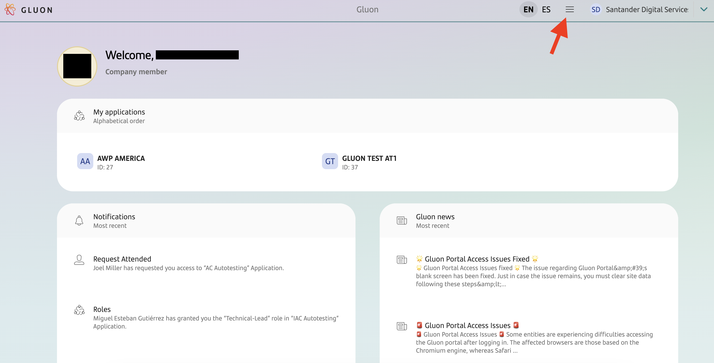

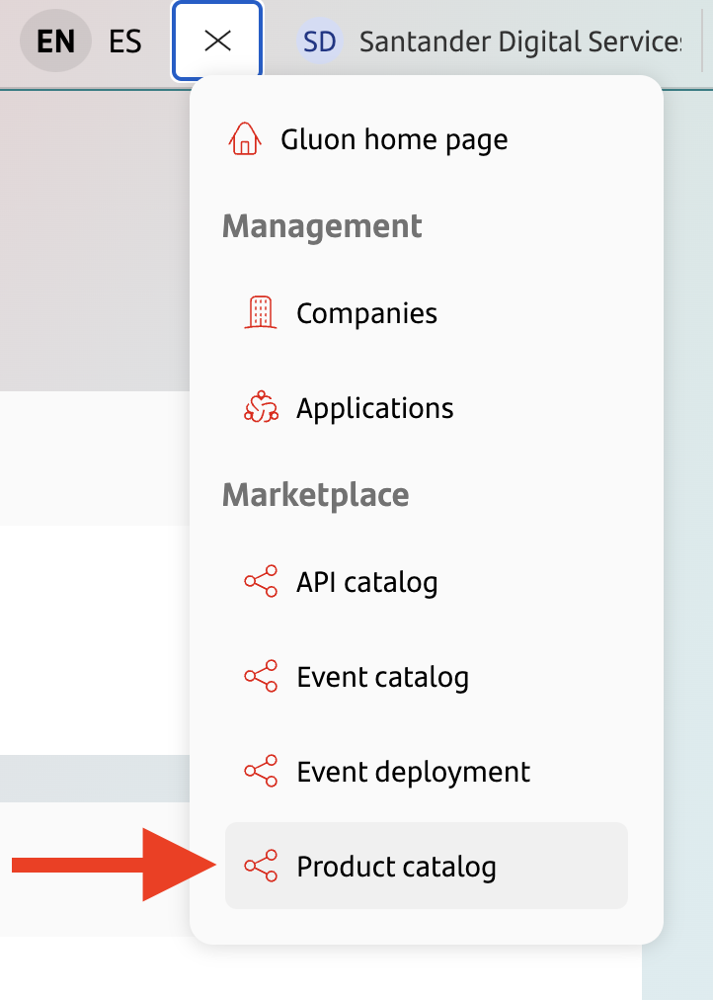

>2 - On this page, you will be able to view all the products available for requesting a subscription.

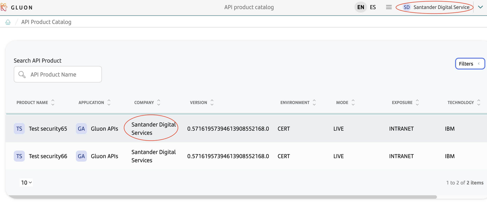

>3 - After selecting a `Product`, you will be redirected to the Product details page, where you can see information based on consumption plans and description. Select the desired plan and click on `Request subscription`.

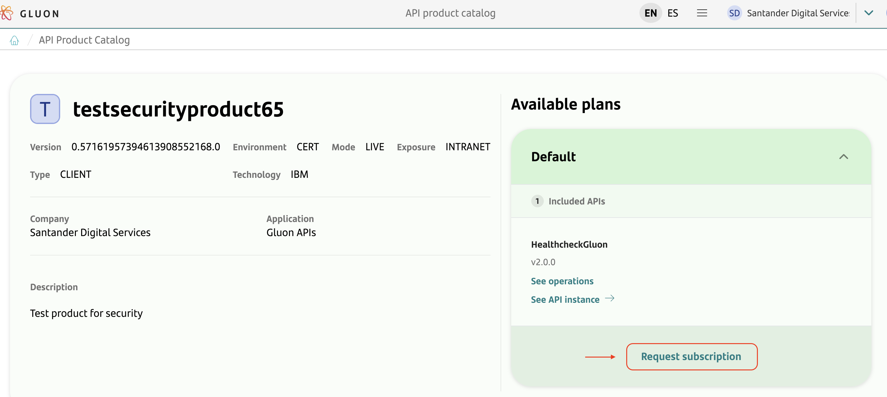

>4 - Select a technical application you belong to and wish to subscribe to this product.

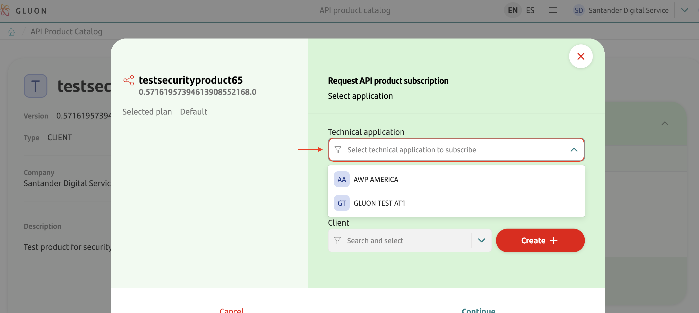

>4.1 - Next, in the `Client` field, select an available `Keyset` that is compatible with the product. If no available Keyset is available, you can create a new available Keyset in `Create`.
Follow the [documentation](https://github.com/santander-group-gluon/gln-internal-mktplc-documentation/blob/feature/keysetDoc/docs/microservice/sgt-mktplckeyset/mktplckeysetdoc.md). After filling in the fields, click on `Next`.

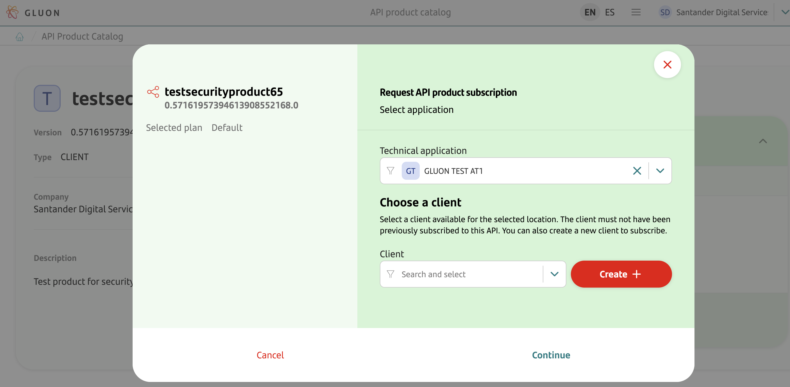

>4.2 - On this page, you can see the summary of your request. If you agree, click on `Save`.

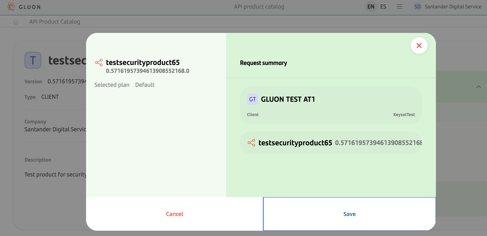
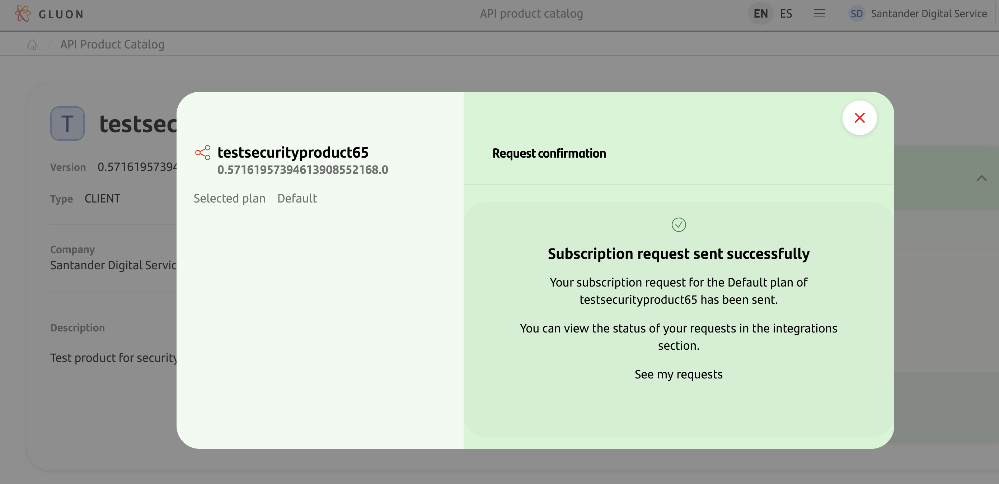

>5 - To view the requests made, return to the `Gluon home`, click on the application you are onboarded in `My applications` and you will be redirected to `Application information`.

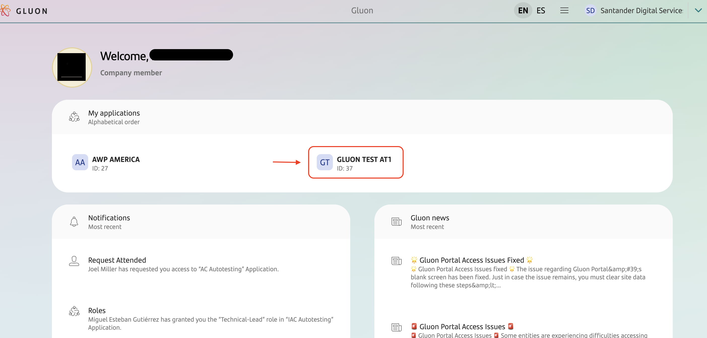

>6 - On the `Application information` page, click on `Integrations` and then on `Requests`.

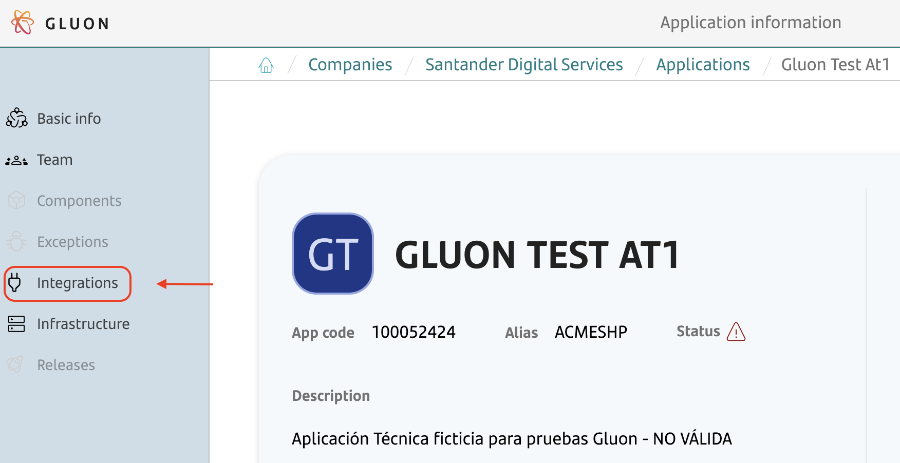
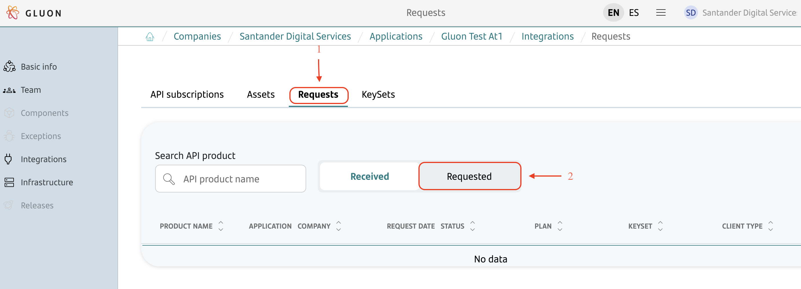

>7 - On this page, under `Received`, you can see all the subscription requests that other technical applications have made to consume your API products.
You can take actions to approve or reject the consumption of the API product that a particular application has requested.

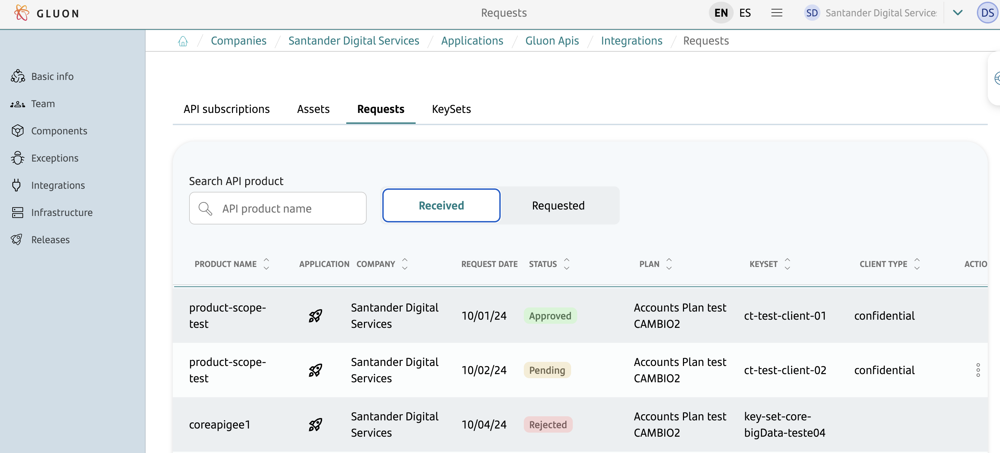

>8 - In "Requested", you can check the status of all subscription requests you have made for the API products of other applications.
For approved requests, you can create a repository to include the OAuth server information in the case of client-type products; for core-type products, this is not necessary.
Additionally, you must create the subscription repository to start the deployment flow of your key set in the API gateway manager where this API product is located.

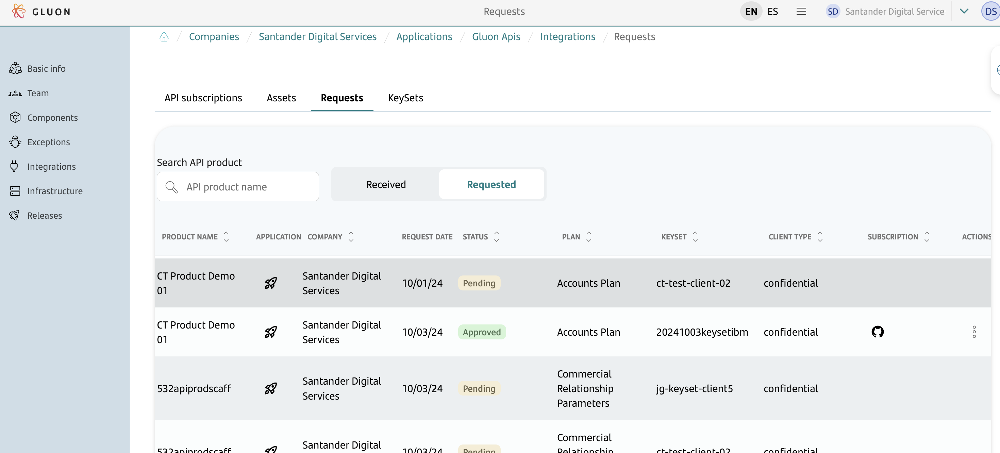
