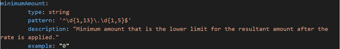

# Open API Specification Guidelines

[Open API Specification 3.0.3 documentation](https://spec.openapis.org/oas/v3.0.3)

The OAS defines a standard, language-agnostic interface to HTTP APIs which allows both humans and computers to discover and understand the capabilities of the service without access to source code, documentation, or through network traffic inspection.
When properly defined, a consumer can understand and interact with the remote service with a minimal amount of implementation logic.

#### 1) Info Section

Info section provides metadata about the API, and it is REQUIRED. The metadata MAY be used by the clients if needed, and MAY be presented in editing or documentation generation tools for convenience.
It also improves the self-service experience for developers/consumers.

All Santander Group APIs deployed in the production environment MUST include legal and license information

```yaml
openapi: 3.0.1
info:
  title: Party Identity And Verification
  version: 1.0.0
  contact:
    email: DLPartyidvOnboardingBaaS@santander.co.uk
    name: PLM Party Idv
    url: "https://confluence.almuk.santanderuk.corp/display/PARTYIDVHO/Party+IDV+Home"
  description: "This API specification provides endpoints for managing the lifecycle of a party for identity and verification (IDV). The IDV lifecycle consists of three phases: initiate, execute, and complete. The endpoints allow for the creation, retrieval, and modification of party IDV records, as well as the retrieval of the status of a party IDV lifecycle."
  license:
    name: "Apache"
    url: "https://www.apache.org/licenses/LICENSE-2.0"
```

#### 2) Summary and Description

Improve the API documentation by providing more context to the API functionality. An API consumer should be able to understand the overall API functionality and details related to each of its operations.

- Descriptions SHOULD be provided for describable objects, such as **info, tags, operations, parameters, and more**.
- Descriptions SHOULD be a minimum of 20 characters, start with a capital letter, and end with a period
- Each API operation/endpoint SHOULD have an appropriate summary and description

##### Valid Example

This example is valid because it contains more than 20 characters and both summary and description are added to the API Operation.

```yaml
paths:
  "/{card_id}/use_limits/{card_usability_limit_id}":
    put:
      summary: "Updates a usage limit for a card."
      description: "Updates a specific usage limit for a card.\n\nTo send this request, you must provide a card ID and a usage limit ID in the request path.\n\nThe updated usage limit amount must be provided in the request body."
```

##### **Invalid Example**

This example is invalid because the description is too short and does not end with a period. A consumer will not be able to understand the API operation.

```yaml
responses:
  '200':
     description: User Found
```

#### 3) Data Validation

Data validation is a key aspect of API design. It is important to define the data validation rules for parameters, requestBody and responses of each of the API operations and schema elements.
This will help API consumers to understand the data validation rules and avoid unnecessary API calls.

Continuous values are values that can take on any value within a certain range.

  - for type:integer use the minimum and maximum keywords to specify the range of possible values.
  - for type:string use the minLength and maxLength keywords to specify the range of possible values.

Discrete values are values that can only take on a certain set of values. These are generally represented using enum or by referring to ISO standards.

  - for type:string use the enum keyword to specify the set of possible values.
  - for type:string use the format keyword to specify the ISO standard.

OpenAPI supports a wide range of data validation options for fields, including:

- Type validation: Specifies the type of the field value (e.g., string, integer, boolean, array, object).
- Format validation: Specifies the format of the field value (e.g., int32, email address, phone number, date).
- Minimum and maximum values: Specifies the minimum and maximum values that the field value can take.
- Enum validation: Specifies a list of allowed values for the field value.
- Required and optional parameters: Specifies whether the field is required or optional.

```yaml
components:
  schemas:
    User:
      type: object
      properties:
        id:
          type: integer
          minimum: 1
          maximum: 1000
          format: int64
        name:
          type: string
          minLength: 3
          maxLength: 20
          format: regex
          pattern: "^[a-zA-Z]+$"
        role:
          type: string
          enum:
            - admin
            - user
```

#### 4) Schema and Examples

Parameters, requestBody and responses should be defined using the schema and example fields. This will help API consumers to understand the data structure and the data validation rules.
Examples are also used by some API mock servers to generate mock responses for the API operations.

##### Valid Example

This example is valid because a schema and examples are defined.

```yaml
get:
  responses:
    '200':
      description: User Found
      content:
        application/json:
          schema:
           $ref: '#/components/schemas/User'
         examples:
           Get User Alice Smith:
              value:
               id: 142
               firstName: Alice
               lastName: Smith
               email: alice.smith@gmail.com
               dateOfBirth: '1997-10-31'
               emailVerified: true
               signUpDate: '2019-08-24'
```

##### Invalid Example

This example is invalid because a schema and examples are not defined.

```yaml
get:
  responses:
    '200':
      description: User Found
      content:
        application/json:
```

#### 5) Tags and OperationId

- Tags are strings used to group API operations together. OperationIds are used to identify individual operations.
- Each API operation SHOULD be associated with a tag and operationId.
- It is also RECOMMENDED specifying description for each tag using the global tag section on the root level. The tag names here should match those used in API operations.
- The operationId value is case-sensitive and SHOULD be **unique**. Tools and libraries MAY use the operationId to uniquely identify an operation and name the corresponding methods in their code.
Therefore, it is RECOMMENDED to follow common programming naming conventions(lowerCamelCase).
- You can assign a **list of tags** to each API operation. Tagged operations may be handled differently by tools and libraries. For example, Swagger UI uses tags to group the displayed operations. Kong Portal uses it also as a filter for the API Catalogue.
- In a global/local scenario. Local may have more resources and operations extending the global API definition. Use the tag "local" to identify such resources/operations
- Tags allows developer apps an easier identification of grouped resources in the Developer Portal.

```yaml

tags:
  - name: Card limits
    description: Operations related to card usage limits
  - name: Card Controls
    description: Operations related to card controls
paths:
  "/{card_id}/use_limits":
    get:
      tags:
        - Card limits
      operationId: "get-limits"
      summary: "Retrieves a list of usage limits for a card."
      description: "To send this request, you must provide a card ID in the request path."

```

#### 6) Use of $ref

Parameters, requestBody and responses SHOULD be encapsulated in a **$ref** definition structure, as it is more efficient to make changes only in the components section of the API definition

```yaml
paths:
  "/{card_id}/use_limits":
    get:
      tags:
        - Card limits
      operationId: "get-limits"
      summary: "Retrieves a list of usage limits for a card."
      description: "Retrieves a list of usage limits for a specific card.\n\nTo send this request, you must provide a card ID in the request path."
      parameters:
        - $ref: "#/components/parameters/X-Santander-Client-Id"
        - $ref: "#/components/parameters/card_id"
      responses:
        "200":
          $ref: "#/components/responses/Get200_CardUsageLimitsList"
        "400":
          $ref: "#/components/responses/BadRequest"
        "401":
          $ref: "#/components/responses/Unauthorized"
        "500":
          $ref: "#/components/responses/InternalServerError"
```

#### 7) Security Schemes

API spec should define the security schemes of the API along with the specific scopes(if applicable) for accessing each endpoint. This will help API consumers to understand the security requirements for consuming the API operations.

For further information, please refer to the [Security](../std-security.md) section.

#### 8) Currency field in APIs Definition

Json data is supported both in decimal format (eg: 123.52) and in scientific notation (eg: 12352E-2). The description indicates that the field must be sent in decimal format separated by a point and specifying the number of digits.
However, this type of definition can cause a precision loss in the amount fields, and this generates a high risk.

The best way to solve the problem is to define the currency amount data as a **string** type, which can be masked, and almost any software library can work with it without taking any additional steps.

##### **Advantages**

- It is aligned with the *amount* fields defined in ISO 20022, which are *pattern* limited.
- Using pattern univocally define the expected format, without needing further explanations in a description.
- The vast majority of the market, both competitors and the main international banking interoperability frameworks, such as PSD2 or Openbanking use string.<br>


