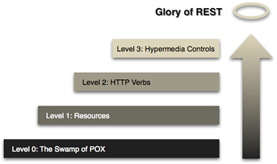

# Core Principles

#### 1. BIAN Catalogation

a) Santander Group APIs MUST be catalogued with BIAN landscape version, business area, business domain and Service Domain information.

b) Catalogation always MUST be aligned with BIAN, and it will be defined in the catalog.yaml file in the API definition repository.

c) BIAN version MUST be 11.

``` yaml
  x-santander-catalogation:
    bian-landscape-version: '11'
    bian-business-area: Sales and Service
    bian-business-domain: Customer Management
    bian-service-domain: Customer Access Entitlement
```

#### 2. Santander Group API MUST be Richardson's REST Maturity Model aligned

[Richardson Maturity Model](https://martinfowler.com/articles/richardsonMaturityModel.html)



##### 2.1 Levels

1. **Level 0 – Swamp of POX:** **(Mandatory)**<br>
  Using **HTTP for remote interactions** without using of any of URI, HTTP Methods, and HATEOAS capabilities. The services at zero maturity level have a single URI and use a single HTTP method (typically POST).
  For example, most SOAP Web Services use a single URI to identify an endpoint, and HTTP POST to transfer SOAP-based payloads, effectively ignoring the rest of the HTTP verbs.
2. **Level 1 – Resources:** **(Mandatory)**

    **Identify resources via URI** without specifying the action to be performed on it.
    The services at maturity level one employ many URIs but only a single HTTP verb – generally HTTP POST to perform operations on them.

3. **Level 2 – HTTP verbs:** **(Mandatory)**

    **Santander Group APIs MUST be at least Level 2 compliant**.Level two of maturity makes use of URIs and HTTP Methods, but does not use the HATEOAS.
    Maturity level 2 is the most popular usecase of REST principles, which advocate using different verbs based on the HTTP request methods, while the system can have multiple resources.

4. **Level 3 – Hypermedia controls: (Recommended)**

    Level three of maturity makes use of all three, i.e. URIs and HTTP, and **HATEOAS**(Hypermedia as the Engine of Application State). It is the most mature level of Richardson’s model, which encourages **easy discoverability**.

    HATEOAS indicates that when a request is made to the server for a resource, along with the response for the resource requested by the client, the server also sends the links to the resources that are related to the resource requested by the client.
    This helps the client to discover the resources that are related to the resource requested by the client.

#### 3. Santander Group API has the Granularity concept

1. Two levels of hierarchy SHOULD NOT be exceeded and SHOULD NOT be more than 8 resources (6-8).
2. A resource has several operations identified by HTTP Verbs. (Recommended)
3. The resources defined via URIs MUST establish a hierarchical relationship to each other as:

    ``` xml
    /\<entity\>

    /\<entity\>/{\<entity\_id\>}

    /\<entity\>/{\<entity\_id\>}/\<sub\_entity\>

    /\<entity\>/{\<entity\_id\>}/\<sub\_entity\>/{\<sub\_entity\_id\>}
    ```

4. APIs MUST NOT define servers.url as "/", as it creates BIAN API cataloguing problems, and technical implementation issues in API Management platforms.

#### 4.Santander Group API - REST Archetypes

a) Collection:

  1. List of functional objects to be used by the user.
  2. All CRUD operations are allowed.
  3. The system manages the store's documents (entity identifier, etc.)
  4. Use plural name to denote collection resource archetype

b) Document:

  1. A document is a **unique functional resource**.
  2. It allows all **CRUD operations**.
  3. Use “singular” name to denote document resource archetype.

c) Store:

  1. List of functional objects to be used by the user.
  2. All typical CRUD operations are allowed.
  3. The consumer manages the store's document management.

d) Event Handlers:

  1. Complex operations that cannot be associated to an HTTP Verb.
  2. THe new created operation path MUST BE be composed by the semantic verb which describes the action to implements in the resource entity followed by an underscore and the resource name. (Mandatory)
  3. POST Verb MUST BE used by convention.

        /one\_off\_transfers/simulate\_transfer

  4. Many event handlers in an API definition SHOULD NOT be used because it penalizes the granularity of the API.
