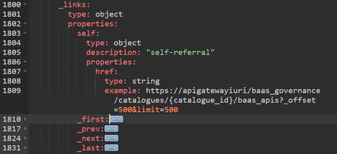

# Observability (flow tracking)

!!! warning
    Observability is currently under review by the Observability team. This section will be updated as soon as it is available.

### **API Standard**

Santander APIs MUST follow the observability standards defined in this document.

### **Guidelines**

Environments are increasingly distributed and applications more atomized. Therefore, traceability is a mandatory aspect.

To this end, the Santander Group has adopted two [traceability specifications](https://confluence.alm.europe.cloudcenter.corp/x/eVNUCQ) in its Observability standards:

- **X-B3 for log-based traceability and log correlation** (log stream).
- **W3C Trace Context for the APM interoperability and telemetry** (Monitoring & APM stream).

*Picture 5 - Observability in a nutshell*

**It is mandatory to following the** [_ **tracing and log correlation standards** _](https://confluence.alm.europe.cloudcenter.corp/x/fVJUCQ).
In addition, you can get detailed information about observability by checking the [Observability Technical Reference Architecture](https://confluence.alm.europe.cloudcenter.corp/x/xYu5AQ) or **asking in the** [**Observability Community**](https://web.yammer.com/main/groups/eyJfdHlwZSI6Ikdyb3VwIiwiaWQiOiI3OTk2OTE1NzEyMCJ9/all).

**B3 specification (for tracing and log correlation)** [B3 Propagation](https://github.com/openzipkin/b3-propagation/blob/master/RATIONALE.md) (*aka* X-B3) is a specification for the header "b3" and those that start with "x-b3-".
These headers are used for trace context propagation across service boundaries.

- X-B3-TraceId (*note: 16 hex-lower implementation*).
- X-B3-ParentSpanId
- X-B3-SpanId
- X-B3-Sampled

**It is mandatory to manage this specification**. The Global CTO APIs Architecture team has implemented the observability tracing and log correlation standards by defining policies at API Gateway level.

**W3C Trace Context specification (for APM-based traceability and APM interoperability)** The [W3C Trace Context v1](https://www.w3.org/TR/trace-context/#tracestate-header) is a specification to ensure APM interoperability.
The following headers are used for propagating the APM trace context:

- traceparent
- tracestate

In this moment, the **only mandatory requirement related to this specification is to propagate both headers** , as long as they have received. The handling of this specification is delegated to the APM agent.

#### Use cases

A [set of diagrams](https://confluence.alm.europe.cloudcenter.corp/x/RgnBCQ) is provided in order to illustrate the most common/representative tracing use cases in the Observability TRA.

#### Logging

The headers of both specifications (b3 and W3C Trace Context) should be added to the [log events](https://confluence.alm.europe.cloudcenter.corp/x/cxkWCg). This is also managed in the policies defined by the Global CTO APIs Architecture.
