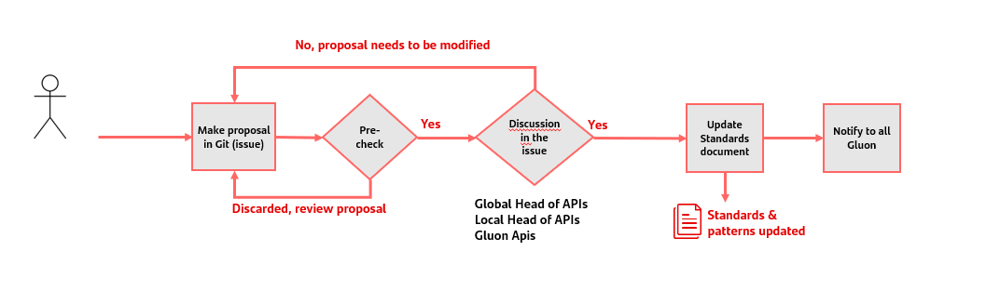
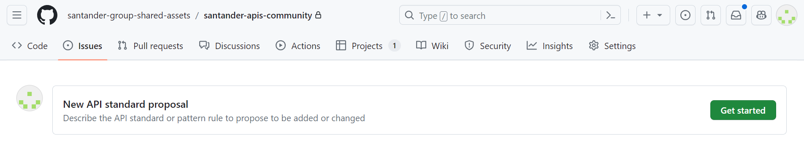
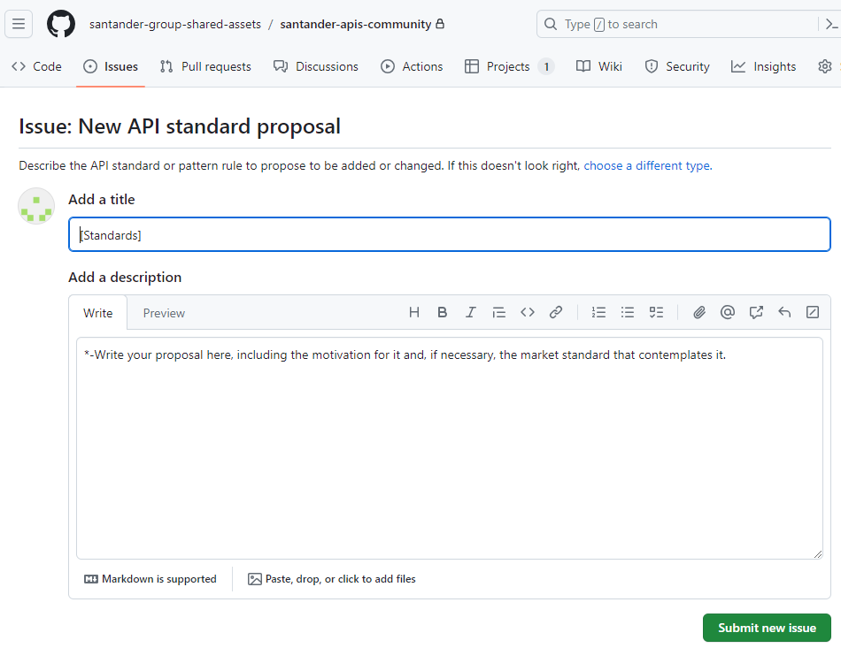

## ​Introduction

The objective of this document is to establish the standardized goals that must be met for the Santander Group APIs.

This document defines conventions, patterns and best practices for designing and developing APIs and is used to ensure that all APIs within the organization are consistent, secure and easy to use thereby improving the overall developer experience

This document is generated as part of a project framed within the strategic lines that the CTO Global is carrying out in the Santander Group, in coordination with the local CTOs.

## Keywords

These CAPITALIZED words throughout the style guide have a special meaning:

The keywords "MUST", "MUST NOT", "REQUIRED", "SHALL", "SHALL NOT",
"SHOULD", "SHOULD NOT", "RECOMMENDED", "NOT RECOMMENDED", "MAY", and "OPTIONAL" in
this document are to be interpreted as described in [RFC2119](https://www.ietf.org/rfc/rfc2119).

## How to propose a new Standard

To propose a new standard, the Global Head of APIs or a Local Head of APIs has to open an issue in the gln-community-apis of New Standard proposal type

The issue has to be filled in detailing the standard to add or change and its motivation. In this moment Gluon APIs team will check if the proposal is suitable with the rest of the standards & patterns of the group and other Gluon capabilities.

In case it is a valid proposal, it will be discussed among Global and Local head of APIs and Gluon APIs teams.
When accepted, it will be written in the Standards&Patterns documentation and notified to the rest of Gluon teams to check with them any possible dependencies.
