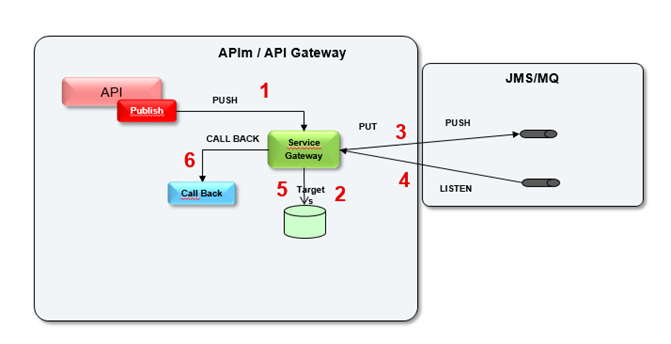

# Asynchronous APIs pattern (Deprecated)

!!! warning
    Currently a new solution for asynchronous APIs is being defined. This section will be updated as soon as it is available.

 

1. API consumer initiates a request, it typically includes a payload message and a callback endpoint
      1. Callback url can be passed to the request preferably as a query parameter
2. The gateway persists "target" information in a database, which includes the callback endpoint. This allows the gateway to identify where to call when a response becomes available.
3. Gateway places the message received in a Queue (previously message protocol transformation)
4. The gateway listens to the queue for responses and processes the callback call once it is received.
5. When a response is received, the gateway retrieves the callback URL from the database, which was stored during the initial request (step 2)
6. It then proceeds to use a callback service to execute the response, which can be exposed through APIs. 
Callback details: [OAS3 - Callback](https://spec.openapis.org/oas/v3.0.3#callback-object)
