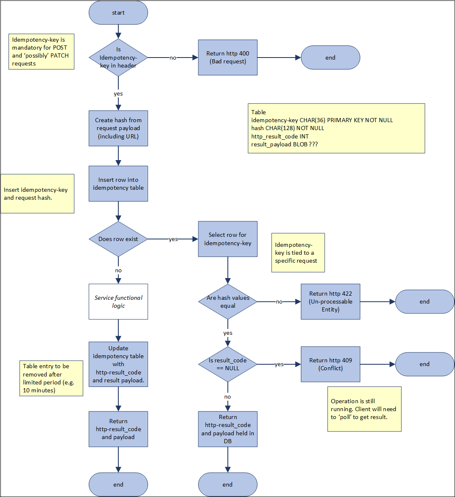

# Idempotent API Design

#### What is Idempotency ?

- Idempotent operations are operations that can be applied multiple times without changing the result beyond the initial application.
- For a RESTful service this means that for an operation to be idempotent, clients can make that same call repeatedly while producing the same result, i.e. **making multiple identical requests has the same effect as making a single request**
- Idempotent operations are useful in the event of network errors, timeouts, or unexpected client behavior that may cause a duplicate request to be sent.
- Idempotent operations are also useful for **retrying requests** without knowing if the initial request was successful.

!!! tip
    Q) Do I need to implement idempotency within my API ?

    A) Yes, if replaying a POST/PATCH request has the potential to create duplicate resources, or to cause other unintended side effects. API Designer and API Product Owner should work together to determine if idempotency is required for a given operation.
    Openbanking APIs provide good reference implementation.

### **API Standard**

POST is not idempotent and PATCH operation may or may not be idempotent. Hence, it is RECOMMENDED to design POST and PATCH as idempotent operations.

#### Example Scenario

- A client makes a POST request to create a new resource. The client receives a 201 Created response with a Location header containing the URL of the newly created resource.
- The client's network connection fails before the response is returned.
- The client retries the POST request with the same payload.
- The client receives a 201 Created response with a Location header containing the URL of the newly created resource.
- The client can be confident that the resource was created only once, even though the client made two requests.

For example, consider a mobile user on a train, clicking on the ‘make payment’ button moments before entering a tunnel and losing their network connection.
On exiting the tunnel the signal is restored but the API request has timed out. Was the payment successful? What can the customer do now? Call the bank, try again?
Consider that the payment was successful, the customer simply did not receive the response. If the payment operation was not idempotent then trying again would create a second payment.
However, if the payment operation was idempotent then the operation could be re-tried BY THE APPLICATION without fear of a second payment being made.
The re-try would mean the customer possibly notices a slight delay but otherwise receives the payment confirmation, unaware that the application had to call the payment operation multiple times.

#### Example idempotent Design

 Client generates a UUID as the idempotency key. This key must be flowed in all POST and PATCH requests in the **x-idempotency-key** http header. Any retries on an operation invocation must flow the same x-idempotency-key.
 The service implementation will require a DB or cache, such as Redis, in order to track requests and responses.

