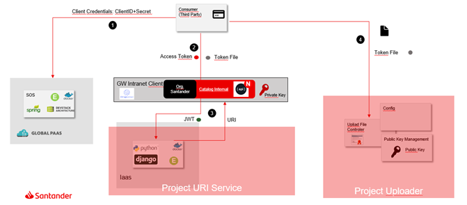
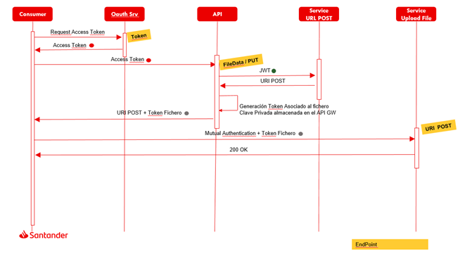

# Exchanging Large Files (Streaming)

### **Guidelines**

- It is NOT RECOMMENDED to exchange large files (more than 5Mb in a request in IBM and more than 10Mb in Apigee). The Gateway IS NOT a file processor tool.
- Typical HTTP verbs MUST be used. GET for download large files and PUT for upload large files
- API must define one object file in request or response depending on the upload/download streaming process.
- Streaming requires no payload transformation.
- Every Gateway handles the streaming in different ways:
    - Apigee requires Streaming software configuration
    - Streaming not supported in IBM

### **Example external pattern for exchanging Large Files**

1. To exchange large files is recommended to use an external File Management solution, for example NFS or Amazon S3 solution as File Management System. More information at: [AmazonS3 ShareObject with PreSignedURL](https://docs.aws.amazon.com/AmazonS3/latest/userguide/ShareObjectPreSignedURL.html)
2. Gateway response is a 200 OK Response containing JWT File. Include gen-jwt-file in API assembly, which returns an API response with a HTTP Header (X-Santander-JWTTokenFile). Next step is a Request to the file Management system with JWT File data.

Steps to upload one file external to Gateway:

- Enrollment in API Portal to obtain app credentials
- Access token request to Oauth Server
- API Request (Oauth token in header)
- File system used must validate JWT token generated in API Gateway (included in JWT File)
- First request from consumer App to Upload file Controller to indicate the uploading of the document. As a result of this request one data token is generated with information that will be checked in validation.
- Request from consumer app to upload file controller. Upload file if data token is correct.

 

