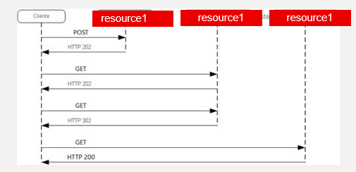
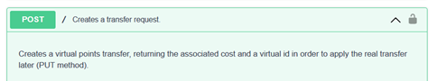
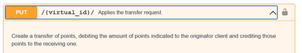

### **Long polling and virtual resources strategy (Recommendation)**

a)**Long polling** is a strategy of request/response communication in APIs

- The 202 (Accepted) status code indicates that the request has been accepted for processing, but the processing has not been completed.
- The 302 (Found) status code indicates that the target resource resides temporarily under a different URI. No documentation. The API Management strategy offers a comprehensive governance of the APIs, managing their consumption through subscriptions.

b) **Virtual Resource** is a design strategy to 'protect' creation and updation of data by unsafe operations

- First the client application 'simulates' or 'request for permission' to the server with POST method. The server creates a virtual resource and responsd to the client with this URI.
- After POST, the client app uses the idempotent verb PUT; then the server update and persist data.
- This solve the problem of creating multiple transfers because of the using of POST verb (non idempotent). The transfer won't be effective until client app requests the resource with PUT operation.

