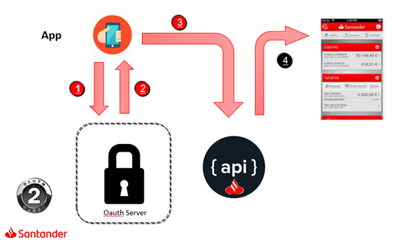
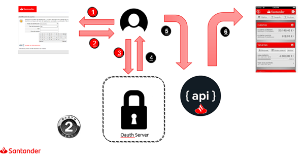
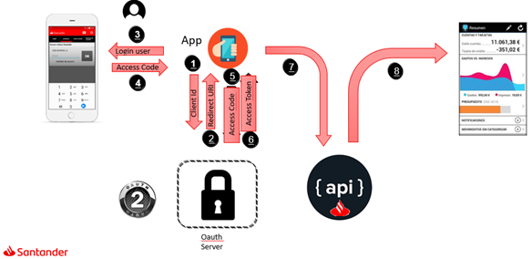
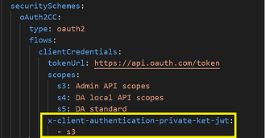
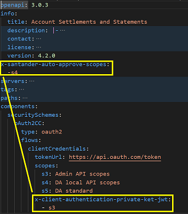

# 3. Security Standards

!!! warning
    This document is currently under review by the Security team and some features may change. This section will be updated as soon as it is available.

### Security Principles (Recommended)

- End-To-End
    - Defined and implemented from the beginning to the end of the process
    - It allows us to guarantee the security of the services from their exposure as an API, as external services, to the consumption of back-end services.
- Based on the Configuration
    - Allows us to integrate seamlessly security developments.
    - The developers do not need to know any general security feature.
    - The developers need to be aware and try to follow the security code guidelines for APIs to avoid the insertion of vulnerabilities through their development. These guidelines can be found in this [link.](https://confluence.alm.europe.cloudcenter.corp/display/SDDEVOPS/Cyber+security+stuff+for+Security+Champions#CybersecuritystuffforSecurityChampions-4.1Securecodingguidelines)
- Security building blocks integrated into the architecture.
    - It allows us to limit exposure to attacks.
    - A large amount of security controls are included at architectural level.
    - New developments must be in line with security code guidelines for APIs. These guidelines can be found in this [link.](https://confluence.alm.europe.cloudcenter.corp/display/SDDEVOPS/Cyber+security+stuff+for+Security+Champions#CybersecuritystuffforSecurityChampions-4.1Securecodingguidelines)
- Architecture allows the seamless integration with additional security services, e.g., Global SOC.
- API-centric Security
    - Apply API-centric security for threat protection. Threat analysis for Common APIs has been carried out and is available for guidance at this [link.](https://confluence.alm.europe.cloudcenter.corp/display/SDDEVOPS/Cyber+security+stuff+for+Security+Champions#CybersecuritystuffforSecurityChampions-4.2ThreatmodelforAPIs)
    - API security is guaranteed through an architecture with components, threat analysis, secure code guidelines and security testing. The Secure Development lifecycle for Common APIs is available at this [link.](https://confluence.alm.europe.cloudcenter.corp/display/SDDEVOPS/Cyber+security+stuff+for+Security+Champions#CybersecuritystuffforSecurityChampions-4.4.SecureDevelopmentlifecycleforCommonAPIs)
- The same services can be consumed regardless of which identity provider is the one that made the login, as long as this identity provider respects security standards.
- Communication MUST BE Secured with SSL Protocol. The crypto standard for the group indicates TLS 1.3, TLS 1.2 with a restricted set of cipher suites (according to the same standard) can also be used if TLS 1.3 negotiation is not possible.

### **API Security Required - OAuth 2.0 Standard (Mandatory)**

- OAuth 2.0 Standard Protocol Authentication required if API is requested by an application ([RFC-6749](std-rfcs.md#rfc-6749)).
- Threat model for OAuth has been also considered and is available at this [link](https://confluence.alm.europe.cloudcenter.corp/display/SDDEVOPS/Cyber+security+stuff+for+Security+Champions#CybersecuritystuffforSecurityChampions-4.4.OAuthserver-threatmodel).

### Grant types supported (Mandatory)

- Client Credentials.
Security Oauth flow used to secure APIs consumed by trusted internal apps. App in this grant type is logged. <br>

- ROTC (Resource Owner Token Credentials)
Security Oauth flow used to secure APIs consumed by trusted internal apps which required user information. User information included in one Corporate token (user is logged in a Santander security structural page which responses with token in URL) to
OAuth server. This grant type is used to secure Santander functionalities which require a logged user.App and User in this grant type is logged.<br>
 

- JWT Profile.
    1. [RFC-7523](std-rfcs.md#rfc-7523). In santander Group under OAuth2 flow variable with 'implicit' value in security schemes.

- Authorization Code.
Security OAuth flow used to secure APIs consumed by external apps. This grant type is used to secure Santander functionalities which require a logged user. App and User in this grant type are logged.

 

In API security schemes is mandatory include under the Oauth definition type next line code: x-santander-refresh-token: true. If we don't include this line, the API will be vulnerable.

For example:

``` yaml
AC:
    type: oauth2
    description: 'authorization code grant type'
    flows:
        authorizationCode:
            authorizationUrl: $(authorization-url)
            tokenUrl: $(token-url)
            scopes:
                customers.read: Scope that allows to retrieve customer information.
```

#### Oauth 2.0 Scopes

a) The scopes defined SHOULD follow the nomenclature:

    \<entity\>.\<access\_mode\>
     \<entity\>.\<create | read | updatetotal | updatepartial | delete | *controller_verb* \>

The scope verb will depend on the HTTP verb used. *controller_verb* means that the scope name should be the same as the action of the POST controller.

b) In order to be aligned with market standards and Oauth RFC (6749), all APIs secured in Santander Group with Oauth 2.0 must define at least a scope for the API. The scope is mandatory in the request sent to Oauth Server to obtain the Access token.

### **API Security Required – JWT Token (Recommended)**

1. JWT standard Protocol Authentication is required if API is requested by another API ([RFC-7519](std-rfcs.md#rfc-7519))

2. JWT Token MUST only generated in Gateway.

3. JWT security definition in yaml

``` yaml
    securitySchemes:
        JWT:
            type: http
            scheme: bearer
            bearerFormat: JWT
    security:
        -JWT: []
```

### Sensitive data management procedure (Recommended)

[Handling Confidential Data in APIs](https://confluence.alm.europe.cloudcenter.corp/display/ARCHSEC/%5BAPISEC%5D+DP+-+Handling+Confidential+Data+in+APIs)

### Client Assertion pattern (Recommended)

Information related to this pattern is available here:

- [Client Authentication](https://confluence.alm.europe.cloudcenter.corp/display/ARCHSEC/%5BAPISEC%5D+ABB+-+Client+Authentication)<br>
- [JWT Profile for Client Application Authentication](https://confluence.alm.europe.cloudcenter.corp/display/ARCHSEC/%5BAPISEC%5D+ABB+-+JWT+Profile+for+Client+Application+Authentication)

When a security of type client assertion is defined, the array of scopes that require consumption only with private\_key\_jwt must be defined in a field within the security definition with the name: "x-client-authentication-private-key-jwt"
(as in the yellow box below the image).<br>


In some APIs it is necessary to mark certain scopes of type self-approval.

It has been placed in the info section, but it makes much more sense to include it within the security definition itself under the x-client-auto-approve-scopes parameter, as scopes are attributes of a specific grant.
 This change makes the security definition much more complete.<br>


### SCA Sign Pattern (Deprecated)

!!! warning
    Currently a new solution for SCA is being defined. This section will be updated as soon as it is available.

To validate a Payment token when implementing SCA next steps must be done:

1. Obtain JWT Payment token from Sca-Token Header
2. JWT token validation (with the public key) aligned with RFC-7519
3. Consult the value of 'alg' claim to know the algorithm used to obtain the payload Hash
4. Calculate the request payload hash through the obtained algorithm in the previous step
5. Compare values achieved from algorithm over the payload and the value of 'hd' claim and if they are the same, continue with the process
6. If values are different, a 401 HTTP response will be returned

 If  more detailed information is needed, please check this link:

[https://confluence.alm.europe.cloudcenter.corp/display/COMM/02+-+Security](https://confluence.alm.europe.cloudcenter.corp/display/COMM/02+-+Security)
