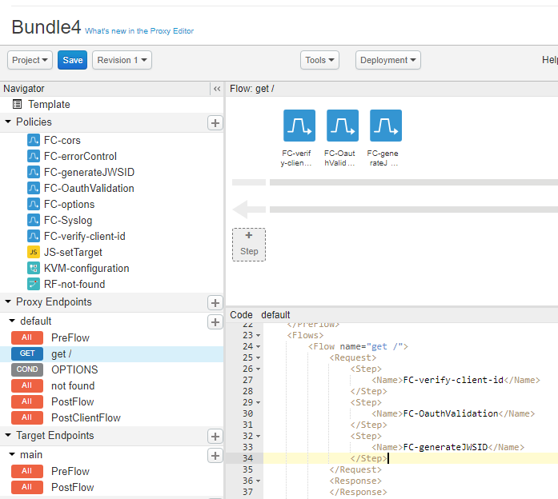
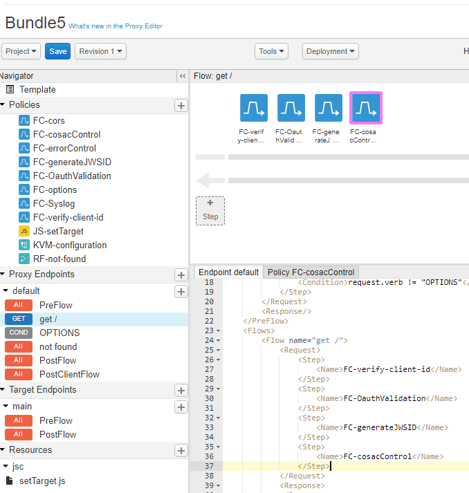
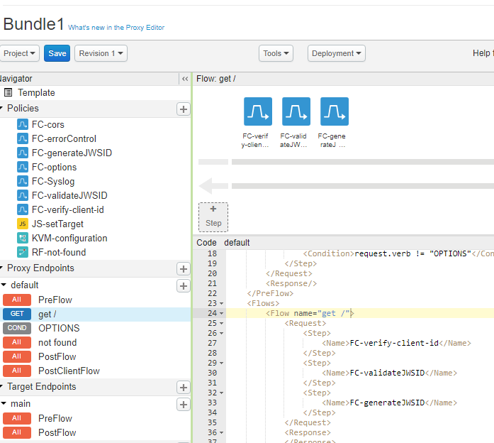
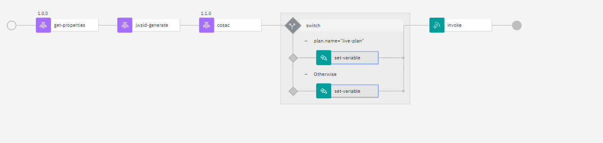

# Gluon API policies

Gluon has accepted the following policies for Apigee and IBM API Connect v10. The deployment archetype includes some policies for each API Manager.

**It is mandatory that before deploying an API, the policies are installed in the API Manager because otherwise the deployment will fail.**

## 1. Apigee list of Gluon policies

At the moment, Apigee’s OPDK policies in Gluon are different depending on the region (Europe or Brazil) but in the coming months work will be done to have common policies in all entities that are using Apigee.

Policies included in the deployment archetype for **Apigee OPDK Europe** (more info about the policies is in the policies repositories):

- cors
- setProperties
- KVM
- verifyClientId
- oauthValidation (only when the oauth security is defined in the API)
- validateJWSID (only when the JWSID security is defined in the API)
- generateJWSID
- cosacControl (only when Operative Control is defined)

See an example of the policies deployed in an API in Apigee OPDK Europe with Oauth security:

In the image you can see an example of a bundle with Oauth Security & JWSID Generation

 
In the image you can see an example of a bundle with Oauth Security & JWSID Generation & CosacControl

 
In the image you can see an example of a bundle with JWSID Security & JWSID Validation & JWSID Generation

Policies included in the deployment archetype for **Apigee OPDK Brazil** (more info about the policies included in the policies repositories):

- rate limit for Brazil
- validate API key
- set appname header
- validate oauth Brazil Access Token

The complete list of the Apigee policies availables in Gluon for both regions:

|Gluon policy|Versions|Type of policy|Description|Apigee Region|Archetype|Repositories|
|------------|--------|------|-----------|---------|------------|------------|
|API Proxy default functionalities|1.0.0|API management policy|<li>Europe: It includes defaultErrorRules, PreFlow (setProperties), PostClientFlow (syslog), OPTIONS method and notFound. </li><li>Brazil: It includes defaultErrorRules, PostClientFlow (log write) and OPTIONS method.</li>|<li>Europe</li><li>Brazil</li>|Deployment Archetype v1.4.0|<li>Europe functionalities: [options policy](https://github.com/santander-group-shared-assets/gln-apis-apigee-policies-options/tree/1.0.0), [cors policy](https://github.com/santander-group-shared-assets/gln-apis-apigee-policies-cors)</li><li>[Brazil Apigee functionalities](https://github.com/santander-group-shared-assets/gln-apis-apigee-opdk-policies/tree/main/apigee-opdk-brazil)</li>|
|errorControl|1.0.0|API management policy|Check that the changes work properly and are compatible. <li>Europe: By default, the error returned will be the one specified in the standards and patterns.</li><li>Brazil has a specific error format, not based in the standardsand patterns defined for Global.</li>|<li>Europe</li><li>Brazil</li>|Deployment Archetype v1.4.0|<li>[Europe errorControl policy](https://github.com/santander-group-shared-assets/gln-apis-apigee-policies-error-control/tree/1.0.0)</li><li>[Brazil errorControl policy](https://github.com/santander-group-shared-assets/gln-apis-apigee-opdk-policies/tree/main/apigee-opdk-brazil/arch-fault-rules)</li>|
|getProperties|1.0.0|API management policy|It is a part of the preproxy FlowHook (optional). If you cannot use and you want to obtain the variables in each policy you can choose.|<li>Europe</li>|Not included in deployment archetype| [Europe getProperties policy](https://github.com/santander-group-shared-assets/gln-apis-apigee-policies-get-properties/tree/1.0.0)|
|postProxyFlowHook|1.0.0|API management policy|<li>Europe: It includes Assign Message policy "securityHeaders" to add and remove some headers.</li><li>Brazil: It includes Assign Message policy "securityHeaders" to add and remove some headers; and send logs and status code</li>|<li>Europe</li><li>Brazil</li>|Not included in deployment archetype|<li>[Europe postProxyFlowHook](https://github.com/santander-group-shared-assets/gln-apis-apigee-policies-postproxy-flowhook/tree/1.0.0)</li><li>[Brazil postProxyFlowHook](https://github.com/santander-group-shared-assets/gln-apis-apigee-opdk-policies/tree/main/apigee-opdk-brazil/arch-postclientflow)</li>|
|preProxyFlowHook|1.0.0|API management policy|It includes getProperties (optional) and observability policies.|<li>Europe</li><li>Brazil</li>|Not included in deployment archetype|[Europe preProxyFlowHook](https://github.com/santander-group-shared-assets/gln-apis-apigee-policies-preproxy-flowhook/tree/1.0.0)|
|preTargetFlowHook|1.0.0|API management policy|It includes setTargetUrl policy.|Europe|Not included in deployment archetype|-|
|Rate limit| 1.0.0|API management policy| Policy to limit requests to avoid the limits of the consume of the API. |Brazil|Deployment Archetype v1.4.0|[Brazil rate limit policy](https://github.com/santander-group-shared-assets/gln-apis-apigee-opdk-policies/tree/main/apigee-opdk-brazil/arch-rate-limit)|
|Set appname header| 1.0.0|API management policy|Set a header needed to Arsenal framework.|Brazil|Deployment Archetype v1.4.0|[Brazil set appname header](https://github.com/santander-group-shared-assets/gln-apis-apigee-opdk-policies/tree/main/apigee-opdk-brazil/arch-set-appname-header)|
|setProperties|1.0.0|API management policy|New policy to substitute the use of the KVMs. This Assign Message policy will be in each API proxy operation or in the API Proxy preflow.|Europe|Deployment Archetype v1.4.0|[setProperties policy](https://github.com/santander-group-shared-assets/gln-apis-apigee-policies-set-properties/tree/1.0.0)|
|setTargetUrl|1.0.0|API management policy|This JavaScript will be used with setProperties in the target endpoints of the API proxies.|Europe|Deployment Archetype v1.4.0|It is a policy includes in the deployment archetype|
| **New policy:** verifyClientId | 1.0.0| API management policy | It validates clientId within of header or query param. |All regions| Deployment Archetype v1.4.0 |[verifyclientId policy](https://github.com/santander-group-shared-assets/gln-apis-apigee-policies-verify-clientId/tree/1.0.0)|
|verifyClientId or validateAPIKey|1.0.0|API management policy| **New verifyClientId policy available**<li>Europe: It validates clientId within of header or query param.</li><li>Brazil: It validates clientId within of header</li>|<li>Europe</li><li>Brazil</li>| Deployment Archetype v1.4.0|<li>[Europe verifyClientId policy](https://github.com/santander-group-shared-assets/gln-apis-apigee-opdk-policies/tree/main/apigee-opdk-europe/verifyClientId)</li><li>[Brazil validate APIkey policy](https://github.com/santander-group-shared-assets/gln-apis-apigee-opdk-policies/tree/main/apigee-opdk-brazil/arch-validate-api-key)</li>|
|clientCertificateValidation|1.0.0|Security policy|External WAF must propagate a header with CN certificate value. Validate use case mTLS.|Europe|WIP. Not included in deployment archetype||
|generateJwt|1.0.0|Security policy|This policy generates a JWT token. Multiples audiences are allowed.|Europe|Not available to use in deployment Archetype|[Europe generateJWT policy](https://github.com/santander-group-shared-assets/gln-apis-apigee-policies-generate-jwt/tree/1.0.0)|
| **New policy:** generateJWSId | 1.2.0| Security policy | Generate a JWSId token based in these [requirements](https://santandernet.sharepoint.com/sites/SantanderPlatforms/SitePages/Identity-%26-SAA-JWT-claims(1).aspx).|All regions| Deployment Archetype v1.4.0 |[generateJWSId policy](https://github.com/santander-group-shared-assets/gln-apis-apigee-policies-generate-jwsid/tree/1.2.0)|
|oauthValidation|1.0.0|Security policy| It validates the access token against an external Oauth Server (GOS/SOS). CheckScope policy included.|Europe|Deployment Archetype v1.4.0|[Europe oauthValidation policy](https://github.com/santander-group-shared-assets/gln-apis-apigee-opdk-policies/tree/main/apigee-opdk-europe/oauthValidation)|
| **New policy:** oauthValidation | 1.1.0 | Security policy |It validates the access token against an external Oauth Server. |All regions| Deployment Archetype v1.4.0 |[oauthValidation policy](https://github.com/santander-group-shared-assets/gln-apis-apigee-policies-oauth-validation/tree/1.1.0)|
|validateBks|1.0.0|Security policy| _policy deprecated_ but it is accepted in the cases that some entities needs to use it.|Europe|Not included in deployment archetype|No policy available|
|validateJwt|1.0.0|Security policy| Validate token JWT received against a public key obtained from a PKM.|Europe|Not available to use in deployment Archetype|[Europe validateJWT policy](https://github.com/santander-group-shared-assets/gln-apis-apigee-policies-validate-jwt/tree/1.0.0)|
| **New policy:** validateJWSId | 1.2.0| Security policy | Validate a JWSId token against a public key within of the gateway|All regions| Deployment Archetype v1.4.0  |[validateJWSId policy](https://github.com/santander-group-shared-assets/gln-apis-apigee-validate-jwsid/tree/1.2.0)|
| **New policy:** cosacControl | 1.1.0| Security policy |This Shared Flow executes a Channel Operation Control using data received in the request|All regions| Deployment Archetype v1.4.0  |[cosacControl policy](https://github.com/santander-group-shared-assets/gln-apis-apigee-policies-cosac-control/tree/1.1.0)|
|Validate Access Token|1.0.0|Security policy|It validates the access token against an external Oauth Server (keycloack). |Brazil|Deployment Archetype v1.4.0|[Brazil validate Access Token policy](https://github.com/santander-group-shared-assets/gln-apis-apigee-opdk-policies/tree/main/apigee-opdk-brazil/arch-validate-access-token)|
|Observability|1.0.0|Observability policy|Observability X-B3* headers. If they are included in the request this policy propagates the headers and if not it adds the policies.|<li>Europe</li><li>Brazil</li>|Not included in deployment archetype|Europe: Policy included in preProxyFlowHook policy|
|Syslog|1.0.0|Observability policy|_Solution pending review._ It will be in the postclient flow instead of the postproxy flow hook. It includes logManagement policy.|Europe|Deployment Archetype v1.4.0|It is a policy included in the deployment archetype|

### Infrastructure security global policies

|Gluon policy|Versions|Type of policy|Description|Repositories|
|------------|--------|------|-----------|------------|
|**New global policy:** SQL Injection| 1.0.0|Security global policy|Establish the necessary controls to prevent SQL Injection attacks.|[SQL Injection](https://github.com/santander-group-shared-assets/gln-apis-apigee-policies-sql-injection-nosql-injection/tree/1.0.0)|
|**New global policy:** NoSQL Injection| 1.0.0|Security global policy|Establish the necessary controls to prevent NoSQL Injection attacks.|[NoSQL Injection](https://github.com/santander-group-shared-assets/gln-apis-apigee-policies-sql-injection-nosql-injection/tree/1.0.0)|
|**New global policy:** OS Command Injection| 1.0.0|Security global policy|Establish the necessary controls to prevent OS Command Injection attacks.|[OS Command Injection](https://github.com/santander-group-shared-assets/gln-apis-apigee-policies-sql-injection-nosql-injection-os-command-injection/tree/1.0.0)|
|**New global policy:** LDAP Injection| 1.0.0|Security global policy|Establish the necessary controls to prevent LDAP Injection attacks.|[LDAP Injection](https://github.com/santander-group-shared-assets/gln-apis-apigee-policies-sql-injection-nosql-injection-ldap-injection-os-command-injection/tree/1.0.0)|

### Other policies

Deployment pipelines with these policies will be available in future releases

|Gluon policy|Versions|Type of policy|Description|Repositories|
|------------|--------|------|-----------|------------|
|**New policy:** Obfuscation| 1.0.0|API management policy|This policy provides the necessary mechanisms to hide sensitive information found within certain fields.|[Obfuscation](https://github.com/santander-group-shared-assets/gln-apis-apigee-policies-obfuscation/tree/1.0.0)|
|**New policy:** Whitelist| 1.0.0|API management policy|In order to control wanted connections from certain API consumers, an IP control policy that belongs to a whitelist is established.|[Whitelist](https://github.com/santander-group-shared-assets/gln-apis-apigee-policies-whitelist/tree/1.0.0)|
|**New policy:** Blacklist| 1.0.0|API management policy|In order to control unwanted connections from certain API consumers, an IP control policy that belongs to a blacklist is established.|[Blacklist](https://github.com/santander-group-shared-assets/gln-apis-apigee-policies-blacklist/tree/1.0.0)|
|**New policy:** CORS| 2.0.0|API management policy|Cross-Origin Resource Sharing (CORS) is a mechanism that uses additional HTTP headers to allow a user agent (en-US) to get permission to access selected resources from a server, on a different origin (domain) to which it belongs.|[CORS](https://github.com/santander-group-shared-assets/gln-apis-apigee-policies-cors/tree/2.0.0)|
|**New policy:** JSON Validation| 1.0.0|API management policy|The objective of this policy is to ensure that the messages received are correctly formed and with appropriate content.|[JSON-Validation](https://github.com/santander-group-shared-assets/gln-apis-apigee-policies-json-validation/tree/1.0.0)|

About type of policies:

- **`API Management`**: policies used to make functionalities work according to the group's standards.
- **`Security policies`**: policies to guarantee the security defined by Cybersecurity.

  :link: API security policies documentation [here](https://santandernet.sharepoint.com/sites/SantanderPlatforms/SitePages/API-Security-Policies.aspx)

- **`Observability policies`**:
    - `Monitoring`:
        - Europe: a Dynatrace agent (OneAgent) is installed in all Apigee machines and then all machines are monitorized in Dynatrace. A plugin for Apigee in Dynatrace is used to monitor and to obtain dashboard for Apigee.
        Also, observability policies were developed to add X-B3* and W3C headers for tracing.
        - Brazil: TBD
    - `Logging`: :link: Gluon Observability official link for [logging](../../../../../../application/observability-insights/observability/obs-foundations/logs/index.md)
        - Europe: (_work in progress_)
        - Brazil: a fluentd agent is installed on Apigee gateway machines that gets all the logs from the machine and then sends the logs to a kafka. Kafka sends to a logstash container and here a log procedure is performed.
        Finally, logstash sends the logs to elastic.

## 2. IBM API Connect v10 policies

> NOTE: At the moment, these policies were agreed with Santander SCIB, HQ and Totta (they are migrating from v5 to v10) in order to align all policies.

Policies included in the deployment archetype for **IBM API Connect v10** (more info about the policies included in the policies repositories):

- get-properties
- jwsid-generate
- jwsid-validate
- cosac
- set-properties (**WIP. Not yet included in the deployment archetype**)
- switch
- invoke

See an assembly example of the policies in an API with Oauth security:

### Infrastructure prerequisites IBM API Connect v10 policies

|Gluon policy|Versions|Type of policy|Description|Repositories|
|------------|--------|------|-----------|------------|
|APImConfig domain| 1.0.0| API management policy|Domain with properties files used in the different APIs.|[APImConfig](https://github.com/santander-group-shared-assets/gln-apis-ibm-policies-apim-config-domain)|
|Extension| 1.0.0|API management policy|It allows to select the oauth servers in each gateway, deploy custom policies and install configuration files in file system|[Extension](https://github.com/santander-group-shared-assets/gln-apis-ibm-policies-extensions)|
|preFlow policy| 1.0.0|API management policy| Policy that loads a list of security policies to be executed before proxy execution. Deploy code to select oauth server based on gateway service the request is executed on|[pre-flow](https://github.com/santander-group-shared-assets/gln-apis-ibm-policies-pre-flow)|
| **New policy:** jwsid-generate | 1.3.1| Security policy | Generate a JWSId token based in Cybersecurity [requirements](https://santandernet.sharepoint.com/sites/SantanderPlatforms/SitePages/Identity-%26-SAA-JWT-claims(1).aspx).|[JWSid-generate](https://github.com/santander-group-shared-assets/gln-apis-ibm-policies-generate-jwsid/tree/1.3.1)|
| **New policy:** jwsid-validate | 1.2.0|Security policy | Validate a JWSId token |[JWSid-validate](https://github.com/santander-group-shared-assets/gln-apis-ibm-policies-validate-jwsid/tree/1.2.0)|
| **New policy:** COSAC | 1.1.0| Security policy | This policy executes a Channel Operation Control using data received in the request based in Cybersecurity [requirements](https://santandernet.sharepoint.com/sites/SantanderPlatforms/SitePages/Channel-operational-security.aspx).|[COSAC](https://github.com/santander-group-shared-assets/gln-apis-ibm-policies-cosac-control/tree/1.1.0)|

### Infrastructure security global policies

|Gluon policy|Versions|Type of policy|Description|Repositories|
|------------|--------|------|-----------|------------|
|**New global policy:** SQL Injection| 1.0.0|Security global policy|Establish the necessary controls to prevent SQL Injection attacks.|[SQL Injection](https://github.com/santander-group-shared-assets/gln-apis-ibm-policies-sql-injection-nosql-injection/tree/1.0.0)|
|**New global policy:** NoSQL Injection| 1.0.0|Security global policy|Establish the necessary controls to prevent NoSQL Injection attacks.|[NoSQL Injection](https://github.com/santander-group-shared-assets/gln-apis-ibm-policies-sql-injection-nosql-injection/tree/1.0.0)|
|**New global policy:** OS Command Injection| 1.0.0|Security global policy|Establish the necessary controls to prevent OS Command Injection attacks.|[OS Command Injection](https://github.com/santander-group-shared-assets/gln-apis-ibm-policies-sql-injection-nosql-injection-os-command-injection/tree/1.0.0)|
|**New global policy:** LDAP Injection| 1.0.0|Security global policy|Establish the necessary controls to prevent LDAP Injection attacks.|[LDAP Injection](https://github.com/santander-group-shared-assets/gln-apis-ibm-policies-sql-injection-nosql-injection-ldap-injection-os-command-injection/tree/1.0.0)|

### Gluon deployment profiles policies

>The deployment profiles available in GLUON are listed below. Although all the profiles are listed, you should look at the **DEFINED PROFILE** label that indicates the profiles allowed by GLUON.

#### Client profiles

##### JWSID + COSAC

This table shows the policies used for the following profiles:

- **authorization-code-cosac** **DEFINED PROFILE**. : Security type Oauth2, flow authorization code, generate a JWSID Bearer token, applied operational control
- **jwt-profile-cosac** **There is currently no use case for deploying this profile**. :Security type Oauth2, flow implicit, generate a JWSID Bearer token, applied operational control

API Connect custom policies:

|Gluon policy|Versions|Type of policy|Description|Repositories|
|------------|--------|------|-----------|------------|
|get-properties| 1.0.0|API management policy|Config file with variables that the API use in the policies of the assembly.|[get-properties](https://github.com/santander-group-shared-assets/gln-apis-ibm-policies-get-properties)|
| **New policy:** jwsid-generate | 1.3.1| Security policy | Generate a JWSId token based in Cybersecurity [requirements](https://santandernet.sharepoint.com/sites/SantanderPlatforms/SitePages/Identity-%26-SAA-JWT-claims(1).aspx).| [JWSid-generate](https://github.com/santander-group-shared-assets/gln-apis-ibm-policies-generate-jwsid/tree/1.3.1)|
| **New policy:** COSAC | 1.1.0| Security policy | This policy executes a Channel Operation Control using data received in the request based in Cybersecurity [requirements](https://santandernet.sharepoint.com/sites/SantanderPlatforms/SitePages/Channel-operational-security.aspx).|[COSAC](https://github.com/santander-group-shared-assets/gln-apis-ibm-policies-cosac-control/tree/1.1.0)|

##### JWSID (Without COSAC)

This table shows the policies used for the following profiles:

- **authorization-code-jwsid** **DEFINED PROFILE**. : Security type Oauth2, flow authorization code, generate a JWSID Bearer token
- **jwt-profile-jwsid** **There is currently no use case for deploying this profile**. : Security type Oauth2, flow implicit, generate a JWSID Bearer token
- **client-credentials-jwsid** **There is currently no use case for deploying this profile**. : Security type Oauth2, flow client credentials, generate a JWSID Bearer token

API Connect custom policies:

|Gluon policy|Versions|Type of policy|Description|Repositories|
|------------|--------|------|-----------|------------|
|get-properties| 1.0.0|API management policy|Config file with variables that the API use in the policies of the assembly.|[get-properties](https://github.com/santander-group-shared-assets/gln-apis-ibm-policies-get-properties)|
| **New policy:** jwsid-generate | 1.3.1| Security policy | Generate a JWSId token based in Cybersecurity [requirements](https://santandernet.sharepoint.com/sites/SantanderPlatforms/SitePages/Identity-%26-SAA-JWT-claims(1).aspx).|[JWSid-generate](https://github.com/santander-group-shared-assets/gln-apis-ibm-policies-generate-jwsid/tree/1.2.1)|

#### Core profiles

##### JWSID

This table shows the policies used for the following profiles:

- **jwsid** **DEFINED PROFILE**.  : Security type http, scheme bearer, generate a JWSID Bearer token

API Connect custom policies:

|Gluon policy|Versions|Type of policy|Description|Repositories|
|------------|--------|------|-----------|------------|
|get-properties| 1.0.0|API management policy|Config file with variables that the API use in the policies of the assembly.|[get-properties](https://github.com/santander-group-shared-assets/gln-apis-ibm-policies-get-properties)|
| **New policy:** jwsid-generate | 1.3.1| Security policy | Generate a JWSId token based in Cybersecurity [requirements](https://santandernet.sharepoint.com/sites/SantanderPlatforms/SitePages/Identity-%26-SAA-JWT-claims(1).aspx).|[JWSid-generate](https://github.com/santander-group-shared-assets/gln-apis-ibm-policies-generate-jwsid/tree/1.3.1)|
| **New policy:** jwsid-validate | 1.2.0|Security policy | Validate a JWSId token |[JWSid-validate](https://github.com/santander-group-shared-assets/gln-apis-ibm-policies-validate-jwsid/tree/1.2.0)|

#### Common policies out the box

This API Connect policies are used in all gluon profiles

API Connect Policies out the box:

|API Connect policy|Versions|Type of policy|Description|More information|
|------------|--------|------|-----------|------------|
|invoke| 2.2.0|API management policy|Template in pipelines in order to config the targetUrl.| [More information](https://www.ibm.com/docs/en/api-connect/10.0.5.x_lts?topic=invoke-configuring-policy-datapower-api-gateway)|
|switch| 2.0.0|API management policy|Template in pipelines in order to config the switch policy.|[More information](https://www.ibm.com/docs/en/api-connect/10.0.5.x_lts?topic=execute-switch)|

#### Other policies

Deployment pipelines with these policies will be available in future releases

|Gluon policy|Versions|Type of policy|Description|Repositories|
|------------|--------|------|-----------|------------|
|**New policy:** Obfuscation| 1.0.0|API management policy|This policy provides the necessary mechanisms to hide sensitive information found within certain fields.|[Obfuscation](https://github.com/santander-group-shared-assets/gln-apis-ibm-policies-obfuscation/tree/1.0.0)|
|**New policy:** Whitelist| 1.0.0|API management policy|In order to control wanted connections from certain API consumers, an IP control policy that belongs to a whitelist is established.|[Whitelist](https://github.com/santander-group-shared-assets/gln-apis-ibm-policies-whitelist/tree/1.0.0)|
|**New policy:** Blacklist| 1.0.0|API management policy|In order to control unwanted connections from certain API consumers, an IP control policy that belongs to a blacklist is established.|[Blacklist](https://github.com/santander-group-shared-assets/gln-apis-ibm-policies-blacklist/tree/1.0.0)|
|**New policy:** COSAC| 2.0.0| Security policy | This policy executes a Channel Operation Control using data received in the request based in Cybersecurity [requirements](https://santandernet.sharepoint.com/sites/SantanderPlatforms/SitePages/Channel-operational-security.aspx).|[COSAC](https://github.com/santander-group-shared-assets/gln-apis-ibm-policies-cosac-control)|
| **New policy:** jwsid-generate | 2.0.0| Security policy | Generate a JWSId token based in Cybersecurity [requirements](https://santandernet.sharepoint.com/sites/SantanderPlatforms/SitePages/Identity-%26-SAA-JWT-claims(1).aspx).|[JWSid-generate](https://github.com/santander-group-shared-assets/gln-apis-ibm-policies-generate-jwsid)|

About type of policies:

- **`API Management`**: policies used to make functionalities work according to the group's standards.
- **`Security policies`**: policies to guarantee the security defined by Cybersecurity. :link: API security policies documentation [here](https://santandernet.sharepoint.com/sites/SantanderPlatforms/SitePages/API-Security-Policies.aspx)

- **`Observability policies`**:
    - `Monitoring`: Dynatrace does not have any agent working on IBM API Connect v10. The current solution from SCIB creates alerts with watchers in elastic and they are sent to Dynatrace who creates a ServiceNow.

    - `Logging`:
      :link: Gluon Observability official link for [logging](../../../../../../application/observability-insights/observability/obs-foundations/logs/index.md) 
      From IBM API Manager the api event is sent to a kafka and then, the Getafe platform observability gives the log format previously to send the log to a logstash and elastic.
