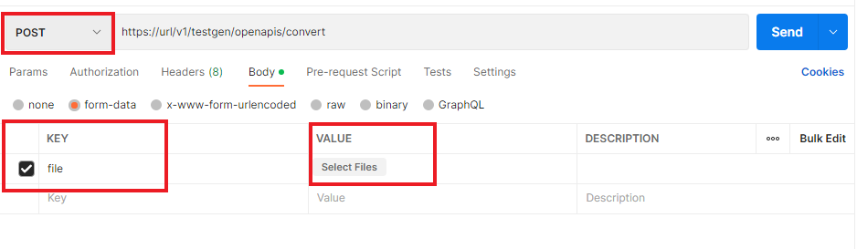
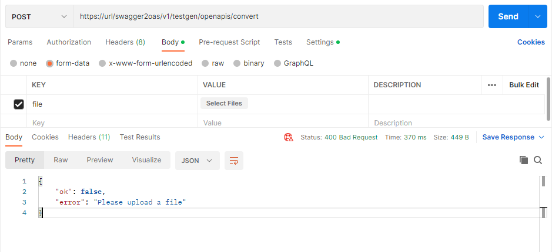
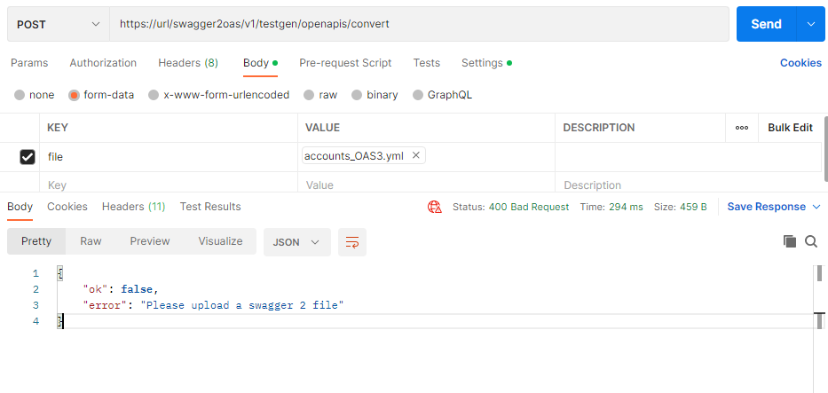
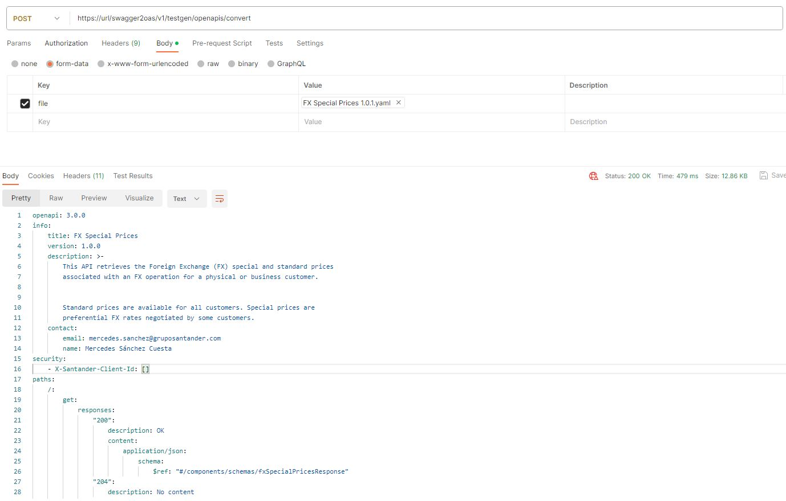

### How to migrate APIs from swagger 2 to OpenAPI3

Gluon only support OpenAPI3 standard for APIs, so all Swagger 2 APIs must be converted to [OpenAPI3 specification](https://www.openapis.org/) using the Gluon OpenAPI3 Converter.

To make this process easier, Gluon has a tool available to make the format conversion. To use it, it will be necessary to make a call to an API.

Please use this code to import the request in postman tool or download the postman collection:

```bash
curl --location --request POST 'https://gluon.gs.corp/swagger2oas/v1/testgen/openapis/convert' \
--form 'file=@"api-specification.yml"'
```

Postman collection: [Postman collection conversion request](../../lifecycle/images/apimigration/ConvertOAS3tool.postman_collection.json)

The request is a POST HTTP verb must be used and the body must be in form-data, which key has to be the word "file" and the content must be the yaml in Swagger 2 format.



If a file is not attached, an error "*400 Bad Request*" will be returned as shown in the following image.



Otherwise, if the file has other format different from Swagger 2 or it is already in OpenApi3 format, the error returned will be "*400 Bad Request*" as shown in the following image.



If the conversion has finished correctly, the API returns a *200 HTTP status code* and the yaml file in OpenAPI3 specification.


