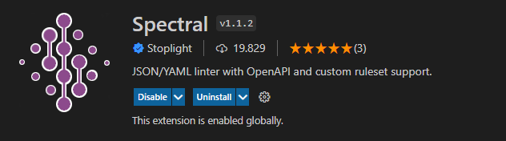
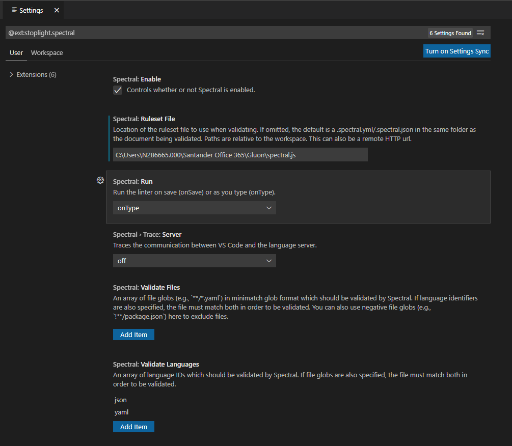
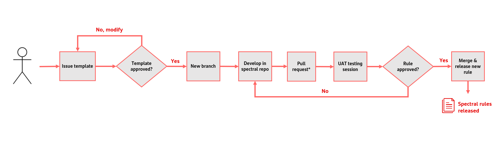
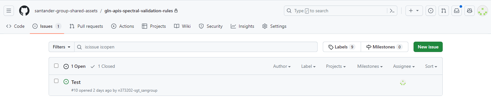
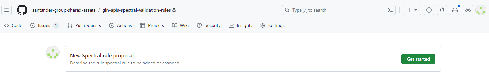
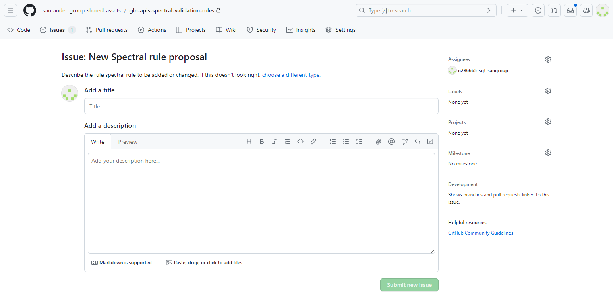

## Spectral Rules

In order to validate the API definitions using the rules defined in the Group, you have to follow these steps:

- Install Visual Studio Code from the corporative installer.
- Install Spectral extension.

- Download the javascript file in which the rules are coded. [Spectral Javascript rules](https://github.com/santander-group-shared-assets/gln-apis-spectral-validation-rules)
- In Spectral extension settings include the javascript file with the rules that has been downloaded. It must be a local route to your computer. It does not work using the URL from the repository.

## Spectral rules governance process

Any Gluon team can develop a spectral rule to automate an existing standard. The steps are the following:

### Issues

From the [spectral rules repository](https://github.com/santander-group-shared-assets/gln-apis-spectral-validation-rules) select the Tab "Issues"

Into the issues section click on "Get Started" in "New Spectral rule proposal".

Fill in the proposal detailing the existing standard to code in the spectral rule. It is mandatory to code an existing standard.

### Developing and activating the rule

Once the issue has been fully described, it is reviewed by Gluon APIS team, which will decide if the proposal is valid. If it is valid, Gluon APIs will create a new branch in which the requesting team will develop the rule.

When the rule is developed and tested, the delivery team will make the pull request, which MUST include the following information:

- Standard which is implemented by the rule included.
- Readme modification with full description of the rule.

With this information Gluon APIs and Global head of APIs team will carry on tests to ensure the rule is correct.

When all the test have been performed, the pull request can be approved and the rule will be added in the next Spectral rules release to be promoted into production.
