## Introduction

The Terms Dictionary is unique and mandatory for all consumption APIs between group systems, whether within an entity, between entities, or between global platforms and other internal systems.

It also supports the definition of events following JSON Schema.

1. It is a tool to manage terms.

2. **Terms are elements associated with functional or technical concepts**. Two types of terms can be distinguished:
    - **Simple**: they are composed of a name and a description.
    - **Structured**: they are also composed of a name and a description, but they contain other terms (simple or structured), providing them with a semantic context which are called business objects.

3. In APIs technology, we call terms to swagger parameters in URL, query, body or header.

    - In body, structured terms (business objects) must be used.
    - In header, path and query, simple terms, with the correspondent notation, must be used.
    - The dictionary offers the functionality to consult the terms in order to use them to define the API and then validate that the API is align with the dictionary.
    - Aligned with dictionary means: all url, query and header simple terms are in the dictionary. All of the complex terms in the body are included in the dictionary as business objects.
    APIs must use the compound terms hierarchies defined in the dictionary. The hierarchies must be used completely until the first term has data.

4. In Events technology, we call terms to the parameters that carry the event's business information.

    - The dictionary offers the functionality to generate a JSON Schema aligned with the dictionary.

## Terms Dictionary browser

All objects and terms are displayed in this section. The Terms Dictionary browser page can be accessed using this [link](https://gluon.gs.corp/gluon/data-platform/terms-dictionary/definitions-tree).
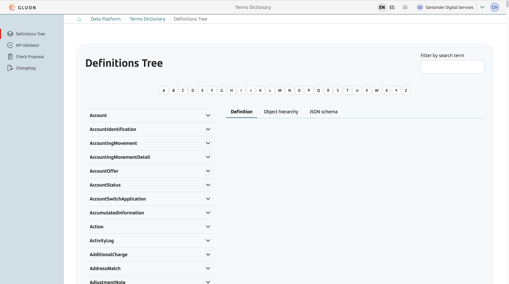

You can search for an object or a term using the search bar.

A list of objects whose names match will be displayed with a blue shading.
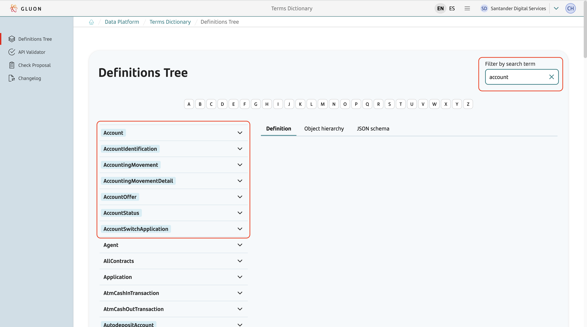

Also you can find an object that has a property that contains the typed search word in its name with a blue shading.
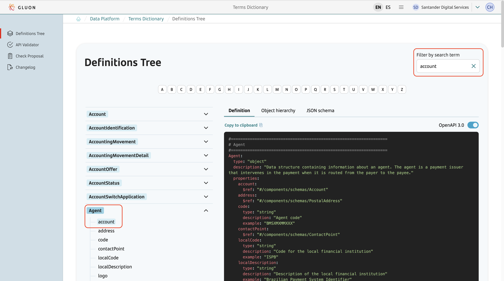

## How to validate an API against the dictionary?

The validator page can be accessed from the main page of the dictionary, just click on the **Validator** button. 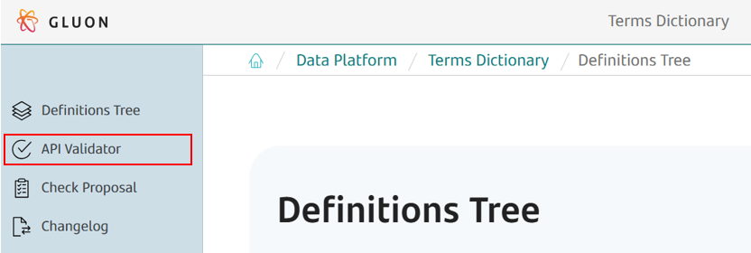

Once the validator screen is opened, the YAML file must be attached and its validation result will automatically appear. 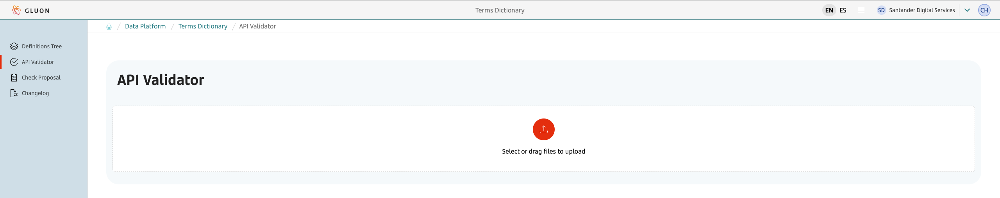

The validator automatically detects whether it is Swagger or OpenAPI and applies the corresponding validations and the output will be shown. 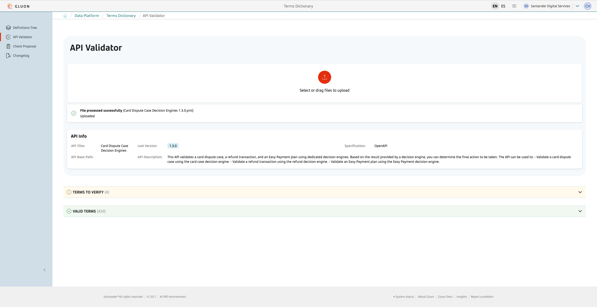

You can review the mismatches of each term if you click on the specified term. You should view the mismatches displayed with a shading. 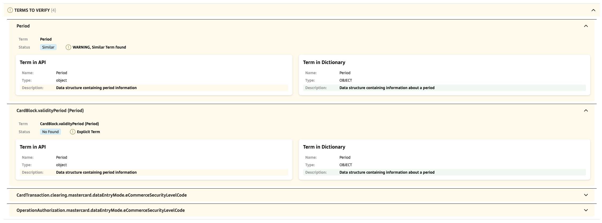

If you have a term in your API definition but that term is not present in the dictionary you should view an empty result in the "Terms in Dictionary" section. 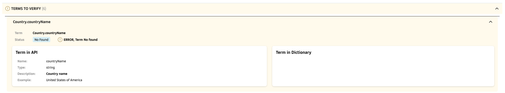

## How to update the dictionary?

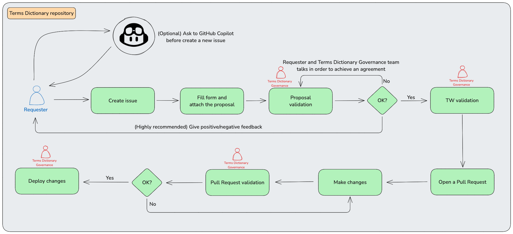

### Submit a proposal

The mechanism to propose a change into the dictionary are the **issues**. All the issues will be created and stored in the **santander-terms-dictionary** repository at **santander-group-shared-assets** GitHub organization.

The issues can be created through this link, [click here.](https://github.com/santander-group-shared-assets/santander-terms-dictionary/issues/new?template=new_dd_proposal.yml)

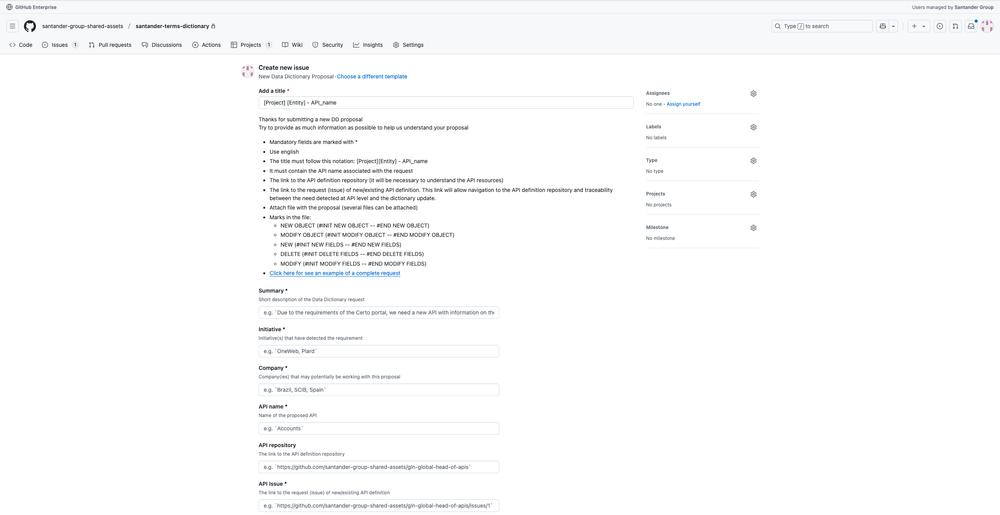


To ensure a better resolution, the issue should be created using the following guidelines:

1. **Subject**: it must contains the project, entity and API name associated with the request.
2. **Detail**: it must contain a detailed explanation of the request/proposal, which must be attached as a file in the issue. This detail must also contain:
    - A description of the request/proposal.
    - Initiative(s) that have detected the requirement.
    - Company(ies) that may potentially be working with this proposal.
    - Name of the proposed API.
    - The link to the API definition repository.
    - The link to the request (issue) of new/existing API definition.
    - A section to upload the proposal file(s).

**NOTE**: in case of not having the API definition repository in Gluon yet, it will be necessary to clearly express in the issue.

You can see an example of a complete request [here](https://github.com/santander-group-shared-assets/santander-terms-dictionary/issues/678).

Once the issue has been created, the Terms Dictionary Governance team analyzes the proposal and if doubts arise or it is necessary to contact the requester for any reason, a conversation will be established through the issue itself.

The next step is the Technical Writing validation. When it is finished, this team will return the edited file which should be the final proposal. It is very important to attach the edited file to the issue in order to maintain a proper traceability.

### Dictionary update

Once the Terms Dictionary Governance team approves the issue, follow these steps to update the dictionary:

1. Open a pull request to include the approved changes in the dictionary.
2. Navigate to the [Terms Dictionary repository](https://github.com/santander-group-shared-assets/santander-terms-dictionary/tree/development/TermsDictionary/SingleTerms), where you will find a list of YAML files.
Each file corresponds to an existing object in the dictionary.
3. Name the feature branch using the format `issue_XXXX` (e.g., `issue_1234`).

As recommendation, use the format **issue_XXXX** for name the feature branch. **It is very important that the base branch is the development branch**.

Just make the changes that have been approved in the issue, add, modify and/or delete file as you need, then open the pull request. The pull request title should be something like this:
**[Project][Entity] Issue XXXX** and in the pull request description add the link to the issue.

The Terms Dictionary Governance team will review, approve and merge the pull request and the dictionary will be update at the end of the day.

### (Optional) Using GitHub Copilot

Before submitting a new proposal, you can use GitHub Copilot to search for dictionary terms that meet your needs.

Navigate to the [Terms Dictionary repository](https://github.com/santander-group-shared-assets/santander-terms-dictionary) and use Copilot to assist you.

Be sure to clearly specify your requirements. The Terms Dictionary Governance team can provide prompting techniques to help optimize your search.

Your search may conclude that there is no object for your needs and therefore it must be created, that the object exists but a new term must be added, or that an object already exists that covers all your needs.

You can submit a new proposal with the information provided by Copilot but is the Terms Dictionary Governance team that has the final say and the initial proposal may require adjustments.

Once the proposal is approved or denied, is highly recommended to return to Copilot and give feedback in order to improve the future proposals.

## Rules to generate a valid proposal

The proposal must be a **text file** represented in **yaml** containing the **required objects** in **swagger** language. The information should be presented in the same way that the dictionary shows the *Definitions Tree*. Three cases can be identified:

1. **Creating** a new object: the complete structure of the new object must be provided.
2. **Deleting** an object: the complete structure of the new object must be provided.
3. **Updating** existing objects: Only the changes must be provided and:
    - The new fields to be added must be identified with comment lines at the beginning and at the end of the new block.
    - In the same way, the fields to be deleted must be identified with comment lines at the beginning and at the end of the block to delete.

You can see the accepted comment lines below:

```txt
NEW OBJECT (#INIT NEW OBJECT -- #END NEW OBJECT)
DELETE OBJECT (#INIT DELETE OBJECT -- #END DELETE OBJECT)
MODIFY OBJECT (#INIT MODIFY OBJECT -- #END MODIFY OBJECT)
NEW (#INIT NEW FIELDS -- #END NEW FIELDS)
DELETE (#INIT DELETE FIELDS -- #END DELETE FIELDS)
MODIFY (#INIT MODIFY FIELDS -- #END MODIFY FIELDS)
```

The provided YAML file must be <u>valid</u> and include the <u>minimum required attributes</u> (see examples below)

- A valid file means there are no errors when it is tested in a Swagger editor under the *definitions* or *components/schemas* section. Errors related to references not found will be accepted if they are references to objects existing in the dictionary.
- Minimum required attributes are:
    - **type**: all terms must declare its type.
    - **description**: all terms (objects and simple terms) must contain a description.
    - **example**: all simple terms must contain an example.

If a proposal is not valid or does not contain all the required attributes will be directly discarded.

### Example requesting new object

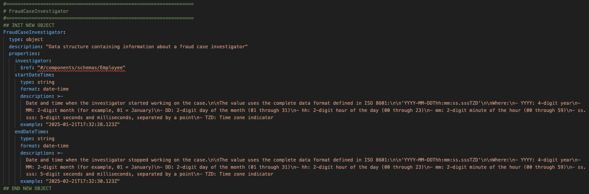

### Example requesting deleting object

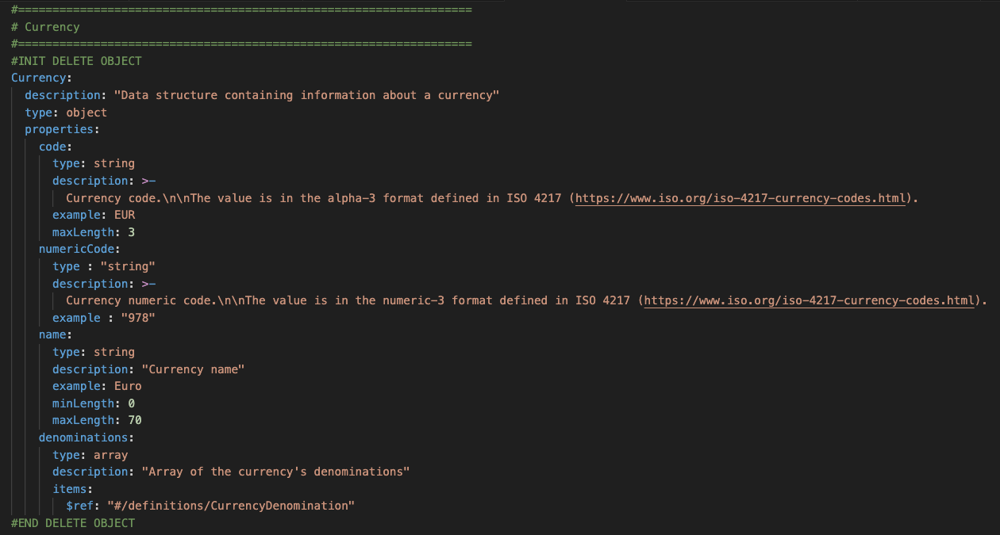

### Example requesting existing object update

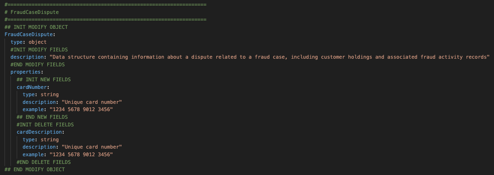

## Modelling Guidelines

The following defines a set of rules, both generic and specific, to be followed when modelling objects in the Terms Dictionary. Following them will speed up the validation process of the proposal.

### Generic rules

- Structured terms should be used.
- Not over-structure, use the necessary structures.
- The descriptions of the terms will always be in english (Oxford standard).
- The dictionary terms will follow the *API Design Standards and Patterns*.
- Use the naming standards to facilitate the reading of the code and understanding. This is *Lower Camel Case* for *attributes* and *Upper Camel Case* for *objects*.
- The dictionary will allow the definition of hierarchies between terms (simple and compound/object).
- The descriptions of the terms must be highly self-explanatory, precise and concise.
- In relation to the information structures:
  - When there is a standard, for example ISO20022, that already has the objects defined, analyze it, use it and adapt it (if necessary).
  - When no standard exists, it will be necessary to model the structures following certain guidelines:
    - Avoid defining the same concept with different descriptions. If it is necessary, add attributes containing that specification (for example, mobile_availability, email_availability -> availability.type).
    - Define structures with generic descriptions that are understood through their context, which facilitates reuse (semantics given by the one who contains them, for example, *Person.document* or *Organization.document*).
    - Grouping of semantically related terms (self-contained).
- When managing attributes containing lists of values (for example, maritalStatus, gender, etc.) they should be modeled using a pair of attributes with the 'Code' and 'Description' suffixes.

### Specific rules

- The aim is to reuse existing objects in the dictionary. For example, if two fields *startDate* and *endDate* must be used in an object, perhaps the Period object already defined in the dictionary could be used. For example, *Customer.validityPeriod*.
- When defining dates, depending on whether they are *date* or *date-time*, add the suffix *Date* or *DateTime* respectively. For example, *Card.issueDate* or *Period.startDateTime*.
- When managing list of values, use '*Code*' and '*Description*' suffixes (also detailed in generic rules). For example, *Person.genderCode* or *Person.genderDescription*.
- When managing a boolean value, try to model it using the prefixes '*can*', '*is*' or '*has*' or the suffix '*Indicator*'. For example, *Account.isBankbookSupported* or *Applicant.hasExistingMortgageApplication*.
- When there is an optional block with grouped information, a boolean attribute can be used to indicate whether that block is reported. For example, *ConfirmingRemittance.isInValidation*.
- To model a list or array a suffix '*List*', '*Array*' or similar should not be used. The plural should be used to indicate that it contains several elements. For example, *Person.documents*.
- Attribute names must be descriptive and allow the identification of their content. For example, *Participant.preferredLanguage*.
- In most cases, the identifier of an the object should be formed with the name of the object followed by the '*id*' suffix. This will allow to identify what the information refers to if the object is returned anonymously. For example, *Person.personId*.
- As far as possible and with some exceptions, avoid the use of abbreviations and use whole words.
- Reuse generic objects. Examples of these objects are:
  - When an issue status must be reported, use the *StatusInfo* object.
  - When audit information must be reported, use the *Audit* object.
  - When a period of time must be reported, use the *Period* or *Term* objects.
  - When an amount must be reported, use the *Amount* object.
  - When a country must be reported, use the *Country* object.
- If an object can handle a single element or several elements (array), define both possibilities and at API level decide whether to use one or the other. For example, *Person.document*, *Person.documents*.
- Use the same criteria when assigning names. For example, if openingDate or creationDate already exists in an object, use the same name to represent the same concept (not use similar ones like openDate, openedDate, createDate, ...).
- Managing lists of values:
  - Situation A: an attribute can take a list of possible values and these values are the same for all APIs.
    - In this case, the possible values must be specified in the dictionary.
    - If there are few values, they can be explicitly declared.
    - If there are a lot of values, a reference to a URL (for example, in the case of ISO values) or a reference to a file containing the values in the Santander Developer MarketPlace can be used.
  - Situation B: an attribute can take a list of possible values and these values are API dependent.
    - In this case, the values mustn't be specified in the dictionary, only the term description must be specified. Since the term description in the dictionary can be extended in the API, the values will be specified at API level.
- When the nature of the attribute is not functional but oriented to how the information should be displayed to the consumer, the prefix '*display*' shall be used. For example, *PostalAddress.displayLine1*.
- When an object offers a link to its own details, a '*link*' attribute must be used. For example, *Account.link*.
- When an object offers a link to other information, an attribute providing information about the referenced elements and the '*Link*' suffix must be used. For example, *Account.balancesLink*.
- Attributes representing rates:
  - No more fields ending with or named '*percentage*' will be created, everything will be '*rate*'.
  - For '*rate*' fields, the definition will contain the phrase '*expressed as a percentage*' if and only if, according to business, that field will only be expressed as a percentage.
  - In all other cases, the way it is represented shall not be specified, it is left to the designers.

## Main Concepts

### Business Object

Business objects (or business terms) are all those objects related with Banking Industry, i.e.: Cards, Payees, Accounts... etc.

These objects <u>exist in the dictionary</u>.

### Structural Object

Structural objects are all those that joined with business object help us to define our interface contracts. These objects can have business semantics such as *Country*, *Currency*, *Amount*, etc or be technical objects such as *Links* or *Error*.

These objects <u>exist in the dictionary</u>.

### Wrapper Object

Wrapper objects are used at API level, both at requests and responses, to create ad-hoc definitions using objects already defined in the dictionary, either business or structural objects.

These objects <u>do not exist in the dictionary</u> and must <u>follow certain syntactic rules</u> so that the validator can verify them. A wrapper must start with:

- The word 'Wrapper' followed by any text, for instance, WrapperGetAlertMessageResponse.

A wrapper has two main uses:

1. **Ad-hoc objects**: define an object that does not exist in the dictionary that is necessary within the context of a given contract. Its attributes **should always be references** to either a Dictionary Object or another wrapper.

2. **Represent multiple aspects of a business object**: it is a special case of a wrapper, (**the x-bizObjRef attribute is used only in this case**) it is used in a contract where it is necessary to represent more than one aspect of the same object.
These wrappers must always declared in first level.

## Actions

The main purpose of the dictionary is to <u>provide object definitions</u> that will later <u>be used when defining contracts</u>, be it API, events or any other technology. In this way, <u>homogeneity</u> will be achieved in all definitions.

There are a series of <u>actions that can be performed when defining these contracts</u>, <u>so that they are aligned with the dictionary</u> even if the information does not match 100% with that of the dictionary.

These actions are:

1. Simplification
2. Replacement
3. Tailoring
4. Wrappers
5. Working with descriptions

### Simplification

The dictionary contains <u>maximal descriptions of the objects</u>. This means that it contains all the attributes that an object may have or at least have been identified so far.
However, at the time of defining a given contract, it may not be desired to report all the information but a subset of it. This is called ***simplification***, taking to the contract a subset of existing information in the dictionary for that object.
By applying this technique, the defined contract will still be aligned with the dictionary.

### Replacement

When defining a contract, it is possible to replace the reference to an object by its explicit declaration, this is what we call ***replacement***. The following image illustrates the action.
By applying this technique, the defined contract will still be aligned with the dictionary.

### Tailoring

We have defined the ***tailoring*** concept but it's simply combine the simplification and the replacement actions. By applying this technique, the defined contract will still be aligned with the dictionary.

### Wrappers

As introduced in the Main Concepts section, a **wrapper** has two main uses, define ad-hoc objects and represent multiples aspects of a business object.

#### Defining ad-hoc objects

In this case, a wrapper is used to define an object that does not exist in the dictionary and it's necessary within the context of a given contract. Its attributes **should always be references** to either a Dictionary Object or another wrapper.

#### Represent multiple aspects of a business object

In this case, a wrapper (using the *x-bizObjRef* attribute) is used in a contract where it is necessary to represent more than one aspect of the same object.

### Working with descriptions

There are two actions related to *descriptions*, both at object and property level, that can be performed:

1. The descriptions in the dictionary can be extended in the API.
2. When there's a reference, the description of the referenced object can be overwritten (this is not valid in swagger but we can do it in the dictionary).

## Working with Events

The terms dictionary, although it came up linked to the APIs technology, as it simply contains definitions of terms, it can be used or extended to other technologies.
The second technology for which a new functionality has been introduced in the dictionary is *Events*.

This new functionality is the <u>generation of the json-schema</u> associated with a given business object already existing in the dictionary.
For the time being, there is no a validator module to check that the event definition is aligned with the dictionary, only the json schema generation is available.
This json-schema will be able to be used to define a business event in another component, for example, a *Schema Registry*, in order to check that received events are aligned with the dictionary.

This generation can be done just clicking on the *JSON schema* link that can be found in the *Definitions Tree* section within each business object. This link retrieves the definition of the main object selected, as well as all the objects it references.
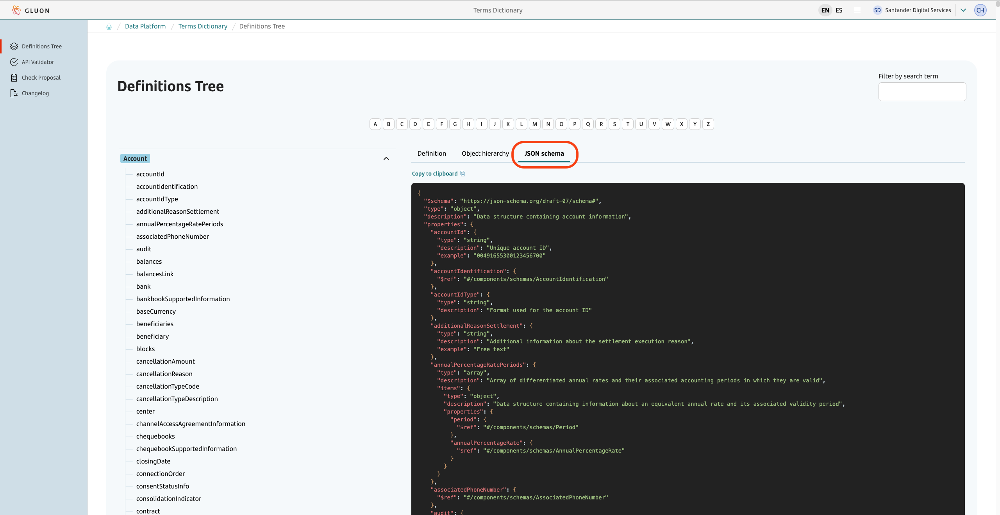
