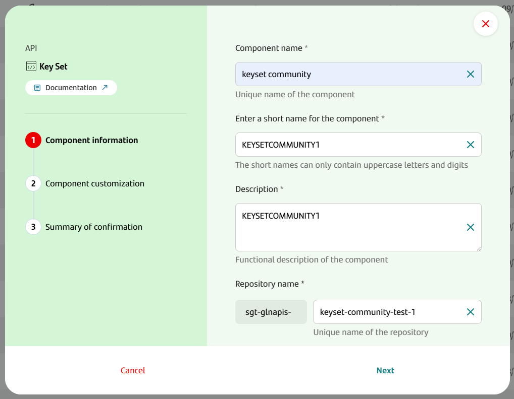
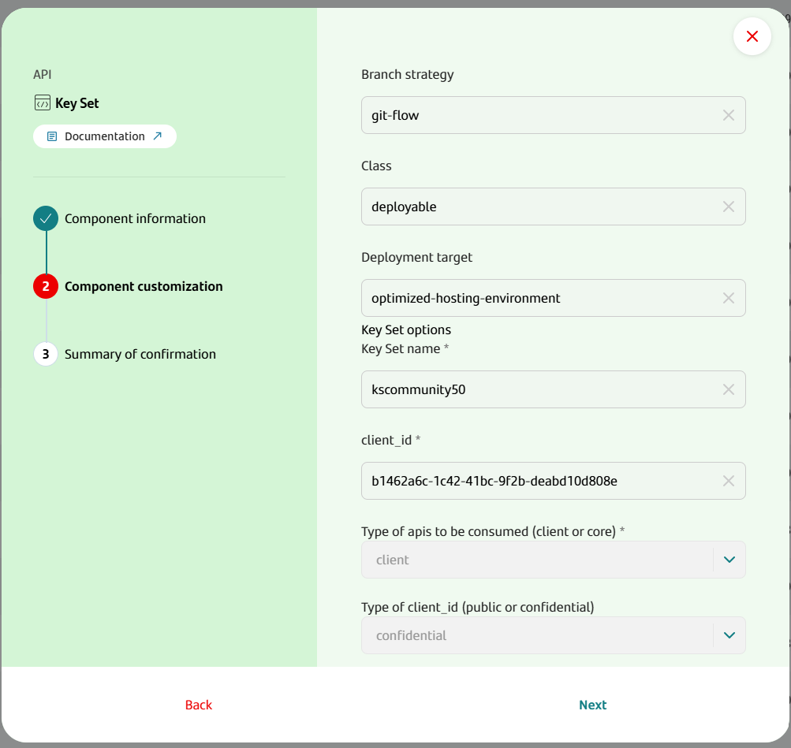
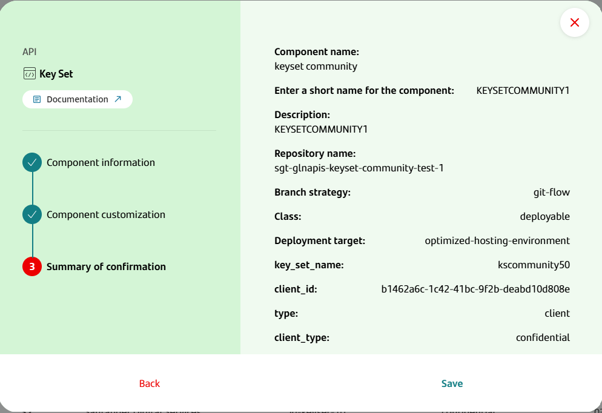
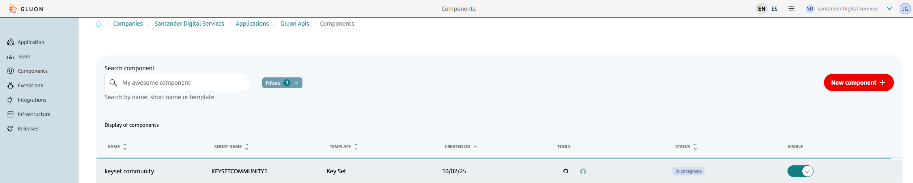
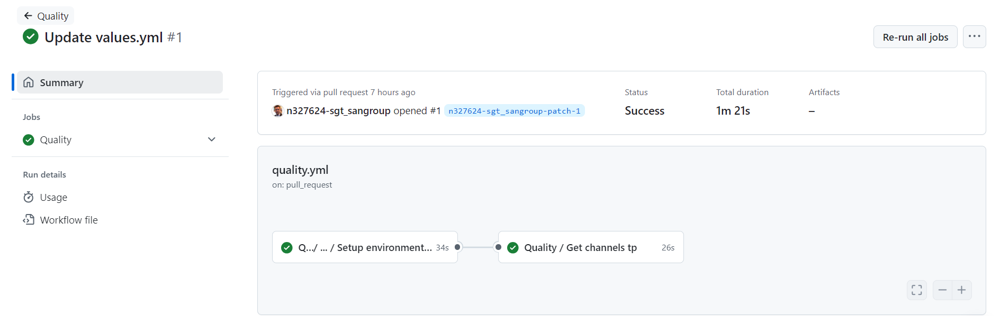
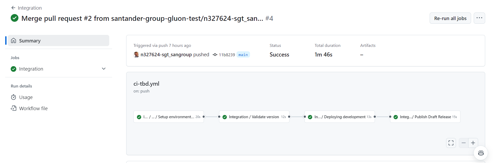
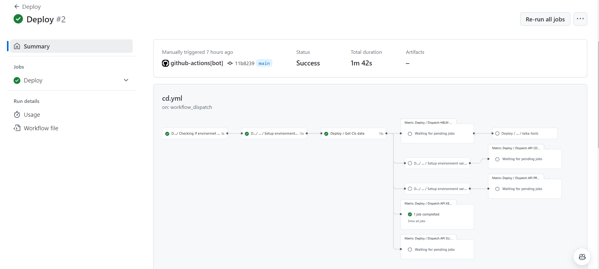
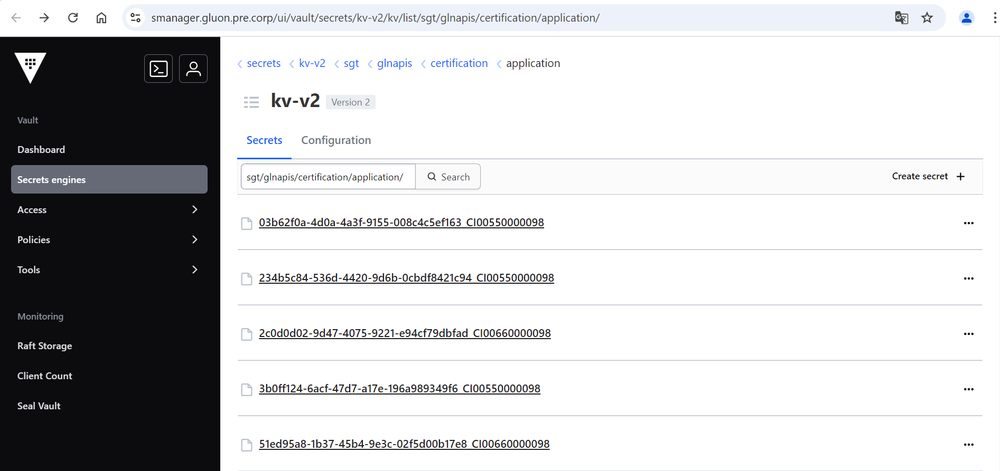
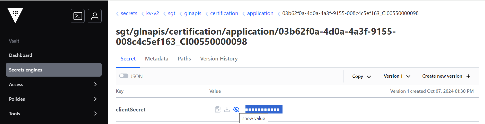
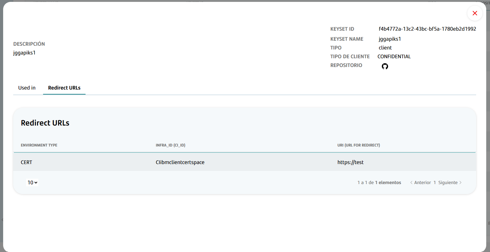

## Introduction

The purpose of this documentation is to provide a **step-by-step guide** on how to create a Key Set component to create a consumer application for **client subscriptions**.

**When do you need a Key Set component?**

- **Required for**: Client subscriptions to API Products deployed with `security_type: CLIENT`
- **Not required for**: Core subscriptions to API Products deployed with `security_type: CORE`
- **Purpose**: Manages client IDs and redirect URIs for client subscriptions

**Environment-specific configuration**:
The Key Set component optionally allows different client IDs per environment. This should only be used when you are importing an existing application from API Manager that already has different client IDs in each environment.

This guide will guide you in understanding how to execute the CI/CD processes to create the client id in the SOS as Authorization Server.

## Create Component

### Gluon Portal

To create a Key Set Component, you must have followed the [subscription request and approval process](./framework/marketplace/request-subscription.md) by the Application Owner of the application.
Once approved, from the received section of Integrations -> Assets -> Requests -> Requested, a logo with 3 points is enabled in the row of the request in the actions column,
which, in the case of being a client subscription and that key set has not been created previously, shows the option to **Create Keyset**.


When clicking on **Create Keyset**, a screen is displayed that allows you to create the component. On the first screen, you must enter the 4 common values of all Gluon components:



At the next point, the fields that allow configuring the component are displayed. In this screen, you can choose between importing an existing client ID from API Manager or using an autogenerated new one:

- **Key Set name**: Name of the Key Set.
- **client_id**: You can either input an existing client ID you want to import from API Manager, or use a new client ID automatically generated.
- **Type of APIs to be consumed (client or core)**: The creation of Key Set components for client consumption is allowed.
- **Type of client_id (public or confidential)**: Public or confidential. Confidential input will generate a client secret that will be updated to vault.



The next screen shows a summary of all the fields that will be used to create the component.



Finally, when you click Save, the component is created and is accessible from the components screen of the technical application.



### Key Set Template

#### Structure

The generated Key Set component has the following structure (showing only top levels of directory structure):

``` bash

📦repository
 ┣ 📂.github
 ┃ ┣ 📂workflows
 ┃ ┗ 📜CODEOWNERS
 ┣ 📂.gluon
 ┃ ┣ 📂cd
 ┃ ┣ ┣ 📂cert
 ┃ ┣ ┣ ┗ 📜cd.yml
 ┃ ┣ ┣ 📂pre
 ┃ ┣ ┣ ┗ 📜cd.yml
 ┃ ┣ ┣ 📂pro
 ┃ ┣ ┣ ┗ 📜cd.yml
 ┣ 📂src/properties
 ┃ ┣ ┣ 📂cert
 ┃ ┣ ┣ ┗ 📜values.yml
 ┃ ┣ ┣ 📂pre
 ┃ ┣ ┣ ┗ 📜values.yml
 ┃ ┣ ┣ 📂pro
 ┃ ┣ ┣ ┗ 📜values.yml
 ┃ ┣ ┣ 📜api-keyset-config.yml
 ┃ ┣ ┣ 📜values.yml
 ┗ 📜README.md
```

### Inspect your component in your local environment

??? abstract "Cloning your repository"

    ### Cloning your repository

    Once you have the device properly configured, the first step is to clone the project locally.

    To do so, visit [**How to clone the project**](../../../application/component-management/create-component.md#cloning-a-repository).

{!
   include-markdown "./snippets/snippet-oam.md"
!}

## Component Configuration

### Branches

It's important that we have our main branch (**main** by default) from where we will make the deployments to each of our environments.

### Configuration Files

The generated files include all the information that has been entered for the creation of the component. However, there is some additional information that must be provided for deployment.

**Key Set Configuration Overview:**
The Key Set component uses environment-specific configuration files to manage client IDs and redirect URIs for each environment. This is essential for CLIENT structure subscriptions.

**Important**: Configuring different client IDs for each environment is **optional**
and should only be used when importing an existing application from API Manager that already has different client IDs in each environment.
For new applications, it's recommended to use the same client ID across all environments, and in this case it's not necessary to configure the client ID in the environment-specific fields.

Next, the generated files and the configurations to be made are described:

#### api-keyset-config.yml

This file contains the information entered by the user in the key set creation. Below is an example of a generated file:

> !IMPORTANT: This file should not be modified

``` yaml title="api-subscription-config.yml"
key-set-name: keyset-community-client
client-id: 80ec1325-b9eb-4b88-859c-eba9f21c9d61
type: client
client-type: confidential
```

#### values.yml

This file contains the parameters that the user can modify for the subscription. The included parameters are:

- **version**: Subscription version to generate the release.
- **channel-tp**: Value of the channel-tp field used in the creation of the client_id. It must be a value included in the following list:
    - INT
    - EMP
    - RML
    - CIC
    - OFI
    - RCA
    - RME
    - PLR
    - IVR

Below is an example of the file:

``` yaml title="values.yml"
version: 1.0.0
channel-tp: INT
```

#### Files {{environment}}/values.yml

These files are used to configure environment-specific values, particularly the redirect URI for each environment. This allows different redirect URIs for CERT, PRE, and PRO environments.

**Optional Configuration**: You can optionally configure different client IDs for each environment using these files. This should only be used when importing an existing application from API Manager that already has different client IDs in each environment.

Each environment file (cert/values.yml, pre/values.yml, pro/values.yml) contains properties to configure:

``` yaml title="{{environment}}/values.yml"
client-id: 123456789 # Optional: client-id specific for this environment (if different from main client-id)
redirect-uri: https://dummy.corp
```

**Note**: Replace `https://dummy.corp` with the actual redirect URI for each specific environment.

{!
   include-markdown "./snippets/snippet-secrets.md"
!}

## Key Set Deployment

Next, we will describe the steps needed to deploy your Key Set across the DEV, PRE, and PRO environments.

The cycle explained below is based on **Trunk Based Development**.

### Pull Request to Main

When you create the **Pull Request event to your branch main/ branch** it will automatically run the workflow  ***quality.yml***

The following are the steps that are executed in this workflow.

- **Setup environment variables**: Load the properties needed for the workflow.
- **Quality / Get channels tp**: It validates that the value entered in the channel-tp property of the values.yml file is valid.



### Push to Main

By approving the Pull Request of the previous step on the main branch you will generate a push event on this branch and therefore the workflow ci-tbd.yml will be executed automatically.

These are the steps that will be executed in this part of the cycle:

- **Setup environment variables**: Load the properties needed for the workflow.
- **Integration/validate version**: It obtains the version from the values.yml file and validates that it is higher than the last release of the component.
- **Deploying development**: Execute the cd workflow.
- **Publish Draft Release**: Generates a Draft Release of the deployment.



At the end of the ci-tbd.yml workflow, the cd.yml workflow is launched and it is deployed in all the certification type environments that have been configured.

These are the steps that will be executed in this part of the cycle:

- **Checking if environment or environment-type is defined**: Validate that the environment that is being executed is correctly configured in the repository, with its folder created in the .gluon path and the cd.yml file configured.
- **Setup environment variables**: Load the properties needed for the workflow.
- **Get CIs data**: Get the information of the infrastructures in which it is going to be deployed, based on the configured cd.yml files.
- **Common CD**: It creates the key set in the Authorization Server, in the API Manager, and saves the client-secret in the vault as an application secret.



For certification environments, the created client-secrets can be consulted by accessing the following Vault path:

{url-vault}/ui/vault/secrets/kv-v2/list/{company}/{application_short_name}/{environment}/application/

For each generated client-id, a secret is created with the nomenclature client-id_ci_id:



If you access the secret detail, you can see the value with the show value option:



You will also be able to see in your repository that a release has been generated of the
version of your API Subscription that you want to deploy.


### Publish Release

To publish the Release, you access the Release generated by the ci-tbd.yml workflow, modify the name of the Release by removing Draft and publish the Release.


When publishing the Release, the release-tbd.yml workflow is launched.

These are the steps that will be executed in this part of the cycle:

- **Setup environment variables**: Load the properties needed for the workflow.
- **Upload assets to nexus**: Upload the API configuration to nexus.

> !IMPORTANT: The release workflow is available from version 7.0 of Gluon. If the component was created in an earlier version, you must [*update the component*](./../../../application/component-management/update-component.md#updating-your-component)

### Manual deployment to PRE/PRO

> !IMPORTANT: The method for deploying releases in PRE and PRO in Gluon is using Release Management. This method should only be used as an alternative.

The **Deploy Workflow** can be called manually to deploy to the PRE and PRO environments.

To learn how the common deployment workflow works, applicable to all technologies, you can refer to the [Common CD Workflow](../../../application/ci-cd/cd/cd-rm/cd-workflow/index.md) section of the documentation.

## Key Set Visualization

Once the Key Set is complete, you can consult the Key Set in the Integrations -> Assets -> Key section and selest the Key Set:



