## Introduction

The purpose of this documentation is to provide a **step-by-step guide** on how to orchestrate the deployment of APIs Products within the GLUON platform.

This guide will allow you to understand how to build and deploy your API Products through a CI/CD process to your IBM API Connect or Apigee environments.

This component is used in combination with [**API Deployment 2.0**](./apideployment/apis.md) to publish the APIs that have been deployed using Gluon components of that type.

The API Product component is not compatible with APIs that have not been deployed with Gluon or that have been deployed with the deprecated [**API Deployment**](./apideployment/apis10.md) component.

## Create Component

### Gluon Portal

First you have to [**onboard your application.**](../../../application/application-management/index.md)
Once you have your application created, you can start creating your component.

To create a component, follow the steps described in [**Component Management**](../../../application/component-management/create-component.md), searching for the component to be created.

You have to select the type of component you want to create, in this case you are going to create a **API Product**.

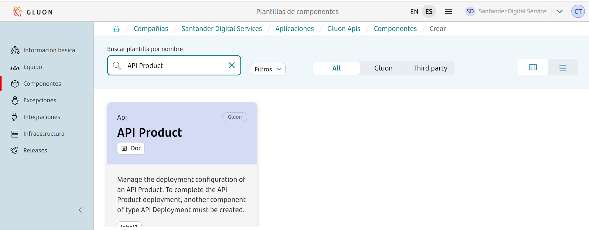

???+ remember

    To follow the naming convention visit [Repository Naming Convention](../../../application/component-management/create-component.md#repository-naming-convention).

The user can customize the type of application that they want to create.The parameters that must be configured are the following:

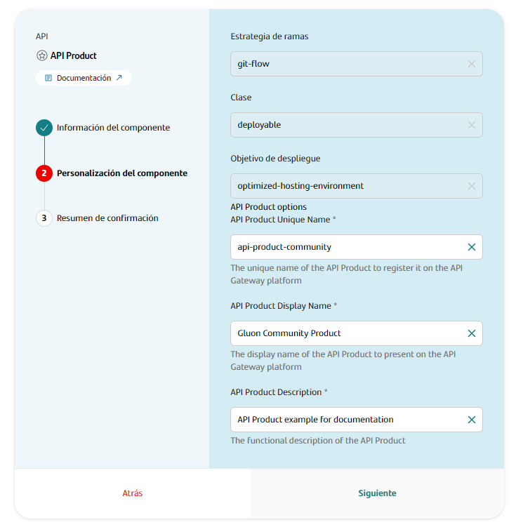

API Product Template Parameters:

|**Input**|**Required**|**Description**|
|---------|------------|---------------|
|**API Product Unique Name**|true|The unique name of the API Product to register it on the API Gateway platform|
|**API Product Display Name**|true|The display name of the API Product to present on the API Gateway platform|
|**API Product Description**|true|The functional description of the API Product|

Once the component is created you can see under the application that there is a new repository created with the name of the component.

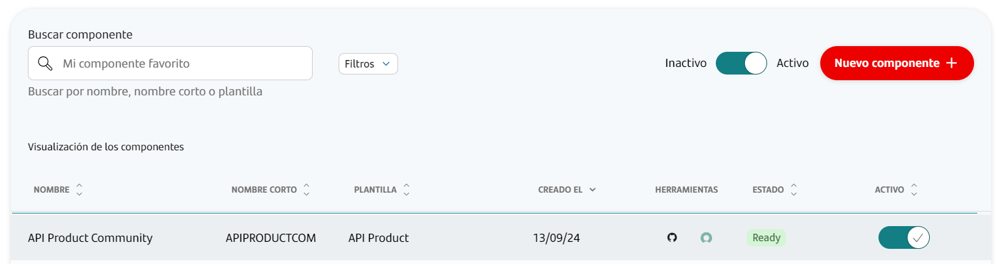

### API Product Template

#### Branches

It's important that we have our main branch (**main** by default) from where we will make the deployments to each of our environments.

#### Structure

The generated API component has the structure defined in the [archetype](framework/tech-components/archetypes/product.md) similar to the following (showing only top levels of directory structure):

``` bash

📦repository
 ┣ 📂.github
 ┃ ┣ 📂workflows
 ┃ ┗ 📜CODEOWNERS
 ┣ 📂.gluon
 ┃ ┣ 📂cd
 ┃ ┣ ┣ 📂cert
 ┃ ┣ ┣ ┗ 📜cd.yml
 ┃ ┣ ┣ 📂pre
 ┃ ┣ ┣ ┗ 📜cd.yml
 ┃ ┣ ┣ 📂pro
 ┃ ┣ ┣ ┗ 📜cd.yml
 ┣ 📂src
 ┃ ┣ 📂properties
 ┃ ┣ ┣ 📂cert
 ┃ ┣ ┣ ┣ 📜values.yml
 ┃ ┣ ┣ 📂pre
 ┃ ┣ ┣ ┣ 📜values.yml
 ┃ ┣ ┣ 📂pro
 ┃ ┣ ┣ ┣ 📜values.yml
 ┃ ┣ ┣ 📜values.yml
 ┗ 📜README.md
```

### Inspect your component in your local environment

??? abstract "Cloning your repository"

    ### Cloning your repository

    Once you have the device properly configured, the first step is to clone the project locally.

    To do so, visit [**How to clone the project**](../../../application/component-management/create-component.md#cloning-a-repository).

{!
   include-markdown "./snippets/snippet-oam.md"
!}

## Component Configuration

### Branches

It's important that we have our main branch (**main** by default) from where we will make the deployments to each of our environments.

### Configuration Files

#### API Configuration

An API Product can contain various APIs, taking into account the following considerations:

- **Only deployed APIs** using the [**API Deployment 2.0**](./apideployment/apis.md) component can be included.
- The APIs must belong to the **same application** in Gluon.
- The APIs must have the **same security profile** configured.
- The APIs must have been previously deployed in the **same infrastructure** configured in the API Product component,
with the same value of the ci_id field configured in the equivalent cd.yml file.

Taking into account these requirements, first, the APIs must be identified in the Integrations -> Assets -> My API Instances section of the Gluon application:

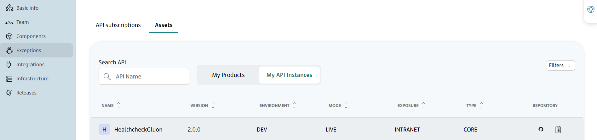

Once the API is found, the copy icon in the row can be used to copy the information that must be configured to include the API, which consists of the combination of the API repository and the version:

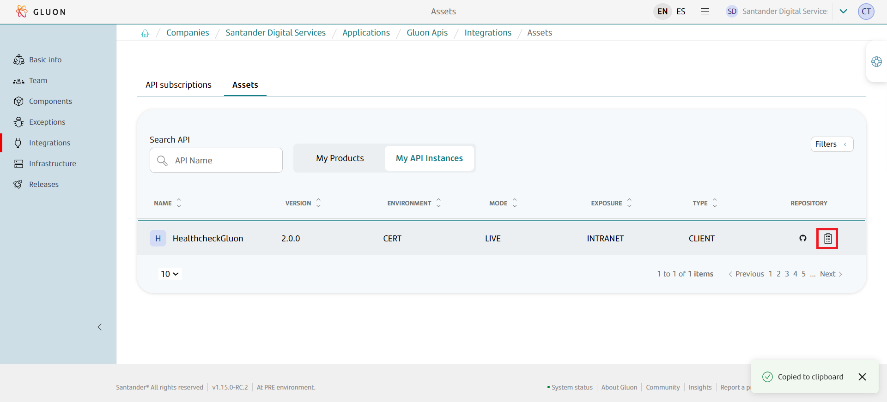

The copied text must be included in the apis section of the src/properties/values.yml file. As many APIs as you want to include in the product can be included.

Below is an example of incorporating an API into the values.yml file:

```yaml
api_product:
    version: 1.0.0
    apis:
      - santander-group-gluon-test/sgt-glnapis-testdeploy01:2.0.0
```

#### Configuration of the plan(s)

The API plans can be configured at 2 levels:

- For all environments.
- For a specific environment.

In the [archetype](framework/tech-components/archetypes/product.md) section, examples of how to configure both cases are shown.

#### Migration of subscriptions in IBM API Connect

In IBM API Connect, the product allows having multiple versions of the same Product. By default, Gluon works this way, and each deployment of a different version publishes that version in the API Manager.

However, if the Product owner wants to have a single major version of the same product, with all its subscriptions, they can enable subscription migration in the values.yml file:

```yaml
api_product:
    version: 1.0.0
    migrate-subscriptions: true
    apis:
      - santander-group-gluon-test/sgt-glnapis-testdeploy01:2.0.0
```

By enabling this capability, the workflow will include 2 additional steps:

- **Migrate subscriptions**: Migrates all subscriptions from previous versions of the product within the same major version.
For example, if versions 1.0.0, 1.1.0, and 1.1.1 of the Product were deployed with active migrations and version 1.2.0 is deployed, it will migrate all subscriptions from those versions to version 1.2.0.
However, if version 2.0.0 is deployed, it will not migrate any subscriptions.
  
- **Retire products**: Once the subscriptions are migrated in the previous step, it retires the products that no longer have subscriptions, both from the API Manager and from Gluon.

This capability works the same way in case a rollback of the release has been executed. In that case, it publishes the previous version of the API Product, migrates the subscriptions from the version that caused the rollback,
and finally retires the version that caused the rollback.

All of this is done automatically without any action required from the consumers.

{!
   include-markdown "./snippets/snippet-secrets.md"
!}

## API Product Deploy

Next, we will describe the steps needed to deploy your API Products across the DEV, PRE, and PRO environments.

The cycle explained below is based on **Trunk Based Development**.

### Pull Request to Main

When you create the **Pull Request event to your branch main/ branch** it will automatically run the workflow  ***quality.yml***

The following are the steps that are executed in this workflow.

- **Setup environment variables**: Load the properties needed for the workflow.
- **Get CIs data**: Get the information of the infrastructures in which it is going to be deployed, based on the configured cd.yml files.
- **Validate assembly**: To validate the configurations in all environments, it generates the assembly of the API Product to be deployed to detect if there was any format error or configuration of any property.

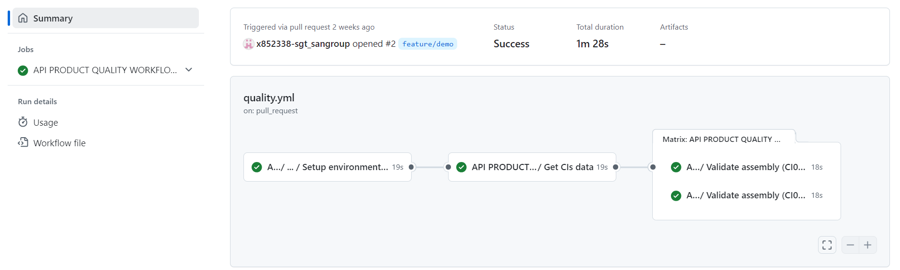

### Push to Main

By approving the Pull Request of the previous step on the main branch you will generate a push event on this branch and therefore the workflow ci-tbd.yml will be executed automatically.

These are the steps that will be executed in this part of the cycle:

- **Setup environment variables**: Load the properties needed for the workflow.
- **Resolve version**: Get the version of the deployed API Product from file values.yml.
- **Upload assets to nexus**: Upload the API Product configuration to nexus.
- **Deploying development**: Execute the cd workflow.
- **Publish Draft Release**: Generates a Draft Release of the deployment.

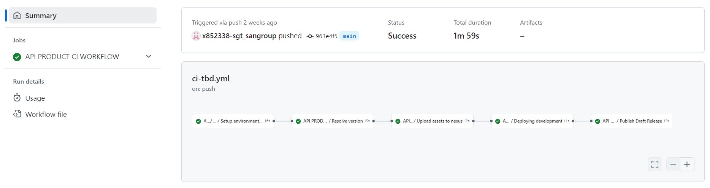

At the end of the ci-tbd.yml workflow, the cd.yml workflow is launched and it is deployed in all the certification type environments that have been configured.

These are the steps that will be executed in this part of the cycle:

- **Checking if environment or environment-type is defined**: Validate that the environment that is being executed is correctly configured in the repository, with its folder created in the .gluon path and the cd.yml file configured.
- **Setup environment variables**: Load the properties needed for the workflow.
- **Get CIs data**: Get the information of the infrastructures in which it is going to be deployed, based on the configured cd.yml files.
- **Setup environment variables**: Load the properties needed for the workflow.
- **Common CD**: Download the artifact generated in the ci-tbd.yml workflow, generate the assembly to be deployed and deploy the API Product in the API Manager. Depending on the technology, it behaves in the following way:
    - IBM API Connect: A new version of the product is generated with the version indicated in the values.yml file.
    To publish the product, the workflow searches for the assembly of the APIs it contains in Nexus. If it is not found in Nexus because it was deployed with an older version of the workflow, it downloads them from the Drafts section.
    - Apigee: Only one major version per product is supported, so if a version is already deployed, it is overwritten.

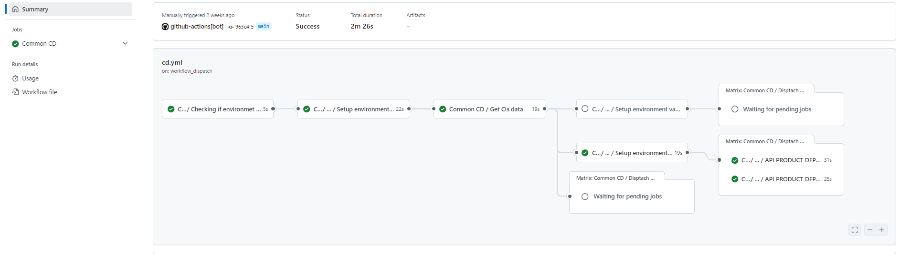

You will also be able to see in your repository that a release has been generated of the
version of your API Product that you want to deploy.

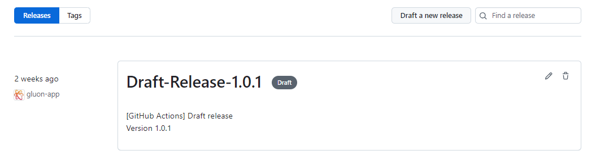

### Publish Release

To publish the Release, you access the Release generated by the ci-tbd.yml workflow, modify the name of the Release by removing Draft and publish the Release.

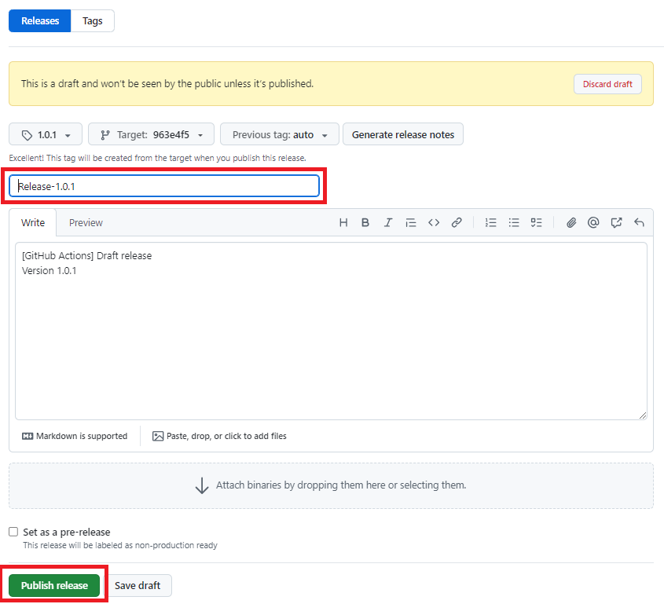

When publishing the Release, the release-tbd.yml workflow is launched.

These are the steps that will be executed in this part of the cycle:

- **Setup environment variables**: Load the properties needed for the workflow.
- **Upload assets to nexus**: Upload the API configuration to nexus.

### Manual deployment to PRE/PRO

> !IMPORTANT: The method for deploying releases in PRE and PRO in Gluon is using Release Management. This method should only be used as an alternative.

The **Deploy Workflow** can be called manually to deploy to the PRE and PRO environments.

To learn how the common deployment workflow works, applicable to all technologies, you can refer to the [Common CD Workflow](../../../application/ci-cd/cd/cd-rm/cd-workflow/index.md) section of the documentation.

## API Product Visualization

Once the API Product deployment is complete, you can consult the deployed API Product in the Integrations -> Assets -> My Products section:

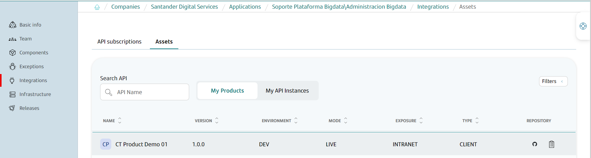

Additionally, it can be viewed in the [Product Catalog of the Marketplace](framework/marketplace/product-catalog.md)

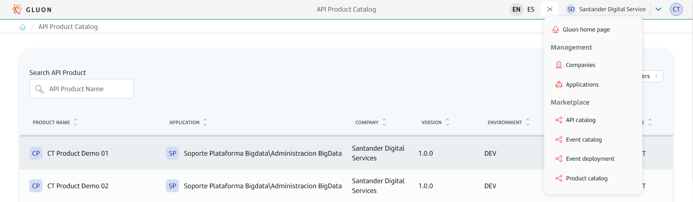
