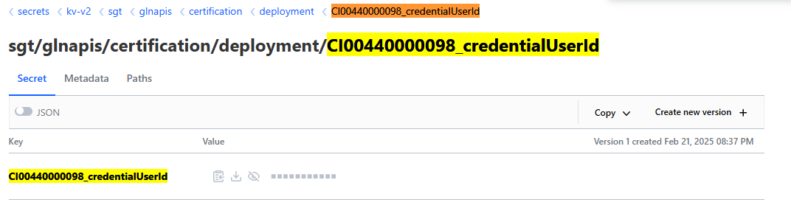
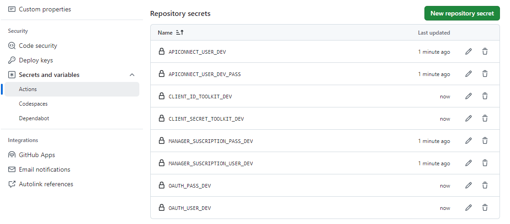

### Configure your secrets

Secrets can be configured in Hashicorp Vault or in GitHub, obtaining the secrets from Vault if configured in both.

#### Configure your secrets in Hashicorp Vault

Secrets in Vault should be [configured in the corresponding path of the technical application and environment](../../../../application/ci-cd/howtos/index.md#21-how-to-register-a-secret-in-a-githubcom-repository).

For the cases of API Deployment 2.0 and API Product, a naming convention has been defined to search for secrets in the corresponding path:

{url-vault}/ui/vault/secrets/kv-v2/data/{company}/{application_short_name}/{environment}/deployment/{ci_id}_{secret}

- company: short name of the company
- application_short_name: short name of the application
- environment: type of environment. Valid values are certification, preproduction, and production
- ci_id: infrastructure identifier in the Gluon Application Model component

For the specific case of API Deployment 2.0 and API Product, the secrets that need to be configured are `credentialUserId` and `credentialPassId` (aws-access-key-id and aws-secret-access-key for AWS). Consider the following example:

- company: sgt
- application_short_name: gluon
- environment: certification
- ci_id: CI000000000XXX

The secrets that need to be created for API Deployment 2.0 and API Product are:

- **AWS:**
  - `kv-v2/data/sgt/gluon/certification/deployment/CI000000000XXX_aws-access-key-id`
  - `kv-v2/data/sgt/gluon/certification/deployment/CI000000000XXX_aws-secret-access-key`

- **APIGEE and IBM:**
  - `kv-v2/data/sgt/gluon/certification/deployment/CI000000000XXX_credentialUserId`
  - `kv-v2/data/sgt/gluon/certification/deployment/CI000000000XXX_credentialPassId`

- **IBM:**
  - `kv-v2/data/sgt/gluon/certification/deployment/CI000000000XXX_clientId-toolkit`
  - `kv-v2/data/sgt/gluon/certification/deployment/CI000000000XXX_client-secret-toolkit`

For Key Set, the secrets that need to be created are:

- kv-v2/data/sgt/gluon/certification/deployment/CI000000000XXX_oauth-user
- kv-v2/data/sgt/gluon/certification/deployment/CI000000000XXX_oauth-pass

Finally, for API Subscription, the secrets that need to be created are:

- **General:**
  - `kv-v2/data/sgt/gluon/certification/deployment/CI000000000XXX_oauth-user`
  - `kv-v2/data/sgt/gluon/certification/deployment/CI000000000XXX_oauth-pass`

- **IBM:**
  - `kv-v2/data/sgt/gluon/certification/deployment/CI000000000XXX_clientId-toolkit`
  - `kv-v2/data/sgt/gluon/certification/deployment/CI000000000XXX_client-secret-toolkit`
  
- **APIGEE e IBM:**
  - `kv-v2/data/sgt/gluon/certification/deployment/CI000000000XXX_manager-subscription-user`
  - `kv-v2/data/sgt/gluon/certification/deployment/CI000000000XXX_manager-subscription-password`
  - `kv-v2/data/sgt/gluon/certification/deployment/CI000000000XXX_credentialUserId`
  - `kv-v2/data/sgt/gluon/certification/deployment/CI000000000XXX_credentialPassId`

- **AWS:**
  - `kv-v2/data/sgt/gluon/certification/deployment/CI000000000XXX_aws-access-key-id-subscription`
  - `kv-v2/data/sgt/gluon/certification/deployment/CI000000000XXX_aws-secret-access-key-subscription`

> !IMPORTANT: To configure secrets in Hashicorp Vault and for it to work correctly, the Key name must be the same as the secret name, as shown in the following image:



#### Configure your secrets in github

There are three types of secrets in github.com:

- **Organization secrets**: Secrets that can be used by all repositories in the organization.
- **Repository secrets**: Secrets that can be used only by the repository.
- **Environment secrets**: Secrets that can be used only by the repository and the environment.

For API capabilities, secrets can be configured at the organization or repository level, current workflows do not support environment-specific secret configuration.

To create a repository secret, there is a [HowTo](../../../../application/ci-cd/howtos/index.md#21-how-to-register-a-secret-in-a-githubcom-repository)

> !IMPORTANT: These secrets must be registered in the repositories of the API Deployment 2.0, API Product, API Subscription, and Key Set components, not in the repository of the Gluon Application Model component.

???+ warning "Setup Github Secrets"

    Currently only the devops team of the entity has permissions to create the secrets in the organization. If you need to create a secret, please contact with the devops team. If you have doubts what users belongs to devops team, please contact with your entity Gluon Champion.

##### Deploy Secrets

In the infrastructure configuration in the [Gluon Application Model](../framework/infrastructure/oam-configuration.md) component, the names of the secrets that need to be configured in GitHub are indicated.

For the deployment of an API or a Product in Apigee, it is only necessary to configure the credentials to access the API Manager. For IBM API Connect, the secrets to use the API Connect toolkit must also be configured.

For the key set deployment it is only necessary to configure the credentials to access the oauth provider.

The rest of the secrets are only necessary for the subscription.

Next, an example of secret configuration for both technologies and an explanation of what each property is will be shown.

=== "**API Connect**"

    ``` yaml
    properties:
      type: IBM
      credentialUserId: APICONNECT_USER_DEV
      credentialPassId: APICONNECT_USER_DEV_PASS
      manager-subscription-user: MANAGER_SUSCRIPTION_USER_DEV
      manager-subscription-password: MANAGER_SUSCRIPTION_PASS_DEV
      clientId-toolkit: CLIENT_ID_TOOLKIT_DEV
      client-secret-toolkit: CLIENT_SECRET_TOOLKIT_DEV
      oauth-user: OAUTH_USER_DEV
      oauth-pass: OAUTH_PASS_DEV
    ```

=== "**APIGee**"

    ``` yaml
    properties:
      type: apigee
      credentialUserId: APIGEE_USER_DEV
      credentialPassId: APIGEE_PASS_DEV
      manager-subscription-user: MANAGER_SUSCRIPTION_USER_DEV
      manager-subscription-password: MANAGER_SUSCRIPTION_PASS_DEV
      oauth-user: OAUTH_USER_DEV
      oauth-pass: OAUTH_PASS_DEV
    ```

| Parameter | Description | Example | Components |
|-----------|-------------|---------|---------|
| credentialUserId | ID of the github secret contains api connect user| APICONNECT_USER_DEV | API Deployment 2.0, API Product, API Subscription |
| credentialPassId | ID of the github secret contains api connect password | APICONNECT_PASS_DEV | API Deployment 2.0, API Product, API Subscription |
| manager-subscription-user | User for subscription used in the API Manager  | MANAGER_SUSCRIPTION_USER_DEV | API Subscription |
| manager-subscription-password | Id github secret reference password for subscription used in the API Manager  | MANAGER_SUSCRIPTION_PASS_DEV | API Subscription |
| clientId-toolkit | id github secret contains client Id for API Connect toolkit  | CLIENT_ID_TOOLKIT_DEV | Only for IBM API Connect. API Deployment 2.0, API Product, API Subscription |
| client-secret-toolkit | Id github secret contains client secret for API Connect toolkit  | CLIENT_SECRET_TOOLKIT_DEV| Only for IBM API Connect. API Deployment 2.0, API Product, API Subscription |
| oauth-user | Github secret contains user to login in oauth server  | OAUTH_USER_DEV | Only for client subscriptions. API Subscription, Key Set |
| oauth-pass | ID of the github secret contains oauth password | OAUTH_PASS_DEV | Only for client subscriptions. API Subscription, Key Set |

Once the secrets are entered, for the case of IBM API Connect client subscriptions, which requires a larger number, the repository configuration for deployment in certification should look similar to the following image:


